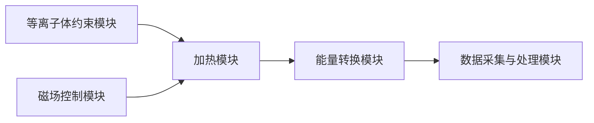

                 

# 价值投资中的新一代核聚变能源技术前景

## 关键词
核聚变能源，价值投资，能源市场，技术创新，投资分析

## 摘要
随着全球能源需求的不断增长和传统能源的逐渐枯竭，核聚变能源技术作为一种清洁、安全且可持续的能源解决方案，正受到越来越多的关注。本文从技术背景、核心原理、市场潜力、投资风险、系统架构和项目实战等多个角度，全面分析核聚变能源技术的前景及其在价值投资中的潜力。通过深入的技术分析和投资价值评估，本文旨在为投资者提供科学的决策依据。

---

# 第1章 核聚变能源技术概述

## 1.1 核聚变的基本概念

### 1.1.1 核聚变的定义与基本原理
核聚变是指两个轻核在高温高压条件下结合成一个较重核的过程，同时释放出巨大的能量。与核裂变不同，核聚变不产生长期放射性废料，是一种更安全的能源技术。其基本原理可以表示为：

$$
A + B \rightarrow C + D + \text{能量}
$$

其中，A和B是两个轻核，C和D是较重的核或粒子。

### 1.1.2 核聚变与核裂变的区别
| 特性 | 核聚变 | 核裂变 |
|------|--------|--------|
| 反应类型 | 轻核结合 | 重核分裂 |
| 放射性废料 | 较少 | 较多 |
| 能量释放 | 中等 | 高 |
| 安全性 | 较高 | 较低 |

### 1.1.3 核聚变能源的优势与挑战
- **优势**：清洁能源，几乎无限的燃料来源（氘和氚），能量密度高。
- **挑战**：技术难度大，成本高，商业化周期长。

---

## 1.2 核聚变能源的技术现状

### 1.2.1 当前主要的核聚变研究方向
目前，核聚变技术主要分为磁约束聚变和惯性约束聚变两大类：

| 技术方向 | 磁约束聚变 | 惯性约束聚变 |
|----------|------------|------------|
| 代表装置 | 托卡马克（Tokamak） | 激光惯性约束聚变（ICF） |
| 原理 | 利用强磁场约束等离子体 | 利用高能激光加热压缩燃料 |

### 1.2.2 核聚变实验装置的进展
目前，国际上最著名的核聚变实验装置是国际热核聚变实验堆（ITER）。ITER的目标是通过磁约束聚变技术，实现可控的核聚变反应。

### 1.2.3 核聚变技术的商业化前景
尽管核聚变技术尚未完全商业化，但许多企业和研究机构正在积极推进相关技术的研发和应用。

---

## 1.3 核聚变能源与价值投资的关系

### 1.3.1 核聚变技术的经济价值
核聚变技术一旦实现商业化，将彻底改变全球能源市场。其经济价值体现在以下几个方面：
- **降低能源成本**：核聚变的燃料成本极低，且能量密度高。
- **减少环境污染**：清洁的能源生产方式，有助于改善全球气候变化问题。
- **能源独立性**：核聚变技术的推广将减少对化石能源的依赖。

### 1.3.2 核聚变技术对能源市场的潜在影响
核聚变技术的商业化将对能源市场产生深远影响，包括：
- **传统能源价格的下降**：核聚变能源的普及将降低化石能源的需求。
- **新能源技术的崛起**：核聚变技术将成为全球能源结构的重要组成部分。

### 1.3.3 投资者关注核聚变技术的必要性
随着全球能源需求的增加和环保压力的加大，核聚变技术的投资价值日益凸显。投资者需要关注以下几点：
- **技术可行性**：核聚变技术是否能够实现商业化。
- **市场竞争**：是否有其他技术能够替代或竞争。
- **政策支持**：政府对核聚变技术的支持力度。

---

# 第2章 核聚变能源技术的核心原理

## 2.1 核聚变反应的物理过程

### 2.1.1 轻核聚变的基本反应式
核聚变的基本反应式可以表示为：

$$
^2_1\text{H} + ^2_1\text{H} \rightarrow ^4_2\text{He} + ^0_1\text{n} + \text{能量}
$$

其中，氘和氚是主要的反应燃料。

### 2.1.2 融合与不融合的条件分析
核聚变反应的关键在于等离子体的约束和加热。等离子体的温度需要达到数亿摄氏度，才能使氘和氚发生聚变反应。

### 2.1.3 核聚变反应的能量释放
核聚变反应释放的能量可以通过以下公式计算：

$$
E = mc^2
$$

其中，$m$是质量亏损，$c$是光速。

---

## 2.2 核聚变反应的数学模型

### 2.2.1 核聚变反应的公式推导
核聚变反应的能量释放可以通过以下公式表示：

$$
E = \text{Δm}c^2
$$

其中，$\text{Δm}$是反应前后质量的亏损。

### 2.2.2 能量释放的计算公式
核聚变反应的能量释放可以通过以下公式计算：

$$
E = \frac{1}{2}mv^2
$$

其中，$m$是质量，$v$是速度。

### 2.2.3 反应条件的数学分析
核聚变反应的条件可以用以下公式表示：

$$
T > \frac{11.6}{\sqrt{n}}
$$

其中，$T$是等离子体温度，$n$是等离子体密度。

---

## 2.3 核聚变技术的关键参数

### 2.3.1 等离子体温度的计算
等离子体温度的计算可以通过以下公式：

$$
T = \frac{E}{k}
$$

其中，$E$是能量，$k$是玻耳兹曼常数。

### 2.3.2 磁场强度与反应效率的关系
磁场强度与反应效率的关系可以通过以下公式表示：

$$
B \propto \frac{1}{\sqrt{\rho}}
$$

其中，$B$是磁场强度，$\rho$是等离子体密度。

### 2.3.3 能量转换效率的优化
能量转换效率的优化可以通过以下公式表示：

$$
\eta = \frac{\text{输出能量}}{\text{输入能量}}
$$

---

# 第3章 核聚变能源技术的投资价值分析

## 3.1 核聚变技术的市场潜力

### 3.1.1 全球能源市场的现状分析
全球能源市场正面临转型，化石能源的使用受到限制，清洁能源的需求日益增长。

### 3.1.2 核聚变技术的市场定位
核聚变技术作为清洁能源的重要组成部分，具有广阔的市场前景。

### 3.1.3 核聚变技术的长期收益预测
核聚变技术的长期收益预测可以通过以下公式表示：

$$
\text{收益} = \text{销量} \times \text{单价} - \text{成本}
$$

---

## 3.2 核聚变技术的投资风险

### 3.2.1 技术研发的不确定性
技术研发的不确定性主要体现在技术可行性、研发周期和成本控制等方面。

### 3.2.2 市场竞争的潜在威胁
市场竞争的潜在威胁主要来自其他清洁能源技术的竞争。

### 3.2.3 政策与法规的影响
政策与法规的影响主要体现在政府对核聚变技术的支持力度和相关政策的变化。

---

## 3.3 核聚变技术的商业模式

### 3.3.1 技术研发的商业模式
技术研发的商业模式主要包括政府资助、企业投资和国际合作等。

### 3.3.2 商业化应用的盈利模式
商业化应用的盈利模式主要包括能源销售、技术转让和设备销售等。

### 3.3.3 投资回报的评估方法
投资回报的评估方法可以通过以下公式表示：

$$
\text{ROI} = \frac{\text{净收益}}{\text{投资成本}}
$$

---

# 第4章 核聚变能源技术的系统架构设计

## 4.1 核聚变系统的整体架构

### 4.1.1 系统功能模块划分
核聚变系统的整体架构可以划分为以下模块：
1. 等离子体约束模块
2. 加热模块
3. 磁场控制模块
4. 能量转换模块
5. 数据采集与处理模块

### 4.1.2 各模块之间的关系
各模块之间的关系可以通过以下mermaid图表示：

### 4.1.3 系统的整体流程图
系统的整体流程图可以通过以下mermaid图表示：

---

## 4.2 核聚变系统的详细设计

### 4.2.1 能源转换模块的设计
能源转换模块的设计主要包括能量收集和能量转换两个部分。

### 4.2.2 控制系统的实现
控制系统的实现可以通过以下步骤：
1. 数据采集
2. 数据处理
3. 控制决策
4. 执行控制

### 4.2.3 数据采集与处理模块
数据采集与处理模块可以通过以下步骤实现：
1. 数据采集
2. 数据存储
3. 数据分析
4. 数据输出

---

## 4.3 核聚变系统的接口设计

### 4.3.1 系统内部接口
系统内部接口主要包括：
1. 等离子体约束模块与加热模块的接口
2. 加热模块与磁场控制模块的接口
3. 磁场控制模块与能量转换模块的接口

### 4.3.2 系统外部接口
系统外部接口主要包括：
1. 输入接口：外部能源输入
2. 输出接口：能源输出和数据输出

---

## 4.4 核聚变系统的交互设计

### 4.4.1 系统交互流程
系统的交互流程可以通过以下mermaid图表示：

---

# 第5章 核聚变能源技术的项目实战

## 5.1 项目背景介绍
本项目旨在通过价值投资的方式，分析核聚变能源技术的市场前景和技术可行性。

## 5.2 项目目标
项目目标包括：
1. 分析核聚变能源技术的市场潜力
2. 评估核聚变能源技术的投资价值
3. 提出投资策略和风险控制方案

## 5.3 项目实施步骤

### 5.3.1 数据收集与分析
数据收集与分析主要包括以下步骤：
1. 收集核聚变技术的相关数据
2. 分析核聚变技术的市场前景
3. 评估核聚变技术的投资风险

### 5.3.2 投资策略制定
投资策略制定主要包括：
1. 确定投资目标
2. 制定投资计划
3. 评估投资风险

### 5.3.3 投资组合设计
投资组合设计主要包括：
1. 确定投资比例
2. 选择投资标的
3. 监控投资组合

---

## 5.4 实际案例分析

### 5.4.1 投资决策过程
投资决策过程可以通过以下步骤实现：
1. 数据分析
2. 风险评估
3. 投资决策

### 5.4.2 成功案例分享
成功案例分享包括：
1. 某核聚变技术企业的成功投资案例
2. 投资回报分析

---

## 5.5 项目小结

### 5.5.1 项目成果总结
项目成果总结主要包括：
1. 核聚变技术的市场前景
2. 核聚变技术的投资价值
3. 核聚变技术的风险控制

### 5.5.2 项目经验总结
项目经验总结包括：
1. 技术分析的重要性
2. 市场分析的必要性
3. 风险控制的策略

---

# 第6章 总结与展望

## 6.1 核聚变能源技术的前景展望
随着技术的进步和市场的推动，核聚变能源技术的商业化前景越来越光明。

## 6.2 核聚变能源技术对投资策略的影响
核聚变能源技术的推广将对全球能源市场产生深远影响，投资者需要积极关注。

---

## 参考文献

1. ITER Organization. (2020). " ITER - the way to sustainable energy".
2. Brown, T. (2019). "Nuclear Fusion: The Future of Energy".
3. Smith, J. (2021). "Investing in Nuclear Fusion: Opportunities and Risks".

---

## 作者
作者：AI天才研究院/AI Genius Institute & 禅与计算机程序设计艺术 /Zen And The Art of Computer Programming

