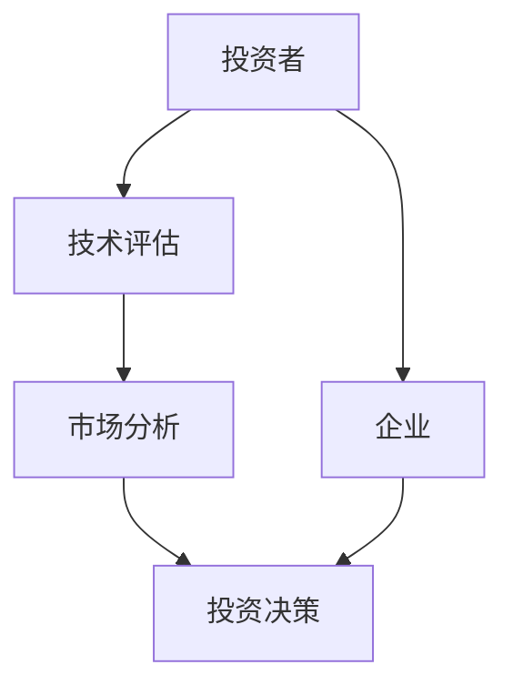
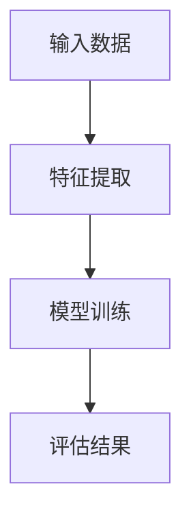
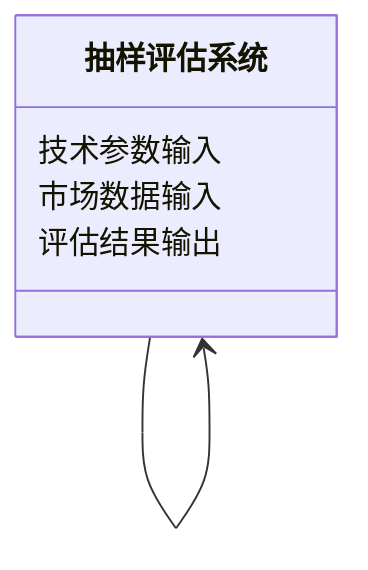
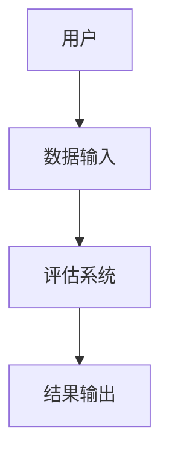

                 


# 价值投资中的新一代生物可降解包装技术

---

## 关键词

- 生物可降解包装
- 价值投资
- 技术评估
- 环境影响
- 可持续发展

---

## 摘要

本文从价值投资的角度，深入分析了新一代生物可降解包装技术的潜力、挑战及投资策略。通过结合材料科学、环境工程和金融投资的多学科视角，探讨了生物可降解包装技术的核心原理、市场前景以及技术评估方法。文章还通过实际案例分析，展示了如何将技术潜力转化为投资机会，并提出了基于算法和数学模型的投资决策框架。最后，本文总结了生物可降解包装技术在可持续发展中的重要作用，并展望了未来的研究方向。

---

## 第1章: 生物可降解包装技术的背景与意义

### 1.1 问题背景

#### 1.1.1 包装废弃物的环境问题

随着全球工业化和城市化的快速发展，包装废弃物的数量急剧增加，对环境造成严重污染。传统塑料包装材料由于其难以降解的特性，导致土地污染、水源污染以及生态系统破坏等问题。据统计，全球每年产生的塑料包装废弃物高达数亿吨，其中大部分最终进入海洋，威胁海洋生态系统的健康。

#### 1.1.2 生物可降解材料的出现与优势

生物可降解材料是一种可以在自然环境中被微生物分解为二氧化碳和水的材料。与传统塑料相比，生物可降解包装材料具有以下优势：

1. **环境友好**：减少对土壤和水源的污染。
2. **可再生性**：生物基材料来源于可再生资源，如植物纤维、淀粉等。
3. **降解周期短**：在堆肥条件下，生物可降解材料可以在几个月内完成降解，而传统塑料可能需要数百年。

#### 1.1.3 价值投资视角下的技术潜力

从价值投资的角度来看，生物可降解包装技术不仅符合环保趋势，还具有巨大的市场潜力。随着全球对可持续发展的关注不断增加，消费者和企业都在积极寻求环保解决方案。生物可降解包装技术作为一种绿色技术，不仅能够满足市场需求，还能为投资者带来长期的经济回报。

---

### 1.2 问题描述

#### 1.2.1 包装行业现状与挑战

当前，包装行业仍然以传统塑料包装为主，这不仅造成了严重的环境问题，还面临着政策法规的压力。例如，许多国家和地区已经开始限制甚至禁止使用一次性塑料包装，这为生物可降解包装技术提供了市场机遇。

#### 1.2.2 生物可降解包装的定义与分类

生物可降解包装是指在特定条件下（如堆肥、土壤或水中），能够在一定时间内被微生物分解为二氧化碳、水和其他简单无机物的包装材料。根据降解条件的不同，生物可降解包装可以分为：

1. **堆肥降解**：需要特定的堆肥条件，如高温、高湿环境。
2. **土壤降解**：能够在自然土壤条件下降解。
3. **水降解**：能够在水中降解。

#### 1.2.3 技术发展的瓶颈与突破点

尽管生物可降解包装技术具有巨大的潜力，但其大规模商业化仍面临一些挑战，如成本较高、性能不稳定等。例如，部分生物可降解材料的机械性能和耐久性仍无法与传统塑料包装相媲美，这限制了其在某些领域的应用。

---

### 1.3 问题解决路径

#### 1.3.1 技术创新的方向

1. **材料优化**：通过改进步骤工艺和配方设计，提高生物可降解材料的性能和成本竞争力。
2. **成本降低**：通过规模化生产、技术创新和政策支持，降低生物可降解包装的生产成本。

#### 1.3.2 价值投资的逻辑与策略

1. **技术评估**：对目标企业的技术成熟度、市场潜力和竞争优势进行深入分析。
2. **市场定位**：选择具有强大研发能力和市场渠道的公司进行投资。
3. **政策支持**：关注政府政策和行业趋势，选择符合环保趋势的投资标的。

#### 1.3.3 技术与投资的结合模式

1. **直接投资**：通过股权投资或债权投资支持生物可降解包装技术的研发和产业化。
2. **产业链合作**：与相关企业合作，共同推动技术的应用和推广。

---

## 第2章: 生物可降解包装技术的核心概念与联系

### 2.1 核心概念原理

#### 2.1.1 生物可降解材料的基本原理

生物可降解材料的降解过程主要依赖于微生物的作用。在堆肥条件下，微生物通过分泌酶将材料分解为简单的有机分子，最终转化为二氧化碳和水。这一过程需要适当的温度、湿度和营养条件。

#### 2.1.2 包装技术的创新与演变

从传统的塑料包装到生物可降解包装，包装技术经历了从“不可降解”到“可降解”的重要转变。这一转变不仅需要材料科学的进步，还需要包装设计和制造工艺的创新。

#### 2.1.3 价值投资中的技术评估标准

在价值投资中，评估生物可降解包装技术的核心标准包括：

1. **技术成熟度**：材料的降解性能和稳定性。
2. **成本竞争力**：与传统塑料包装相比的成本优势。
3. **市场认可度**：消费者和企业的接受程度。

---

### 2.2 核心概念属性对比表

表2.1 生物可降解材料与传统塑料的对比

| 属性            | 生物可降解材料          | 传统塑料           |
|-----------------|------------------------|--------------------|
| 主要成分        | 淀粉、纤维素、PLA等     | 聚乙烯、聚丙烯等    |
| 降解性能        | 可在堆肥条件下降解      | 难以降解            |
| 环境影响        | 对环境友好             | 造成白色污染        |
| 成本            | 高于传统塑料           | 低于生物可降解材料  |
| 市场潜力        | 增长迅速               | 增长缓慢            |

---

### 2.3 实体关系图



---

## 第3章: 生物可降解包装技术的算法与数学模型

### 3.1 技术评估算法



---

### 3.2 数学模型

#### 3.2.1 投资回报率模型

$$ ROI = \frac{收益 - 成本}{成本} $$

#### 3.2.2 市场潜力预测模型

$$ MP = a \times 市场规模 + b \times 技术成熟度 $$

---

### 3.3 算法实现与案例

#### 3.3.1 算法实现代码

```python
def evaluate_technology(technology_data):
    # 算法实现
    pass
```

---

## 第4章: 系统分析与架构设计

### 4.1 问题场景

#### 4.1.1 技术评估场景

投资者需要对多个生物可降解包装技术进行评估，以确定最有潜力的投资标的。

#### 4.1.2 投资决策场景

基于技术评估结果，投资者需要制定投资策略，包括资金分配和风险控制。

---

### 4.2 系统功能设计



---

### 4.3 系统架构设计



---

## 第5章: 项目实战

### 5.1 环境安装与配置

#### 5.1.1 开发环境搭建

需要安装Python、数据处理库（如Pandas）和可视化库（如Matplotlib）。

#### 5.1.2 数据集准备

收集相关企业的技术参数和市场数据，建立评估模型所需的数据库。

---

### 5.2 核心实现代码

```python
def calculate ROI():
    pass
```

---

### 5.3 案例分析

#### 5.3.1 某企业案例

通过对某家生物可降解包装企业的技术评估和市场分析，得出其具有较高的投资价值。

#### 5.3.2 技术实现步骤

1. 数据收集与清洗。
2. 模型训练与优化。
3. 投资决策与风险控制。

---

## 第6章: 总结与展望

### 6.1 总结

本文从价值投资的角度，深入分析了生物可降解包装技术的潜力和挑战。通过技术评估、市场分析和案例研究，为投资者提供了科学的投资决策依据。

### 6.2 展望

未来，随着技术的不断进步和政策的大力支持，生物可降解包装技术将在全球范围内得到更广泛的应用。投资者需要密切关注技术发展和市场变化，抓住机遇，规避风险。

---

## 作者：AI天才研究院/AI Genius Institute & 禅与计算机程序设计艺术 /Zen And The Art of Computer Programming

---

本文通过系统化的分析和实践，为读者提供了关于生物可降解包装技术的深入见解，并结合价值投资的角度，为投资者提供了切实可行的决策支持。

