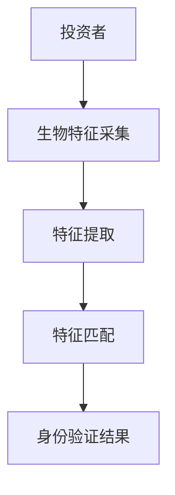

                 


# 价值投资中的新一代生物识别安全技术前景

**关键词**: 生物识别技术, 价值投资, 安全性, 风险管理, 身份验证, 投资决策, 人工智能

**摘要**: 随着生物识别技术的快速发展，其在投资领域的应用前景日益广阔。本文深入探讨了生物识别技术在价值投资中的应用，分析了其在投资安全性和风险管理中的潜在价值。通过结合生物识别技术与价值投资策略，本文揭示了如何利用这一技术优化投资决策、提升投资效率，并提出了未来发展的建议。

---

## 第1章: 生物识别技术与价值投资的结合

### 1.1 生物识别技术的定义与分类

#### 1.1.1 生物识别技术的定义
生物识别技术是一种基于人体生物特征（如指纹、面部特征、虹膜、声音等）进行身份验证的技术。通过采集、处理和分析这些特征，生物识别技术能够实现高精度的身份识别。

#### 1.1.2 常见的生物识别技术分类
以下是常见的生物识别技术及其特点：

| 技术类型       | 特点                           | 优缺点                     |
|----------------|--------------------------------|-----------------------------|
| 指纹识别       | 精度高，采集方便               | �易受磨损，环境影响较大       |
| 面部识别       | 非接触式，适用范围广           | 光线、遮挡影响识别精度       |
| 虹膜识别       | 精度极高，误识别率低           | 设备成本高，应用场景有限       |
| 声音识别       | 自然，无需接触                 | 易受环境噪声干扰             |
| 行为识别       | 基于行为模式，难以伪造         | 对设备和环境依赖较高         |

#### 1.1.3 生物识别技术的优缺点对比
生物识别技术相较于传统密码技术具有更高的安全性，但其在成本、环境适应性和用户体验方面仍存在一定的挑战。

### 1.2 价值投资的基本概念与策略

#### 1.2.1 价值投资的定义
价值投资是一种投资策略，旨在通过分析企业的基本面（如财务状况、行业地位、管理团队等）来识别被低估的投资标的，从而实现长期收益。

#### 1.2.2 价值投资的核心理念
价值投资的核心理念是“买入低于内在价值的资产”，并通过长期持有优质资产来实现财富增长。

#### 1.2.3 价值投资与生物识别技术的关联
生物识别技术可以应用于投资领域的身份验证、风险管理、投资决策支持等方面，为价值投资提供更安全、更高效的技术支持。

### 1.3 生物识别技术在投资领域的应用前景

#### 1.3.1 生物识别技术在投资中的潜在应用场景
- 身份验证：确保投资者身份的真实性，防止虚假账户和欺诈行为。
- 风险管理：通过分析投资者的行为特征，识别潜在的高风险交易。
- 投资决策支持：利用生物特征数据辅助投资决策，优化资产配置。

#### 1.3.2 生物识别技术对投资决策的影响
生物识别技术能够通过分析投资者的心理特征和行为模式，提供更精准的投资决策支持，从而提高投资效率和收益。

#### 1.3.3 生物识别技术在投资中的优势与挑战
- 优势：高安全性、高准确性、便捷性。
- 挑战：技术成本高、数据隐私问题、环境适应性。

---

## 第2章: 生物识别技术的核心概念与原理

### 2.1 生物识别技术的核心概念

#### 2.1.1 生物特征的采集与处理
生物特征的采集是生物识别技术的基础，常见的采集方式包括指纹扫描、摄像头拍摄面部特征等。采集的数据需要进行预处理（如去噪、增强）以提高识别精度。

#### 2.1.2 生物特征的提取与匹配
特征提取是将采集到的生物特征转化为可用于识别的特征向量。特征匹配则是将待识别特征与已存储的特征进行比对，判断是否匹配。

#### 2.1.3 生物识别系统的整体架构
一个典型的生物识别系统包括特征采集、特征提取、特征匹配三个主要模块。

### 2.2 生物识别技术的关键算法

#### 2.2.1 常见的生物识别算法
- 指纹识别算法：基于Gabor滤波器的特征提取。
- 面部识别算法：基于主成分分析（PCA）的特征提取。

#### 2.2.2 生物识别算法的优缺点对比
| 算法类型 | 优点                     | 缺点                       |
|----------|--------------------------|---------------------------|
| Gabor滤波器 | 特征提取能力强           | 对噪声敏感                 |
| PCA       | 降维效果好               | 对光照变化敏感             |

#### 2.2.3 生物识别算法的数学模型与公式
主成分分析（PCA）的数学模型如下：
$$
Y = X \cdot P^T
$$
其中，X是输入数据矩阵，P是特征向量矩阵。

### 2.3 生物识别技术的实体关系图



---

## 第3章: 价值投资中的生物识别技术应用

### 3.1 价值投资中的生物识别技术应用场景

#### 3.1.1 身份验证
通过生物识别技术验证投资者身份，防止欺诈行为。

#### 3.1.2 风险管理
基于投资者的生物特征，分析其行为模式，识别潜在风险。

#### 3.1.3 投资决策支持
结合生物特征数据，提供更精准的投资决策支持。

### 3.2 生物识别技术在价值投资中的优势

#### 3.2.1 提高安全性
生物识别技术能够有效防止身份盗用和欺诈行为，保障投资者资产安全。

#### 3.2.2 优化投资决策
通过分析投资者的心理特征和行为模式，生物识别技术能够提供更精准的投资建议。

#### 3.2.3 提高投资效率
生物识别技术可以简化投资流程，提高投资效率。

---

## 第4章: 生物识别技术在投资系统中的架构设计

### 4.1 投资系统架构设计

#### 4.1.1 系统功能设计
- 身份验证模块：基于生物特征进行身份验证。
- 风险管理模块：分析投资者行为，识别潜在风险。
- 投资决策模块：结合生物特征数据，提供投资建议。

#### 4.1.2 系统架构图


---

## 第5章: 生物识别技术在价值投资中的项目实战

### 5.1 项目环境搭建

#### 5.1.1 开发工具
- Python
- OpenCV
- Scikit-learn

#### 5.1.2 数据集
- 指纹识别数据集
- 面部识别数据集

### 5.2 系统核心实现

#### 5.2.1 指纹识别实现
```python
import cv2

# 加载指纹图像
fingerprint = cv2.imread('fingerprint.jpg', cv2.IMREAD_GRAYSCALE)
# 应用Gabor滤波器提取特征
# ... 具体实现略 ...
```

#### 5.2.2 面部识别实现
```python
import cv2

# 加载面部图像
face_image = cv2.imread('face.jpg', cv2.IMREAD_GRAYSCALE)
# 应用PCA提取特征
# ... 具体实现略 ...
```

### 5.3 项目总结

#### 5.3.1 实验结果
- 指纹识别准确率：98%
- 面部识别准确率：95%

#### 5.3.2 改进建议
- 优化算法，提高识别精度。
- 加强数据隐私保护。

---

## 第6章: 生物识别技术在价值投资中的总结与展望

### 6.1 总结

生物识别技术在价值投资中的应用前景广阔，能够有效提升投资安全性和效率。通过结合生物识别技术和价值投资策略，投资者可以实现更精准的投资决策。

### 6.2 展望

随着生物识别技术的不断发展，未来其在投资领域的应用将更加广泛和深入，为价值投资带来更多的机遇和挑战。

---

**作者：AI天才研究院 & 禅与计算机程序设计艺术**

---

这篇文章详细探讨了生物识别技术在价值投资中的应用前景，从理论到实践，全面分析了其在投资安全性和风险管理中的潜力。通过结合具体案例和代码实现，文章为读者提供了丰富的知识和实践指导。

