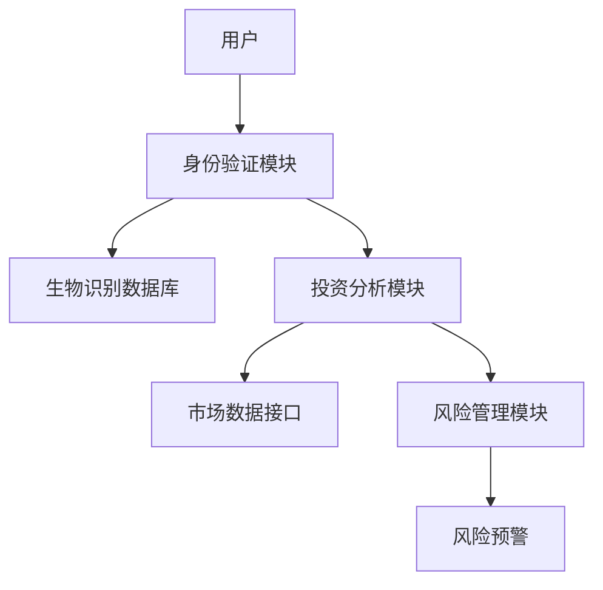

                 


# 价值投资中的新一代生物识别技术前景

> 关键词：生物识别技术、价值投资、风险管理、投资者身份验证、金融系统安全

> 摘要：本文探讨了生物识别技术在价值投资中的应用前景，分析了其在投资者身份验证和风险管理中的作用，详细介绍了相关算法原理，并提出了系统的架构设计和实际案例分析，以期为价值投资者提供新的视角和策略。

---

## 第1章: 背景介绍

### 1.1 生物识别技术的基本概念
- 1.1.1 生物识别技术的定义：生物识别技术是利用人体的生理特征或行为特征进行身份验证的技术，包括指纹识别、面部识别、声音识别等。
- 1.1.2 生物识别技术的主要类型：指纹识别、面部识别、声音识别、虹膜识别等。
- 1.1.3 生物识别技术的核心优势：高安全性、高准确性、便捷性。

### 1.2 价值投资的基本原理
- 1.2.1 价值投资的定义：价值投资是一种投资策略，通过分析公司的基本面，寻找市场价格低于其内在价值的证券进行投资。
- 1.2.2 价值投资的主要策略：注重长期回报、关注公司基本面、分散投资风险。
- 1.2.3 价值投资与现代技术的结合：通过技术手段提升投资分析的效率和准确性。

### 1.3 生物识别技术在价值投资中的应用背景
- 1.3.1 传统投资分析的局限性：信息不对称、市场波动大、人为情绪影响决策。
- 1.3.2 生物识别技术在投资决策中的潜在价值：通过分析投资者的生理和行为特征，辅助判断投资决策的合理性和稳定性。
- 1.3.3 当前市场对生物识别技术的需求：金融行业对安全性和个性化服务的需求增加，生物识别技术成为提升服务质量和风险管理的重要手段。

---

## 第2章: 生物识别技术的核心概念与联系

### 2.1 生物识别技术的核心原理
- 2.1.1 指纹识别的原理：通过采集和分析指纹的细节特征，利用算法进行匹配和识别。
- 2.1.2 面部识别的原理：通过采集面部图像，利用特征点提取和匹配算法进行识别。
- 2.1.3 声音识别的原理：通过采集语音信号，利用模式识别和信号处理技术进行识别。

### 2.2 生物识别技术与价值投资的联系
- 2.2.1 生物识别技术在投资者身份验证中的应用：通过生物特征识别投资者身份，确保交易的安全性和合法性。
- 2.2.2 生物识别技术在投资风险管理中的应用：通过分析投资者的情绪和行为特征，评估投资决策的稳定性。
- 2.2.3 生物识别技术在投资行为分析中的应用：通过分析投资者的行为模式，优化投资策略和风险管理。

### 2.3 核心概念的对比分析
- 2.3.1 不同生物识别技术的优缺点对比：
  | 技术类型 | 优点 | 缺点 |
  |----------|------|------|
  | 指纹识别 | 高准确率，成本低 | 易受皮肤磨损影响 |
  | 面部识别 | 非接触式，适用性广 | 易受光线和角度影响 |
  | 声音识别 | 自然性高，不易复制 | 易受环境噪声影响 |
- 2.3.2 生物识别技术与传统投资分析方法的对比：生物识别技术提供更客观和个性化的数据支持，而传统方法依赖于财务指标和市场分析。

---

## 第3章: 生物识别技术的算法原理

### 3.1 常见的生物识别算法
- 3.1.1 指纹识别算法：基于Gabor滤波器的特征提取和模板匹配算法。
- 3.1.2 面部识别算法：基于主成分分析（PCA）的特征提取和K-近邻算法（KNN）的分类器。
- 3.1.3 声音识别算法：基于Mel频率倒谱系数（MFCC）的特征提取和隐马尔可夫模型（HMM）的分类。

### 3.2 生物识别算法的流程图
```mermaid
graph TD
A[开始] -> B[采集生物特征]
B -> C[预处理特征]
C -> D[提取特征]
D -> E[匹配/分类]
E -> F[输出结果]
F -> G[结束]
```

### 3.3 生物识别算法的数学模型
- 指纹识别的Gabor滤波器模型：
  $$ I(x,y) = I(x,y) * G(x,y) $$
- 面部识别的PCA模型：
  $$ Y = X X^T $$
- 声音识别的HMM模型：
  $$ P(O|λ) = \prod_{i=1}^{N} P(o_i | s_{t-1}=s_i) \cdot P(s_i | s_{t-1}) $$

### 3.4 算法实现的Python代码示例
```python
import numpy as np
from sklearn.neighbors import KNeighborsClassifier
from sklearn.decomposition import PCA

# 示例面部识别算法
def face_recognition():
    # 假设X为输入的面部图像数据，y为标签
    X = np.random.randn(100, 100, 3)  # 示例数据
    X_flattened = X.reshape(X.shape[0], -1)
    pca = PCA(n_components=50)
    X_pca = pca.fit_transform(X_flattened)
    knn = KNeighborsClassifier(n_neighbors=3)
    knn.fit(X_pca, y)
    return knn

face_model = face_recognition()
```

---

## 第4章: 系统分析与架构设计

### 4.1 金融投资系统的设计目标
- 提供安全的身份验证功能。
- 实现个性化投资建议。
- 提供实时市场数据分析。

### 4.2 系统功能设计
- 用户身份验证模块：基于生物识别技术的身份验证。
- 投资分析模块：结合生物识别数据的投资决策支持。
- 风险管理模块：实时监控和风险预警。

### 4.3 系统架构设计


### 4.4 系统接口设计
- 用户端接口：API接口用于生物特征的采集和提交。
- 系统内部接口：模块之间的数据交互接口。
- 第三方接口：与市场数据供应商的数据接口。

### 4.5 系统交互流程
```mermaid
sequenceDiagram
参与者 用户
参与者 身份验证模块
参与者 投资分析模块
参与者 风险管理模块

用户->>身份验证模块: 提交生物特征
身份验证模块->>用户: 验证结果
用户->>投资分析模块: 查询投资建议
投资分析模块->>风险管理模块: 获取市场数据
风险管理模块->>投资分析模块: 提供风险评估
投资分析模块->>用户: 提供投资建议
```

---

## 第5章: 项目实战

### 5.1 项目背景与目标
- 开发一个基于面部识别的投资者身份验证系统。
- 实现投资者行为分析和风险管理功能。

### 5.2 项目环境配置
- 操作系统：Linux
- 开发工具：Python、Jupyter Notebook
- 依赖库：OpenCV、scikit-learn、numpy

### 5.3 核心代码实现
```python
import cv2
import numpy as np
from sklearn.svm import SVC

# 示例面部识别代码
def face_detection():
    face_cascade = cv2.CascadeClassifier('haarcascade_frontalface_default.xml')
    eye_cascade = cv2.CascadeClassifier('haarcascade_eye.xml')
    cap = cv2.VideoCapture(0)
    while True:
        ret, img = cap.read()
        gray = cv2.cvtColor(img, cv2.COLOR_BGR2GRAY)
        faces = face_cascade.detectMultiScale(gray, 1.3, 5)
        for (x, y, w, h) in faces:
            cv2.rectangle(img, (x, y), (x + w, y + h), (255, 0, 0), 2)
        cv2.imshow('Face Detection', img)
        if cv2.waitKey(1) == ord('q'):
            break
    cap.release()
    cv2.destroyAllWindows()

face_detection()
```

### 5.4 系统测试与优化
- 功能测试：验证身份验证的准确性和稳定性。
- 性能测试：评估系统在高并发情况下的处理能力。
- 安全性测试：确保系统对数据的保护和隐私的合规性。

### 5.5 项目案例分析
- 案例背景：某金融机构引入面部识别技术进行投资者身份验证。
- 实施过程：系统集成、数据测试、用户反馈收集。
- 实施效果：提高了身份验证效率，降低了欺诈风险。

---

## 第6章: 总结与展望

### 6.1 核心结论
- 生物识别技术在价值投资中的应用前景广阔。
- 生物识别技术能够提升投资决策的准确性和安全性。

### 6.2 未来发展趋势
- 更多生物识别技术的集成和优化。
- 生物识别技术与人工智能的深度融合。
- 生物识别技术在个性化投资服务中的应用。

### 6.3 注意事项与建议
- 加强生物识别技术的安全性研究，防止数据泄露。
- 注重投资者隐私保护，确保合规性。
- 持续关注生物识别技术的最新发展，保持技术领先性。

---

## 作者：AI天才研究院 & 禅与计算机程序设计艺术

