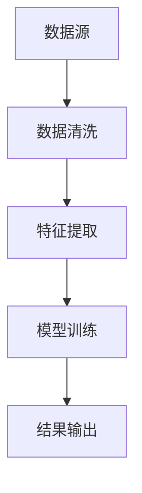

                 


# 价值投资中的新一代电池技术分析

---

## 关键词

- 价值投资
- 电池技术
- 新一代电池
-抽蓄电站
-抽水储能
- 技术分析

---

## 摘要

在能源转型和绿色投资的背景下，电池技术作为新能源产业的核心，其发展与价值投资密切相关。本文从技术原理、市场动态、投资策略等多维度，详细分析了新一代电池技术的特点及其对投资决策的影响。通过建立技术评估模型、探讨市场趋势，并结合实际案例，为投资者提供科学的决策依据，帮助其在新能源领域实现稳健投资。

---

## 正文

---

### 第一部分：背景与概述

---

#### 第1章：电池技术与价值投资的背景

##### 1.1 电池技术的发展历程

电池技术经历了从铅酸电池到锂离子电池的演变，每一代技术都推动了能源存储和应用的进步。当前，固态电池、钠离子电池等新技术正在快速发展，为新能源产业带来革命性变化。

##### 1.2 价值投资与电池技术的结合

价值投资是一种长期投资策略，注重基本面分析和技术壁垒。电池技术的高投入、高门槛特性，使其成为价值投资的理想标的。通过技术分析，投资者可以更好地识别技术领先企业，捕捉投资机会。

##### 1.3 电池技术在能源领域的应用前景

随着可再生能源的普及，储能需求激增，电池技术成为能源系统的核心。抽蓄电站和抽水储能等技术的应用，进一步拓展了电池技术的市场空间。

---

#### 第2章：电池技术的现状与趋势

##### 2.1 当前主流电池技术分析

| 技术类型       | 能量密度（Wh/kg） | 循环寿命 | 安全性 |
|----------------|------------------|----------|--------|
| 锂离子电池     | 100-250          | 300-1000 | 高     |
| 固态电池       | 250-400          | 1000+    | 极高    |
| 钠离子电池     | 100-150          | 500-1000 | 高     |

##### 2.2 电池技术的市场动态

全球电池市场持续增长，中国成为主要生产基地。技术竞争日益激烈，龙头企业通过技术创新和成本优化巩固市场地位。

---

### 第二部分：核心概念与技术分析

---

#### 第3章：电池技术的核心指标与评估方法

##### 3.1 电池技术的关键指标

- **能量密度**：单位重量的能量存储能力，直接影响电池的续航能力。
- **循环寿命**：电池充放电次数，影响其长期使用价值。
- **安全性**：电池在使用中的稳定性，关系到应用场景的安全性。

##### 3.2 电池技术的评估方法

1. **技术可行性评估**：通过实验室数据和技术成熟度判断技术的可行性。
2. **成本效益分析**：比较不同技术的成本和性能，评估其经济性。
3. **市场竞争力评估**：分析市场需求和技术渗透率，判断技术的市场前景。

---

#### 第4章：电池技术与投资价值的关联

##### 4.1 电池技术对投资价值的影响

- **技术领先性**：领先的技术意味着更高的市场占有率和盈利能力。
- **成本优势**：低成本技术在价格竞争中更具优势。
- **市场需求**：旺盛的市场需求推动技术快速商业化，带来投资收益。

---

### 第三部分：电池技术评估模型

---

#### 第5章：电池技术评估模型的构建

##### 5.1 技术评估模型的框架

- **数据输入**：电池技术参数、市场数据、财务数据。
- **模型计算**：净现值（NPV）、内部收益率（IRR）。
- **结果输出**：技术的经济价值和投资可行性。

##### 5.2 技术评估模型的数学公式

净现值计算公式：
$$ NPV = \sum_{t=0}^{n} \frac{CF_t}{(1 + r)^t} $$

内部收益率计算公式：
$$ IRR = r \text{ 使得 } NPV = 0 $$

---

### 第四部分：电池技术的市场与投资分析

---

#### 第6章：电池技术的市场动态与投资策略

##### 6.1 市场动态分析

- **全球电池市场增长**：预计未来五年年均增长率超过15%。
- **技术竞争加剧**：企业加大研发投入，推动技术升级。
- **政策支持**：政府补贴和环保政策促进电池产业发展。

##### 6.2 投资策略

1. **技术驱动型投资**：重点关注技术领先企业。
2. **成本优势投资**：选择具有规模化生产能力的企业。
3. **市场渗透率投资**：布局市场需求增长快的领域。

---

### 第五部分：系统架构与数据支持

---

#### 第7章：系统架构与数据支持

##### 7.1 系统功能设计

- **数据收集模块**：采集市场、技术和财务数据。
- **分析模块**：利用模型评估技术价值。
- **决策支持模块**：提供投资建议。

##### 7.2 系统架构图



---

### 第六部分：项目实战

---

#### 第8章：项目实战与案例分析

##### 8.1 环境配置

安装必要的库和工具，如Python、Pandas、Scikit-learn等。

##### 8.2 核心实现代码

```python
import pandas as pd
import numpy as np

# 数据预处理
data = pd.read_csv('battery_data.csv')
data = data.dropna()

# 模型训练
from sklearn.linear_model import LinearRegression
model = LinearRegression()
model.fit(data[['能量密度', '循环寿命']], data['成本'])

# 结果预测
new_data = pd.DataFrame({'能量密度': [250], '循环寿命': [1000]})
prediction = model.predict(new_data)
print(prediction)
```

##### 8.3 案例分析

以某电池企业为例，分析其技术优势、市场表现和财务状况，评估其投资价值。

---

### 第七部分：投资策略与风险管理

---

#### 第9章：投资策略与风险管理

##### 9.1 投资策略

- **分散投资**：降低单一技术风险。
- **长期持有**：关注企业长期发展。

##### 9.2 风险管理

- **技术风险**：关注技术更新和替代风险。
- **市场风险**：警惕市场需求变化和竞争压力。
- **财务风险**：评估企业财务健康状况。

---

### 第八部分：结论与展望

---

#### 第10章：结论与展望

##### 10.1 结论

电池技术作为新能源的核心，具有广阔的投资前景。通过技术分析和模型评估，投资者可以更好地识别优质标的，实现稳健投资。

##### 10.2 展望

未来，随着技术进步和市场发展，电池技术分析将更加精细化。投资者需要持续关注技术动态和市场变化，抓住投资机遇。

---

## 作者

作者：AI天才研究院/AI Genius Institute & 禅与计算机程序设计艺术 /Zen And The Art of Computer Programming

---

希望这篇文章能为您提供有价值的见解，并为您的投资决策提供参考。

