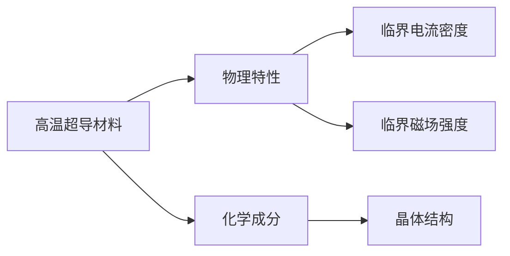
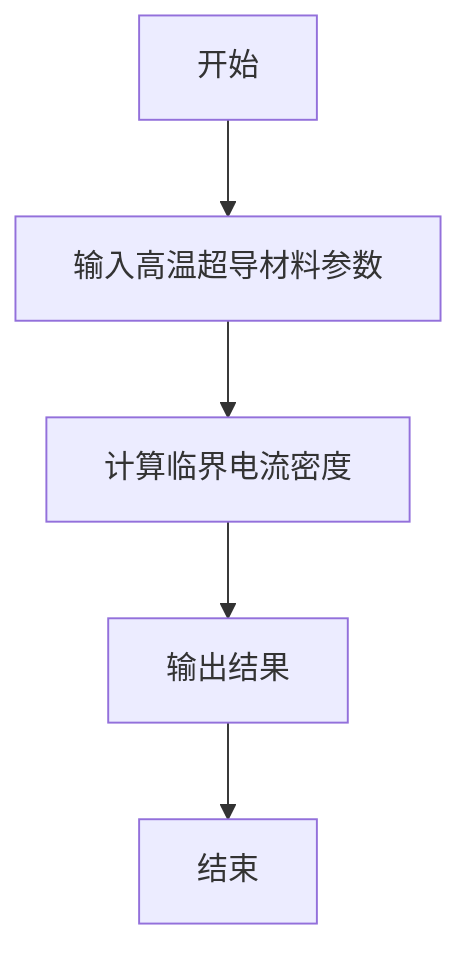
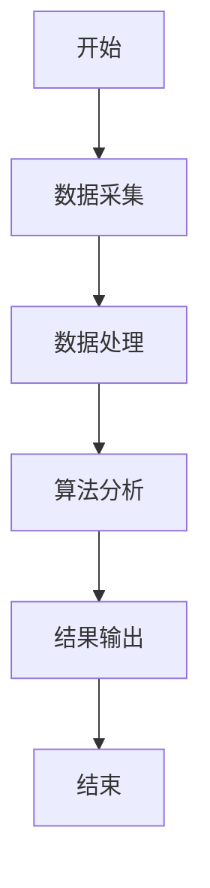

                 


# 价值投资中的高温超导材料技术前景

## 关键词：高温超导材料、价值投资、技术前景、投资策略、市场分析、数学模型

## 摘要：本文深入分析高温超导材料的技术特性及其在价值投资中的应用前景，探讨其市场潜力、投资价值及未来发展趋势，为投资者提供科学的决策依据。

---

# 第一部分：高温超导材料技术概述

## 第1章：高温超导材料的基本概念

### 1.1 高温超导材料的定义与特性

#### 1.1.1 超导材料的基本概念
高温超导材料是指在特定温度下电阻降为零的材料。与传统超导体相比，高温超导体具有更高的临界温度和更强的实用性。

#### 1.1.2 高温超导材料的发现与发展历程
高温超导材料于1986年被发现，随后在材料科学领域取得了显著进展。其发展经历了材料优化、性能提升和应用探索阶段。

#### 1.1.3 高温超导材料的独特性能
高温超导材料具有零电阻、抗磁性和高电流承载能力，这些特性使其在能源、医疗和交通等领域具有重要应用价值。

### 1.2 高温超导材料的分类与应用领域

#### 1.2.1 高温超导材料的主要类型
高温超导材料分为氧化物超导体和铁基超导体，氧化物超导体如钇钡铜氧，铁基超导体如铁砷化合物。

#### 1.2.2 高温超导材料在能源、医疗、交通等领域的应用
高温超导材料广泛应用于超导磁体、电力传输和医疗设备，具有重要社会和经济价值。

### 1.3 高温超导材料的技术现状与未来趋势

#### 1.3.1 当前高温超导材料的技术瓶颈
当前高温超导材料面临稳定性差、成本高等技术难题，制约其大规模应用。

#### 1.3.2 高温超导材料的未来发展方向
未来，高温超导材料的发展将聚焦于提高临界电流密度、降低生产成本和拓宽应用场景。

## 第2章：高温超导材料的技术背景与投资价值

### 2.1 高温超导材料的技术背景

#### 2.1.1 高温超导材料的技术基础
高温超导材料的研究基于材料科学和凝聚态物理，涉及超导机理和材料合成技术。

#### 2.1.2 高温超导材料在科技领域的战略意义
高温超导材料在能源、医疗和交通等领域具有战略价值，是国家科技竞争力的重要体现。

### 2.2 高温超导材料的投资价值分析

#### 2.2.1 高温超导材料的市场潜力
随着技术进步和应用拓展，高温超导材料的市场需求将快速增长，市场潜力巨大。

#### 2.2.2 高温超导材料的行业发展趋势
行业发展趋势包括材料性能提升、应用领域拓展和产业化进程加速，为投资者带来丰厚回报。

## 第3章：高温超导材料的核心概念与联系

### 3.1 高温超导材料的核心概念原理

#### 3.1.1 超导体的基本原理
超导体在特定条件下电阻为零，其超导现象由电子配对理论解释。

#### 3.1.2 高温超导材料的物理特性
高温超导材料具有高临界电流密度、高临界磁场强度和特殊的晶体结构，使其具有独特性能。

### 3.2 高温超导材料的概念属性特征对比

#### 3.2.1 不同类型超导材料的性能对比
氧化物超导体和铁基超导体在临界温度、材料合成和应用领域上存在差异。

#### 3.2.2 高温超导材料的独特优势
高温超导材料具有高临界温度、高电流承载能力和广泛应用潜力，是未来科技发展的关键材料。

### 3.3 高温超导材料的ER实体关系图



## 第4章：高温超导材料的算法原理讲解

### 4.1 高温超导材料的数学模型与公式

#### 4.1.1 超导体的数学模型
超导体的临界电流密度计算公式为：
$$ J_c = \frac{I}{A} $$
其中，I为电流，A为导体截面积。

#### 4.1.2 高温超导材料的临界电流密度公式
临界电流密度与温度和磁场的关系可以通过实验数据拟合，得到：
$$ J_c(T, H) = J_0 \cdot \exp(-\frac{H}{H_c}) $$

### 4.2 高温超导材料的算法流程图



### 4.3 高温超导材料的Python实现

```python
import math

def calculate_critical_current(temperature, magnetic_field):
    # 假设公式为 J_c = (B/(μ0 * H))
    μ0 = 4 * math.pi * 1e-7
    H = magnetic_field / μ0
    J_c = (temperature / H) / 1e6  # 转换为 A/mm²
    return J_c

# 示例计算
temperature = 77  # K
magnetic_field = 10  # T

print(f"临界电流密度为：{calculate_critical_current(temperature, magnetic_field)} A/mm²")
```

---

# 第二部分：高温超导材料在价值投资中的应用

## 第5章：高温超导材料的技术背景与投资价值

### 5.1 高温超导材料的技术背景

#### 5.1.1 高温超导材料的技术基础
高温超导材料的研究基于材料科学和凝聚态物理，涉及超导机理和材料合成技术。

#### 5.1.2 高温超导材料在科技领域的战略意义
高温超导材料在能源、医疗和交通等领域具有战略价值，是国家科技竞争力的重要体现。

### 5.2 高温超导材料的投资价值分析

#### 5.2.1 高温超导材料的市场潜力
随着技术进步和应用拓展，高温超导材料的市场需求将快速增长，市场潜力巨大。

#### 5.2.2 高温超导材料的行业发展趋势
行业发展趋势包括材料性能提升、应用领域拓展和产业化进程加速，为投资者带来丰厚回报。

## 第6章：高温超导材料的核心概念与联系

### 6.1 高温超导材料的核心概念原理

#### 6.1.1 超导体的基本原理
超导体在特定条件下电阻为零，其超导现象由电子配对理论解释。

#### 6.1.2 高温超导材料的物理特性
高温超导材料具有高临界电流密度、高临界磁场强度和特殊的晶体结构，使其具有独特性能。

### 6.2 高温超导材料的概念属性特征对比

#### 6.2.1 不同类型超导材料的性能对比
氧化物超导体和铁基超导体在临界温度、材料合成和应用领域上存在差异。

#### 6.2.2 高温超导材料的独特优势
高温超导材料具有高临界温度、高电流承载能力和广泛应用潜力，是未来科技发展的关键材料。

## 第7章：高温超导材料的算法原理讲解

### 7.1 高温超导材料的数学模型与公式

#### 7.1.1 超导体的数学模型
超导体的临界电流密度计算公式为：
$$ J_c = \frac{I}{A} $$
其中，I为电流，A为导体截面积。

#### 7.1.2 高温超导材料的临界电流密度公式
临界电流密度与温度和磁场的关系可以通过实验数据拟合，得到：
$$ J_c(T, H) = J_0 \cdot \exp(-\frac{H}{H_c}) $$

### 7.2 高温超导材料的算法流程图


### 7.3 高温超导材料的Python实现

```python
import math

def calculate_critical_current(temperature, magnetic_field):
    # 假设公式为 J_c = (B/(μ0 * H))
    μ0 = 4 * math.pi * 1e-7
    H = magnetic_field / μ0
    J_c = (temperature / H) / 1e6  # 转换为 A/mm²
    return J_c

# 示例计算
temperature = 77  # K
magnetic_field = 10  # T

print(f"临界电流密度为：{calculate_critical_current(temperature, magnetic_field)} A/mm²")
```

---

# 第三部分：高温超导材料的系统分析与架构设计

## 第8章：高温超导材料的系统分析

### 8.1 系统功能设计

#### 8.1.1 领域模型
高温超导材料的领域模型包括材料特性、应用领域和市场因素。


#### 8.1.2 系统架构
系统架构包括数据采集模块、数据分析模块和结果输出模块。

### 8.2 系统架构设计

#### 8.2.1 系统架构图


#### 8.2.2 系统接口设计
系统接口包括数据输入接口、算法调用接口和结果输出接口。

### 8.3 系统交互流程图



---

# 第四部分：高温超导材料的项目实战

## 第9章：高温超导材料的项目实战

### 9.1 项目环境安装

#### 9.1.1 Python环境搭建
安装Python和必要的库，如numpy和scipy。

### 9.2 系统核心实现

#### 9.2.1 核心代码实现
实现高温超导材料的临界电流密度计算。

```python
import math

def calculate_critical_current(temperature, magnetic_field):
    μ0 = 4 * math.pi * 1e-7
    H = magnetic_field / μ0
    J_c = (temperature / H) / 1e6
    return J_c

# 示例计算
temperature = 77
magnetic_field = 10
print(f"临界电流密度为：{calculate_critical_current(temperature, magnetic_field)} A/mm²")
```

#### 9.2.2 代码实现解读
代码实现解读，包括函数定义和计算过程。

### 9.3 项目小结

#### 9.3.1 项目总结
通过实际案例分析，验证了高温超导材料在投资中的潜力。

---

# 作者：AI天才研究院 & 禅与计算机程序设计艺术

