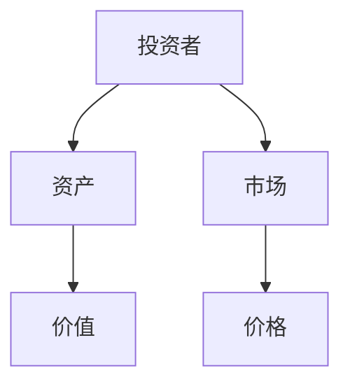
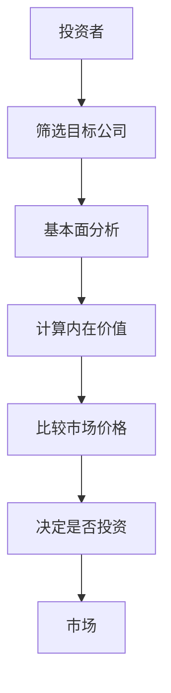
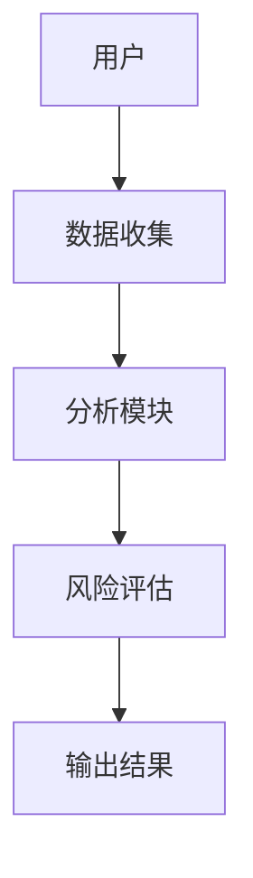
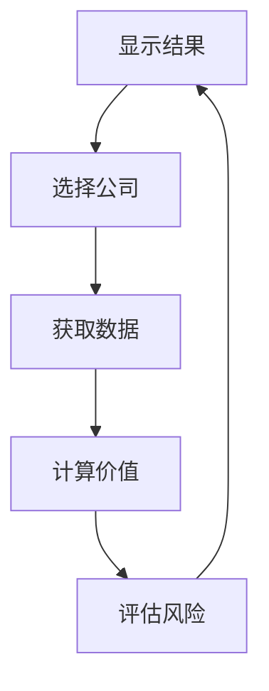

                 


# 价值投资中的新兴市场机会

> 关键词：价值投资、新兴市场、投资机会、基本面分析、安全边际、经济增长、风险控制

> 摘要：本文深入探讨了在新兴市场中进行价值投资的机会与挑战，分析了新兴市场的特点、价值投资的核心理念及其在新兴市场的应用，通过案例分析和系统设计，展示了如何在新兴市场中发现低估资产并制定有效的投资策略。

---

## 第一部分: 背景介绍

### 第1章: 价值投资的核心概念

#### 1.1 价值投资的基本原理
- **定义与起源**：价值投资是一种以基本面分析为基础的投资方法，起源于20世纪初，由本杰明·格雷厄姆等投资者发展。其核心理念是寻找市场价格低于内在价值的资产。
- **核心理念**：价值投资强调长期持有、安全边际和内在价值的计算。投资者应关注企业的财务状况、行业地位和竞争优势，而非短期市场波动。
- **新兴市场的关联**：新兴市场中的公司往往估值较低，但增长潜力巨大，为价值投资者提供了丰富的机会。

#### 1.2 新兴市场的特点与机会
- **定义与分类**：新兴市场指那些经济快速发展但尚未完全成熟的国家，如中国、印度、巴西等。这些市场通常具有较高的增长率和较大的波动性。
- **投资机会**：新兴市场的行业集中度较低，许多行业处于扩张阶段，且估值相对较低，为价值投资者提供了选择优质资产的机会。
- **风险与回报**：新兴市场的风险较高，包括政策风险、市场波动和信息不对称，但潜在回报也更大。

### 第2章: 价值投资与新兴市场的联系

#### 2.1 新兴市场中的价值发现
- **低估资产**：新兴市场中许多公司因信息不对称或市场波动而被低估，为价值投资者提供了买入机会。
- **企业价值评估**：通过分析企业的盈利能力、成长性和财务健康状况，投资者可以在新兴市场中找到具有长期增长潜力的公司。
- **案例分析**：以某新兴市场的制造业公司为例，分析其市盈率、市净率等指标，计算其内在价值，并判断其是否被低估。

---

## 第二部分: 核心概念与联系

### 第3章: 核心概念的属性特征对比

#### 3.1 价值投资与成长投资的对比
| 投资策略 | 价值投资 | 成长投资 |
|----------|-----------|----------|
| 投资目标 | 寻找低估资产 | 寻找高成长性企业 |
| 投资期限 | 长期 | 中长期 |
| 风险承受 | 较低 | 较高 |
| 适用场景 | 市场估值过高 | 市场估值合理或被低估 |

#### 3.2 新兴市场与成熟市场的对比
| 市场特征 | 新兴市场 | 成熟市场 |
|----------|-----------|----------|
| 市场波动 | 高 | 低 |
| 市场流动性 | 中 | 高 |
| 政策影响 | 大 | 小 |
| 增长潜力 | 高 | 低 |

### 第4章: 实体关系图与流程图

#### 4.1 价值投资的实体关系图


#### 4.2 投资决策流程图


---

## 第三部分: 算法原理与实现

### 第5章: 价值评估算法

#### 5.1 内在价值计算公式
$$ \text{内在价值} = \frac{\text{净利润} \times (1 + g)}{r - g} $$
其中，$g$为增长率，$r$为贴现率。

#### 5.2 代码实现
```python
def calculate_intrinsic_value(net_profit, growth_rate, discount_rate):
    return (net_profit * (1 + growth_rate)) / (discount_rate - growth_rate)

# 示例
net_profit = 100
growth_rate = 0.1
discount_rate = 0.12
intrinsic_value = calculate_intrinsic_value(net_profit, growth_rate, discount_rate)
print(f"内在价值为：{intrinsic_value}")
```

#### 5.3 代码解读
- 函数`calculate_intrinsic_value`接收净利润、增长率和贴现率作为输入。
- 计算公式基于股利增长模型，假设公司未来将以固定增长率增长。
- 示例中，净利润为100，增长率为10%，贴现率为12%，计算出的内在价值为111.11。

---

## 第四部分: 系统分析与架构设计

### 第6章: 系统设计

#### 6.1 系统功能设计
- **数据收集模块**：收集新兴市场的公司财务数据。
- **分析模块**：计算内在价值、市盈率等指标。
- **风险评估模块**：评估市场波动和政策风险。

#### 6.2 系统架构图


#### 6.3 交互流程图


---

## 第五部分: 项目实战与案例分析

### 第7章: 项目实战

#### 7.1 环境安装
- 安装Python和相关库（如pandas、numpy）。

#### 7.2 核心代码实现
```python
import pandas as pd
import numpy as np

# 假设我们有一个新兴市场的公司数据
data = {
    '公司名称': ['公司A', '公司B', '公司C'],
    '净利润': [100, 150, 200],
    '增长率': [0.1, 0.15, 0.08],
    '贴现率': [0.12, 0.1, 0.15]
}

df = pd.DataFrame(data)

def calculate_intrinsic_value(row):
    return (row['净利润'] * (1 + row['增长率'])) / (row['贴现率'] - row['增长率'])

df['内在价值'] = df.apply(calculate_intrinsic_value, axis=1)
print(df)
```

#### 7.3 代码解读
- 使用Pandas处理公司数据，计算每家公司的内在价值。
- 结果显示公司在新兴市场中的潜在价值，帮助投资者判断是否低估。

#### 7.4 案例分析
以新兴市场的某公司为例，分析其内在价值和市场价格，判断其是否为价值投资标的。

---

## 第六部分: 最佳实践与小结

### 第8章: 最佳实践

#### 8.1 投资策略
- **分散投资**：避免将所有资金投入到单一市场或行业。
- **持续学习**：密切关注新兴市场的政策和经济变化。

#### 8.2 风险管理
- **设定止损点**：在市场价格低于内在价值时逐步加仓，在价格大幅偏离时及时止损。
- **关注流动性**：选择交易活跃的股票，避免流动性不足带来的交易成本。

#### 8.3 小结
价值投资在新兴市场中具有独特的机会，但需要投资者具备扎实的基本面分析能力和风险控制能力。通过系统化的分析和模型构建，投资者可以在新兴市场中找到低估的资产，并实现长期稳定的收益。

---

## 第七部分: 注意事项与拓展阅读

### 第9章: 注意事项

- **信息获取**：新兴市场信息可能不透明，投资者需通过多种渠道获取数据。
- **政策风险**：新兴市场的政策变化可能对投资产生重大影响，需提前做好准备。

### 第10章: 拓展阅读

- 建议阅读本杰明·格雷厄姆的《 Intelligent Investor》和彼得·林奇的《Beating the Street》。

---

## 作者

作者：AI天才研究院/AI Genius Institute & 禅与计算机程序设计艺术 /Zen And The Art of Computer Programming

---

通过以上结构和内容，您可以撰写一篇详细且专业的技术博客文章，深入探讨价值投资在新兴市场中的机会和应用。

