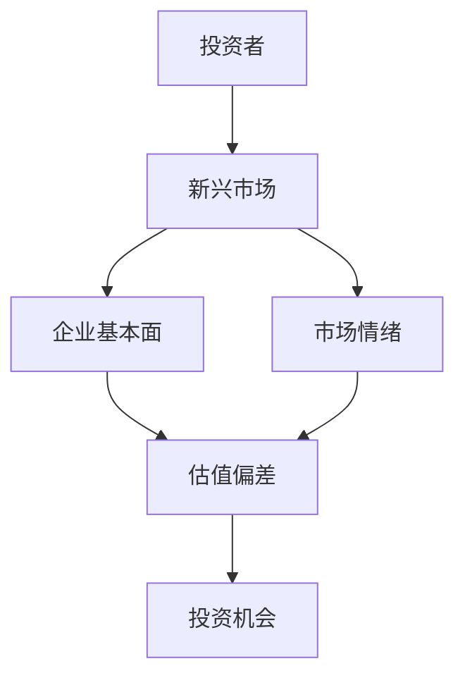

                 

# 价值投资中的新兴市场机遇与风险

> **关键词**：价值投资、新兴市场、投资机遇、投资风险、市场分析、投资策略  
> **摘要**：本文深入探讨了价值投资在新兴市场中的应用，分析了新兴市场的独特机遇与风险，并提出了系统化的投资分析框架和策略。通过理论分析与实际案例结合，帮助投资者更好地理解和把握新兴市场中的价值投资机会。

---

## 第一部分: 价值投资与新兴市场的背景介绍

### 第1章: 价值投资的核心概念

#### 1.1 价值投资的定义与核心理念
价值投资是一种以企业基本面分析为基础的投资策略，旨在通过寻找市场价格低于其内在价值的企业进行投资。其核心理念包括：
- **长期投资**：关注企业的长期价值，而非短期价格波动。
- **安全边际**：买入价格低于内在价值，以降低风险。
- **企业质量**：选择具有强大竞争优势和良好财务状况的企业。

#### 1.2 新兴市场的特点与重要性
新兴市场是指经济快速发展但尚未完全成熟的国家或地区，如中国、印度、巴西等。其特点包括：
- **高增长潜力**：新兴市场通常伴随着快速的经济增长。
- **行业多样性**：新兴市场中往往存在未被充分开发的行业机会。
- **高风险**：新兴市场的经济波动性较大，政策风险和市场流动性风险较高。

### 第2章: 价值投资与新兴市场的结合

#### 2.1 新兴市场中的价值投资机会
在新兴市场中，许多企业由于市场流动性不足或信息不对称，其市场价格可能低于其内在价值。投资者可以通过对企业基本面的深入分析，发现这些被低估的企业。

#### 2.2 新兴市场的投资风险
新兴市场中的投资风险主要体现在：
- **经济波动风险**：新兴市场的经济容易受到外部冲击。
- **政策风险**：政策变化可能对市场产生重大影响。
- **流动性风险**：新兴市场的流动性可能不如成熟市场。

---

## 第二部分: 新兴市场中的价值投资分析框架

### 第3章: 新兴市场价值投资的核心概念与联系

#### 3.1 核心概念原理
在新兴市场中进行价值投资，需要关注以下几个核心概念：
- **企业基本面分析**：包括收入、利润、资产负债表等财务指标。
- **市场情绪与估值偏差**：新兴市场中，投资者情绪可能过度波动，导致市场估值偏离企业真实价值。
- **行业趋势与竞争优势**：新兴市场中某些行业可能处于快速发展阶段，具有竞争优势的企业更容易获得超额收益。

#### 3.2 核心概念对比表格
以下表格对比了新兴市场与成熟市场的核心差异：

| **维度**       | **新兴市场**                          | **成熟市场**                          |
|-----------------|---------------------------------------|---------------------------------------|
| 经济发展水平     | 处于快速发展阶段                    | 经济成熟，增长稳定                  |
| 行业结构         | 新兴行业较多，传统产业占比低        | 传统产业占比高，新兴行业占比低      |
| 投资风险         | 高，政策风险和流动性风险较大        | 低，市场波动较小，流动性充足        |
| 估值偏差         | 可能存在较大的估值偏差              | 估值偏差较小，市场较为理性          |

#### 3.3 ER实体关系图（Mermaid流程图）
以下是一个简单的ER实体关系图，展示了新兴市场中价值投资的核心要素：

---

## 第三部分: 新兴市场价值投资的系统分析与架构设计

### 第4章: 新兴市场中的价值投资策略

#### 4.1 投资策略的制定
在新兴市场中，制定价值投资策略需要考虑以下几个方面：
- **行业选择**：选择具有高增长潜力的行业，如科技、消费、医疗等。
- **企业筛选**：筛选具有强大竞争优势和良好财务状况的企业。
- **风险控制**：通过分散投资和设置止损位来降低风险。

#### 4.2 投资策略的数学模型
以下是一个简单的投资组合优化模型，用于在新兴市场中选择最优的投资组合：

$$
\text{目标函数：最大化预期收益} \quad \max \sum_{i=1}^n w_i r_i
$$

$$
\text{约束条件：最小化投资风险} \quad \min \sum_{i=1}^n w_i^2 \sigma_i^2
$$

其中，\( w_i \) 是第 \( i \) 只股票的投资权重，\( r_i \) 是第 \( i \) 只股票的预期收益率，\( \sigma_i^2 \) 是第 \( i \) 只股票的收益方差。

---

## 第四部分: 新兴市场价值投资的项目实战

### 第5章: 项目实战分析

#### 5.1 案例分析：新兴市场中的科技企业
以中国的某家科技企业为例，分析其投资价值：
- **企业基本面**：收入增长快，利润率稳定，资产负债表健康。
- **行业趋势**：科技行业在新兴市场中具有高增长潜力。
- **估值分析**：市盈率低于行业平均水平，具有较高的安全边际。

#### 5.2 投资策略的实施
- **投资组合配置**：将投资组合的 60% 配置在科技行业，20% 配置在消费行业，20% 配置在医疗行业。
- **风险管理**：设置止损位，定期调整投资组合。

---

## 第五部分: 总结与建议

### 第6章: 总结与展望

#### 6.1 总结
新兴市场中存在丰富的价值投资机会，但也伴随着较高的投资风险。投资者需要通过对企业基本面的深入分析和对行业趋势的准确判断，才能在新兴市场中获得超额收益。

#### 6.2 投资建议
- **长期投资**：新兴市场中的价值投资需要耐心，不要被短期波动所干扰。
- **分散投资**：通过分散投资来降低风险。
- **持续学习**：新兴市场的情况不断变化，投资者需要不断学习和调整投资策略。

---

## 作者：AI天才研究院/AI Genius Institute & 禅与计算机程序设计艺术 /Zen And The Art of Computer Programming

