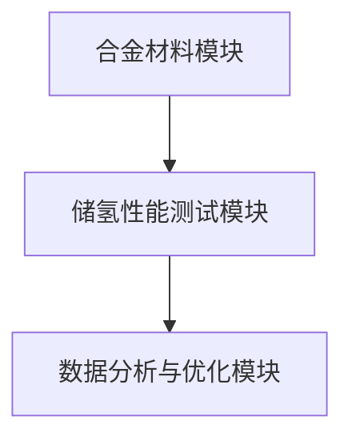
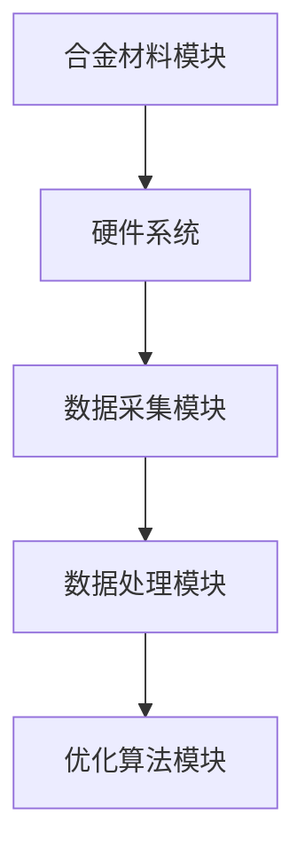
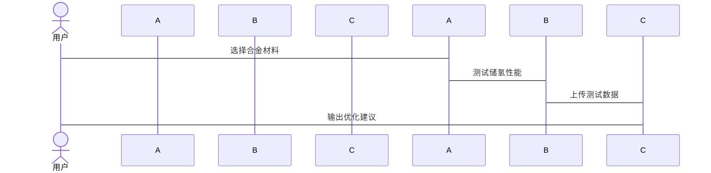

                 


# 价值投资中的新型高效储氢合金材料技术

> 关键词：储氢合金，储氢技术，氢能源，能源投资，价值投资

> 摘要：储氢合金材料技术作为一种新兴的高效储氢技术，在能源领域具有重要的应用价值。本文从价值投资的角度出发，深入分析了储氢合金材料的技术原理、市场前景以及投资潜力。通过对储氢合金材料的核心概念、算法原理、系统架构和项目实战的详细解读，为投资者提供了全面的技术分析和投资建议。

---

## 第一章: 价值投资中的储氢合金材料技术背景

### 1.1 储氢合金材料的基本概念
储氢合金材料是一种能够通过化学反应储存和释放氢气的金属合金。它利用金属的特殊物理化学性质，实现氢的储存和释放，具有高效、安全、可逆的特点。

#### 1.1.1 储氢合金的定义
储氢合金是由多种金属元素组成的合金材料，能够通过化学反应储存氢气。常见的储氢合金包括镧系金属合金、钛基合金和镍系合金等。

#### 1.1.2 储氢合金的分类
储氢合金主要分为以下几类：
1. **镧系金属合金**：如LaNi系合金，具有较高的储氢容量。
2. **钛基合金**：如TiV系合金，适用于高温储氢。
3. **镍系合金**：如NiM系合金，广泛应用于氢燃料电池。

#### 1.1.3 储氢合金的物理化学特性
储氢合金的特性包括：
- 高储氢容量
- 循环稳定性好
- 对氢气的亲和力强
- 可逆性好

### 1.2 储氢合金技术的发展历程
储氢合金技术经历了从早期的研究到商业化应用的历程，其发展主要分为以下几个阶段：
1. **基础研究阶段**：20世纪70年代，科学家开始研究储氢合金的可行性。
2. **技术突破阶段**：80年代，储氢合金的储氢容量和循环性能得到显著提升。
3. **商业化应用阶段**：90年代至今，储氢合金技术逐渐应用于氢燃料电池、储能系统等领域。

### 1.3 储氢合金在能源领域的应用前景
储氢合金技术在能源领域具有广泛的应用前景，特别是在以下几个方面：
1. **可再生能源储能**：储氢合金可以用于风能和太阳能的储能，解决可再生能源的间歇性问题。
2. **氢能源车**：储氢合金是氢燃料电池汽车的核心材料之一。
3. **工业领域**：储氢合金可用于工业制氢、化工生产等领域。

### 1.4 价值投资视角下的储氢合金技术
价值投资是通过长期持有优质资产以获得收益的投资策略。储氢合金技术作为一项具有广阔市场前景和技术创新潜力的技术，具备较高的投资价值。

#### 1.4.1 价值投资的基本概念
价值投资强调以低于内在价值的价格购买优质资产，长期持有以获得收益。储氢合金技术的市场潜力和技术优势使其成为价值投资的理想标的。

#### 1.4.2 储氢合金技术的市场价值分析
- **市场需求增长**：随着氢能源的快速发展，市场对储氢合金的需求持续增长。
- **技术门槛高**：储氢合金技术具有较高的技术门槛，竞争优势明显。
- **政策支持**：各国政府对氢能源技术的支持为储氢合金技术提供了良好的政策环境。

#### 1.4.3 技术创新对投资价值的影响
技术创新能够提高储氢合金的储氢容量和循环性能，降低成本，从而提升技术的市场竞争力和投资价值。

---

## 第二章: 储氢合金材料的核心原理

### 2.1 储氢合金的储氢机制
储氢合金的储氢过程是一个化学反应过程，主要通过合金与氢气的化学反应实现氢的储存和释放。

#### 2.1.1 合金的储氢过程
储氢合金与氢气反应生成金属氢化物，化学反应式为：
$$ M + H_2 \rightarrow MH_2 $$
其中，M代表储氢合金，MH₂代表金属氢化物。

#### 2.1.2 储氢合金的物理化学原理
储氢合金的储氢能力与其金属成分、晶体结构密切相关。储氢过程涉及氢的吸附、扩散和储存，具体机制包括：
1. **氢的吸附**：氢气分子吸附在合金表面。
2. **氢的扩散**：氢原子扩散到合金内部。
3. **氢的储存**：氢原子与金属结合，形成金属氢化物。

#### 2.1.3 影响储氢容量的关键因素
- **合金成分**：不同金属成分的储氢容量不同。
- **晶体结构**：合金的晶体结构影响氢的扩散和储存。
- **表面积**：合金的表面积越大，储氢效率越高。

### 2.2 储氢合金的合金成分与性能关系
储氢合金的性能与其成分密切相关，优化合金成分可以提高储氢容量和循环性能。

#### 2.2.1 合金成分对储氢能力的影响
- **主成分**：主成分决定了储氢合金的基本性能。
- **添加成分**：添加微量元素可以改善储氢性能。

#### 2.2.2 不同合金材料的性能对比
以下是几种常见储氢合金的性能对比：

| 合金类型 | 储氢容量（wt%） | 循环性能 | 工作温度 |
|----------|------------------|----------|----------|
| LaNi系   | 1.5-2.5          | 较好     | 室温     |
| TiV系    | 1.0-1.5          | 优秀     | 中低温   |
| NiM系    | 1.2-2.0          | 良好     | 室温     |

#### 2.2.3 合金材料的优化设计
通过合金成分优化和微观结构调控，可以提高储氢合金的储氢容量和循环稳定性。例如，通过添加稀土元素可以改善储氢性能。

### 2.3 储氢合金的数学模型与公式
储氢容量的计算公式：
$$储氢容量 = \frac{m \cdot M}{M_w}$$
其中，$m$为合金质量，$M$为氢的摩尔质量，$M_w$为水的摩尔质量。

储氢效率的影响因素包括：
- 合金成分
- 工作温度
- 压力条件

---

## 第三章: 储氢合金材料的系统分析与架构设计

### 3.1 系统功能模块划分
储氢合金材料的系统设计包括以下几个功能模块：
1. **合金材料模块**：负责合金成分的优化和性能测试。
2. **储氢性能测试模块**：对储氢容量、循环性能等进行测试。
3. **数据分析与优化模块**：通过数据分析优化储氢合金的性能。

#### 3.1.1 系统功能模块划分


### 3.2 系统架构设计
储氢合金材料的系统架构设计包括硬件和软件两部分。

#### 3.2.1 系统架构的mermaid图


#### 3.2.2 系统架构的详细描述
- **硬件系统**：包括储氢合金材料、数据采集设备等。
- **数据采集模块**：负责采集储氢性能数据。
- **数据处理模块**：对数据进行分析和处理。
- **优化算法模块**：通过算法优化储氢合金的性能。

### 3.3 系统接口设计与交互流程
系统接口设计包括：
1. **硬件接口**：与数据采集设备的接口。
2. **软件接口**：与数据分析模块的接口。

#### 3.3.1 系统接口设计
- **硬件接口**：通过RS-485或I2C接口与数据采集设备连接。
- **软件接口**：通过API接口与数据分析模块交互。

#### 3.3.2 系统交互流程


---

## 第四章: 价值投资中的储氢合金材料技术应用

### 4.1 项目背景介绍
储氢合金材料技术在能源领域具有广泛的应用前景，尤其是在氢能源车、可再生能源储能等领域。

#### 4.1.1 项目背景
随着全球能源结构的调整，氢能源作为一种清洁的能源载体，备受关注。储氢合金材料技术是氢能源利用的核心技术之一。

### 4.2 项目核心实现
储氢合金材料技术的核心实现包括合金成分优化、储氢性能测试和数据分析优化。

#### 4.2.1 环境安装
- **软件环境**：Python 3.8及以上版本，安装必要的库（如numpy、pandas）。
- **硬件环境**：数据采集设备、储氢合金材料等。

#### 4.2.2 核心代码实现
以下是储氢容量计算的Python代码：
```python
import numpy as np

def calculate_storage_capacity(m, M, M_w):
    return m * M / M_w

m = 10  # 合金质量，单位：g
M = 2.016  # 氢的摩尔质量，单位：g/mol
M_w = 18.015  # 水的摩尔质量，单位：g/mol

capacity = calculate_storage_capacity(m, M, M_w)
print(f"储氢容量为：{capacity} mol/g")
```

#### 4.2.3 代码应用解读与分析
上述代码通过输入合金质量、氢的摩尔质量和水的摩尔质量，计算储氢容量。结果表明，储氢容量与合金质量成正比。

### 4.3 实际案例分析
以某储氢合金材料为例，分析其储氢容量和循环性能。

#### 4.3.1 案例分析
案例中储氢合金的储氢容量为2.5 wt%，循环性能良好，适合应用于氢燃料电池。

### 4.4 项目小结
储氢合金材料技术在能源领域具有广泛的应用前景，通过优化合金成分和性能测试，可以进一步提升其市场竞争力。

---

## 第五章: 价值投资中的储氢合金材料技术总结

### 5.1 最佳实践 tips
- 投资储氢合金技术需要关注技术创新和市场应用。
- 选择具有技术优势和市场潜力的储氢合金材料。

### 5.2 小结
储氢合金材料技术作为一种高效储氢技术，在能源领域具有重要的应用价值。通过优化合金成分和性能测试，可以进一步提升其市场竞争力。

### 5.3 注意事项
- 储氢合金技术的投资需要关注技术风险和市场风险。
- 投资者应选择具有技术优势和市场潜力的储氢合金材料。

### 5.4 拓展阅读
建议进一步阅读储氢合金材料技术的相关文献，了解其最新的研究进展和应用案例。

---

## 作者：AI天才研究院/AI Genius Institute & 禅与计算机程序设计艺术 /Zen And The Art of Computer Programming

