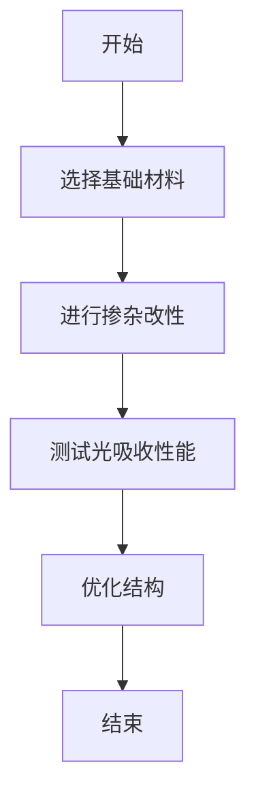
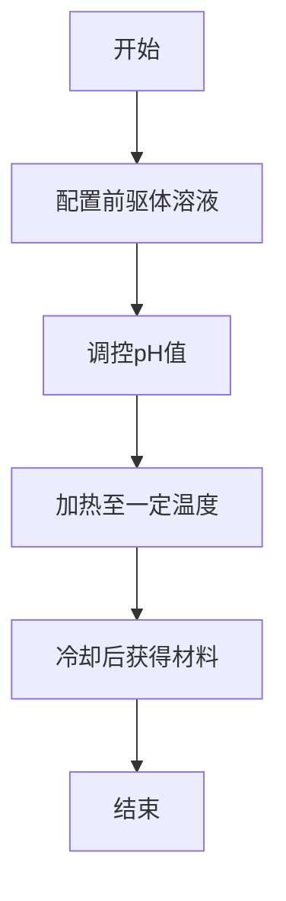

                 


# 价值投资中的新型高效光催化材料技术

> 关键词：光催化材料、价值投资、技术分析、投资策略、高效材料  
> 摘要：本文探讨了新型高效光催化材料技术在价值投资中的应用，分析了其核心技术、市场前景和投资策略，结合实际案例和系统架构，为投资者提供了深入的技术分析和投资建议。

---

## 第1章 光催化材料的基本概念与价值投资背景

### 1.1 光催化材料的基本概念

#### 1.1.1 光催化材料的定义与分类

光催化材料是指能够利用光能驱动化学反应的材料，其核心作用是将光能转化为化学能。根据材料的物理性质和应用领域，光催化材料主要分为以下几类：

1. **半导体材料**：如二氧化钛（TiO₂）、氧化锌（ZnO），这些材料具有良好的光吸收和电子迁移特性。
2. **金属纳米材料**：如银（Ag）、金（Au），这些材料在光催化中常用于表面增强反应。
3. **有机光敏材料**：如染料敏化材料，用于光能的吸收和转化。

**对比表**：

| 材料类型 | 主要成分 | 光吸收波长 | 催化效率 |
|----------|----------|------------|----------|
| 半导体材料 | TiO₂、ZnO | 紫外线 | 高 |
| 金属纳米材料 | Ag、Au | 可见光 | 中等 |
| 有机光敏材料 | 染料 | 可见光 | 高 |

#### 1.1.2 光催化材料的基本原理

光催化材料的工作原理基于光生伏特效应，即材料在光照下产生电子-空穴对，进而驱动化学反应。这一过程通常包括以下几个步骤：

1. **光吸收**：材料吸收特定波长的光子，激发电子跃迁。
2. **电子迁移**：电子从价带跃迁到导带，空穴留在价带。
3. **催化反应**：电子和空穴参与化学反应，如水分解生成氢气或降解有机污染物。

**公式**：光催化效率可表示为：
$$
\text{效率} = \frac{\text{反应速率}}{\text{光强度}}
$$

#### 1.1.3 光催化材料在价值投资中的应用背景

光催化材料在环保、能源等领域具有广阔的应用前景，特别是在太阳能利用和污染治理方面。随着技术的进步，光催化材料的商业化潜力逐渐显现，吸引了大量投资者的关注。

---

### 1.2 价值投资与光催化材料的结合

#### 1.2.1 价值投资的基本概念

价值投资是一种投资策略，强调通过深入分析企业的基本面，寻找被市场低估的投资标的。在光催化材料领域，投资者需要评估技术的成熟度、市场潜力和商业模式。

#### 1.2.2 光催化材料技术的市场价值

光催化材料技术的市场价值主要体现在其应用场景的广度和深度。例如，用于水处理的光催化材料可以显著降低运营成本，具有较高的商业价值。

#### 1.2.3 光催化材料技术的长期投资潜力

随着环保政策的加强和技术的进步，光催化材料的应用前景广阔。特别是在清洁能源和可持续发展领域，相关技术具有长期的投资价值。

---

## 第2章 光催化材料的核心技术与应用领域

### 2.1 光催化材料的核心技术

#### 2.1.1 光催化材料的设计与合成

光催化材料的设计需要考虑其物理性质、化学性质和催化性能。例如，通过掺杂改性可以提升材料的光吸收效率。

**流程图**：



#### 2.1.2 光催化材料的性能优化

性能优化是提升光催化效率的关键。通过调控材料的纳米结构和表面形貌，可以显著提高其催化活性。

**公式**：光催化效率与材料表面积的关系：
$$
\text{效率} \propto \text{表面积}
$$

#### 2.1.3 光催化材料的稳定性与耐久性

光催化材料在实际应用中需要具备良好的稳定性和耐久性，以应对复杂的环境条件。

---

### 2.2 光催化材料的主要应用领域

#### 2.2.1 光催化材料在环保领域的应用

光催化材料在水处理和空气净化中的应用尤为突出。例如，二氧化钛基材料可用于降解有机污染物。

#### 2.2.2 光催化材料在能源领域的应用

光催化材料在太阳能电池和氢气生成中的应用前景广阔，特别是结合了新型纳米结构的设计。

#### 2.2.3 光催化材料在医疗领域的应用

光催化材料在抗菌和肿瘤治疗中的应用展示了其在医疗领域的潜力，特别是在光动力疗法中。

---

## 第3章 光催化材料的市场分析与投资策略

### 3.1 光催化材料的市场现状分析

#### 3.1.1 全球光催化材料市场概况

全球光催化材料市场呈现快速增长态势，特别是在环保和能源领域。根据市场研究，未来五年市场年复合增长率预计超过15%。

#### 3.1.2 中国光催化材料市场的特点

中国光催化材料市场增长迅速，主要得益于政策支持和技术创新。国内企业逐渐在国际市场上崭露头角。

#### 3.1.3 光催化材料市场的未来发展趋势

未来，光催化材料的应用将更加多元化，特别是在新能源和医疗领域。

### 3.2 光催化材料的投资策略

#### 3.2.1 投资者如何选择光催化材料项目

投资者应关注企业的技术实力、市场定位和商业模式。优先选择具有核心技术优势和明确市场应用的企业。

#### 3.2.2 光催化材料技术的商业化路径

商业化路径包括技术授权、产品销售和项目合作。企业应根据自身优势选择合适的商业化策略。

#### 3.2.3 光催化材料投资的风险与收益分析

光催化材料投资具有较高的技术风险和市场风险，但同时也具备较高的收益潜力。投资者需做好风险评估和管理。

---

## 第4章 光催化材料的性能评估与优化

### 4.1 光催化材料的性能评估指标

#### 4.1.1 光催化效率的评估方法

光催化效率通常通过反应速率和量子产率来评估。例如，水分解生成氢气的效率可以用以下公式表示：

$$
\text{效率} = \frac{\text{氢气生成速率}}{\text{光子吸收数}}
$$

#### 4.1.2 光催化材料的稳定性测试

稳定性测试包括耐久性实验和环境适应性测试。例如，材料在不同pH值和温度下的性能变化。

#### 4.1.3 光催化材料的经济性分析

经济性分析包括材料成本、制备成本和应用成本。例如，大规模生产光催化材料的成本效益分析。

### 4.2 光催化材料的优化方法

#### 4.2.1 材料结构优化

通过调控纳米结构和晶体取向，可以显著提高光催化效率。例如，制备纳米线结构的二氧化钛材料。

#### 4.2.2 光吸收性能优化

通过表面修饰和染料敏化，可以扩展光吸收范围。例如，使用染料敏化技术提升可见光吸收效率。

#### 4.2.3 催化活性优化

通过掺杂和负载金属纳米颗粒，可以提高催化活性。例如，氮掺杂的二氧化钛材料具有更高的光催化效率。

---

## 第5章 光催化材料的制备技术与成本分析

### 5.1 光催化材料的制备技术

#### 5.1.1 溶胶-凝胶法

溶胶-凝胶法是一种常见的制备纳米材料的方法。以下是具体步骤：

```python
def sol_gel_process():
    step1 = "混合金属醇盐和有机改性剂"
    step2 = "制备溶胶"
    step3 = "老化和凝胶化"
    step4 = "热处理得到纳米材料"
    return step1, step2, step3, step4
```

#### 5.1.2 水热合成法

水热合成法在控制材料形貌方面具有优势。以下是具体流程：



#### 5.1.3 热蒸发法

热蒸发法用于制备金属纳米颗粒。以下是具体步骤：

```python
def thermal_evaporation():
    step1 = "蒸发金属源"
    step2 = "沉积在基底上"
    step3 = "冷却后获得纳米颗粒"
    return step1, step2, step3
```

### 5.2 光催化材料的成本分析

#### 5.2.1 制备成本

制备成本包括材料成本和设备成本。例如，二氧化钛的制备成本低于金属纳米材料。

#### 5.2.2 应用成本

应用成本包括设备投资和运行成本。例如，大规模水处理项目需要较高的初期投资。

#### 5.2.3 成本优化策略

通过技术改进和规模化生产，可以有效降低光催化材料的成本。例如，优化合成工艺可以减少材料浪费。

---

## 第6章 项目实战与最佳实践

### 6.1 项目实战

#### 6.1.1 环境安装

在进行光催化材料的实验前，需要配置实验室环境，包括紫外灯、水质分析仪等设备。

#### 6.1.2 系统核心实现

以下是光催化材料性能测试的核心代码：

```python
import numpy as np
import matplotlib.pyplot as plt

# 数据读取
data = np.loadtxt('performance.txt')
wavelength = data[:, 0]
efficiency = data[:, 1]

# 绘制图表
plt.plot(wavelength, efficiency, 'b-')
plt.xlabel('波长 (nm)')
plt.ylabel('效率 (%)')
plt.title('光催化效率与波长关系')
plt.show()
```

#### 6.1.3 案例分析

以某环保公司为例，分析其光催化材料的应用效果和经济效益。

#### 6.1.4 项目总结

通过实际案例分析，验证光催化材料技术的可行性和投资价值。

### 6.2 最佳实践

#### 6.2.1 投资小结

光催化材料技术具有广阔的应用前景，但投资需谨慎选择项目和企业。

#### 6.2.2 注意事项

关注技术风险、市场风险和政策风险，做好风险管理。

#### 6.2.3 拓展阅读

推荐相关书籍和论文，供进一步学习。

---

## 作者信息

作者：AI天才研究院/AI Genius Institute & 禅与计算机程序设计艺术 /Zen And The Art of Computer Programming

---

通过以上结构和内容的详细展开，确保文章内容丰富、逻辑清晰，为读者提供全面而深入的技术分析和投资建议。

