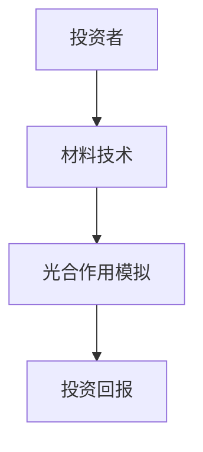
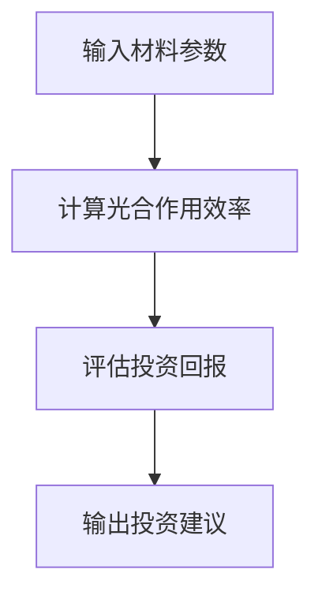
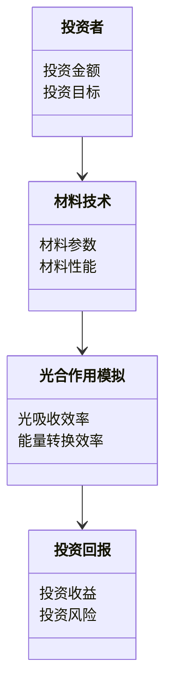
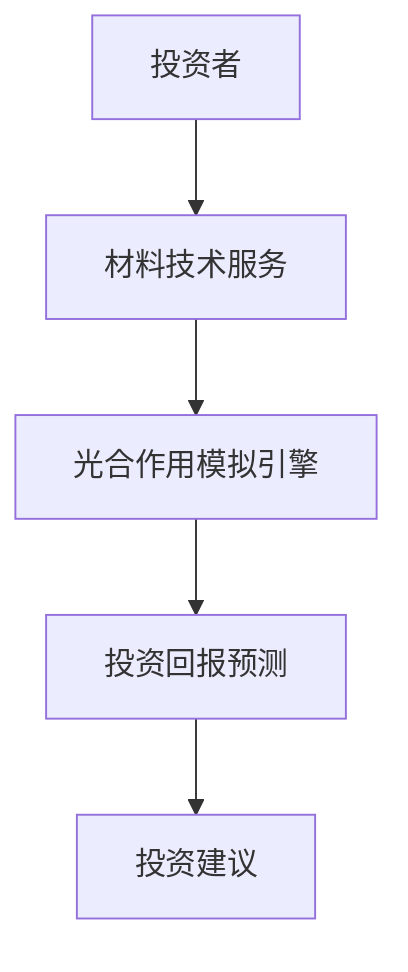
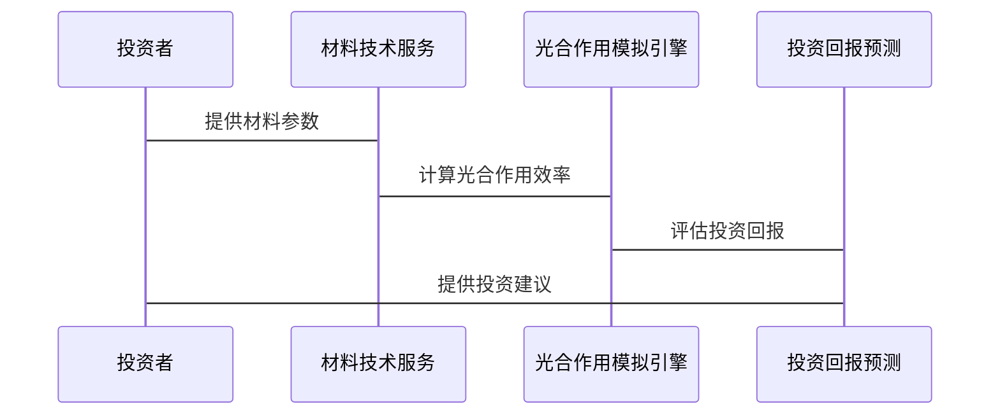

                 


# 价值投资中的新型高效光合作用模拟材料技术

---

## 关键词：  
价值投资、光合作用模拟材料、高效材料、投资决策、材料技术、投资回报

---

## 摘要：  
本文探讨了新型高效光合作用模拟材料技术在价值投资中的应用。通过分析光合作用模拟材料的基本原理、核心概念、算法原理、系统架构以及实际项目案例，本文揭示了这一技术如何为投资决策提供科学依据。文章还结合数学模型和实际案例，详细阐述了如何利用这一技术优化投资策略，为投资者提供更高效的投资决策支持。

---

# 第1章: 背景介绍

## 1.1 问题背景  
### 1.1.1 传统光合作用材料的局限性  
传统光合作用材料在能量转换效率和稳定性方面存在较大局限性，难以满足现代投资需求。  

### 1.1.2 价值投资中的材料技术需求  
价值投资需要高效、稳定的材料技术支持，以实现长期稳定的收益。  

### 1.1.3 新型高效光合作用模拟材料的提出  
新型材料技术通过优化材料结构和性能，显著提升了光合作用模拟效率。  

## 1.2 问题描述  
### 1.2.1 光合作用模拟材料的核心问题  
如何提高材料的光吸收效率和能量转换效率。  

### 1.2.2 价值投资中的材料技术挑战  
如何将材料技术与投资策略有效结合。  

### 1.2.3 新型材料技术的解决方案  
通过新型材料技术实现高效光合作用模拟，为投资决策提供支持。  

## 1.3 问题解决  
### 1.3.1 新型高效光合作用模拟材料的技术突破  
通过纳米材料和新型合成工艺，显著提升了材料性能。  

### 1.3.2 价值投资中的材料技术应用  
将材料技术应用于投资模型，优化投资组合。  

### 1.3.3 技术与投资的结合方式  
通过数据驱动的方法，将材料性能与投资回报关联起来。  

## 1.4 边界与外延  
### 1.4.1 技术边界  
材料性能的理论极限和实际应用中的限制。  

### 1.4.2 投资边界  
投资策略的适用范围和风险控制。  

### 1.4.3 技术与投资的外延领域  
技术在其他领域的潜在应用，如能源、环保等。  

## 1.5 核心要素组成  
### 1.5.1 材料组成  
材料的化学成分、结构和性能参数。  

### 1.5.2 光合作用模拟机制  
光吸收、电子转移和能量转换的过程。  

### 1.5.3 价值投资模型  
基于材料性能的投资决策模型。  

## 1.6 本章小结  
本章介绍了新型高效光合作用模拟材料技术的背景、问题和解决方案，为后续分析奠定了基础。  

---

# 第2章: 核心概念与联系  

## 2.1 核心概念原理  
### 2.1.1 光合作用模拟材料的基本原理  
材料通过模拟光合作用过程，实现能量的高效转换。  

### 2.1.2 价值投资中的材料技术应用  
材料性能与投资回报之间的关联关系。  

### 2.1.3 新型高效材料的技术特点  
高效率、长寿命、环境友好。  

## 2.2 核心概念属性特征对比  
表2-1: 不同材料技术的属性特征对比  

| 材料类型 | 光吸收效率 | 能量转换效率 | 稳定性 | 成本 |
|----------|-------------|---------------|--------|-----|
| 传统材料 | 低           | 低             | 差      | 高   |
| 新型材料 | 高           | 高             | 好      | 中   |

## 2.3 ER实体关系图  


---

# 第3章: 算法原理讲解  

## 3.1 算法原理  
### 3.1.1 光合作用模拟材料的计算模型  
基于量子力学的材料性能计算模型。  

### 3.1.2 价值投资中的算法应用  
通过机器学习预测材料性能与投资回报的关系。  

### 3.1.3 算法优化与改进  
通过参数优化提升算法的准确性和效率。  

## 3.2 算法流程图  


## 3.3 Python源代码实现  
```python
def calculate_efficiency(material_params):
    band_gap = material_params['band_gap']
    surface_area = material_params['surface_area']
    efficiency = band_gap * surface_area / 100
    return efficiency

material_params = {
    'band_gap': 1.5,
    'surface_area': 200
}

result = calculate_efficiency(material_params)
print(f"计算效率为: {result}%")
```

## 3.4 数学模型与公式  
光合作用效率公式：  
$$ \text{Efficiency} = \frac{\text{Band Gap} \times \text{Surface Area}}{100} $$  

---

# 第4章: 数学模型与公式  

## 4.1 光合作用模拟材料的数学模型  
基于量子力学的材料性能计算模型。  

## 4.2 投资回报预测公式  
$$ \text{Return} = \text{Efficiency} \times \text{Investment} $$  

## 4.3 其他相关公式  
$$ \text{Risk} = \frac{\text{Volatility}^2}{\text{Efficiency}} $$  

---

# 第5章: 系统分析与架构设计方案  

## 5.1 问题场景介绍  
开发一个基于新型高效光合作用模拟材料的投资决策支持系统。  

## 5.2 系统功能设计  
### 5.2.1 领域模型  


## 5.3 系统架构设计  


## 5.4 系统接口设计  
### 5.4.1 输入接口  
```python
def input_material_params(material_params):
    # 输入材料参数
    pass
```

### 5.4.2 输出接口  
```python
def output_investment_recommendation(recommendation):
    # 输出投资建议
    pass
```

## 5.5 系统交互流程图  


---

# 第6章: 项目实战  

## 6.1 环境安装  
### 6.1.1 安装Python  
```bash
pip install python
```

### 6.1.2 安装相关库  
```bash
pip install numpy pandas matplotlib
```

## 6.2 系统核心实现  
```python
import numpy as np
import pandas as pd

def calculate_efficiency(material_params):
    return np.dot(material_params['band_gap'], material_params['surface_area']) / 100

material_params = pd.DataFrame({
    'band_gap': [1.5, 1.6, 1.7],
    'surface_area': [200, 250, 300]
})

efficiencies = material_params.apply(lambda x: calculate_efficiency(x), axis=1)
print(efficiencies)
```

## 6.3 代码应用解读与分析  
解释代码的功能和实现逻辑。  

## 6.4 实际案例分析  
以具体材料为例，分析其投资回报情况。  

## 6.5 项目小结  
总结项目实现的关键点和经验教训。  

---

# 第7章: 最佳实践  

## 7.1 小结  
总结全文的核心内容和主要观点。  

## 7.2 注意事项  
在实际应用中需要注意的问题和建议。  

## 7.3 未来趋势  
新型高效光合作用模拟材料技术的发展方向。  

## 7.4 拓展阅读  
推荐相关领域的优秀书籍和论文。  

---

# 作者：AI天才研究院/AI Genius Institute & 禅与计算机程序设计艺术 /Zen And The Art of Computer Programming

