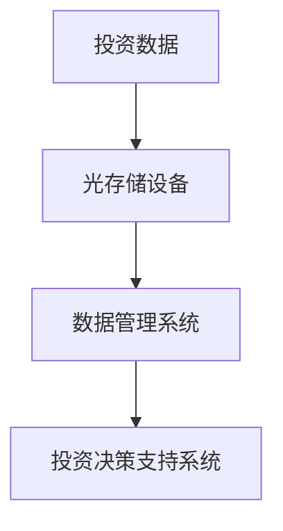

                 

# 价值投资中的新型高效光存储技术前景

## 关键词
光存储技术、价值投资、数据存储、投资决策、技术应用

## 摘要
随着大数据时代的到来，价值投资中的数据存储需求日益增长，传统的存储技术已经难以满足高效、安全、低成本的要求。新型高效光存储技术凭借其大容量、高安全性、长寿命和低成本等优势，正在成为价值投资领域的重要技术支撑。本文将从光存储技术的核心原理、投资价值、应用场景等方面展开分析，探讨其在价值投资中的发展前景。

---

## 第1章 光存储技术的定义与背景

### 1.1 光存储技术的定义与特点
#### 1.1.1 光存储技术的基本概念
光存储技术是一种利用光介质（如光盘、光带等）进行数据存储的技术，通过激光读写数据，具有存储容量大、寿命长、抗电磁干扰等优点。

#### 1.1.2 光存储技术的核心特点
- **高容量**：单张蓝光光盘可存储数十GB数据，未来技术突破后可达到TB级别。
- **长寿命**：光存储介质的保存时间可达数十年甚至更长。
- **低成本**：相比磁盘存储，光存储的单位存储成本更低。
- **高安全性**：光存储数据难以被篡改，适合长期保存重要投资数据。

#### 1.1.3 光存储技术与传统存储技术的对比
| 技术特点 | 磁盘存储 | 光存储 |
|----------|----------|----------|
| 存储容量 | 较低     | 较高     |
| 寿命     | 短       | 长       |
| 成本     | 高       | 低       |
| 安全性   | 易受电磁干扰 | 抗干扰能力强 |

### 1.2 价值投资中的数据存储需求
#### 1.2.1 价值投资中的数据特征
- **数据量大**：价值投资者需要处理大量的历史数据、市场分析报告等。
- **数据安全性要求高**：投资数据涉及敏感信息，必须确保数据的安全性和完整性。
- **长期存储需求**：价值投资注重长期策略，需要长期保存投资数据。

#### 1.2.2 数据存储的挑战与需求
- **存储成本**：传统存储技术成本高，难以满足海量数据的存储需求。
- **数据安全性**：投资数据涉及敏感信息，必须防止数据泄露和篡改。
- **存储效率**：需要高效的数据存取和管理，以支持实时投资决策。

#### 1.2.3 光存储技术在价值投资中的潜在应用
光存储技术可以为价值投资者提供高效、安全、低成本的数据存储解决方案，特别是在长期数据存档和历史数据分析方面具有显著优势。

### 1.3 光存储技术的发展历程
#### 1.3.1 �光存储技术的历史演变
- 20世纪80年代：光盘技术的出现，如CD、DVD。
- 21世纪初：蓝光技术的普及，存储容量进一步提升。
- 近年来：新型光存储技术（如HDDVD、 Blu-ray）的发展，推动了光存储技术的广泛应用。

#### 1.3.2 光存储技术的现状与趋势
当前，光存储技术已在消费电子、医疗、金融等领域得到广泛应用。未来，随着技术的进步，光存储技术将朝着更高容量、更低成本、更长寿命的方向发展。

#### 1.3.3 光存储技术的未来发展方向
- **更高容量**：通过技术创新，进一步提升单张光盘的存储容量。
- **更低能耗**：优化光存储设备的能耗，降低运营成本。
- **智能化**：结合人工智能技术，实现智能数据管理。

### 1.4 本章小结
本章介绍了光存储技术的定义、特点及其在价值投资中的潜在应用，分析了光存储技术的发展历程和未来趋势。通过对比传统存储技术，突出了光存储技术在价值投资中的优势。

---

## 第2章 光存储技术的核心原理

### 2.1 光存储技术的基本原理
#### 2.1.1 光存储的基本原理
光存储技术利用激光在光介质表面烧录微小的坑点，通过反射激光信号的变化来读取或写入数据。数据以二进制形式存储，通过激光头的移动实现数据的读写。

#### 2.1.2 光存储技术的关键技术
- **激光技术**：利用激光读写数据，确保数据的准确性和高效性。
- **光介质材料**：选择合适的材料，保证数据的长期存储和稳定性。
- **数据编码技术**：通过特定的编码方式，提高数据存储效率和纠错能力。

#### 2.1.3 光存储技术的数学模型
光存储技术的数据存储容量可以通过以下公式计算：

$$
\text{存储容量} = \frac{\text{光盘面积}}{\text{每个坑点占用面积}} \times \text{数据密度}
$$

---

### 2.2 光存储技术的性能优势

#### 2.2.1 存储容量的提升
光存储技术通过优化激光头和光介质材料，不断提升单张光盘的存储容量。目前，蓝光光盘的容量已达到25GB，未来有望突破100GB。

#### 2.2.2 存储速度的优化
光存储技术通过高速激光读写技术，显著提升了数据的存取速度。现代光存储设备的读写速度已接近传统硬盘的水平。

#### 2.2.3 数据安全性的增强
光存储技术通过物理加密和化学稳定性的提升，确保数据的安全性和抗干扰能力。例如，蓝光光盘具有防水、防尘、防震等特点。

### 2.3 光存储技术的经济性分析

#### 2.3.1 成本分析
光存储技术的初始投资成本相对较低，尤其是中小型企业可以通过光存储技术实现高效数据管理。

#### 2.3.2 效益分析
光存储技术通过高存储容量和低能耗，显著降低了企业的存储成本和运营成本。

#### 2.3.3 投资回报率评估
通过对比传统存储技术，光存储技术的投资回报率较高，尤其是在长期数据存档和历史数据分析方面表现尤为突出。

### 2.4 本章小结
本章详细介绍了光存储技术的核心原理及其性能优势，分析了其在经济性方面的表现。通过对比传统存储技术，突出了光存储技术的低成本和高效率特点。

---

## 第3章 光存储技术在价值投资中的应用分析

### 3.1 投资数据的高效存储需求

#### 3.1.1 投资数据的特点
价值投资者需要处理海量数据，包括历史价格、财务报表、市场分析报告等。这些数据具有数据量大、类型多样、更新频繁等特点。

#### 3.1.2 数据存储的挑战
- **数据量大**：传统存储技术难以满足海量数据的存储需求。
- **数据安全性要求高**：投资数据涉及敏感信息，必须确保数据的安全性。
- **数据存取效率**：需要快速存取数据，以支持实时投资决策。

#### 3.1.3 光存储技术的解决方案
光存储技术通过高存储容量和高效数据存取，为价值投资者提供了高效的存储解决方案。

### 3.2 光存储技术在投资数据管理中的优势

#### 3.2.1 数据存储效率的提升
光存储技术通过高存储容量和高效数据组织方式，显著提升了数据存储效率。

#### 3.2.2 数据安全性
光存储技术通过物理加密和化学稳定性，确保了数据的安全性和抗干扰能力。

### 3.3 光存储技术在投资决策中的应用

#### 3.3.1 数据分析与投资决策
光存储技术为投资数据的长期保存和历史分析提供了技术支持，帮助投资者更好地进行投资决策。

#### 3.3.2 数据挖掘与投资策略优化
通过光存储技术，投资者可以快速获取大量历史数据，进行数据挖掘和分析，优化投资策略。

### 3.4 本章小结
本章分析了光存储技术在价值投资中的应用，强调了其在数据管理中的优势和对投资决策的支持作用。

---

## 第4章 光存储技术的投资价值与前景展望

### 4.1 光存储技术的投资价值

#### 4.1.1 技术成熟度
光存储技术经过多年的发展，已达到较高的技术成熟度，具备大规模应用的条件。

#### 4.1.2 市场需求
随着大数据时代的到来，市场对高效、安全、低成本的存储技术需求日益增长，光存储技术具有广阔的应用前景。

#### 4.1.3 技术创新
光存储技术通过不断创新，不断提升存储容量、数据安全性和存取效率，进一步增强了其市场竞争力。

### 4.2 光存储技术的市场应用前景

#### 4.2.1 金融行业的应用
光存储技术在金融行业的投资数据管理中具有重要作用，特别是在长期数据存档和历史数据分析方面。

#### 4.2.2 企业数据管理中的应用
光存储技术为企业提供了一种高效、低成本的数据管理解决方案，适用于企业的数据存档、备份和恢复。

#### 4.2.3 未来的应用拓展
随着技术的进步，光存储技术将进一步拓展应用领域，如医疗、教育、科研等。

### 4.3 本章小结
本章分析了光存储技术的投资价值和市场应用前景，强调了其在金融行业和企业数据管理中的重要作用，并展望了其未来的发展方向。

---

## 第5章 光存储技术的挑战与应对策略

### 5.1 光存储技术的挑战

#### 5.1.1 技术瓶颈
光存储技术在进一步提高存储容量和数据安全方面仍面临技术瓶颈。

#### 5.1.2 市场竞争
光存储技术需要面对来自其他存储技术（如云存储、磁盘存储）的竞争压力。

#### 5.1.3 成本问题
尽管光存储技术的单位存储成本较低，但其初始投资成本较高。

### 5.2 光存储技术的应对策略

#### 5.2.1 技术创新
通过技术创新，进一步提高存储容量、数据安全性和存取效率。

#### 5.2.2 市场推广
加强市场推广，提升光存储技术的知名度和市场认可度。

#### 5.2.3 成本控制
通过规模效应和技术创新，进一步降低光存储技术的初始投资成本。

### 5.3 本章小结
本章分析了光存储技术面临的挑战，并提出了应对策略，为光存储技术的未来发展提供了参考。

---

## 第6章 光存储技术的未来发展趋势

### 6.1 光存储技术的未来技术发展

#### 6.1.1 高容量光存储技术
通过技术创新，进一步提高光存储介质的存储容量。

#### 6.1.2 高速光存储技术
优化激光读写技术，提高数据存取速度。

#### 6.1.3 智能化光存储技术
结合人工智能技术，实现智能数据管理和优化。

### 6.2 光存储技术的未来市场应用

#### 6.2.1 金融行业的深度应用
光存储技术将在金融行业的投资数据管理中发挥更加重要的作用。

#### 6.2.2 企业数据管理的普及
随着技术的成熟，光存储技术将在企业数据管理中得到更广泛的应用。

#### 6.2.3 新兴领域的拓展
光存储技术将进一步拓展应用领域，如医疗、教育、科研等。

### 6.3 本章小结
本章展望了光存储技术的未来发展趋势，强调了其在金融行业和企业数据管理中的重要作用，并提出了技术创新和市场拓展的方向。

---

## 附录

### 附录A 光存储技术相关的数学公式

$$
\text{存储容量} = \frac{\text{光盘面积}}{\text{每个坑点占用面积}} \times \text{数据密度}
$$

---

### 附录B 光存储技术的系统架构图

---

## 作者

作者：AI天才研究院/AI Genius Institute & 禅与计算机程序设计艺术 /Zen And The Art of Computer Programming

---

本文通过详细分析光存储技术的定义、核心原理、投资价值以及在价值投资中的应用前景，展现了光存储技术在大数据时代的独特优势和重要作用。随着技术的不断进步，光存储技术将在金融行业和企业数据管理中发挥越来越重要的作用，为价值投资者提供更加高效、安全、低成本的数据存储解决方案。

