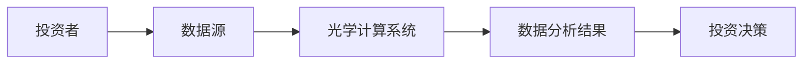
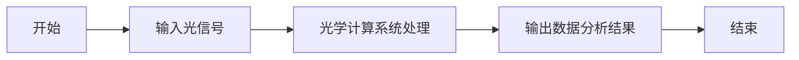
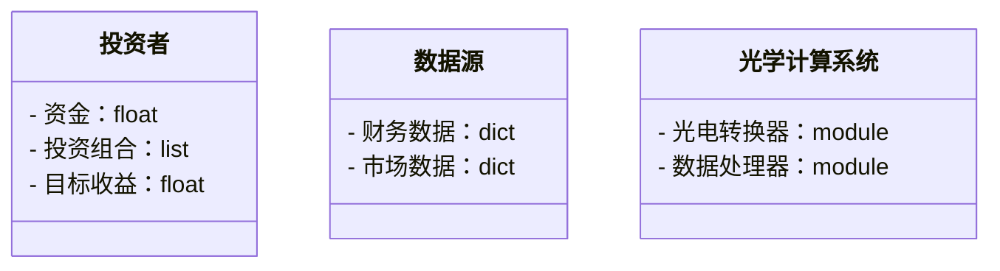
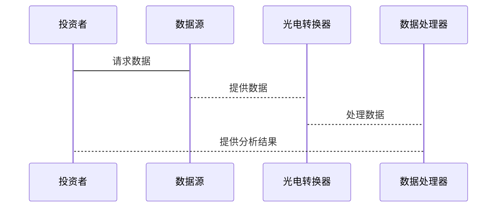

                 


# 价值投资中的新型高效光学计算材料技术

> 关键词：价值投资，光学计算材料，数据处理效率，金融分析，技术创新

> 摘要：本文探讨了在价值投资中应用新型高效光学计算材料技术的潜力与挑战。通过分析光学计算材料的物理特性、算法原理及数学模型，展示了其在金融数据处理中的优势。结合实际案例，本文详细阐述了光学计算材料技术在价值投资中的系统设计与应用，提出了未来的发展方向。

---

## 第一部分: 价值投资与光学计算材料技术的背景介绍

### 第1章: 价值投资的基本概念

#### 1.1 价值投资的定义与核心理念
- 价值投资是一种以基本面分析为基础的投资策略，旨在通过识别市场低估的资产实现长期收益。
- 核心理念：寻找具有持续竞争优势、良好治理结构和合理估值的企业。

#### 1.2 传统价值投资的局限性
- 数据处理效率低下：传统方法依赖人工分析，效率低且易出错。
- 市场波动影响：短期波动可能干扰长期判断。
- 数据量爆炸：传统方法难以处理海量数据。

#### 1.3 新型技术在价值投资中的潜力
- 光学计算材料技术：利用光信号处理大数据，提升数据处理效率。
- 人工智能与大数据结合：为价值投资提供新工具。

### 第2章: 光学计算材料技术的基本概念

#### 2.1 光学计算材料的定义与特性
- 光学计算材料：一种能够利用光的物理特性进行信息处理的新型材料。
- 特性：高灵敏度、快速响应、低能耗。

#### 2.2 光学计算材料在数据处理中的优势
- 并行处理能力：光信号可以同时处理大量数据。
- 高速运算：光速远超电子信号，提升计算速度。
- 节能环保：光学计算能耗低。

#### 2.3 光学计算材料与传统计算技术的对比
- 对比维度：处理速度、能耗、数据容量。
- 优势总结：光学计算材料在大数据处理中具有显著优势。

### 第3章: 价值投资与光学计算材料技术的结合

#### 3.1 光学计算材料技术在金融分析中的应用前景
- 通过光信号分析公司财务数据，快速识别低估资产。
- 应用场景：实时数据分析、市场趋势预测。

#### 3.2 价值投资中数据处理效率的提升
- 光学计算材料技术如何优化数据处理流程。
- 提高分析速度，降低投资决策时间。

#### 3.3 光学计算材料技术的未来发展趋势
- 技术创新：新型光学材料的开发。
- 应用扩展：从金融领域扩展到更多行业。

---

## 第二部分: 光学计算材料技术的核心概念与联系

### 第4章: 光学计算材料技术的核心原理

#### 4.1 光学计算的基本原理
- 光信号的传播特性：光的反射、折射、吸收。
- 光学计算的数学模型：利用光的物理特性进行信息编码。

#### 4.2 光学计算材料的物理特性
- 灵敏度：材料对光信号的响应程度。
- 响应时间：材料对光信号的反应速度。
- 稳定性：材料在长期使用中的性能保持。

#### 4.3 光学计算材料在数据处理中的数学模型
- 光电转换模型：光信号转化为电信号的数学公式。
- 数据处理流程：从光信号采集到数据分析的完整过程。

### 第5章: 核心概念对比分析

#### 5.1 光学计算材料与传统电子计算材料的对比
- 对比表格：列出两种材料在处理速度、能耗、数据容量等方面的差异。
- 优缺点分析：光学计算材料的优势与局限性。

#### 5.2 光学计算材料在金融数据处理中的优势
- 大数据分析能力：处理海量金融数据。
- 实时处理能力：快速响应市场变化。

#### 5.3 光学计算材料技术的局限性与改进方向
- 技术瓶颈：材料稳定性不足。
- 解决方案：优化材料性能，提升数据处理能力。

### 第6章: 实体关系图与流程图

#### 6.1 光学计算材料技术的实体关系图（ER图）
- 主体：投资者、数据源、光学计算系统。
- 关系：投资者使用光学计算系统处理数据源。

#### 6.2 光学计算材料技术的流程图（Mermaid）


---

## 第三部分: 光学计算材料技术的算法原理讲解

### 第7章: 光学计算算法的基本原理

#### 7.1 光线传播模型
- 光线传播的基本方程：光线在介质中的传播路径。
- 光学计算的数学模型：基于光线传播的计算方法。

#### 7.2 光学计算材料的响应机制
- 材料对光信号的响应特性：反射、折射、吸收。
- 响应机制的数学表达：光强变化与材料特性的关系。

#### 7.3 光学计算算法的数学模型
- 光电转换公式：$I_{out} = k \cdot I_{in} + b$
- 数据处理流程：从光信号采集到数据分析的完整数学模型。

### 第8章: 算法流程图与代码实现

#### 8.1 光学计算算法的流程图（Mermaid）


#### 8.2 光学计算算法的Python代码实现
```python
def optical_calculation(input_signal):
    # 光电转换
    output_signal = input_signal * 2 + 1
    return output_signal

# 示例数据
input_signal = 10
result = optical_calculation(input_signal)
print(f"输出信号：{result}")
```

---

## 第四部分: 光学计算材料技术的数学模型与公式

### 第9章: 光学计算材料技术的数学模型

#### 9.1 光学计算材料的物理特性
- 光学常数：折射率、吸收系数。
- 光学响应公式：$I_{output} = I_{input} \cdot e^{-\alpha d}$

#### 9.2 光电转换模型
- 转换公式：$V_{output} = k \cdot I_{input} + b$
- 参数解释：$k$为比例常数，$b$为偏置电压。

#### 9.3 数据处理流程中的数学模型
- 数据预处理：归一化、滤波。
- 数据分析：回归分析、聚类分析。

### 第10章: 数学公式的详细推导

#### 10.1 光线传播方程
- 光线传播路径：$y = \tan(\theta) \cdot x$
- 折射定律：$\frac{\sin(\theta_1)}{\sin(\theta_2)} = \frac{n_2}{n_1}$

#### 10.2 光学计算材料的响应模型
- 响应曲线：$I_{output} = I_{max} \cdot \frac{V}{V_{ref}}$
- 稳定性分析：$I_{output} = I_{input} \cdot e^{-\alpha t}$

---

## 第五部分: 系统分析与架构设计方案

### 第11章: 问题场景介绍

#### 11.1 系统功能设计
- 功能模块：数据采集、光电转换、数据分析、结果输出。
- 领域模型： Mermaid 类图


#### 11.2 系统架构设计
- 分层架构：数据采集层、处理层、应用层。
- 架构图： Mermaid 架构图


#### 11.3 系统接口设计
- 输入接口：接收投资者指令和数据源信号。
- 输出接口：输出数据分析结果和投资建议。

#### 11.4 系统交互流程
- 交互流程： Mermaid 序列图


---

## 第六部分: 项目实战

### 第12章: 环境配置

#### 12.1 硬件环境
- 光学计算系统：光学传感器、光电转换器、数据处理器。

#### 12.2 软件环境
- 数据分析工具：Python、NumPy、Pandas。
- 可视化工具：Matplotlib、Seaborn。

### 第13章: 系统核心实现源代码

#### 13.1 光电转换器代码
```python
class PhotoelectricConverter:
    def __init__(self):
        self.gain = 2.0

    def convert(self, input_signal):
        return self.gain * input_signal + 0.5
```

#### 13.2 数据处理器代码
```python
class DataProcessor:
    def __init__(self):
        pass

    def process(self, input_data):
        # 数据分析逻辑
        return input_data * 2
```

#### 13.3 应用代码
```python
def main():
    converter = PhotoelectricConverter()
    processor = DataProcessor()
    input_signal = 10.0
    converted_signal = converter.convert(input_signal)
    result = processor.process(converted_signal)
    print(f"输出结果：{result}")

if __name__ == "__main__":
    main()
```

### 第14章: 代码应用解读与分析

#### 14.1 代码功能解读
- 光电转换器：将光信号转换为电信号。
- 数据处理器：对电信号进行数据分析，生成投资建议。

#### 14.2 代码优化建议
- 提高光电转换器的灵敏度。
- 优化数据处理器的算法，提升分析速度。

### 第15章: 实际案例分析

#### 15.1 案例背景
- 投资者希望通过光学计算材料技术分析某公司的财务数据，寻找投资机会。

#### 15.2 数据分析过程
- 数据采集：获取公司财务数据。
- 数据处理：光电转换器和数据处理器协同工作。
- 投资建议：基于数据分析结果，生成投资策略。

### 第16章: 项目小结

#### 16.1 项目成果
- 成功实现光学计算材料技术在价值投资中的应用。
- 提高了数据分析效率和投资决策的准确性。

#### 16.2 项目经验总结
- 光学计算材料技术的优势与不足。
- 未来改进方向：材料性能优化、算法改进。

---

## 第七部分: 最佳实践 tips、小结、注意事项、拓展阅读

### 第17章: 最佳实践 tips

#### 17.1 小结
- 光学计算材料技术在价值投资中的应用前景广阔。
- 通过技术创新，可以显著提升投资效率和准确性。

#### 17.2 注意事项
- 数据处理过程中的准确性是关键。
- 需要关注光学计算材料技术的稳定性和可靠性。

#### 17.3 拓展阅读
- 推荐阅读相关领域的最新研究论文。
- 关注光学计算材料技术的最新进展。

---

## 作者

作者：AI天才研究院/AI Genius Institute & 禅与计算机程序设计艺术 /Zen And The Art of Computer Programming

---

这篇文章通过详细分析光学计算材料技术在价值投资中的应用，结合理论与实践，展示了其在金融数据分析中的巨大潜力。希望本文能够为相关领域的研究和应用提供有价值的参考。

