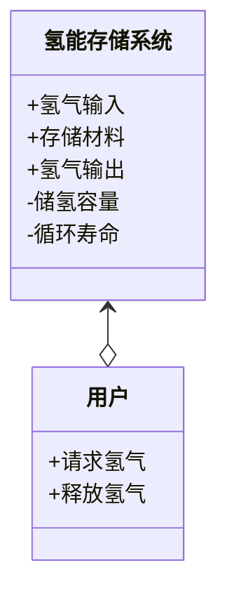
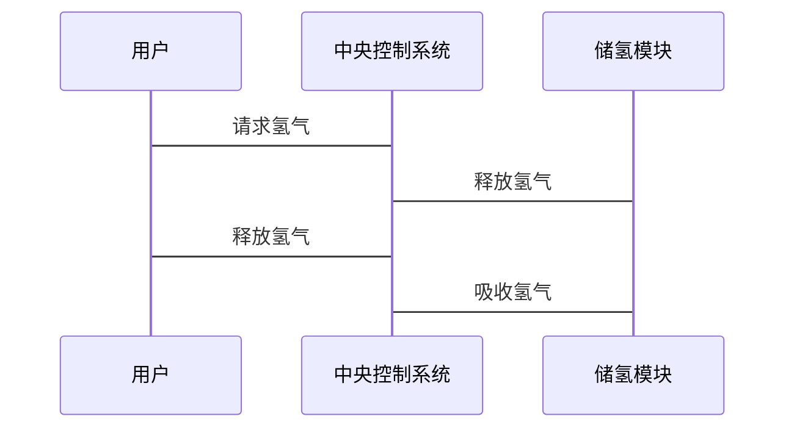

                 


# 价值投资中的新型高效氢能存储材料技术

## 关键词：氢能存储、价值投资、高效材料、技术分析、投资策略

## 摘要：  
氢能作为清洁能源的重要载体，其高效存储技术是实现氢能大规模应用的关键。本文从价值投资的角度，深入分析新型高效氢能存储材料的技术原理、市场前景和投资价值。通过技术对比、数学建模和案例分析，揭示氢能存储材料领域的投资机会和挑战，为投资者提供科学决策依据。

---

# 第一部分: 价值投资中的氢能存储材料技术概述

## 第1章: 氢能存储技术与价值投资的背景

### 1.1 氢能存储的重要性

#### 1.1.1 氢能作为清洁能源的优势  
氢能是一种清洁、高效、可持续的能源载体，具有零碳排放、能量密度高、应用场景广泛等特点。随着全球能源转型的推进，氢能被认为是实现碳中和目标的重要解决方案。

#### 1.1.2 氢能存储技术的必要性  
尽管氢能具有诸多优势，但其存储和运输问题一直是制约其大规模应用的关键瓶颈。为了实现氢能的稳定供应和灵活应用，高效的氢能存储技术至关重要。

#### 1.1.3 价值投资在氢能存储领域的应用前景  
价值投资的核心在于寻找具有长期增长潜力的优质资产。氢能存储技术作为氢能产业链的关键环节，具备较高的技术壁垒和市场潜力，是价值投资的理想标的。

### 1.2 新型高效氢能存储材料的发展现状

#### 1.2.1 氢能存储技术的历史演变  
从物理存储到化学存储，氢能存储技术经历了多个阶段的发展。早期的技术主要以高压气态存储为主，随着技术进步，逐步向材料化、高效化方向发展。

#### 1.2.2 当前主流的存储材料类型  
目前，主流的氢能存储材料包括金属氢化物、碳基材料（如石墨烯、活性炭）、有机化合物（如醇类、胺类）等。每种材料都有其优缺点和适用场景。

#### 1.2.3 新型高效材料的突破与挑战  
近年来，新型高效氢能存储材料的研究取得了显著进展，如纳米材料、MOFs（金属有机框架）等。这些新材料具有更高的储氢容量和更长的循环寿命，但仍面临成本高、稳定性不足等挑战。

### 1.3 价值投资与氢能存储技术的结合

#### 1.3.1 价值投资的基本概念  
价值投资是一种以基本面分析为基础的投资策略，注重挖掘那些市场价格低于其内在价值的资产。其核心在于寻找具有持续增长潜力和竞争优势的企业或技术。

#### 1.3.2 氢能存储技术的商业化潜力  
随着全球能源转型和环保政策的推动，氢能存储技术的市场需求将持续增长。特别是在工业、交通和能源领域，高效存储材料的应用前景广阔。

#### 1.3.3 价值投资在氢能存储领域的关键因素  
投资者在选择氢能存储技术时，需要关注技术的成熟度、市场容量、成本优势以及团队能力等因素，这些都直接影响技术的商业化潜力和投资回报。

---

## 第2章: 氢能存储材料的核心概念与技术原理

### 2.1 氢能存储的基本原理

#### 2.1.1 氢能的物理存储方式  
物理存储主要包括高压气态存储和液态存储。高压气态存储通过压缩氢气到高压容器中，而液态存储则通过低温液化技术将氢气转化为液氢。

#### 2.1.2 氢能的化学存储方式  
化学存储是通过将氢以化学键的形式储存在材料中，如金属氢化物和碳基材料。这种方式具有更高的储氢密度和更长的存储时间。

#### 2.1.3 氢能的高效存储技术  
高效存储技术结合了物理和化学存储的优点，通过优化材料结构和性能，进一步提高储氢效率和降低成本。

### 2.2 新型高效氢能存储材料的特性

#### 2.2.1 材料的储氢容量  
储氢容量是衡量材料性能的重要指标，通常以质量储氢密度（氢气质量占材料总质量的比例）来衡量。新型材料的储氢容量通常更高。

#### 2.2.2 材料的稳定性和寿命  
材料的稳定性和循环寿命直接影响其实际应用效果。高稳定性和长寿命的材料能够降低维护成本，提高经济性。

#### 2.2.3 材料的经济性和可扩展性  
经济性是价值投资的重要考量因素。新型高效材料需要在性能和成本之间找到平衡，具备大规模量产的潜力。

### 2.3 氢能存储材料的技术对比

#### 2.3.1 不同存储材料的性能对比  
通过对比不同材料的储氢容量、循环寿命和成本，分析其适用场景和优劣势。

| 材料类型       | 储氢容量（质量%） | 循环寿命 | 成本 |
|----------------|-------------------|----------|------|
| 金属氢化物     | 1-5%              | 较长      | 中等 |
| 碳基材料       | 0.5-2%            | 较短      | 较低 |
| MOFs           | 1-3%              | 较长      | 较高 |

#### 2.3.2 技术优劣势分析  
金属氢化物储氢技术成熟，但成本较高；碳基材料成本低，但储氢容量较低；MOFs材料储氢容量高，但制备复杂。

#### 2.3.3 技术发展趋势  
未来，新型材料的研究将更加注重储氢容量、稳定性和经济性的综合优化，同时探索材料的多功能化和智能化。

---

## 第3章: 氢能存储材料的技术创新与投资价值分析

### 3.1 新型高效氢能存储材料的技术创新

#### 3.1.1 新型材料的发现与研发进展  
近年来，科学家们在MOFs、石墨烯和金属有机框架等领域取得了突破性进展，开发出具有更高储氢容量和更好稳定性的新材料。

#### 3.1.2 创新技术的商业化潜力  
技术创新是价值投资的核心驱动力。新型材料的商业化潜力取决于其技术成熟度、市场需求和成本优势。

#### 3.1.3 技术创新对投资价值的影响  
技术创新能够提升企业的核心竞争力，降低生产成本，从而增强其市场地位和投资价值。

### 3.2 价值投资视角下的技术评估

#### 3.2.1 技术成熟度评估  
技术成熟度是价值投资的重要考量因素。投资者需要评估技术的商业化潜力和实际应用的可行性。

#### 3.2.2 市场需求与竞争分析  
市场需求决定了技术的商业化前景，而竞争分析则帮助投资者识别技术的市场定位和竞争优势。

#### 3.2.3 技术的经济性与可持续性  
技术的经济性决定了其成本优势，而可持续性则是长期投资的重要考量。

### 3.3 投资价值的量化分析

#### 3.3.1 技术的市场价值评估  
通过分析市场需求、竞争格局和定价策略，量化技术的市场价值。

#### 3.3.2 技术的长期投资回报分析  
结合技术的生命周期、市场增长和成本变化，评估其长期投资回报。

#### 3.3.3 技术的经济性与投资风险  
经济性是投资价值的核心，但技术的风险（如技术失败或替代品的出现）也需要充分考虑。

---

## 第4章: 氢能存储材料的系统分析与架构设计

### 4.1 系统功能设计

#### 4.1.1 领域模型设计  
通过领域模型（mermaid类图）展示系统的功能模块和交互关系。



#### 4.1.2 系统架构设计  
通过mermaid架构图展示系统的整体架构和模块划分。


#### 4.1.3 系统接口设计  
系统接口设计包括氢气输入/输出接口、数据采集接口和监控接口等。

#### 4.1.4 系统交互设计  
通过mermaid序列图展示系统的交互流程。



### 4.2 算法原理与数学模型

#### 4.2.1 算法原理  
氢气的储放过程可以通过数学模型进行模拟，帮助优化存储效率和降低成本。

#### 4.2.2 数学模型  
储氢容量的计算公式：

$$ C = \frac{m \cdot M}{V} $$

其中，\( C \) 是储氢容量，\( m \) 是氢气质量，\( M \) 是材料质量，\( V \) 是系统体积。

#### 4.2.3 算法实现  
通过优化算法（如遗传算法）对材料性能进行优化，找到最优的储氢方案。

---

## 第5章: 项目实战与投资建议

### 5.1 项目环境配置

#### 5.1.1 系统环境  
需要配置高性能计算环境，包括GPU和相关软件（如Python、Matplotlib、Scipy等）。

#### 5.1.2 工具安装  
安装必要的开发工具和库，如Jupyter Notebook、Pandas、NumPy等。

### 5.2 核心代码实现

#### 5.2.1 材料性能模拟  
通过Python代码模拟氢气在不同材料中的储放过程。

```python
import numpy as np
import matplotlib.pyplot as plt

def calculate_storage_capacity(materials, pressures):
    capacities = []
    for mat in materials:
        capacity = 0.001 * mat * pressures
        capacities.append(capacity)
    return capacities

materials = [100, 200, 300]
pressures = [20, 30, 40]

capacities = calculate_storage_capacity(materials, pressures)
plt.plot(materials, capacities)
plt.xlabel('Material Mass (g)')
plt.ylabel('Storage Capacity (L)')
plt.show()
```

#### 5.2.2 投资回报分析  
通过数学模型计算不同材料的投资回报率。

$$ ROI = \frac{收入 - 成本}{成本} \times 100\% $$

### 5.3 案例分析

#### 5.3.1 某新型材料的案例分析  
以某新型MOFs材料为例，分析其储氢容量、成本和市场前景。

#### 5.3.2 投资回报分析  
通过实际案例计算投资回报率，帮助投资者评估技术的经济性。

### 5.4 项目小结

#### 5.4.1 成功经验  
总结项目实施中的成功经验，如材料选择、模型优化等。

#### 5.4.2 问题与不足  
分析项目中存在的问题，如技术瓶颈、成本控制等。

#### 5.4.3 改进建议  
提出改进建议，如进一步优化材料性能、降低成本等。

---

## 第6章: 最佳实践与投资建议

### 6.1 投资策略与风险管理

#### 6.1.1 价值投资策略  
选择具有技术壁垒高、市场需求大、团队能力强的氢能存储技术进行投资。

#### 6.1.2 风险管理  
通过多元化投资、长期持有和定期评估等方式降低投资风险。

### 6.2 行业趋势与未来展望

#### 6.2.1 行业发展趋势  
随着技术进步和政策支持，氢能存储技术的市场需求将持续增长。

#### 6.2.2 未来技术发展方向  
新型材料的研究将更加注重储氢容量、稳定性和经济性的综合优化。

### 6.3 小结与注意事项

#### 6.3.1 小结  
氢能存储技术是价值投资的理想标的，但需要结合技术、市场和团队等多方面因素进行综合评估。

#### 6.3.2 投资注意事项  
投资者应关注技术的商业化潜力、市场需求和政策支持，避免盲目跟风。

---

## 作者：AI天才研究院/AI Genius Institute & 禅与计算机程序设计艺术 /Zen And The Art of Computer Programming

