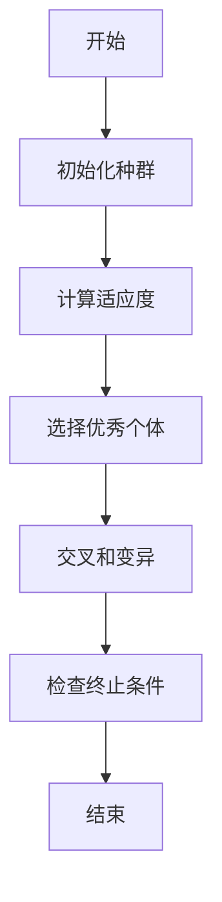
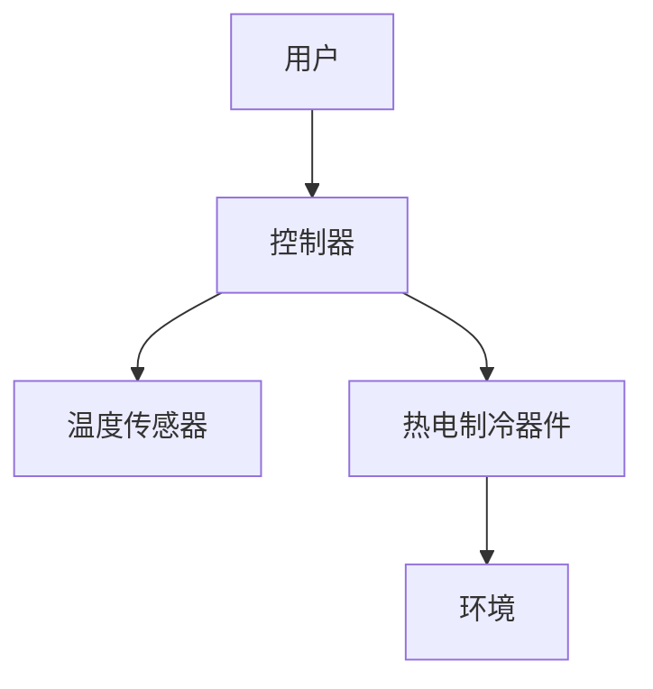

                 

# 价值投资中的新型高效热电制冷材料技术

> 关键词：热电制冷材料，价值投资，热电效应，热电性能优化，数学模型，系统架构

> 摘要：本文将探讨新型高效热电制冷材料技术在价值投资中的应用。通过分析热电制冷材料的物理原理、数学模型、优化算法以及系统架构，结合价值投资的核心理念，提出一种基于热电制冷材料技术的投资策略。本文旨在为投资者和技术开发者提供一种全新的视角，通过技术与投资的结合，实现高效的投资决策和技术创新。

---

## 第1章: 热电制冷材料的基本概念与价值投资背景

### 1.1 热电制冷材料的定义与分类

热电制冷材料是一种能够将热能直接转化为电能，或通过电能实现制冷效果的功能材料。其核心原理基于热电效应，即在特定条件下，材料内部的载流子（电子或空穴）会因温度梯度而发生定向迁移，从而实现热能的传递和电能的转换。

#### 1.1.1 热电效应的基本原理

热电效应主要包括以下三种效应：
1. **塞贝克效应**：温差导致电压差的产生。
2. **帕尔帖效应**：电流通过材料时，吸收或释放热量。
3. **汤姆逊效应**：电流流经材料时，因温度梯度而产生热流。

热电效应的数学表达式如下：
$$ V = S \cdot \Delta T $$
其中，$V$ 是电压，$S$ 是塞贝克系数，$\Delta T$ 是温度差。

#### 1.1.2 热电制冷材料的分类

热电制冷材料主要分为两类：
- **无机热电材料**：如碲化铋（Bi₂Te₃）及其合金，具有较高的热电性能。
- **有机热电材料**：如聚苯胺等高分子材料，具有柔性和可加工性。

### 1.2 价值投资的基本概念

价值投资是一种以基本面分析为基础的投资策略，旨在通过分析企业的财务状况、市场地位和竞争优势，寻找被市场低估的投资标的。其核心理念是“买入低于内在价值的资产”。

#### 1.2.1 价值投资的核心理念

价值投资的核心理念包括：
1. **安全边际**：买入价格低于内在价值。
2. **长期视角**：关注企业的长期盈利能力。
3. **竞争优势**：投资具有核心竞争优势的企业。

### 1.3 热电制冷材料技术的市场潜力

热电制冷技术具有以下优势：
- **无移动部件**：无需机械运动，可靠性高。
- **体积小**：适合便携式设备和微型冷却系统。
- **环保**：无需制冷剂，减少对环境的影响。

随着技术的进步，热电制冷材料在以下几个领域具有广阔的应用前景：
1. **消费电子**：手机、笔记本电脑的散热系统。
2. **汽车工业**：电动汽车的电池冷却系统。
3. **医疗设备**：低温存储设备。

---

## 第2章: 热电制冷材料的物理原理与数学模型

### 2.1 热电效应的物理基础

热电材料的性能主要由其热电特性决定，包括：
- **电导率（σ）**：材料的导电能力。
- **热导率（k）**：材料的导热能力。
- **塞贝克系数（S）**：材料的温差电压特性。

热电材料的热电优值（ZT值）是衡量其性能的重要指标，公式为：
$$ ZT = \frac{S^2 \cdot \sigma \cdot \Delta T}{k} $$

#### 2.1.1 热电性能的影响因素

热电性能的影响因素包括：
- **材料的晶体结构**：影响电导率和热导率。
- **载流子浓度**：影响电导率和热电效应。
- **温度**：影响热电性能的稳定性。

### 2.2 热电制冷系统的数学模型

热电制冷系统的数学模型主要涉及热流和电流的传递过程。

#### 2.2.1 热流方程

热流方程可以表示为：
$$ q = -\lambda \cdot A \cdot \frac{\Delta T}{\Delta x} $$
其中，$q$ 是热流，$\lambda$ 是热导率，$A$ 是面积，$\Delta T$ 是温差，$\Delta x$ 是距离。

#### 2.2.2 电流传导方程

电流传导方程可以表示为：
$$ I = \frac{V}{R} $$
其中，$I$ 是电流，$V$ 是电压，$R$ 是电阻。

#### 2.2.3 热电制冷系统的效率优化

热电制冷系统的效率可以通过以下公式优化：
$$ \eta = \frac{1}{\frac{k}{\sigma} + \frac{1}{ZT}} $$
其中，$\eta$ 是效率，$k$ 是热导率，$\sigma$ 是电导率，$ZT$ 是热电优值。

---

## 第3章: 热电制冷材料与价值投资的结合

### 3.1 热电制冷材料的技术进步与市场价值

#### 3.1.1 热电材料的技术进步

近年来，新型热电材料的研发取得了显著进展，例如：
- **纳米材料**：通过纳米技术提高材料的热电性能。
- **复合材料**：通过复合不同材料优化热电性能。

#### 3.1.2 热电制冷技术的商业化应用

热电制冷技术已在以下几个领域实现商业化：
- **消费电子**：手机、笔记本电脑的散热系统。
- **汽车工业**：电动汽车的电池冷却系统。
- **医疗设备**：低温存储设备。

### 3.2 价值投资视角下的热电制冷材料评估

#### 3.2.1 技术壁垒与竞争优势分析

在价值投资中，技术壁垒是衡量企业竞争力的重要指标。热电制冷材料技术的核心竞争力包括：
- **材料制备技术**：企业的材料制备能力。
- **设备研发能力**：企业的设备研发能力。
- **成本控制**：企业的生产成本。

#### 3.2.2 市场需求与投资回报预测

市场需求是影响投资回报的关键因素。热电制冷材料技术的市场需求主要取决于以下几个方面：
- **市场规模**：热电制冷材料的市场容量。
- **技术成熟度**：技术的商业化程度。
- **政策支持**：政府的政策支持力度。

---

## 第4章: 热电制冷材料技术的核心算法与数学模型

### 4.1 热电材料性能优化的数学模型

热电材料性能优化的数学模型可以表示为：
$$ \text{目标函数} = \max ZT $$
$$ \text{约束条件} = \begin{cases} 
0 < \sigma < 10^4 \, \text{S/m} \\
0 < k < 10 \, \text{W/m·K} \\
0 < S < 10 \, \text{μV/K} 
\end{cases} $$

### 4.2 热电材料优化的算法实现

#### 4.2.1 遗传算法（GA）在热电性能优化中的应用

遗传算法是一种常用的优化算法，其流程如下：
1. 初始化种群。
2. 计算适应度。
3. 选择优秀个体。
4. 进行交叉和变异操作。
5. 重复迭代直到满足终止条件。

遗传算法的流程图如下：

---

## 第5章: 热电制冷系统的系统架构与价值投资分析

### 5.1 热电制冷系统的系统架构设计

#### 5.1.1 热电制冷系统的功能设计

热电制冷系统的功能模块包括：
- **温度传感器**：采集环境温度。
- **控制器**：根据温度数据调节电流。
- **热电制冷器件**：实现制冷功能。

#### 5.1.2 热电制冷系统的架构设计

热电制冷系统的架构设计如下：

---

## 第6章: 价值投资视角下的热电制冷材料技术

### 6.1 价值投资视角下的技术评估

在价值投资中，热电制冷材料技术的评估需要综合考虑以下几个方面：
- **技术壁垒**：企业的技术专利数量和质量。
- **市场需求**：热电制冷材料的市场容量和增长潜力。
- **财务状况**：企业的盈利能力和发展潜力。

### 6.2 价值投资策略的优化

基于热电制冷材料技术的价值投资策略包括：
1. **长期持有**：投资具有长期增长潜力的企业。
2. **分散投资**：降低投资风险。
3. **持续跟踪**：关注企业的技术研发和市场表现。

---

## 第7章: 热电制冷材料技术的未来发展趋势

### 7.1 新型热电材料的研发方向

未来，热电材料的研发将朝着以下几个方向发展：
- **高性能材料**：进一步提高材料的热电性能。
- **低成本材料**：降低材料的生产成本。
- **多功能材料**：开发具有多种功能的热电材料。

### 7.2 热电制冷技术的商业化前景

随着技术的进步，热电制冷技术将在以下几个领域实现更广泛应用：
- **消费电子**：手机、笔记本电脑的散热系统。
- **汽车工业**：电动汽车的电池冷却系统。
- **医疗设备**：低温存储设备。

---

## 结语

热电制冷材料技术是一种具有广阔前景的新兴技术，其在价值投资中的应用也为投资者提供了新的视角。通过技术创新和市场分析的结合，投资者可以更好地把握热电制冷材料技术的市场机会，实现高效的投资决策。

---

## 作者

作者：AI天才研究院/AI Genius Institute & 禅与计算机程序设计艺术 /Zen And The Art of Computer Programming

