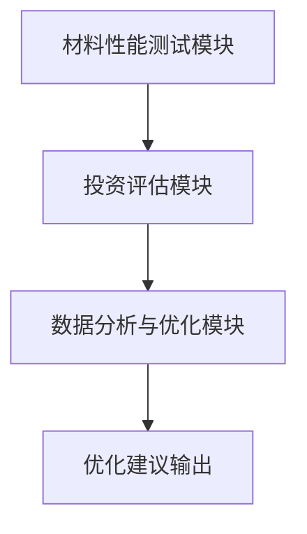

                 


# 价值投资中的新型高效热电转换材料技术

> 关键词：热电转换材料，价值投资，热电效率，投资回报，技术应用

> 摘要：本文探讨了新型高效热电转换材料在价值投资中的应用潜力。通过分析热电转换材料的物理特性、市场前景及投资评估方法，结合具体的数学模型和系统架构设计，本文提出了在投资决策中如何选择和优化热电转换材料技术的策略。文章还通过实际案例分析，展示了如何将热电转换技术与投资回报相结合，为投资者提供了实用的参考。

---

## 第一部分：热电转换材料的技术背景与价值投资概述

### 第1章：热电转换材料的基本概念与价值投资背景

#### 1.1 热电转换材料的定义与分类

热电转换材料是一种能够将热能直接转化为电能的材料，其核心原理是基于热电效应。这种材料在电子设备、能源回收系统等领域具有广泛的应用潜力。热电转换材料主要分为本征型和掺杂型两大类，每类材料都有其独特的物理特性和适用场景。

- **本征型热电材料**：这类材料具有较高的热电系数，但其电导率和热导率通常较低，适合应用于低温度梯度的场景。
- **掺杂型热电材料**：通过在基体材料中引入掺杂元素，可以有效调节材料的电导率和热导率，从而提高热电转换效率。

#### 1.2 价值投资的背景与意义

价值投资是一种以内在价值为导向的投资策略，强调通过深入分析企业的基本面来选择具有长期增长潜力的标的。在技术领域，价值投资的逻辑同样适用。热电转换材料作为一种新兴的技术，其市场潜力和技术创新能力是决定其投资价值的关键因素。

- **技术创新**：热电转换材料的技术进步直接影响其市场竞争力和投资回报率。例如，新型纳米材料的应用显著提高了热电转换效率。
- **市场需求**：随着能源危机的加剧，热电转换技术在节能和可再生能源领域的需求日益增长，为相关投资提供了广阔的空间。

#### 1.3 热电转换材料技术的现状与发展趋势

当前，热电转换材料的研究主要集中在提高转换效率和降低成本方面。然而，现有技术仍面临效率瓶颈和大规模应用的挑战。未来，随着新材料科学和纳米技术的进步，热电转换材料的效率和经济性有望进一步提升。

- **技术挑战**：热电材料的热导率和电导率之间存在固有的权衡关系，如何在保持较高电导率的同时降低热导率是当前研究的难点。
- **未来趋势**：新型二维材料和拓扑绝缘体的研究为热电转换技术的突破提供了新的方向。

---

## 第二部分：热电转换材料的核心特性与投资评估

### 第2章：热电转换材料的核心物理特性与投资评估

#### 2.1 热电转换材料的关键特性

热电转换材料的性能主要由以下几个关键指标决定：

- **热电势（Seebeck系数）**：反映了材料在温差下产生电压的能力，是衡量材料热电性能的核心指标。
- **电导率（σ）**：材料的导电能力直接影响电流的大小。
- **热导率（κ）**：材料的导热能力影响温差的维持，热导率越低，温差越大，热电势越高。

#### 2.2 投资评估的核心指标

在进行热电转换材料的投资评估时，需要重点关注以下几个方面：

- **技术可行性**：材料的性能是否能够满足实际应用需求，是否有技术壁垒。
- **市场需求**：目标市场的规模、增长潜力以及竞争状况。
- **成本结构**：材料的生产成本是否具有竞争力，是否能够实现规模化生产。

#### 2.3 热电转换材料的性能与投资回报的关联

材料性能的优劣直接影响其市场竞争力和投资回报。例如，一种具有较高热电势和较低热导率的材料，不仅能够提高转换效率，还能降低系统的散热需求，从而降低成本。

- **效率提升带来的收益**：转换效率的提高可以直接增加能源回收的经济效益。
- **成本降低的潜力**：通过优化材料配方和生产工艺，可以有效降低生产成本，提高产品的市场竞争力。

---

## 第三部分：热电转换效率的数学模型与算法

### 第3章：热电转换效率的数学模型与算法

#### 3.1 热电转换效率的计算公式

热电转换效率的计算公式如下：

$$
\eta = \frac{S^2 T}{(S^2 T + \alpha \lambda)}
$$

其中：
- \( S \) 是热电势（Seebeck系数）。
- \( T \) 是温差。
- \( \alpha \) 是材料的电阻率。
- \( \lambda \) 是材料的热导率。

#### 3.2 热电转换效率的算法实现

以下是一个基于上述公式的Python实现示例：

```python
def calculate_efficiency(S, T, alpha, lambda_):
    numerator = S**2 * T
    denominator = numerator + alpha * lambda_
    efficiency = numerator / denominator
    return efficiency

# 示例参数
S = 200  # Seebeck系数 (μV/K)
T = 100  # 温差 (K)
alpha = 0.1  # 电阻率 (Ω·m)
lambda_ = 0.2  # 热导率 (W/m·K)

efficiency = calculate_efficiency(S, T, alpha, lambda_)
print(f"热电转换效率为：{efficiency:.4f}")
```

#### 3.3 热电转换效率的优化策略

- **材料改性**：通过掺杂或其他改性手段，优化材料的热电性能。
- **结构设计**：优化热电模块的结构设计，减少热损失，提高转换效率。
- **工艺优化**：改进生产工艺，降低成本，提高产品的市场竞争力。

---

## 第四部分：热电转换材料的系统分析与架构设计

### 第4章：热电转换材料的系统分析与架构设计

#### 4.1 热电转换系统的整体架构

热电转换系统的整体架构可以分为以下几个模块：

1. **材料性能测试模块**：用于测试材料的热电性能指标。
2. **投资评估模块**：基于测试数据和市场信息，评估材料的投资价值。
3. **数据分析与优化模块**：通过对数据的分析，提出优化建议。

#### 4.2 热电转换系统的功能设计

- **材料性能测试模块**：包括热电势测量、电导率测量、热导率测量等功能。
- **投资评估模块**：包括市场需求分析、成本分析、竞争分析等功能。
- **数据分析与优化模块**：包括数据建模、优化算法设计、结果输出等功能。

#### 4.3 热电转换系统的架构图

以下是热电转换系统的架构图（使用Mermaid语法）：



---

## 第五部分：价值投资中的热电转换材料技术应用案例分析

### 第5章：价值投资中的热电转换材料技术应用案例分析

#### 5.1 案例背景介绍

假设我们选择一家专注于研发新型热电转换材料的公司作为投资标的。该公司拥有多项专利技术，并在市场上取得了良好的口碑。然而，由于市场竞争激烈，该公司需要进一步优化其产品性能和降低成本。

#### 5.2 案例分析

通过对该公司的分析，我们可以得出以下结论：

1. **技术优势**：该公司拥有多项专利技术，尤其是在材料改性和结构设计方面具有较强的技术实力。
2. **市场定位**：公司产品主要应用于工业废热回收领域，市场需求旺盛，竞争相对较小。
3. **成本结构**：由于生产工艺较为复杂，生产成本较高，需要通过工艺优化降低成本。

#### 5.3 投资建议

基于以上分析，建议投资者重点关注以下几点：

1. **技术改进**：继续加大研发投入，优化材料性能和生产工艺。
2. **市场拓展**：积极开拓新的市场领域，扩大市场份额。
3. **成本控制**：通过规模效应和技术改进降低成本，提高产品的市场竞争力。

---

## 第六部分：结论与展望

### 第6章：结论与展望

#### 6.1 本章总结

本文系统地探讨了热电转换材料在价值投资中的应用潜力。通过分析热电转换材料的核心特性、投资评估指标以及数学模型，本文提出了在投资决策中如何选择和优化热电转换材料技术的策略。同时，通过实际案例分析，本文展示了如何将热电转换技术与投资回报相结合，为投资者提供了实用的参考。

#### 6.2 未来展望

未来，随着新材料科学和纳米技术的进一步发展，热电转换材料的性能和经济性有望进一步提升。投资者需要密切关注技术创新和市场动态，抓住技术突破带来的投资机遇。

---

## 作者信息

作者：AI天才研究院/AI Genius Institute & 禅与计算机程序设计艺术 /Zen And The Art of Computer Programming

