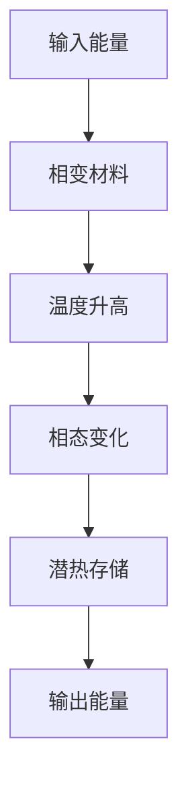
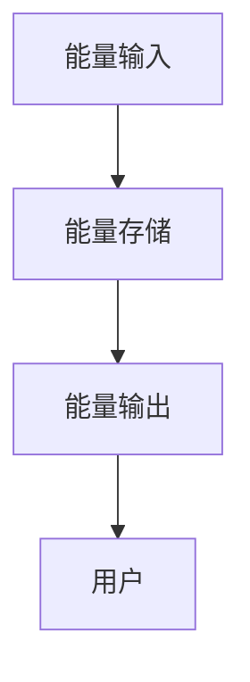
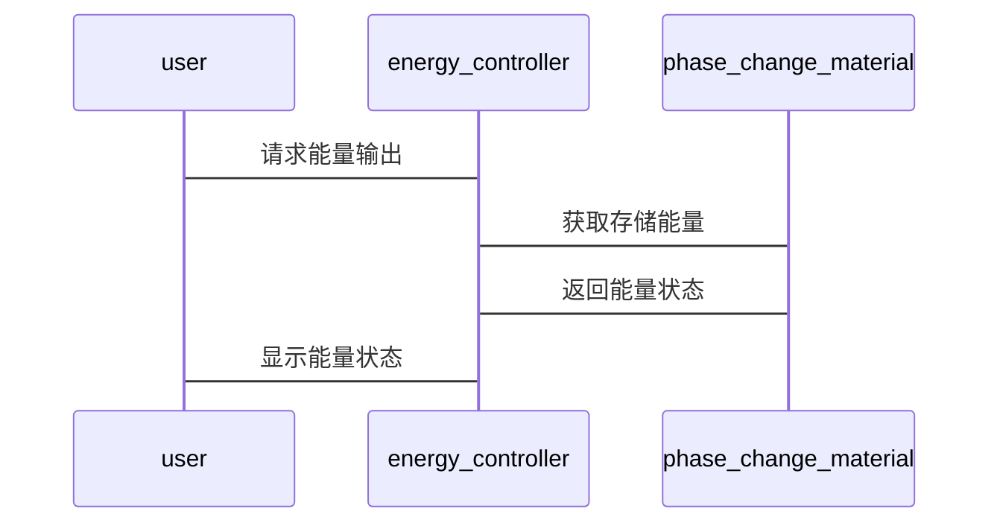

                 


# 价值投资中的新型高效相变储能材料技术

> 关键词：相变储能材料、储能技术、价值投资、高效储能、可再生能源

> 摘要：本文深入探讨了新型高效相变储能材料技术在储能领域中的应用及其对价值投资的影响。文章从相变储能材料的基本概念出发，分析了其物理化学性质、分类与性能，结合数学模型与算法原理，详细阐述了相变储能技术的系统架构设计与实际应用案例。最后，本文从价值投资的角度，分析了相变储能材料技术的市场潜力与投资价值，并提出了未来的研究方向与投资建议。

---

# 第一部分：相变储能材料与价值投资的背景介绍

## 第1章：相变储能材料的基本概念

### 1.1 相变储能材料的定义
相变储能材料是一种能够通过相变（固态、液态、气态之间的转变）存储和释放能量的材料。这种材料在相变过程中会吸收或释放大量热量，具有高储能密度和高效能转换的特点。

### 1.2 相变储能的基本原理
相变储能的核心原理是利用物质在相变过程中的潜热。当材料吸收热量时，其相态发生转变（如固态变为液态），同时存储大量潜热；当材料释放热量时，其相态发生逆转变，潜热被释放。

### 1.3 相变储能材料的分类与应用领域
相变储能材料主要分为无机相变材料、有机相变材料和复合相变材料三大类：
- **无机相变材料**：如石蜡、有机物等，具有高储能密度和稳定性。
- **有机相变材料**：如脂肪酸、聚酯等，具有较好的热稳定性。
- **复合相变材料**：结合了无机和有机材料的优势，具有更高的储能效率和循环寿命。

---

## 第2章：相变储能材料在储能技术中的重要性

### 2.1 相变储能技术的发展历程
相变储能技术自20世纪70年代以来逐步发展，经历了实验室研究、小规模应用到大规模商业化应用的阶段。近年来，随着全球能源需求的增长和可再生能源的普及，相变储能技术得到了广泛关注。

### 2.2 相变储能技术在可再生能源中的应用
可再生能源（如太阳能、风能）的间歇性问题可以通过相变储能技术有效解决。通过存储多余的能量，在需要时释放，从而提高能源利用效率。

### 2.3 相变储能技术对价值投资的潜在影响
相变储能技术的商业化应用为投资者提供了新的价值增长点。例如，投资于高效相变储能材料的生产、储能系统的设计与运营等领域，能够获得较高的投资回报。

---

## 第3章：价值投资与相变储能材料的结合

### 3.1 价值投资的基本概念
价值投资是一种投资策略，通过分析企业的基本面（如财务状况、市场地位、盈利能力等），寻找被市场低估的投资标的。

### 3.2 相变储能材料技术的市场价值分析
相变储能材料技术在储能领域的广泛应用，使得相关企业具有较高的市场价值。例如，生产相变储能材料的企业或提供储能解决方案的企业，其市场估值有望随着技术进步而增长。

### 3.3 价值投资视角下的技术风险与收益评估
尽管相变储能技术具有广阔的应用前景，但其商业化过程中仍面临技术瓶颈、市场竞争、政策法规等风险。投资者需要综合评估这些因素，制定合理的投资策略。

---

# 第二部分：相变储能材料的核心概念与技术特征

## 第4章：相变储能材料的物理化学性质

### 4.1 熔点与相变潜热的关系
相变材料的熔点决定了其相变温度区间，而相变潜热则决定了其储能容量。熔点越高、相变潜热越大，材料的储能能力越强。

### 4.2 材料的导热系数与比热容
导热系数决定了材料的热传导能力，比热容则决定了材料在吸热或放热过程中的温度变化。两者共同影响材料的储能效率。

### 4.3 相变过程中的热力学分析
相变过程遵循热力学定律，能量守恒和能量转化效率是分析相变储能系统的关键因素。

---

## 第5章：相变储能材料的类型与性能对比

### 5.1 无机相变材料的优势与不足
无机相变材料（如石蜡）具有高储能密度和稳定性，但其相变温度较高，可能不适合某些应用场景。

### 5.2 有机相变材料的优势与不足
有机相变材料（如脂肪酸）具有较低的相变温度和较高的热稳定性，但其储能密度相对较低。

### 5.3 复合相变材料的性能优化
复合相变材料结合了无机和有机材料的优点，通过优化成分比例和微观结构，能够实现更高的储能效率和循环寿命。

---

# 第三部分：相变储能技术的数学模型与算法原理

## 第6章：相变储能系统的能量平衡方程

### 6.1 系统的能量守恒定律
相变储能系统中的能量守恒可以通过以下方程表示：
$$ Q_{\text{in}} = Q_{\text{out}} + Q_{\text{storage}} $$
其中，$Q_{\text{in}}$ 是输入系统的能量，$Q_{\text{out}}$ 是输出系统的能量，$Q_{\text{storage}}$ 是存储的能量。

### 6.2 相变过程中的能量转化效率
能量转化效率可以通过以下公式计算：
$$ \eta = \frac{Q_{\text{output}}}{Q_{\text{input}}} $$

---

## 第7章：热量传递与相变过程的模拟

### 7.1 热传导方程的建立
热传导方程可以表示为：
$$ \frac{\partial T}{\partial t} = \alpha \frac{\partial^2 T}{\partial x^2} $$
其中，$\alpha$ 是热扩散系数，$T$ 是温度，$x$ 是空间坐标，$t$ 是时间。

### 7.2 使用 Mermaid 绘制热量传递流程图


---

## 第8章：算法实现与优化

### 8.1 算法的基本实现步骤
1. 初始化相变材料的参数（如熔点、相变潜热）。
2. 计算系统的能量输入与输出。
3. 模拟相变过程中的温度变化。
4. 优化算法以提高计算效率。

### 8.2 使用 Python 实现相变过程模拟代码
```python
import numpy as np

# 初始化参数
T_initial = 200  # 初始温度（K）
T_melt = 250     # 熔点温度（K）
Q_storage = 100  # 潜热（J/kg）

# 计算相变过程
T = np.linspace(200, 300, 100)  # 温度范围
Q = np.zeros_like(T)

for i in range(len(T)):
    if T[i] < T_melt:
        Q[i] = 0  # 未开始相变
    elif T[i] == T_melt:
        Q[i] = Q_storage  # 开始相变
    else:
        Q[i] = Q_storage  # 继续相变

print(Q)
```

---

# 第四部分：相变储能系统的系统分析与架构设计

## 第9章：系统应用场景分析

### 9.1 工业余热回收系统
相变储能技术可以用于回收工业过程中的余热，降低能源浪费。

### 9.2 可再生能源储能系统
在太阳能、风能等可再生能源发电系统中，相变储能技术可以用于存储多余的能量，确保能源供应的稳定性。

### 9.3 建筑节能储能系统
在建筑中使用相变储能技术，可以实现建筑的主动式热调节，降低能源消耗。

---

## 第10章：系统功能设计

### 10.1 系统功能模块划分
- **能量输入模块**：接收外部能量输入。
- **能量存储模块**：存储能量。
- **能量输出模块**：输出存储的能量。

### 10.2 使用 Mermaid 绘制系统架构图


---

## 第11章：系统接口设计

### 11.1 系统输入接口设计
- **温度传感器**：监测环境温度。
- **能量控制器**：控制能量输入与输出。

### 11.2 系统输出接口设计
- **温度调节器**：调节环境温度。
- **能量显示器**：显示存储的能量状态。

---

## 第12章：系统交互设计

### 12.1 使用 Mermaid 绘制系统交互序列图


---

# 第五部分：项目实战

## 第13章：环境安装与代码实现

### 13.1 环境安装
安装必要的软件和库：
```bash
pip install numpy matplotlib
```

### 13.2 代码实现
```python
import numpy as np
import matplotlib.pyplot as plt

# 初始化参数
T_initial = 200  # 初始温度（K）
T_melt = 250     # 熔点温度（K）
Q_storage = 100  # 潜热（J/kg）

# 计算相变过程
T = np.linspace(200, 300, 100)  # 温度范围
Q = np.zeros_like(T)

for i in range(len(T)):
    if T[i] < T_melt:
        Q[i] = 0  # 未开始相变
    elif T[i] == T_melt:
        Q[i] = Q_storage  # 开始相变
    else:
        Q[i] = Q_storage  # 继续相变

# 绘制相变过程曲线
plt.plot(T, Q)
plt.xlabel('Temperature (K)')
plt.ylabel('Heat (J/kg)')
plt.title('Phase Change Process')
plt.show()
```

### 13.3 案例分析与结果解读
通过上述代码，可以绘制出相变过程中的潜热变化曲线，验证模型的正确性。

---

# 第六部分：总结与展望

## 第14章：总结与展望

### 14.1 相变储能材料的优势与价值投资机会
相变储能材料技术具有高效、稳定、可持续的特点，是储能领域的理想选择。投资者可以通过投资相关企业或项目，获得较高的投资回报。

### 14.2 未来的研究方向
未来，研究者可以进一步优化相变材料的性能，探索其在更多领域的应用，如高效能源存储、智能建筑等领域。

---

# 第七部分：最佳实践与小结

## 第15章：最佳实践 tips

### 15.1 投资建议
投资者应关注相变储能技术的商业化应用，选择具有技术优势和市场潜力的企业进行投资。

### 15.2 项目开发注意事项
在开发相变储能系统时，应注重系统的稳定性、安全性和经济性，确保技术的实用性和可推广性。

---

# 作者：AI天才研究院/AI Genius Institute & 禅与计算机程序设计艺术 /Zen And The Art of Computer Programming

