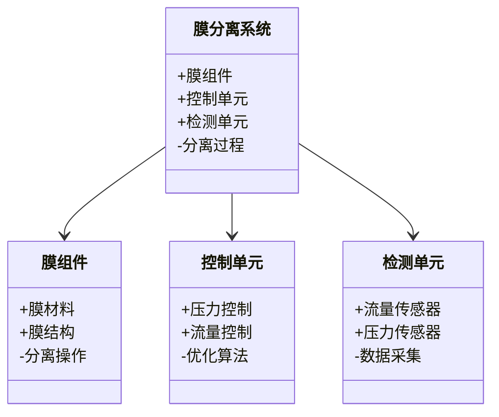
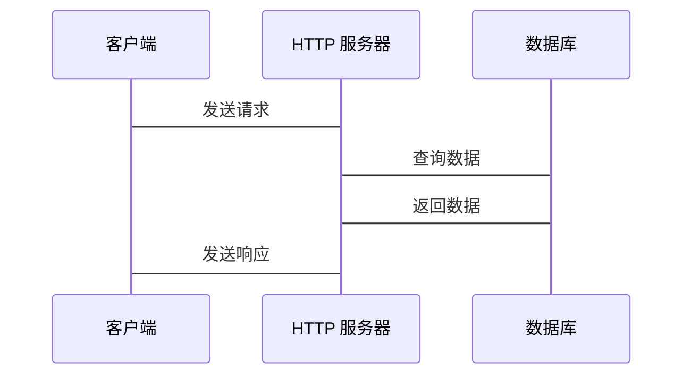

                 


# 价值投资中的新型高效膜分离技术前景

> **关键词**：膜分离技术，价值投资，高效分离，技术前景，膜材料，优化算法，系统架构

> **摘要**：膜分离技术作为一种高效、环保的分离手段，在化工、环保、生物医药等领域具有重要应用。本文从膜分离技术的基本原理、数学建模、算法优化、系统架构等方面进行深入分析，并结合实际案例探讨其在价值投资中的应用前景，最后总结了膜分离技术的优势与挑战，展望了未来的发展方向。

---

## 第一章: 膜分离技术的背景与概述

### 1.1 膜分离技术的基本概念

膜分离技术是一种基于膜的选择透过性原理，通过物理或化学方法实现混合物中各组分分离的技术。其核心在于膜材料的结构特性和分离机制。膜分离技术广泛应用于水处理、食品加工、医药分离等领域，具有高效、节能、环保的特点。

#### 术语解释：
- **膜材料**：决定膜分离性能的关键因素，常见的膜材料包括高分子聚合物、无机材料（如陶瓷、金属）等。
- **选择透过性**：膜材料允许某些物质透过，而阻止其他物质透过的能力。
- **膜污染**：膜表面或内部的 fouling 现象，影响分离效率。

### 1.2 膜分离技术的发展历程

膜分离技术自20世纪60年代发展至今，经历了从简单结构到复杂功能的演变。早期主要用于水处理领域，随着技术进步，逐渐拓展到生物制药、化工分离等领域。

#### 问题背景：
- 传统分离技术如蒸馏、吸附等存在能耗高、效率低的问题。
- 膜分离技术的出现为高效分离提供了新思路。

#### 问题解决：
- 膜分离技术通过物理过滤和选择性透过，显著降低了能耗和污染。
- 通过优化膜材料和结构设计，提高了分离效率和稳定性。

### 1.3 膜分离技术的分类与特点

膜分离技术根据驱动方式和膜孔径大小可分为多种类型：

| **分类依据** | **具体类型** | **特点** |
|--------------|--------------|----------|
| 驱动方式     | 压力驱动     | 无需额外能量输入，适合液体分离 |
|              | 热驱动       | 需要加热，适用于气体分离 |
| 膜孔径大小   | 微滤         | 用于大颗粒分离 |
|              | 超滤         | 用于小分子分离 |
|              | 反渗透       | 用于水分子与溶解物分离 |

---

## 第二章: 膜分离技术的核心原理

### 2.1 膜的结构与特性

膜的结构直接影响其分离性能。常见膜结构包括平板膜、中空纤维膜和卷式膜，每种结构各有优缺点。

#### 案例分析：
- **中空纤维膜**：适用于大规模水处理，具有高通量和长寿命的特点。

### 2.2 膜分离的基本机制

膜分离主要依赖于膜的物理特性和流体动力学效应。以下公式描述了膜分离的基本过程：

$$ Q = k \cdot A \cdot \Delta P $$
其中：
- \( Q \) 表示通量，\( k \) 为渗透系数，\( A \) 为膜面积，\( \Delta P \) 为压力差。

### 2.3 影响膜分离效率的因素

#### 2.3.1 膜材料的选择
- 不同材料的膜具有不同的化学稳定性和机械强度。例如，聚砜膜适用于高温环境，而聚乙烯膜则适合低压力条件。

#### 2.3.2 操作条件的影响
- 温度、压力和流速都会影响分离效率。例如，提高温度会增加膜的渗透性，但也可能加速膜污染。

#### 2.3.3 膜污染与 fouling 问题
- 膜污染是影响其长期性能的主要问题。通过优化预处理和操作条件可以有效减少污染。

---

## 第三章: 膜分离技术的数学模型与算法

### 3.1 膜分离过程的数学建模

数学建模是优化膜分离过程的关键步骤。以下公式描述了膜分离的传质过程：

$$ J = -D \cdot \frac{dC}{dx} $$
其中：
- \( J \) 为通量，\( D \) 为扩散系数，\( C \) 为浓度，\( x \) 为空间坐标。

### 3.2 膜分离的优化算法

#### 3.2.1 遗传算法优化
遗传算法通过模拟自然选择过程优化膜分离参数。例如，优化膜的厚度和孔隙率以提高分离效率。

#### 3.2.2 粒子群优化
粒子群优化算法通过群体协作寻找最优解。例如，优化膜的孔径分布以适应不同分离需求。

---

## 第四章: 膜分离系统的分析与设计

### 4.1 系统分析

#### 4.1.1 问题场景介绍
膜分离系统通常包括预处理、主分离和后处理三个部分。预处理阶段去除大颗粒杂质，主分离阶段实现精确分离，后处理阶段优化产品品质。

#### 4.1.2 项目介绍
以某污水处理厂为例，采用超滤膜技术处理工业废水，目标是实现水资源的循环利用。

### 4.2 系统功能设计

#### 4.2.1 领域模型类图
以下是领域模型类图（使用 Mermaid 绘制）：



### 4.3 系统架构设计

#### 4.3.1 系统架构图
以下是系统架构图（使用 Mermaid 绘制）：


### 4.4 系统交互设计

#### 4.4.1 系统交互序列图
以下是系统交互序列图（使用 Mermaid 绘制）：



---

## 第五章: 项目实战

### 5.1 环境安装

#### 5.1.1 安装膜分离系统
- **硬件**：配置高压泵、膜组件和传感器。
- **软件**：安装控制软件和数据采集系统。

### 5.2 系统核心实现

#### 5.2.1 核心代码示例
以下是一个优化膜分离过程的 Python 示例代码：

```python
def optimize_membrane_system(parameters):
    from sklearn.model_selection import GridSearchCV
    from sklearn.metrics import accuracy_score
    # 定义优化参数
    param_grid = {
        'C': [0.1, 1, 10],
        'gamma': [1, 0.1, 0.01]
    }
    # 初始化 SVM 分类器
    from sklearn.svm import SVC
    clf = SVC()
    # 网格搜索优化
    grid_search = GridSearchCV(clf, param_grid)
    grid_search.fit(X_train, y_train)
    # 输出最佳参数
    print("Best parameters found:", grid_search.best_params_)
    return grid_search.best_estimator_
```

### 5.3 案例分析

#### 5.3.1 水处理项目
某化工企业采用新型膜分离技术处理废水，成功实现了水资源的循环利用，节约了30%的用水成本。

---

## 第六章: 总结与展望

### 6.1 全文总结

膜分离技术凭借其高效、环保的优势，在多个领域展现出广阔的应用前景。通过优化算法和系统设计，可以进一步提高分离效率和降低成本。

### 6.2 未来展望

随着纳米技术的发展，新型膜材料的出现将推动膜分离技术的进一步创新。此外，人工智能技术的应用也将为膜分离系统的优化提供新的思路。

### 6.3 最佳实践 tips

- 选择合适的膜材料和结构，根据具体应用场景进行优化。
- 定期维护和清洗膜组件，防止 fouling 问题。
- 结合自动化技术，实现膜分离系统的智能化管理。

---

## 作者：AI天才研究院 & 禅与计算机程序设计艺术

--- 

**小结**：本文从膜分离技术的基本原理到实际应用进行了全面探讨，分析了其在价值投资中的潜力，并展望了未来的发展方向。希望对读者在膜分离技术的研究和应用中提供有价值的参考。

