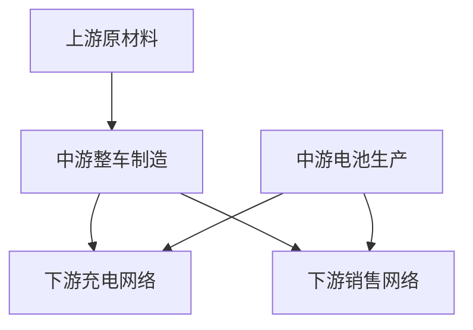

                 


# 价值投资中的新能源汽车产业链分析

> 关键词：价值投资、新能源汽车、产业链分析、投资策略、系统架构

> 摘要：本文从价值投资的角度，详细分析了新能源汽车产业链的构成、核心环节、主要企业以及投资机会。通过系统架构设计和项目实战，为投资者提供了深入的分析工具和方法。

---

## 第1章: 新能源汽车产业链的背景与发展

### 1.1 新能源汽车的定义与核心概念

#### 1.1.1 新能源汽车的定义
新能源汽车是指采用新型动力系统，完全或主要依靠电能驱动的汽车，主要包括纯电动汽车（BEV）、插电式混合动力汽车（PHEV）和燃料电池汽车（FCEV）。

#### 1.1.2 新能源汽车的核心技术特征
- **电动驱动**：以电机为动力来源，替代传统内燃机。
- **电池技术**：电池的能量密度、充放电速度和成本是关键。
- **充电设施**：充电桩的建设和运营是产业链的重要组成部分。

#### 1.1.3 新能源汽车与传统燃油车的对比分析
- **能源消耗**：新能源汽车的能耗更低，但依赖电力供应。
- **环保性**：减少碳排放，符合全球环保趋势。
- **技术复杂性**：电池和电机技术要求高，研发投入大。

### 1.2 新能源汽车产业链的构成

#### 1.2.1 产业链的上游环节
- **原材料**：锂、镍、钴等稀有金属，用于电池生产。
- **零部件**：电机、电控系统等关键部件。

#### 1.2.2 产业链的中游环节
- **整车制造**：新能源汽车的组装和生产。
- **电池生产**：电池的制造和研发。

#### 1.2.3 产业链的下游环节
- **充电网络**：充电桩的建设和运营。
- **销售与服务**：新能源汽车的销售和服务体系。

### 1.3 新能源汽车产业链的全球发展现状

#### 1.3.1 全球新能源汽车市场的增长趋势
- **增长迅速**：全球新能源汽车销量持续增长，2020年超过500万辆。
- **政策支持**：各国政府提供补贴和税收优惠，推动市场发展。

#### 1.3.2 主要国家的政策支持与市场发展
- **中国**：补贴政策和基础设施建设推动市场增长。
- **欧盟**：严格的排放标准推动新能源汽车发展。
- **美国**：税收优惠和技术创新推动市场。

#### 1.3.3 中国新能源汽车市场的独特地位
- **全球第一大市场**：中国是全球最大的新能源汽车市场，销量占全球一半以上。
- **政策支持**：政府补贴和购车优惠推动市场增长。

### 1.4 价值投资的核心理念与方法

#### 1.4.1 价值投资的基本定义
价值投资是一种投资策略，强调以低于内在价值的价格买入优质资产，长期持有，获得超额收益。

#### 1.4.2 价值投资的核心原则
- **长期视角**：关注企业的长期价值，而非短期波动。
- **安全边际**：买入价格低于内在价值，确保投资的安全性。
- **优质企业**：选择具有竞争优势和良好管理的企业。

#### 1.4.3 价值投资在新能源汽车产业链中的应用
- **选择龙头企业**：投资具有技术优势和市场份额的龙头企业。
- **关注产业链整合**：选择能够垂直整合产业链，降低成本的企业。
- **评估企业护城河**：选择具有技术壁垒和品牌优势的企业。

---

## 第2章: 新能源汽车产业链的细分领域分析

### 2.1 上游产业: 原材料与零部件

#### 2.1.1 电池材料的种类与市场分析
- **锂离子电池**：目前主流的电池技术，包括钴酸锂、镍钴锰酸锂等。
- **钠离子电池**：新兴技术，成本更低，适合储能领域。

#### 2.1.2 稀有金属的需求与价格波动
- **需求增长**：新能源汽车的快速发展推动稀有金属需求增长。
- **价格波动**：锂、钴等价格受市场供需影响，波动较大。

#### 2.1.3 零部件供应商的市场地位
- **电机供应商**：如特斯拉、比亚迪等企业。
- **电控系统供应商**：如博世、大陆等企业。

### 2.2 中游产业: 汽车制造与电池生产

#### 2.2.1 新能源汽车制造商的市场格局
- **国际主流车企**：如特斯拉、丰田、大众等。
- **中国新兴车企**：如蔚来、小鹏、理想等。

#### 2.2.2 电池技术的创新与企业竞争力
- **技术路线**：磷酸铁锂与三元锂电池的技术对比。
- **企业竞争力**：宁德时代、比亚迪等企业的技术优势。

#### 2.2.3 电池生产的成本与规模效应
- **生产成本**：原材料价格、人工成本和设备投资。
- **规模效应**：大规模生产可以降低成本，提高利润率。

### 2.3 下游产业: 充电与销售网络

#### 2.3.1 充电基础设施的建设与运营
- **充电桩数量**：充电桩的数量和分布影响用户体验。
- **充电技术**：快充技术的发展提升充电效率。

#### 2.3.2 销售渠道的多元化发展
- **线上销售**：电商平台和自有APP。
- **线下渠道**：4S店和经销商网络。

#### 2.3.3 新能源汽车的售后服务体系
- **售后服务**：包括电池保修、软件升级等。
- **用户满意度**：售后服务的质量影响品牌形象。

---

## 第3章: 新能源汽车产业链的核心企业分析

### 3.1 上游原材料供应商

#### 3.1.1 稀有金属供应商的市场地位
- **锂供应商**：如赣锋锂业、天齐锂业等。
- **钴供应商**：如洛阳钼业等。

#### 3.1.2 电池材料供应商的竞争优势
- **技术优势**：拥有专利技术，提升产品竞争力。
- **成本优势**：规模化生产降低成本。

#### 3.1.3 原材料价格波动对企业的影响
- **价格波动风险**：原材料价格波动影响企业盈利。
- **应对策略**：签订长期供货合同，锁定价格。

### 3.2 中游整车制造商

#### 3.2.1 国际主流车企的市场表现
- **特斯拉**：全球最大的新能源汽车制造商，技术领先。
- **大众集团**：传统车企转型新能源，推出多款电动车型。

#### 3.2.2 中国新能源车企的崛起
- **比亚迪**：垂直整合产业链，成本优势明显。
- **蔚来**：专注于高端市场，提供换电服务。

#### 3.2.3 整车制造商的技术创新与成本控制
- **技术创新**：如特斯拉的FSD系统，提升自动驾驶能力。
- **成本控制**：通过规模效应降低成本，提升竞争力。

### 3.3 下游充电与销售网络运营商

#### 3.3.1 充电桩运营商的商业模式
- **充电服务费**：通过收取充电费用获得收入。
- **广告与增值服务**：充电桩广告、APP会员服务等。

#### 3.3.2 销售网络的布局与运营效率
- **销售网络布局**：一线城市为重点，逐步覆盖二线城市。
- **运营效率**：通过数据分析优化销售和服务流程。

#### 3.3.3 下游企业的盈利模式与风险
- **盈利模式**：充电服务费、广告收入、增值服务。
- **风险分析**：充电桩利用率低、充电技术落后等。

---

## 第4章: 新能源汽车产业链的价值投资策略

### 4.1 价值投资的核心指标与分析方法

#### 4.1.1 财务指标分析
- **市盈率（PE）**：股价与每股收益的比率，用于评估企业估值。
- **市净率（PB）**：股价与每股净资产的比率，用于评估企业资产价值。
- **ROE（净资产收益率）**：衡量企业盈利能力。

#### 4.1.2 技术优势评估
- **技术壁垒**：企业拥有的专利和技术优势。
- **技术创新能力**：企业研发投入和创新能力。

#### 4.1.3 市场前景分析
- **市场规模**：新能源汽车市场的增长潜力。
- **竞争格局**：企业市场份额和竞争对手分析。

### 4.2 产业链各环节的投资机会

#### 4.2.1 上游原材料的投资机会
- **锂资源**：需求增长，价格上升，投资锂供应商。
- **钴资源**：钴在电池中的应用广泛，投资钴供应商。

#### 4.2.2 中游整车制造的投资机会
- **技术领先企业**：投资技术领先的整车制造商，如特斯拉、比亚迪。
- **品牌优势企业**：投资品牌优势明显的企业，如蔚来、小鹏。

#### 4.2.3 下游充电网络的投资机会
- **充电桩运营商**：需求增长，投资充电桩运营商。
- **充电技术企业**：投资快充技术企业，提升充电效率。

### 4.3 价值投资的风险与应对策略

#### 4.3.1 行业风险
- **政策变化**：政府政策变化影响市场。
- **技术风险**：技术落后被市场淘汰。

#### 4.3.2 市场风险
- **价格波动**：原材料价格波动影响企业盈利。
- **竞争风险**：市场竞争加剧，企业市场份额下降。

#### 4.3.3 应对策略
- **分散投资**：投资不同环节的企业，分散风险。
- **长期持有**：避免短期波动，长期持有优质资产。

---

## 第5章: 新能源汽车产业链的系统分析与架构设计

### 5.1 产业链系统架构设计

#### 5.1.1 产业链结构
- **上游**：原材料、零部件供应商。
- **中游**：整车制造商、电池生产企业。
- **下游**：充电网络、销售服务网络。

#### 5.1.2 系统架构图


### 5.2 项目实战：新能源汽车产业链分析

#### 5.2.1 环境安装
- **工具安装**：安装Python、Pandas、Matplotlib等工具。
- **数据获取**：从公开数据源获取新能源汽车产业链相关数据。

#### 5.2.2 核心代码实现
```python
import pandas as pd
import matplotlib.pyplot as plt

# 获取新能源汽车产业链数据
data = pd.read_csv('new_energy_vehicle.csv')

# 数据清洗
data = data.dropna()
data = data[~data[' revenue'].isnull()]

# 数据分析与可视化
plt.figure(figsize=(10,6))
plt.plot(data[' year'], data[' revenue'], label='Revenue')
plt.title('新能源汽车产业链收入变化')
plt.xlabel('年份')
plt.ylabel('收入（亿元）')
plt.legend()
plt.show()
```

#### 5.2.3 代码应用解读与分析
- **数据清洗**：处理缺失值和异常值。
- **数据分析**：计算收入变化趋势，分析企业盈利能力。
- **可视化**：绘制收入变化图，直观展示市场趋势。

#### 5.2.4 实际案例分析
- **案例分析**：分析特斯拉的收入和利润变化，评估投资价值。
- **案例结论**：特斯拉作为行业龙头，具有较高的投资价值。

---

## 第6章: 总结与展望

### 6.1 总结
- **产业链分析**：详细分析了新能源汽车产业链的构成和各环节的关键企业。
- **投资策略**：提出了基于价值投资的分析方法和投资策略。
- **系统设计**：通过系统架构设计和项目实战，提供了具体的分析工具和方法。

### 6.2 未来展望
- **技术进步**：电池技术的进一步突破将推动市场发展。
- **政策支持**：各国政府将继续支持新能源汽车的发展，推动行业增长。
- **投资机会**：新能源汽车产业链将继续增长，投资机会丰富。

---

## 作者

作者：AI天才研究院/AI Genius Institute & 禅与计算机程序设计艺术 /Zen And The Art of Computer Programming

---

本文通过详细分析新能源汽车产业链的构成、核心环节和投资机会，结合价值投资的策略和系统架构设计，为投资者提供了深入的分析工具和方法。通过实际案例分析和代码实现，帮助读者更好地理解新能源汽车产业链的价值投资机会。未来，随着技术进步和政策支持，新能源汽车产业链将继续增长，为投资者提供更多的机会。

