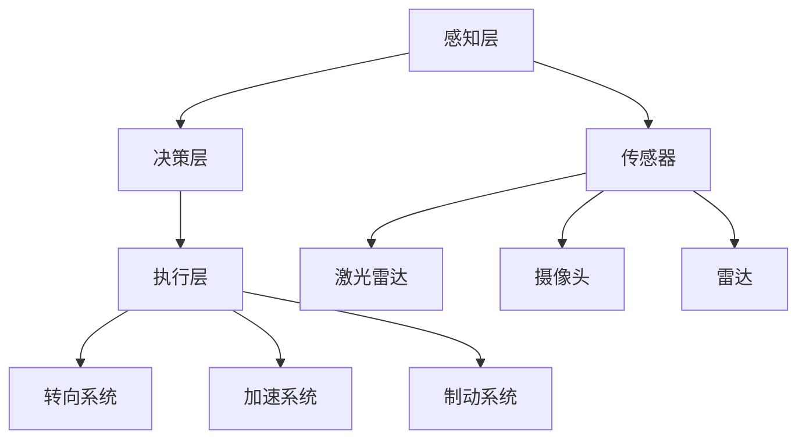

                 

# 价值投资中的无人驾驶技术前景

> 关键词：价值投资、无人驾驶技术、自动驾驶系统、投资分析、市场前景

> 摘要：无人驾驶技术作为一项革命性的技术，正在逐步改变汽车行业的格局。本文从技术、经济和投资的角度，分析无人驾驶技术的现状、发展趋势及其在价值投资中的潜力。通过深入探讨无人驾驶技术的核心原理、市场潜力和投资策略，本文旨在为投资者提供一个全面的视角，帮助他们在无人驾驶技术的投资中做出明智的决策。

---

## 第1章：无人驾驶技术的定义与现状

### 1.1 无人驾驶技术的定义

无人驾驶技术，又称自动驾驶技术，是一种通过计算机系统实现车辆自动驾驶的技术。它利用传感器、摄像头、雷达和激光雷达等设备，结合人工智能算法，实现对周围环境的感知、决策和控制。

无人驾驶技术的核心在于其系统架构，通常包括以下几个层次：

1. **感知层**：通过传感器获取环境信息，如车道线、障碍物、交通信号灯等。
2. **决策层**：基于感知信息，通过算法做出驾驶决策，如路径规划、速度控制等。
3. **执行层**：将决策转化为实际的驾驶操作，如转向、加速和制动。

### 1.2 无人驾驶技术的现状分析

当前，无人驾驶技术的发展已经取得了显著进展，但仍然面临诸多挑战。以下是无人驾驶技术的现状分析：

1. **技术发展**：
   - 感知技术：目前主要依赖激光雷达、摄像头和雷达，但感知精度和稳定性仍有提升空间。
   - 决策算法：基于深度学习的决策算法逐渐成熟，但复杂场景下的决策能力仍需优化。
   - 通信技术：车联网（V2X）技术逐步普及，但网络延迟和安全性问题尚未完全解决。

2. **市场现状**：
   - 无人驾驶技术的商业化正在逐步推进，目前主要集中在Robotaxi（自动驾驶出租车）和物流领域。
   - 主要参与者包括特斯拉、Waymo、百度Apollo等企业。

3. **技术瓶颈**：
   - **感知精度**：在复杂天气条件下（如雨、雪、雾）的感知能力不足。
   - **决策算法**：在极端场景下的决策能力有限，如突然出现的障碍物或行人。
   - **法律法规**：无人驾驶技术的法律法规尚未完善，各地政策差异较大。

### 1.3 价值投资的基本概念

价值投资是一种基于对公司基本面分析的投资策略，旨在通过寻找被市场低估的优质公司实现长期收益。以下是价值投资的核心概念：

1. **核心理念**：
   - 购买低于内在价值的资产。
   - 长期投资，避免短期波动。

2. **基本原则**：
   - 研究公司的财务状况、行业地位和竞争优势。
   - 关注公司的盈利能力、成长性和现金流。

3. **分析框架**：
   - **财务分析**：通过市盈率、市净率、ROE等指标评估公司价值。
   - **行业分析**：研究行业的发展趋势和竞争格局。
   - **公司分析**：评估公司的管理团队、技术创新能力和市场前景。

---

## 第2章：无人驾驶技术的关键技术分析

### 2.1 自动驾驶系统架构

无人驾驶技术的系统架构是理解其技术原理的关键。以下是自动驾驶系统的典型架构：

### 2.2 关键技术的数学模型

无人驾驶技术的核心在于算法，而算法的实现依赖于数学模型。以下是几种常见的算法及其数学模型：

1. **目标检测**：
   - 使用目标检测算法（如YOLO、Faster R-CNN）识别道路中的障碍物。
   - 检测概率公式：
     $$P(y|\mathbf{x}) = \frac{P(\mathbf{x}|y)P(y)}{P(\mathbf{x})}$$
     其中，$P(y|\mathbf{x})$是后验概率，表示在观察到特征$\mathbf{x}$的情况下，目标类别为$y$的概率。

2. **路径规划**：
   - 使用强化学习算法（如Q-learning）进行路径规划。
   - Q-learning的更新公式：
     $$Q(s, a) = Q(s, a) + \alpha \left[r + \gamma \max_{a'} Q(s', a') - Q(s, a)\right]$$
     其中，$Q(s, a)$是状态-动作对的价值，$\alpha$是学习率，$\gamma$是折扣因子。

### 2.3 技术的商业化挑战

无人驾驶技术的商业化面临以下挑战：

1. **技术成熟度**：
   - 当前无人驾驶技术尚未完全成熟，仍需在复杂场景下进行大量测试。
   - 例如，极端天气条件下的感知能力不足。

2. **商业化模式**：
   - 目前主要通过Robotaxi和物流领域实现商业化，但盈利能力有限。
   - 需要依赖政府政策支持和基础设施建设。

3. **技术壁垒**：
   - 感知技术和决策算法的技术壁垒较高，中小企业难以进入。

---

## 第3章：无人驾驶技术的经济价值分析

### 3.1 无人驾驶技术的市场潜力

无人驾驶技术的市场潜力主要体现在以下几个方面：

1. **市场规模**：
   - 根据市场研究机构预测，全球无人驾驶市场规模将在未来十年内快速增长，年复合增长率预计超过30%。

2. **主要市场参与者**：
   - 特斯拉、Waymo、百度Apollo、通用Cruise等企业正在积极推动无人驾驶技术的商业化。

3. **市场增长驱动因素**：
   - 技术进步：感知和决策算法的不断优化。
   - 政策支持：各国政府出台相关政策支持无人驾驶技术的发展。
   - 消费者需求：消费者对自动驾驶功能的需求逐渐增加。

### 3.2 无人驾驶技术的经济影响

无人驾驶技术的经济影响主要体现在以下几个方面：

1. **对传统汽车行业的冲击**：
   - 无人驾驶技术将改变传统汽车行业的价值链，整车制造商可能面临转型压力。
   - 例如，传统4S店的商业模式可能受到冲击。

2. **对相关产业链的带动效应**：
   - 传感器、芯片、人工智能算法等相关产业将受益于无人驾驶技术的发展。
   - 例如，激光雷达和摄像头的需求将大幅增加。

3. **对社会经济的长期影响**：
   - 无人驾驶技术将减少交通事故，降低交通拥堵，提高交通效率。
   - 例如，无人驾驶技术可以减少交通事故的发生率。

### 3.3 无人驾驶技术的投资价值

无人驾驶技术的投资价值主要体现在以下几个方面：

1. **技术壁垒与投资门槛**：
   - 无人驾驶技术的技术壁垒较高，但市场潜力巨大。
   - 投资者需要关注企业的技术实力和商业化能力。

2. **市场空间与投资回报**：
   - 无人驾驶技术的市场规模预计将持续增长，投资回报潜力较大。
   - 例如，Robotaxi业务的盈利能力可能在未来逐步提升。

3. **风险因素与投资风险评估**：
   - 技术不确定性：无人驾驶技术的成熟度仍需进一步验证。
   - 政策风险：各地政府政策的差异可能影响技术的商业化进程。
   - 市场竞争：主要参与者之间的竞争可能加剧，影响投资回报。

---

## 第4章：无人驾驶技术的价值投资策略

### 4.1 价值投资的核心指标

在无人驾驶技术的价值投资中，投资者需要关注以下几个核心指标：

1. **市盈率（P/E）**：
   - 市盈率是衡量公司估值的重要指标，反映了市场的预期。
   - 公式：$$P/E = \frac{\text{股价}}{\text{每股净利润}}$$

2. **市净率（P/B）**：
   - 市净率是衡量公司资产价值的指标，反映了市场的资产定价。
   - 公式：$$P/B = \frac{\text{股价}}{\text{每股净资产}}$$

3. **自由现金流（FCF）**：
   - 自由现金流反映了公司的盈利能力和现金流状况。
   - 公式：$$FCF = \text{净利润} - \text{非现金支出} + \text{折旧和摊销}$$

### 4.2 无人驾驶技术的估值模型

在无人驾驶技术的估值中，投资者可以使用以下几种模型：

1. **现金流折现模型（DCF）**：
   - DCF模型通过将未来现金流折现到现值，评估公司的内在价值。
   - 公式：$$\text{企业价值} = \sum_{t=1}^{n} \frac{\text{现金流}_t}{(1 + r)^t}$$
   - 其中，$r$是折现率，$n$是预测期数。

2. **市场乘数法（Market Multiple Method）**：
   - 市场乘数法通过比较可比公司的估值指标，评估目标公司的价值。
   - 例如，使用市盈率或市净率作为乘数。

3. **可比公司分析**：
   - 可比公司分析通过比较同类公司的估值指标，评估目标公司的相对价值。

### 4.3 投资组合管理

在无人驾驶技术的投资中，投资者需要注重投资组合的管理：

1. **分散化策略**：
   - 通过投资不同领域的公司，降低投资风险。
   - 例如，同时投资整车制造商和传感器供应商。

2. **风险管理与止损机制**：
   - 设置止损点，避免投资损失过大。
   - 例如，当股价下跌超过20%，立即卖出。

3. **长期投资与短期波动的平衡**：
   - 无人驾驶技术的商业化需要时间，投资者需要耐心等待。
   - 但也要关注短期波动，避免重大风险。

---

## 第5章：无人驾驶技术的案例分析

### 5.1 典型企业的分析

1. **特斯拉（Tesla）**：
   - 特斯拉是目前市场上唯一一家实现全自动驾驶功能的公司。
   - 其自动驾驶系统（FSD）已经具备较高的技术水平。
   - 投资价值：特斯拉的市场地位和技术实力使其成为无人驾驶技术投资的首选。

2. **Waymo**：
   - Waymo是谷歌母公司Alphabet旗下的无人驾驶技术公司。
   - 其技术路线以激光雷达为核心，具备较高的技术壁垒。
   - 投资价值：Waymo的技术实力和商业化能力使其成为无人驾驶技术领域的领导者。

3. **百度Apollo**：
   - 百度Apollo是中国领先的无人驾驶技术公司。
   - 其技术路线以开源平台为核心，具备较强的生态优势。
   - 投资价值：百度Apollo在中国市场的优势使其具备较大的投资潜力。

### 5.2 投资案例的详细解读

1. **特斯拉的投资分析**：
   - 特斯拉的市盈率较高，但其技术实力和市场地位使其具备较高的投资价值。
   - 投资者可以通过市盈率和市净率指标进行估值。

2. **Waymo的投资分析**：
   - Waymo的估值主要依赖于其技术实力和商业化能力。
   - 投资者可以通过DCF模型进行估值。

3. **百度Apollo的投资分析**：
   - 百度Apollo的估值主要依赖于其在中国市场的生态优势。
   - 投资者可以通过可比公司分析进行估值。

---

## 第6章：无人驾驶技术的未来趋势与投资机会

### 6.1 无人驾驶技术的未来趋势

1. **技术进步**：
   - 感知技术的精度和稳定性将逐步提高。
   - 决策算法的智能化水平将不断提升。

2. **商业化进程**：
   - 无人驾驶技术的商业化将逐步扩大，从Robotaxi到物流领域。
   - 政府政策的支持将进一步推动商业化进程。

3. **行业整合**：
   - 无人驾驶技术的行业整合将加速，形成少数几家领先的公司。

### 6.2 无人驾驶技术的投资机会

1. **技术驱动型投资**：
   - 投资于具备技术优势的公司，如Waymo和百度Apollo。
   - 关注公司的技术创新能力和专利布局。

2. **市场驱动型投资**：
   - 投资于具备市场优势的公司，如特斯拉。
   - 关注公司的市场份额和品牌影响力。

3. **生态驱动型投资**：
   - 投资于具备生态系统优势的公司，如百度Apollo。
   - 关注公司的生态合作和产业链整合能力。

---

## 第7章：总结与展望

### 7.1 总结

无人驾驶技术是一项具有革命性的技术，正在逐步改变汽车行业的格局。本文从技术、经济和投资的角度，分析了无人驾驶技术的现状、发展趋势及其在价值投资中的潜力。通过深入探讨无人驾驶技术的核心原理、市场潜力和投资策略，本文旨在为投资者提供一个全面的视角，帮助他们在无人驾驶技术的投资中做出明智的决策。

### 7.2 展望

未来，无人驾驶技术的发展将更加迅速，市场潜力将逐步释放。投资者需要密切关注技术进步、商业化进程和政策变化，抓住投资机会。同时，也需要注重风险管理，避免投资风险。

---

## 作者：AI天才研究院/AI Genius Institute & 禅与计算机程序设计艺术 /Zen And The Art of Computer Programming

