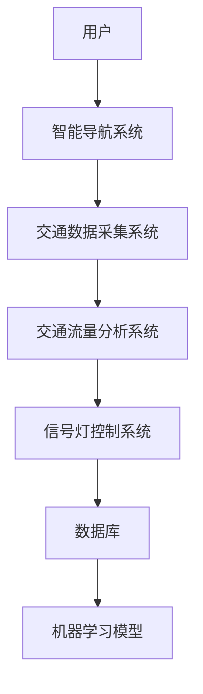
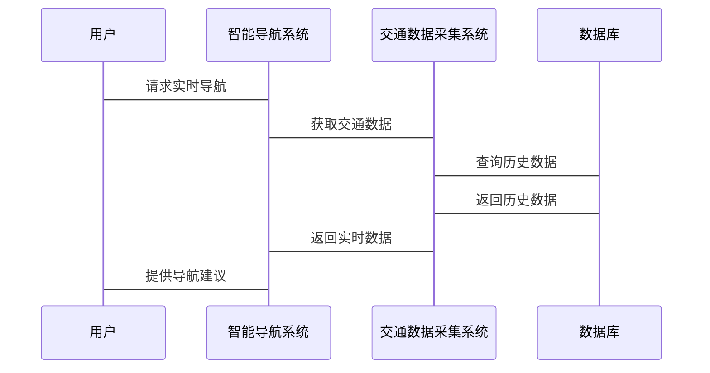

                 


# 价值投资中的智慧城市机会

> 关键词：智慧城市，价值投资，智慧交通，智慧能源，智慧医疗，投资策略

> 摘要：  
本文探讨了智慧城市建设中的投资机会，结合价值投资的理念，分析了智慧交通、智慧能源和智慧医疗等领域的技术应用和市场潜力。通过技术原理、系统架构和实际案例的深入剖析，总结了智慧城市投资的关键策略和注意事项。

---

## 第一部分: 智慧城市与价值投资的背景与概念

### 第1章: 智慧城市与价值投资的背景

#### 1.1 智慧城市的定义与特点

**1.1.1 智慧城市的定义**  
智慧城市是通过数字化技术将城市中的各个系统（如交通、能源、医疗等）有机整合，以实现资源优化配置和高效管理的城市发展模式。智慧城市的核心目标是提高居民生活质量、降低资源消耗和提升城市竞争力。

**1.1.2 智慧城市的核心特点**  
- **数据驱动**：依赖大数据和人工智能技术进行决策和优化。  
- **互联互通**：通过物联网技术实现城市基础设施的实时监测与控制。  
- **智能化服务**：提供个性化的城市服务，如智能交通导航、智能医疗预约等。  
- **可持续性**：注重资源节约和环境保护，推动绿色城市发展。

**1.1.3 智慧城市与传统城市的主要区别**  
- **技术基础**：传统城市依赖人工管理，而智慧城市依赖数字化技术。  
- **效率与资源利用**：智慧城市通过数据优化资源配置，传统城市资源浪费较多。  
- **服务模式**：智慧城市提供智能化服务，传统城市服务相对单一。

#### 1.2 价值投资的基本概念

**1.2.1 价值投资的定义**  
价值投资是一种投资策略，强调以低于资产内在价值的价格购买优质资产。其核心理念是寻找市场低估的公司，长期持有，等待价值回归。

**1.2.2 价值投资的核心理念**  
- **长期视角**：关注企业的长期价值，而非短期波动。  
- **安全边际**：买入价格低于内在价值，以降低投资风险。  
- **优质企业**：选择具有强大竞争优势和良好管理的公司。

**1.2.3 价值投资在现代经济中的作用**  
- **稳定市场**：通过长期投资减少市场的短期波动。  
- **促进企业成长**：支持优质企业持续发展，推动经济进步。  
- **投资者收益**：通过价值发现，为投资者创造超额收益。

#### 1.3 智慧城市与价值投资的结合

**1.3.1 智慧城市发展的投资机遇**  
智慧城市建设涉及多个领域，如交通、能源、医疗等，这些领域都存在大量投资机会。例如，智能交通系统（ITS）的建设需要大量的传感器、数据处理平台和算法支持。

**1.3.2 价值投资在智慧城市中的应用前景**  
价值投资者可以通过分析智慧城市企业的基本面（如财务状况、管理团队、市场地位等），寻找被市场低估的优质企业进行投资。

**1.3.3 智慧城市与价值投资的协同发展**  
智慧城市的发展需要长期资金支持，而价值投资的长期视角正好契合这一需求。通过价值投资，可以为智慧城市企业提供稳定的资金来源，推动其技术创新和市场拓展。

#### 1.4 本章小结  
本章介绍了智慧城市的定义、特点及其与传统城市的区别，阐述了价值投资的基本概念和核心理念，并探讨了两者结合的投资机遇和协同发展路径。

---

### 第2章: 智慧城市的核心技术与应用场景

#### 2.1 智慧城市的核心技术

**2.1.1 大数据技术在智慧城市中的应用**  
大数据技术用于城市数据的采集、存储和分析，帮助城市管理者优化资源配置。例如，通过分析交通数据，可以预测交通拥堵情况，优化信号灯配时。

**2.1.2 人工智能技术在智慧城市中的应用**  
人工智能技术广泛应用于智能交通、智能安防等领域。例如，AI算法可以识别交通违法行为，辅助交警执法。

**2.1.3 物联网技术在智慧城市中的应用**  
物联网技术通过传感器和智能设备，实时监测城市环境（如空气质量、温度、湿度等），为城市管理者提供决策支持。

#### 2.2 智慧城市的主要应用场景

**2.2.1 智慧交通**  
智慧交通通过智能信号灯、自动驾驶技术等，提升交通效率，减少拥堵和尾气排放。

**2.2.2 智慧能源**  
智慧能源系统通过智能电网和可再生能源技术，实现能源的高效利用和绿色低碳发展。

**2.2.3 智慧医疗**  
智慧医疗通过远程诊疗、电子健康档案等，提升医疗服务效率和质量，降低医疗成本。

**2.2.4 智慧教育**  
智慧教育利用在线学习平台、智能教学工具等，提供个性化教育服务，提升教育效果。

#### 2.3 技术对智慧城市价值的影响

**2.3.1 技术进步对智慧城市价值的提升**  
技术创新可以提高城市运行效率，降低成本，提升居民生活质量。

**2.3.2 技术风险对智慧城市投资的影响**  
技术失败可能导致项目延期或成本超支，增加投资风险。

**2.3.3 技术创新对智慧城市未来发展的作用**  
技术创新是智慧城市持续发展的核心动力，推动城市功能不断完善和优化。

#### 2.4 本章小结  
本章分析了智慧城市的核心技术及其应用场景，探讨了技术对智慧城市价值的影响，强调了技术创新对智慧城市发展的重要性。

---

### 第3章: 价值投资中的智慧城市机会分析

#### 3.1 智慧城市投资的现状与趋势

**3.1.1 智慧城市投资的现状**  
当前，智慧城市建设在全球范围内迅速推进，投资规模持续增长。例如，中国政府提出了“新型智慧城市”建设目标，计划到2025年建成一批智慧城市试点。

**3.1.2 智慧城市投资的趋势**  
随着技术进步和政策支持，智慧城市建设将更加注重绿色低碳和可持续发展。投资领域将从基础设施建设扩展到智能服务和数据平台建设。

**3.1.3 智慧城市投资的主要驱动因素**  
- **技术进步**：人工智能、大数据等技术的快速发展为智慧城市投资提供了技术支撑。  
- **政策支持**：各国政府出台政策鼓励智慧城市建设，提供资金和政策支持。  
- **市场需求**：居民对智能化服务的需求不断增加，推动智慧城市投资。

#### 3.2 智慧城市投资的主要领域

**3.2.1 智慧交通投资机会**  
智能交通系统的建设和运营需要大量资金，投资者可以通过投资智能交通解决方案提供商获得收益。

**3.2.2 智慧能源投资机会**  
智能电网、可再生能源等领域具有广阔的投资前景，尤其是新能源汽车充电设施的建设。

**3.2.3 智慧医疗投资机会**  
远程医疗、电子健康档案等领域的投资潜力巨大，随着老龄化加剧，医疗需求不断增加。

**3.2.4 智慧教育投资机会**  
在线教育平台、智能教学工具等领域具有广阔的发展空间，技术进步推动教育模式创新。

#### 3.3 价值投资在智慧城市中的策略

**3.3.1 投资策略的制定原则**  
- **长期视角**：关注企业的长期价值，而非短期市场波动。  
- **基本面分析**：深入分析企业的财务状况、管理团队、市场地位等。  
- **安全边际**：选择价格低于内在价值的企业进行投资。  
- **分散投资**：通过分散投资降低风险，避免过度集中。

**3.3.2 投资策略的具体实施步骤**  
1. **行业分析**：选择具有广阔市场前景和高增长潜力的领域，如智慧交通、智慧能源等。  
2. **企业筛选**：通过基本面分析，筛选出具有竞争优势和良好管理的企业。  
3. **估值评估**：计算企业的内在价值，选择价格低于内在价值的企业进行投资。  
4. **持续跟踪**：定期评估投资组合的表现，根据市场变化调整投资策略。

**3.3.3 投资策略的风险管理**  
- **风险分散**：通过投资不同领域的企业降低风险。  
- **风险评估**：定期评估投资组合的风险，及时调整投资策略。  
- **风险管理工具**：使用期权、期货等金融工具对冲市场风险。

#### 3.4 本章小结  
本章分析了智慧城市投资的现状与趋势，探讨了投资的主要领域，并提出了价值投资的策略和风险管理方法。

---

## 第四部分: 技术分析与系统架构设计

### 第4章: 技术分析与系统架构设计

#### 4.1 问题场景介绍  
本章以智慧交通系统为例，分析其技术架构和实现方案。智慧交通系统通过大数据和人工智能技术，实现交通流量预测、智能信号灯控制等功能，提升交通效率。

#### 4.2 项目介绍  
智慧交通系统项目旨在通过技术手段优化城市交通管理，减少拥堵和尾气排放，提升居民出行体验。

#### 4.3 系统功能设计  
- **交通流量监测**：通过传感器和摄像头采集交通数据，实时监测交通状况。  
- **流量预测**：利用机器学习算法预测未来交通流量，优化信号灯配时。  
- **智能导航**：为驾驶员提供实时导航服务，避开拥堵路段。

#### 4.4 系统架构设计  
使用Mermaid绘制系统架构图：



#### 4.5 系统接口设计  
- **用户接口**：智能导航系统通过API与交通数据采集系统交互。  
- **数据接口**：交通数据采集系统与数据库交互，存储和检索数据。  
- **算法接口**：机器学习模型通过接口与交通流量分析系统交互。

#### 4.6 系统交互设计  
使用Mermaid绘制交互序列图：



#### 4.7 本章小结  
本章通过智慧交通系统的案例，详细分析了系统架构设计、功能设计和接口设计，展示了技术在智慧城市中的应用。

---

## 第五部分: 项目实战与案例分析

### 第5章: 项目实战与案例分析

#### 5.1 项目实战

**5.1.1 环境安装**  
- 操作系统：Linux（Ubuntu 20.04）  
- 开发工具：PyCharm  
- 依赖库：Python 3.8，numpy，pandas，scikit-learn，tensorflow

**5.1.2 系统核心实现源代码**  
以下是一个简单的交通流量预测模型的代码实现：

```python
import numpy as np
import pandas as pd
from sklearn.model_selection import train_test_split
from sklearn.linear_model import LinearRegression
from sklearn.metrics import mean_squared_error

# 加载数据
data = pd.read_csv('traffic_data.csv')

# 数据预处理
X = data[['time', 'location']]
y = data['traffic_volume']

# 划分训练集和测试集
X_train, X_test, y_train, y_test = train_test_split(X, y, test_size=0.2, random_state=42)

# 建立模型
model = LinearRegression()
model.fit(X_train, y_train)

# 预测
y_pred = model.predict(X_test)

# 评估
mse = mean_squared_error(y_test, y_pred)
print(f"均方误差：{mse}")
```

**5.1.3 代码应用解读与分析**  
上述代码实现了基于线性回归的交通流量预测模型，能够根据时间和地点预测交通流量，为信号灯控制提供参考。

#### 5.2 案例分析

**5.2.1 案例背景**  
某城市智慧交通系统上线后，交通拥堵情况显著减少，平均通行时间降低20%。

**5.2.2 技术实现**  
通过部署智能信号灯控制系统和实时交通监控系统，实现了交通流量的智能优化。

**5.2.3 投资收益分析**  
- 投资额：5000万元  
- 投资回报：每年节约的交通成本约为1000万元，投资回报期为5年。

#### 5.3 本章小结  
本章通过智慧交通系统的项目实战，详细展示了技术实现和投资收益分析，为投资者提供了参考。

---

## 第六部分: 最佳实践与总结

### 第6章: 最佳实践与总结

#### 6.1 投资策略 tips  
- **长期视角**：智慧城市投资需要耐心，关注企业的长期价值。  
- **基本面分析**：深入分析企业的财务状况和管理团队，选择优质企业。  
- **风险管理**：分散投资，合理配置资产，降低投资风险。

#### 6.2 本章小结  
本文通过分析智慧城市建设中的投资机会，结合价值投资的理念，提出了智慧城市投资的策略和方法。通过技术分析和项目实战，展示了智慧城市投资的潜力和实际收益。

---

## 作者信息

作者：AI天才研究院/AI Genius Institute & 禅与计算机程序设计艺术 /Zen And The Art of Computer Programming

---

通过以上结构，我们可以看到，智慧城市建设中的投资机会巨大，而价值投资的长期视角和基本面分析方法，为投资者提供了有效的投资策略。希望本文能为投资者提供有价值的参考，帮助他们在智慧城市建设中抓住投资机遇。

