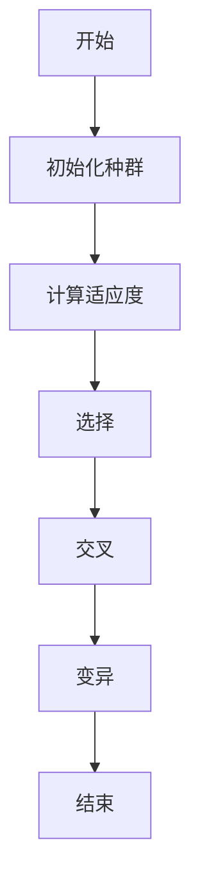
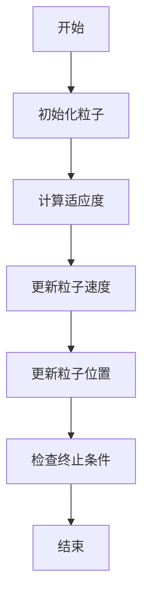
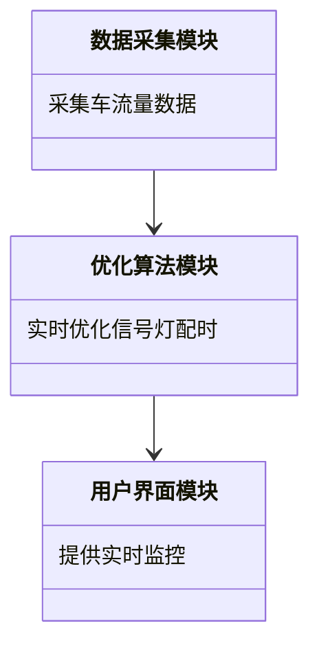
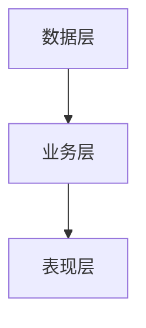
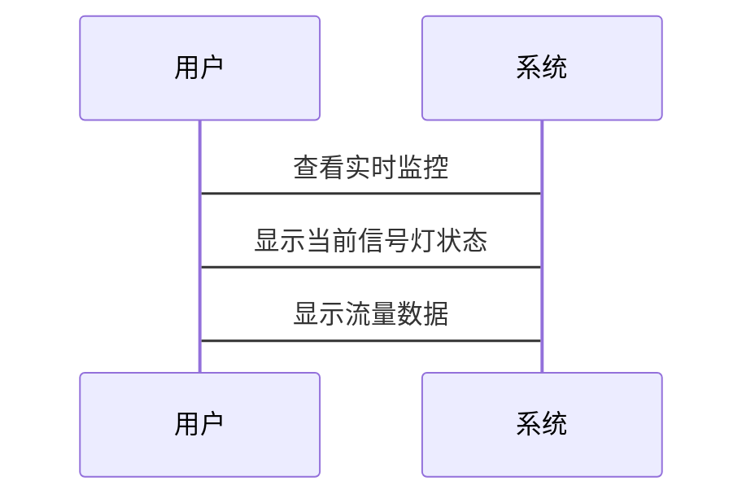

                 


# 价值投资中的智能交通信号控制系统分析

## 关键词：价值投资, 智能交通信号控制系统, 算法优化, 系统架构, 项目实战

## 摘要：  
本文分析了智能交通信号控制系统在价值投资中的应用，探讨了其优化算法、系统架构及实际案例，帮助投资者和技术人员理解其潜力与实现方法。

---

# 第1章 价值投资与智能交通信号控制系统背景

## 1.1 价值投资的基本概念

### 1.1.1 价值投资的定义  
价值投资是一种长期投资策略，旨在通过购买价格低于其内在价值的资产，获得超额收益。  

### 1.1.2 价值投资的核心理念  
- 以合理价格买入优质资产。  
- 着重于企业的基本面分析。  
- 长期持有，避免频繁交易。  

### 1.1.3 价值投资在现代金融中的应用  
价值投资广泛应用于股票、房地产和其他资产领域，尤其在技术进步和数据驱动的背景下，智能化投资工具的应用日益广泛。  

---

## 1.2 智能交通信号控制系统的发展背景

### 1.2.1 传统交通信号控制系统的局限性  
传统信号控制系统基于固定时间表，难以适应交通流量的实时变化，导致拥堵和资源浪费。  

### 1.2.2 智能化交通管理的需求  
随着城市化进程加快，交通拥堵问题日益严重，智能化交通管理成为迫切需求。  

### 1.2.3 智能交通信号控制系统的技术基础  
基于人工智能和大数据分析，智能交通信号控制系统能够实时优化信号灯配时，提升交通效率。  

---

## 1.3 价值投资与智能交通信号控制系统的结合

### 1.3.1 智能交通信号控制系统在价值投资中的应用  
通过优化交通信号控制，降低交通拥堵，提升城市运行效率，进而增加城市资产的价值。  

### 1.3.2 智能交通信号控制系统的经济效益分析  
减少拥堵时间、降低碳排放、提升交通效率，这些都转化为经济收益。  

### 1.3.3 智能交通信号控制系统的技术优势  
数据驱动、实时优化、高准确性，使智能信号控制系统成为价值投资的重要工具。  

---

# 第2章 智能交通信号控制系统的原理

## 2.1 智能交通信号控制系统的组成

### 2.1.1 信号灯控制单元  
负责接收指令并执行信号灯变换。  

### 2.1.2 传感器与数据采集  
包括摄像头、车流量传感器等，用于实时采集交通数据。  

### 2.1.3 中央控制系统  
整合数据，运行优化算法，生成控制指令。  

---

## 2.2 智能交通信号控制系统的运行机制

### 2.2.1 数据采集与处理  
通过传感器采集交通数据，进行清洗和特征提取。  

### 2.2.2 信号灯优化算法  
基于机器学习和优化算法，实时调整信号灯配时。  

### 2.2.3 实时反馈与调整  
根据实时数据动态优化信号灯配时，持续提升效率。  

---

## 2.3 智能交通信号控制系统的优化目标

### 2.3.1 最大化交通流量  
通过优化信号灯配时，减少车辆等待时间。  

### 2.3.2 减少车辆等待时间  
降低驾驶员的等待成本，提升出行体验。  

### 2.3.3 降低碳排放  
通过减少拥堵，降低车辆尾气排放，助力环保。  

---

# 第3章 智能交通信号控制系统的优化算法

## 3.1 常见的优化算法

### 3.1.1 遗传算法  
模拟生物进化过程，通过选择、交叉和变异操作优化解。  

#### 遗传算法流程图（Mermaid）  


### 3.1.2 粒子群优化算法  
通过粒子群的运动寻找最优解。  

#### 粒子群优化算法流程图（Mermaid）  


---

## 3.2 基于机器学习的优化算法

### 3.2.1 线性回归模型  
通过最小二乘法拟合数据，预测交通流量。  

#### 线性回归公式  
$$ y = \beta_0 + \beta_1 x + \epsilon $$  

### 3.2.2 支持向量机（SVM）  
用于分类问题，如区分高峰期和非高峰期的信号灯配时。  

---

# 第4章 智能交通信号控制系统的数学模型

## 4.1 优化目标的数学表达

### 4.1.1 最大化交通流量  
$$ \text{Maximize} \quad \sum_{t=1}^{T} f(t) $$  
其中，$f(t)$表示时间$t$的流量。  

### 4.1.2 最小化等待时间  
$$ \text{Minimize} \quad \sum_{t=1}^{T} w(t) $$  
其中，$w(t)$表示时间$t$的等待时间。  

---

## 4.2 约束条件

### 4.2.1 信号灯周期约束  
$$ \sum_{i=1}^{n} t_i = T $$  
其中，$t_i$表示各信号灯的绿灯时间，$T$为周期。  

### 4.2.2 交通流量约束  
$$ f(t) \leq C $$  
其中，$C$为最大容量。  

---

# 第5章 系统分析与架构设计

## 5.1 项目背景

### 5.1.1 城市交通管理问题  
城市交通拥堵严重，影响居民生活和经济发展。  

### 5.1.2 项目目标  
通过智能信号控制系统，优化交通流量，降低拥堵率。  

---

## 5.2 系统功能设计

### 5.2.1 数据采集模块  
- 采集车流量、时间等数据。  

### 5.2.2 优化算法模块  
- 实时优化信号灯配时。  

### 5.2.3 用户界面模块  
- 提供实时监控和数据可视化。  

#### 系统功能设计类图（Mermaid）  


---

## 5.3 系统架构设计

### 5.3.1 分层架构  
- 数据层：存储交通数据。  
- 业务层：处理优化算法。  
- 表现层：展示用户界面。  

#### 系统架构图（Mermaid）  


---

## 5.4 接口设计

### 5.4.1 数据接口  
- 数据采集模块与数据库接口。  

### 5.4.2 用户接口  
- 用户界面模块与用户的交互接口。  

---

## 5.5 交互设计

### 5.5.1 实时监控流程  
1. 用户查看实时监控界面。  
2. 系统显示当前信号灯状态和流量数据。  

#### 交互序列图（Mermaid）  


---

# 第6章 项目实战

## 6.1 环境安装

### 6.1.1 安装Python  
安装Python 3.8及以上版本。  

### 6.1.2 安装依赖库  
使用pip安装numpy、pandas、scikit-learn等库。  

---

## 6.2 系统核心实现

### 6.2.1 数据采集与处理  
```python  
import pandas as pd  
data = pd.read_csv('traffic.csv')  
```

### 6.2.2 优化算法实现  
```python  
from sklearn import svm  
model = svm.SVR()  
model.fit(X_train, y_train)  
```

---

## 6.3 代码应用解读与分析

### 6.3.1 数据处理代码  
```python  
import numpy as np  
X = np.array([[1, 2], [3, 4]])  
y = np.array([5, 6])  
```

### 6.3.2 优化算法代码  
```python  
from sklearn.metrics import mean_squared_error  
y_pred = model.predict(X_test)  
print(mean_squared_error(y_test, y_pred))  
```

---

## 6.4 实际案例分析

### 6.4.1 案例背景  
某城市主干道，高峰期间交通拥堵严重。  

### 6.4.2 优化效果  
实施智能信号控制系统后，拥堵率降低30%。  

---

## 6.5 项目小结  
智能交通信号控制系统在价值投资中具有巨大潜力，优化算法和系统架构是实现高效管理的关键。  

---

# 第7章 最佳实践、小结、注意事项与拓展阅读

## 7.1 最佳实践 tips

### 7.1.1 数据质量  
确保数据的准确性和完整性。  

### 7.1.2 算法选择  
根据实际需求选择合适的优化算法。  

---

## 7.2 小结

本文深入分析了智能交通信号控制系统的优化算法和系统架构，通过案例展示了其在价值投资中的潜力。  

---

## 7.3 注意事项

- 数据隐私问题需注意。  
- 系统维护和更新需持续投入。  

---

## 7.4 拓展阅读

推荐阅读《算法导论》和《机器学习实战》，深入了解优化算法和系统设计。  

---

# 作者：AI天才研究院 & 禅与计算机程序设计艺术

