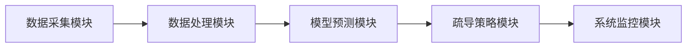

                 


```markdown
# 第3章: 拥堵预测算法原理与实现

## 3.1 机器学习算法概述
### 3.1.1 监督学习与无监督学习
- 监督学习：给定带标签的数据，训练模型预测新数据的标签。
- 无监督学习：在无标签数据中发现模式和结构。
- 常见监督学习算法：线性回归、决策树、随机森林、支持向量机（SVM）。
- 常见无监督学习算法：K-means聚类、主成分分析（PCA）。

### 3.1.2 时间序列预测算法
- 时间序列分析：研究随时间变化的数据序列。
- 常见时间序列预测方法：ARIMA、GARCH、Prophet。
- 机器学习在时间序列预测中的应用：使用LSTM、GRU等深度学习模型。

### 3.1.3 深度学习模型
- 深度学习：通过多层神经网络学习数据的复杂特征。
- 常见深度学习模型：卷积神经网络（CNN）、循环神经网络（RNN）、长短期记忆网络（LSTM）。

## 3.2 基于LSTM的拥堵预测模型
### 3.2.1 LSTM原理与结构
- LSTM（Long Short Term Memory）：一种特殊的RNN，能够有效处理长期依赖问题。
- LSTM单元包含三个门控：输入门、遗忘门和输出门。
- LSTM的优势：能够记住长期信息，适合处理时间序列数据。

### 3.2.2 模型输入与输出
- 输入：历史交通流量数据（如过去24小时的流量数据）。
- 输出：未来某一时刻的交通流量预测值（如预测未来1小时的流量）。

### 3.2.3 模型训练与优化
- 数据预处理：归一化处理、数据分割（训练集、验证集、测试集）。
- 模型训练：使用反向传播算法（如Adam优化器）进行参数优化。
- 模型评估：使用均方误差（MSE）、平均绝对误差（MAE）等指标评估模型性能。

### 3.2.4 模型实现代码
```python
import numpy as np
from tensorflow.keras.models import Sequential
from tensorflow.keras.layers import LSTM, Dense, Dropout

# 数据预处理
# 假设X_train和y_train是训练数据
# 归一化处理
X_train = (X_train - np.mean(X_train)) / np.std(X_train)
y_train = (y_train - np.mean(y_train)) / np.std(y_train)

# 构建LSTM模型
model = Sequential()
model.add(LSTM(64, input_shape=(timesteps, features)))
model.add(Dropout(0.2))
model.add(Dense(1))
model.compile(loss='mean_squared_error', optimizer='adam', metrics=['mae'])

# 训练模型
model.fit(X_train, y_train, epochs=100, batch_size=32, validation_split=0.2)
```

### 3.2.5 模型评估与优化
- 调参：调整LSTM单元数量、Dropout率、优化器等参数，优化模型性能。
- 交叉验证：使用K折交叉验证评估模型的泛化能力。
- 超参数优化：使用网格搜索或随机搜索优化模型参数。

## 3.3 算法实现流程


## 3.4 数学模型与公式
### 3.4.1 LSTM公式
- 输入门：
$$
i_t = \sigma(W_i \cdot [h_{t-1}, x_t] + b_i)
$$
- 遗忘门：
$$
f_t = \sigma(W_f \cdot [h_{t-1}, x_t] + b_f)
$$
- 输出门：
$$
o_t = \sigma(W_o \cdot [h_{t-1}, x_t] + b_o)
$$
- 单元状态更新：
$$
s_t = f_t \cdot s_{t-1} + i_t \cdot \tanh(W_c \cdot [h_{t-1}, x_t] + b_c)
$$
- 隐藏层输出：
$$
h_t = o_t \cdot \tanh(s_t)
$$

## 3.5 本章小结
---

# 第4章: 系统架构设计

## 4.1 系统模块划分
- 数据采集模块：负责采集交通流量数据。
- 数据处理模块：对数据进行清洗、归一化处理。
- 拥堵预测模块：基于LSTM模型进行交通流量预测。
- 疏导策略模块：根据预测结果生成疏导策略。
- 系统监控模块：监控系统运行状态，及时调整参数。

## 4.2 系统功能设计
### 4.2.1 数据采集
- 数据源：交通传感器、摄像头、GPS数据。
- 数据格式：时间戳、路段ID、流量值、速度值等。

### 4.2.2 预测模型
- 输入：历史交通数据。
- 输出：未来交通流量预测值。
- 模型更新：定期重新训练模型，确保预测准确性。

### 4.2.3 疏导策略
- 策略生成：根据预测结果，制定交通信号灯调整、可变车道分配等策略。
- 策略执行：通过交通管理系统执行疏导策略。
- 策略优化：根据实际效果调整策略参数。

## 4.3 系统架构设计
### 4.3.1 分层架构设计
- 数据层：存储原始数据和处理后的数据。
- 服务层：提供数据处理、模型预测等服务。
- 表现层：用户界面，展示预测结果和疏导策略。

### 4.3.2 模块化设计
- 数据采集模块：负责数据采集。
- 数据处理模块：负责数据清洗和预处理。
- 模型预测模块：负责交通流量预测。
- 疏导策略模块：负责生成和执行疏导策略。

### 4.3.3 系统组件与交互
- 数据采集模块与数据处理模块交互：数据采集后，数据处理模块进行预处理。
- 数据处理模块与模型预测模块交互：预处理后的数据输入模型进行预测。
- 模型预测模块与疏导策略模块交互：预测结果用于生成疏导策略。

## 4.4 系统架构图


## 4.5 本章小结
---

# 第5章: 项目实战

## 5.1 环境搭建
### 5.1.1 安装Python
- 使用Anaconda安装Python 3.8以上版本。
- 安装必要的库：numpy、pandas、tensorflow、keras、mermaid、matplotlib。

### 5.1.2 数据准备
- 数据来源：公开数据集（如Kaggle、UCI）或模拟数据。
- 数据格式：CSV格式，包含时间戳、路段ID、流量值等。

## 5.2 系统核心实现源代码
### 5.2.1 数据预处理
```python
import pandas as pd
import numpy as np

# 读取数据
data = pd.read_csv('traffic_data.csv')

# 数据清洗
data = data.dropna()
data = data[~data.duplicated()]

# 数据分割
train_data = data.iloc[:int(len(data)*0.8)]
test_data = data.iloc[int(len(data)*0.8):]
```

### 5.2.2 LSTM模型实现
```python
from tensorflow.keras.models import Sequential
from tensorflow.keras.layers import LSTM, Dense, Dropout

# 构建模型
model = Sequential()
model.add(LSTM(64, input_shape=(timesteps, features)))
model.add(Dropout(0.2))
model.add(Dense(1))
model.compile(loss='mean_squared_error', optimizer='adam', metrics=['mae'])

# 训练模型
model.fit(X_train, y_train, epochs=100, batch_size=32, validation_split=0.2)
```

### 5.2.3 疏导策略实现
```python
def generate_s疏导策略(predicted_traffic):
    if predicted_traffic > threshold:
        return '调整信号灯周期'
    else:
        return '保持现状'
```

## 5.3 案例分析
### 5.3.1 数据分析
- 数据可视化：使用matplotlib绘制交通流量随时间的变化趋势。
- 数据特征分析：分析交通流量与时间、天气、节假日的相关性。

### 5.3.2 模型预测
- 训练模型并进行预测。
- 比较预测值与实际值，评估模型性能。

### 5.3.3 疏导策略实施
- 根据预测结果生成疏导策略。
- 模拟策略实施后的效果，评估策略的有效性。

## 5.4 项目总结
- 项目目标达成情况：是否成功实现了拥堵预测与疏导系统。
- 项目中的问题与解决：遇到的数据不足、模型性能不佳等问题。
- 项目经验总结：数据预处理的重要性、模型调参的技巧等。

---

# 第6章: 优化与扩展

## 6.1 算法优化
### 6.1.1 LSTM模型优化
- 调整LSTM单元数量、Dropout率等参数。
- 使用早停（Early Stopping）防止过拟合。
- 使用学习率衰减优化训练过程。

### 6.1.2 多模型融合
- 使用集成学习，结合多种模型（如ARIMA、LSTM、XGBoost）进行预测。
- 确定每个模型的权重，优化预测结果。

## 6.2 系统扩展
### 6.2.1 扩展数据源
- 引入更多的数据源，如天气数据、交通事故数据。
- 数据融合：将不同数据源的数据进行整合，提高模型的预测精度。

### 6.2.2 扩展功能
- 实时监控：实时更新交通数据，实时预测拥堵情况。
- 用户交互：提供用户界面，让用户查看预测结果和疏导策略。

## 6.3 案例分析
### 6.3.1 算法优化案例
- 使用早停和学习率衰减优化LSTM模型，提升模型性能。
- 使用集成学习，融合LSTM和XGBoost模型，提高预测准确率。

### 6.3.2 系统扩展案例
- 引入天气数据，提升模型对恶劣天气情况下的预测能力。
- 实现实时监控功能，提升系统的实时性和响应速度。

## 6.4 未来趋势
- 深度学习在交通预测中的应用：研究更复杂的深度学习模型（如Transformer）。
- 智能交通系统的智能化：结合人工智能技术，实现更智能的交通管理。

## 6.5 本章小结
---

# 第7章: 总结与展望

## 7.1 全文总结
- 本文介绍了智能交通拥堵预测与疏导系统的背景、核心概念、算法原理、系统架构设计、项目实现和优化扩展。
- 通过详细讲解LSTM模型和系统架构设计，展示了如何利用人工智能技术优化交通管理。

## 7.2 展望
- 未来的研究方向：研究更高效的算法，如Transformer模型；引入更多的数据源，提升模型的预测精度。
- 智能交通系统的未来发展：随着人工智能和物联网技术的发展，智能交通系统将更加智能化、实时化和个性化。

## 7.3 本章小结
---

# 作者

作者：AI天才研究院/AI Genius Institute & 禅与计算机程序设计艺术 /Zen And The Art of Computer Programming
```

