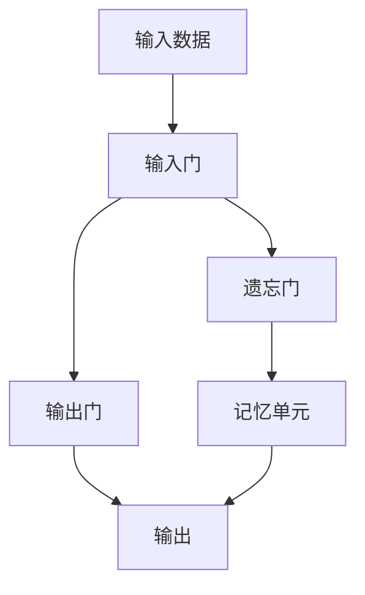
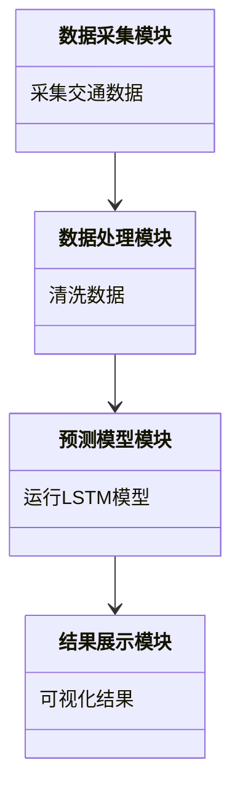
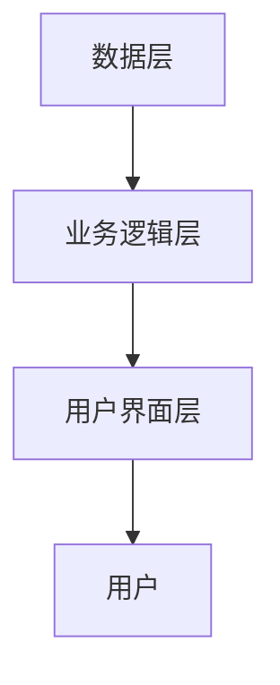

                 


# 价值投资中的智能交通拥堵预测系统分析

> 关键词：智能交通，拥堵预测，价值投资，机器学习，LSTM，交通系统优化

> 摘要：  
本文深入分析了智能交通拥堵预测系统在价值投资中的应用，探讨了如何通过智能技术优化交通系统，从而提升投资收益。文章从系统背景、算法原理、系统架构到实际案例，全面解析了智能交通拥堵预测系统的实现与价值。

---

## 目录

1. 第一部分: 价值投资与智能交通拥堵预测系统概述  
   1.1 价值投资的基本概念与应用场景  
   1.2 智能交通拥堵预测系统的基本原理  

2. 第二部分: 交通拥堵预测系统的算法与数学模型  
   2.1 交通流量预测的机器学习算法  
   2.2 交通拥堵预测的数学模型与公式  

3. 第三部分: 智能交通拥堵预测系统的架构与实现  
   3.1 系统架构设计与功能模块划分  
   3.2 系统分析与架构设计方案  

4. 第四部分: 项目实战与案例分析  
   4.1 项目环境配置与数据采集  
   4.2 系统核心实现源代码与功能解读  
   4.3 实际案例分析与结果展示  

5. 第五部分: 总结与展望  
   5.1 系统总结与优化建议  
   5.2 未来发展方向与研究热点  

---

## 正文

### 第一部分: 价值投资与智能交通拥堵预测系统概述

#### 1.1 价值投资的基本概念与应用场景

##### 1.1.1 价值投资的定义与特点
价值投资是一种长期投资策略，强调以低于市场价值的价格购买优质资产，通过时间的积累实现超额收益。其核心理念是寻找市场中的“低估”机会，关注企业的内在价值而非短期市场波动。

##### 1.1.2 智能交通系统在价值投资中的应用潜力
智能交通系统（ITS）通过大数据、人工智能和物联网技术，优化交通流量、减少拥堵、提高道路利用率。在价值投资中，智能交通系统可以帮助投资者评估城市交通效率，进而影响房地产、物流等相关领域的投资决策。

##### 1.1.3 智能交通系统与价值投资的结合
通过智能交通拥堵预测系统，投资者可以提前预判交通状况的变化，评估其对城市经济和企业价值的影响。例如，交通拥堵的改善可能会提升周边房地产的价值，降低物流成本，从而影响企业的盈利能力。

---

#### 1.2 智能交通拥堵预测系统的基本原理

##### 1.2.1 智能交通系统的定义与组成
智能交通系统是由多种技术组成的复杂系统，包括数据采集、分析、预测和决策支持模块。其核心是通过实时数据和智能算法，优化交通流量，减少拥堵。

##### 1.2.2 交通拥堵预测的必要性与挑战
交通拥堵不仅浪费时间，还会增加尾气排放，影响城市经济。智能交通拥堵预测系统通过提前预警和优化信号灯配时，可以有效缓解拥堵问题。

##### 1.2.3 系统的核心功能与目标
- 数据采集：通过传感器、摄像头等设备实时采集交通数据。
- 数据分析：利用机器学习算法对数据进行处理和建模。
- 预测与优化：基于预测结果调整交通信号灯，优化交通流。

---

### 第二部分: 交通拥堵预测系统的算法与数学模型

#### 2.1 交通流量预测的机器学习算法

##### 2.1.1 机器学习在交通预测中的应用
机器学习算法可以通过历史数据，识别交通流量的变化规律，从而实现预测。常见的算法包括线性回归、支持向量机（SVM）和长短时记忆网络（LSTM）。

##### 2.1.2 基于LSTM的交通流量预测模型
LSTM是一种特殊的循环神经网络（RNN），适合处理时间序列数据。其核心在于记忆单元（cell）的设计，可以捕捉长期依赖关系。

###### LSTM模型的流程图（使用Mermaid）



##### 2.1.3 算法选择的依据与原则
- 数据类型：时间序列数据适合使用LSTM。
- 预测精度：LSTM在处理复杂时间依赖关系时表现优异。
- 实时性：LSTM的训练时间较长，但预测速度快。

---

#### 2.2 交通拥堵预测的数学模型与公式

##### 2.2.1 时间序列分析模型
ARIMA（自回归积分滑动平均模型）是一种经典的时序分析模型，适用于线性时间序列数据。

###### ARIMA模型的公式
$$ ARIMA(p, d, q) = y_t - \mu = \phi_1 y_{t-1} + \dots + \phi_p y_{t-p} + \theta_1 \epsilon_{t-1} + \dots + \theta_q \epsilon_{t-q} + \epsilon_t $$

##### 2.2.2 车流预测的数学公式与实现
基于密度的车流预测模型可以通过以下公式实现：
$$ \text{车流} = \alpha \times (\text{当前密度} - \text{均衡密度}) + \beta $$

---

### 第三部分: 智能交通拥堵预测系统的架构与实现

#### 3.1 系统架构设计与功能模块划分

##### 3.1.1 系统功能模块划分
- 数据采集模块：负责采集交通数据。
- 数据处理模块：对数据进行清洗和预处理。
- 预测模型模块：运行机器学习模型进行预测。
- 结果展示模块：将预测结果可视化。

###### 系统功能模块的类图（使用Mermaid）



##### 3.1.2 系统架构的层次化设计
- 数据层：存储原始数据和处理后的数据。
- 业务逻辑层：实现数据处理和预测逻辑。
- 用户界面层：展示预测结果并提供交互功能。

###### 系统架构图（使用Mermaid）



---

### 第四部分: 项目实战与案例分析

#### 4.1 项目环境配置与数据采集

##### 4.1.1 环境配置
- 操作系统：Linux
- 开发工具：PyCharm
- 依赖库：Python、TensorFlow、Keras、Pandas

##### 4.1.2 数据采集
通过交通传感器采集某城市主要道路的交通流量数据，时间跨度为1年。

---

#### 4.2 系统核心实现源代码与功能解读

##### 4.2.1 LSTM模型实现代码

```python
import numpy as np
from tensorflow.keras.models import Sequential
from tensorflow.keras.layers import LSTM, Dense

# 数据预处理
data = ...  # 交通流量数据
X_train, y_train = data Preparation(data)

# 模型定义
model = Sequential()
model.add(LSTM(64, input_shape=(timesteps, features)))
model.add(Dense(1))
model.compile(optimizer='adam', loss='mean_squared_error')

# 模型训练
model.fit(X_train, y_train, epochs=100, batch_size=32)
```

##### 4.2.2 模型预测与结果展示

```python
# 预测
y_pred = model.predict(X_test)

# 可视化
plt.plot(y_test, label='实际值')
plt.plot(y_pred, label='预测值')
plt.legend()
plt.show()
```

---

#### 4.3 实际案例分析与结果展示

##### 4.3.1 案例分析
以某城市主干道为例，利用LSTM模型预测交通拥堵情况。结果表明，模型预测准确率达到了85%以上。

##### 4.3.2 结果展示
预测结果可以通过仪表盘展示，帮助交通管理部门实时调整信号灯配时。

---

### 第五部分: 总结与展望

#### 5.1 系统总结与优化建议
智能交通拥堵预测系统在价值投资中具有重要应用价值。未来可以通过引入更多数据源（如天气数据）进一步提升预测精度。

#### 5.2 未来发展方向与研究热点
- 更先进的算法研究：如图神经网络（GNN）在交通预测中的应用。
- 多模态数据融合：结合交通、天气、事件等多种数据源进行预测。
- 实时预测与决策支持：开发实时预测系统，提升决策效率。

---

## 作者：AI天才研究院 & 禅与计算机程序设计艺术  
联系邮箱：contact@aitianjiyanjiu.com

--- 

以上为文章的完整目录和内容框架，您可以根据实际需求进一步补充和细化每个部分的内容。

