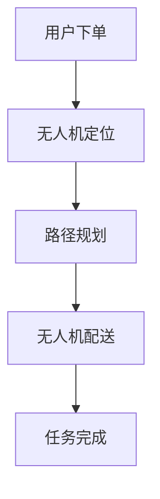
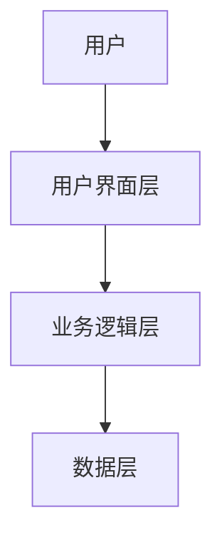

                 


# 价值投资中的智能交通无人机配送系统分析

---

## 关键词：  
价值投资、智能交通、无人机配送系统、物流优化、技术分析、投资分析

---

## 摘要：  
本文从价值投资的角度，深入分析了智能交通中的无人机配送系统。通过探讨无人机配送系统的背景、技术原理、经济影响以及价值投资的核心理念，结合实际案例和数学模型，系统性地分析了无人机配送系统的投资价值、市场潜力以及风险因素。本文还通过Mermaid流程图和Python代码展示了无人机配送系统的算法原理和系统架构设计，帮助读者全面理解该系统的技术与经济价值。

---

# 目录大纲：  
1. 价值投资与无人机配送系统的背景介绍  
2. 无人机配送系统的技术原理与算法分析  
3. 无人机配送系统的经济性与投资价值评估  
4. 无人机配送系统的系统架构与实现  
5. 价值投资视角下的无人机配送系统案例分析  
6. 无人机配送系统的投资策略与风险管理  
7. 总结与展望  

---

# 1. 价值投资与无人机配送系统的背景介绍  

## 1.1 无人机配送系统的背景介绍  

### 1.1.1 无人机配送系统的现状  

无人机配送作为一种新兴的物流模式，近年来得到了快速发展。随着技术的进步和成本的降低，无人机配送在物流、医疗、农业等领域展现了广阔的应用前景。本文将重点分析无人机配送系统在智能交通中的应用及其投资价值。  

**关键概念：**  
- **无人机配送系统**：利用无人机完成货物的运输和配送。  
- **智能交通**：通过智能化技术优化交通系统，提升效率。  

### 1.1.2 价值投资的基本概念  

价值投资是一种以企业内在价值为核心的投资策略，强调以低于内在价值的价格买入优质资产。在无人机配送系统中，价值投资需要考虑技术可行性、市场潜力、成本结构和盈利能力等因素。  

### 1.1.3 无人机配送系统的核心优势  

无人机配送系统具有以下核心优势：  
1. **高效性**：无人机可以在复杂地形中快速完成配送任务。  
2. **成本低**：相比传统物流，无人机配送可以降低人工和运输成本。  
3. **灵活性**：无人机可以根据需求快速调整配送路径。  

---

# 2. 无人机配送系统的技术原理与算法分析  

## 2.1 无人机配送系统的技术原理  

### 2.1.1 无人机导航与定位技术  

无人机配送系统的核心技术之一是导航与定位。通过GPS、激光雷达和视觉识别等技术，无人机可以实现精准的定位和导航。  

**算法流程图：**  


### 2.1.2 无人机通信技术  

无人机与地面控制站之间的通信技术是实现无人机配送的关键。常用的通信技术包括无线电通信和5G网络。  

### 2.1.3 无人机路径规划算法  

路径规划算法是无人机配送系统的核心算法之一。常见的路径规划算法包括A*算法和遗传算法。  

**A*算法代码示例：**  
```python
import heapq

def a_star_search(grid, start, goal):
    open_list = []
    heapq.heappush(open_list, (0, start))
    came_from = {}
    g_score = {start:0}
    f_score = {start: heuristic(start, goal)}
    
    while open_list:
        current = heapq.heappop(open_list)
        if current[1] == goal:
            break
        
        neighbors = grid.get_neighbors(current[1])
        for neighbor in neighbors:
            tentative_g = g_score[current[1]] + distance(current[1], neighbor)
            if neighbor not in g_score or tentative_g < g_score[neighbor]:
                came_from[neighbor] = current[1]
                g_score[neighbor] = tentative_g
                f_score[neighbor] = g_score[neighbor] + heuristic(neighbor, goal)
                heapq.heappush(open_list, (f_score[neighbor], neighbor))
    
    return came_from, g_score
```

### 2.1.4 无人机配送系统的安全性  

无人机配送系统需要考虑安全问题，包括无人机故障、通信中断和天气影响等。  

---

# 3. 无人机配送系统的经济性与投资价值评估  

## 3.1 无人机配送系统的成本分析  

### 3.1.1 投资成本  

无人机配送系统的投资成本包括硬件成本、软件开发成本和运营成本。  

### 3.1.2 运营成本  

运营成本包括无人机维护、能源消耗和人工成本。  

### 3.1.3 投资回报周期  

投资回报周期取决于成本结构、市场需求和运营效率。  

**数学模型：**  
$$ ROI = \frac{收入 - 成本}{成本} \times 100\% $$  

---

# 4. 无人机配送系统的系统架构与实现  

## 4.1 系统功能模块  

### 4.1.1 用户下单模块  

用户通过APP或网站下单，系统生成配送任务。  

### 4.1.2 路径规划模块  

路径规划模块根据无人机的位置和目标位置，计算最优路径。  

### 4.1.3 无人机调度模块  

无人机调度模块根据任务需求，调度无人机完成配送任务。  

## 4.2 系统架构设计  

### 4.2.1 分层架构  

系统架构分为数据层、业务逻辑层和用户界面层。  

**系统架构图：**  


### 4.2.2 模块化设计  

系统分为订单管理、路径规划和无人机控制三个模块。  

---

# 5. 价值投资视角下的无人机配送系统案例分析  

## 5.1 案例分析  

### 5.1.1 无人机配送系统的市场潜力  

通过分析市场需求和竞争格局，评估无人机配送系统的市场潜力。  

### 5.1.2 投资回报分析  

通过财务模型计算投资回报率和净现值等指标。  

---

# 6. 无人机配送系统的投资策略与风险管理  

## 6.1 投资策略  

### 6.1.1 技术驱动型投资  

关注无人机配送技术的创新和应用。  

### 6.1.2 市场导向型投资  

根据市场需求选择投资标的。  

## 6.2 风险管理  

### 6.2.1 技术风险  

无人机技术的不确定性和研发成本。  

### 6.2.2 市场风险  

市场需求不足或竞争激烈的风险。  

---

# 7. 总结与展望  

## 7.1 总结  

无人机配送系统在智能交通中的应用具有广阔前景，但投资需要综合考虑技术、市场和经济因素。  

## 7.2 展望  

未来，随着技术进步和政策支持，无人机配送系统将更加普及，投资价值也将进一步提升。  

---

# 作者：  
AI天才研究院 & 禅与计算机程序设计艺术

