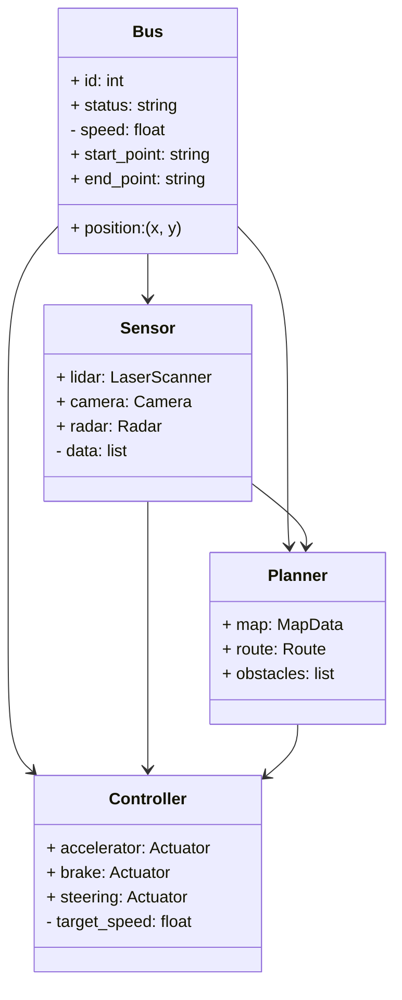
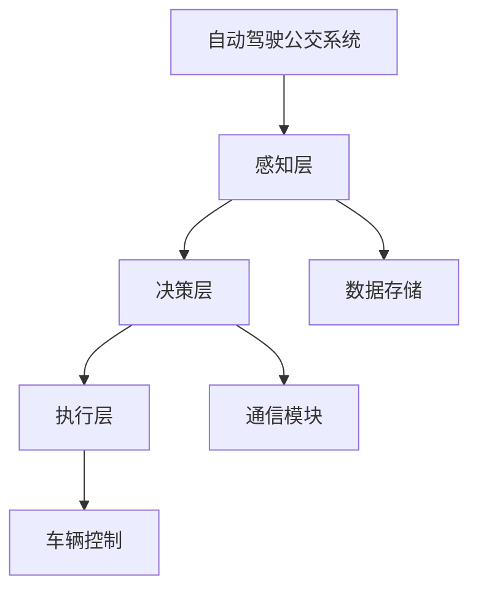

                 


# 价值投资中的智能交通自动驾驶公交系统分析

---

## 关键词：  
自动驾驶、智能交通、价值投资、公交系统、算法原理、系统架构

---

## 摘要：  
本文从价值投资的角度分析智能交通领域的自动驾驶公交系统，探讨其技术实现、经济价值和投资潜力。通过分析自动驾驶的核心技术、算法原理和系统架构，结合实际案例，揭示自动驾驶公交系统如何通过技术创新和商业化落地实现投资价值的最大化。本文旨在为投资者和技术从业者提供一份全面的技术与经济分析指南。

---

# 第一部分：价值投资中的智能交通自动驾驶公交系统概述

## 第1章：自动驾驶公交系统的背景与价值投资概述

### 1.1 自动驾驶公交系统的背景

#### 1.1.1 智能交通系统的概念与特点

智能交通系统（Intelligent Transportation System, ITS）是通过先进的信息技术、数据通信技术、传感器技术和计算机技术，对交通系统进行实时监测、分析和控制的系统。其特点是：

- **高效性**：通过优化交通流量，减少拥堵。
- **安全性**：通过实时监测和预警，降低交通事故风险。
- **智能化**：通过人工智能和大数据分析，实现自动驾驶和智能调度。

#### 1.1.2 自动驾驶技术的发展历程

自动驾驶技术经历了从早期的概念研究到如今的实际应用，主要经历了以下阶段：

1. **研究阶段**（20世纪50年代-80年代）：主要在实验室中进行理论研究和技术探索。
2. **技术突破阶段**（20世纪90年代-2010年代）：自动驾驶技术逐步实现从单一功能到多功能集成。
3. **商业化阶段**（2010年代至今）：自动驾驶技术逐渐应用于公共交通和私家车领域。

#### 1.1.3 自动驾驶公交系统的现状与未来趋势

目前，全球多个城市已开始试点自动驾驶公交系统，例如新加坡、中国深圳和瑞典斯德哥尔摩。未来趋势包括：

- **技术成熟化**：自动驾驶技术将进一步优化，实现完全无人驾驶。
- **大规模商业化**：自动驾驶公交系统将逐步取代传统公交系统。
- **政策支持**：各国政府将出台更多政策支持自动驾驶技术的发展。

### 1.2 价值投资的基本概念与方法

#### 1.2.1 价值投资的定义与核心理念

价值投资是一种投资策略，通过分析企业的基本面，寻找被市场低估的投资标的。其核心理念包括：

- **长期投资**：关注企业的长期价值，而非短期波动。
- **安全边际**：在投资时留有一定的安全边际，以降低风险。
- **优质企业**：选择行业龙头或具有竞争优势的企业。

#### 1.2.2 价值投资的基本原则与策略

- **基本面分析**：分析企业的财务状况、盈利能力和发展潜力。
- **行业研究**：选择具有广阔市场空间和高增长潜力的行业。
- **分散投资**：通过分散投资降低风险。

#### 1.2.3 价值投资在智能交通领域的应用潜力

智能交通领域是一个技术驱动型行业，具有广阔的发展空间。自动驾驶技术作为智能交通的核心，具有以下投资潜力：

- **技术创新**：自动驾驶技术的持续进步将推动行业快速发展。
- **政策支持**：各国政府对智能交通的重视将推动行业增长。
- **市场空间**：自动驾驶公交系统的市场需求将快速增长。

### 1.3 自动驾驶公交系统与价值投资的结合

#### 1.3.1 自动驾驶公交系统的经济价值分析

自动驾驶公交系统的经济价值体现在以下几个方面：

- **降低运营成本**：通过自动化调度和无人驾驶技术，降低人工成本。
- **提高运输效率**：通过智能调度和实时优化，提高车辆利用率。
- **减少交通事故**：通过自动驾驶技术，降低交通事故的发生率。

#### 1.3.2 价值投资视角下的自动驾驶公交系统评估

在价值投资视角下，评估自动驾驶公交系统需要考虑以下几个方面：

- **技术壁垒**：企业的技术优势和创新能力。
- **市场地位**：企业的市场份额和行业地位。
- **财务状况**：企业的盈利能力和发展潜力。

#### 1.3.3 自动驾驶公交系统对交通行业的长期影响

自动驾驶公交系统的普及将对交通行业产生深远影响：

- **推动行业升级**：自动驾驶技术将推动传统交通行业向智能化、数字化转型。
- **改变出行方式**：自动驾驶公交系统将改变人们的出行方式，提供更便捷的服务。
- **促进经济增长**：自动驾驶技术的广泛应用将促进经济增长和就业机会。

---

## 第2章：自动驾驶公交系统的核心技术分析

### 2.1 自动驾驶的关键技术

#### 2.1.1 感知技术

感知技术是自动驾驶的核心技术之一，主要包括以下几种：

1. **激光雷达（LiDAR）**：通过发射激光并接收反射信号，实现对周围环境的三维感知。
2. **摄像头**：通过图像识别技术，识别道路标志、交通信号灯和行人。
3. **雷达**：通过发射无线电波，检测障碍物和车辆。

#### 2.1.2 决策算法

决策算法是自动驾驶的核心算法之一，主要包括以下几种：

1. **路径规划**：通过算法规划车辆的行驶路径。
2. **行为决策**：通过算法决定车辆的行驶行为，如加速、减速、转向。

#### 2.1.3 执行系统

执行系统是自动驾驶的执行机构，主要包括以下几种：

1. **电机控制**：通过电机控制车辆的加速和减速。
2. **制动系统**：通过制动系统实现车辆的减速和停车。

---

## 第3章：自动驾驶公交系统的算法原理

### 3.1 目标检测算法

目标检测是自动驾驶中的重要任务之一，常用的算法包括YOLO和Faster R-CNN。以下是YOLO算法的原理：

```python
def yolo_predict(image):
    # 输入图像经过预处理
    input_image = preprocess(image)
    # 输入模型进行预测
    output = model.predict(input_image)
    # 解析输出结果
    boxes = decode(output)
    return boxes
```

YOLO算法的损失函数如下：

$$
\text{Loss} = \lambda_{\text{xy}}(x - \hat{x})^2 + \lambda_{wh}(w - \hat{w})^2 + \lambda_{conf}(p - \hat{p})^2
$$

### 3.2 路径规划算法

路径规划是自动驾驶中的另一个重要任务，常用的算法包括A*算法和RRT（Rapidly-exploring Random Tree）算法。以下是A*算法的伪代码：

```python
def a_star(start, end, grid):
    open_set = {start}
    closed_set = set()
    g_score = {start: 0}
    f_score = {start: heuristic(start, end)}
    while open_set:
        current = pop(open_set, f_score)
        if current == end:
            break
        closed_set.add(current)
        for neighbor in get_neighbors(current, grid):
            tentative_g_score = g_score[current] + distance(current, neighbor)
            if neighbor not in g_score or tentative_g_score < g_score[neighbor]:
                g_score[neighbor] = tentative_g_score
                f_score[neighbor] = g_score[neighbor] + heuristic(neighbor, end)
                if neighbor not in open_set:
                    open_set.add(neighbor)
    return reconstruct_path(closed_set, end)
```

---

## 第4章：自动驾驶公交系统的系统架构设计

### 4.1 系统功能设计

以下是自动驾驶公交系统的功能模块：



### 4.2 系统架构设计

以下是自动驾驶公交系统的架构设计：



---

## 第5章：自动驾驶公交系统的项目实战

### 5.1 环境安装

以下是安装自动驾驶公交系统开发环境的步骤：

```bash
# 安装Python依赖
pip install numpy
pip install matplotlib
pip install tensorflow
pip install pytorch

# 安装C++依赖
sudo apt-get install libopencv-dev
sudo apt-get install libboost-dev
```

### 5.2 核心算法实现

以下是目标检测算法的实现代码：

```python
import numpy as np

def detect_objects(image):
    # 预处理图像
    input_image = image / 255.0
    # 输入模型进行预测
    model_output = model(input_image)
    # 解析输出结果
    boxes = decode(model_output)
    return boxes
```

### 5.3 实际案例分析

以下是自动驾驶公交系统的实际案例分析：

1. **案例一**：深圳某自动驾驶公交系统的部署。
2. **案例二**：新加坡某自动驾驶公交系统的运行。

---

## 第6章：自动驾驶公交系统的结论与展望

### 6.1 研究结论

通过本文的分析，可以得出以下结论：

- **技术成熟**：自动驾驶技术已经较为成熟，具备商业化落地的条件。
- **经济价值高**：自动驾驶公交系统具有较高的经济价值和投资潜力。
- **未来发展**：自动驾驶技术将进一步优化，应用场景将更加广泛。

### 6.2 未来展望

未来，自动驾驶技术将在以下几个方面进一步发展：

- **技术优化**：进一步优化算法和硬件，提高系统的稳定性和可靠性。
- **商业化落地**：进一步推动自动驾驶技术的商业化应用。
- **政策支持**：各国政府将出台更多政策支持自动驾驶技术的发展。

---

## 作者：AI天才研究院 & 禅与计算机程序设计艺术

---

以上就是《价值投资中的智能交通自动驾驶公交系统分析》的完整内容。希望本文能为投资者和技术从业者提供有价值的参考和启示。

