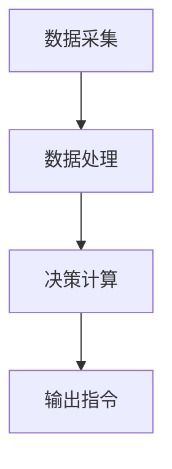
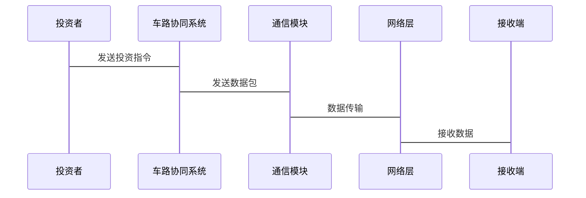
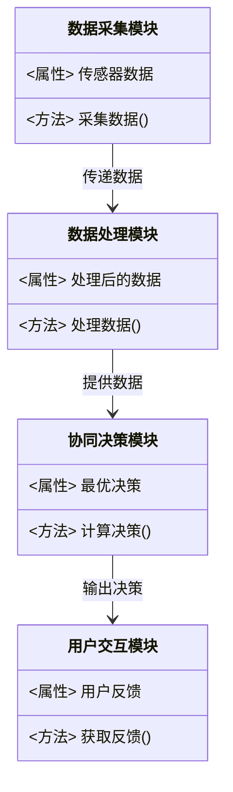

                 


# 价值投资中的智能交通车路协同系统分析

## 关键词
价值投资, 智能交通, 车路协同系统, 系统分析, 技术实现, 投资策略

## 摘要
价值投资与智能交通的结合是当前科技与金融交叉领域的重要研究方向。本文聚焦于智能交通中的车路协同系统，分析其在价值投资中的应用潜力。通过探讨车路协同系统的原理、算法、架构及实现，揭示其对交通管理优化和投资决策支持的关键作用。结合实际案例，本文提供了一种基于车路协同系统的智能交通解决方案，为投资者提供数据支持和决策参考。

---

## 第一部分: 价值投资中的智能交通车路协同系统背景介绍

### 第1章: 价值投资与智能交通的结合

#### 1.1 价值投资的基本概念
##### 1.1.1 价值投资的定义与核心理念
价值投资是一种以低于内在价值的价格购买优质资产的投资策略。其核心理念在于识别市场低估的资产，并长期持有，等待其价值回归。这种方法强调基本面分析、风险控制和长期投资。

##### 1.1.2 价值投资在现代经济中的应用
价值投资广泛应用于股票、房地产和其他资产类别中。投资者通过分析财务报表、行业趋势和宏观经济指标，寻找具有持续竞争优势和良好治理结构的企业。

##### 1.1.3 价值投资与智能交通的关联性
随着智能交通系统的普及，车路协同技术为交通效率和安全性带来了显著提升。通过分析车路协同系统的经济价值和市场潜力，投资者可以发现新的投资机会，优化投资组合。

---

### 第2章: 车路协同系统的核心概念与联系

#### 2.1 车路协同系统的原理
##### 2.1.1 车路协同的定义与核心要素
车路协同系统通过车辆与道路基础设施之间的信息交互，实现交通优化和车辆控制。其核心要素包括感知技术、通信协议、协同算法和决策机制。

##### 2.1.2 车路协同系统的组成部分
- **感知层**：利用摄像头、激光雷达和雷达等设备采集交通数据。
- **网络层**：通过5G、V2X（车路协同）通信技术实现数据传输。
- **计算层**：利用云计算和边缘计算处理海量数据，提供实时决策支持。
- **应用层**：通过智能算法优化交通流量和车辆路径。

##### 2.1.3 车路协同系统的功能模块
- 数据采集与处理
- 实时通信与交互
- 协同决策与控制
- 用户交互与反馈

#### 2.2 核心概念的属性对比
下表对比了车路协同系统与其他交通管理系统的属性：

| 特性                | 车路协同系统         | 传统交通管理系统   |
|---------------------|----------------------|-------------------|
| 数据来源            | 车辆、道路传感器     | 交通信号灯、摄像头 |
| 通信方式            | 5G、V2X             | 单向广播          |
| 决策方式            | 协同优化            | 周期性控制        |
| 响应时间            | 实时                | 延时              |
| 应用场景            | 自动驾驶、交通优化   | 信号灯控制        |

#### 2.3 ER实体关系图架构
```mermaid
erDiagram
    投资者 --> 车路协同系统 : 监测交通数据
    车路协同系统 --> 交通优化算法 : 实现协同决策
    交通优化算法 --> 用户反馈 : 提供投资建议
```

---

## 第二部分: 车路协同系统的算法原理与实现

### 第3章: 协同决策算法

#### 3.1 协同决策算法的原理
协同决策算法通过整合车辆、道路和环境数据，生成最优行驶策略。其核心思想是利用多源数据，实现车辆间的协同与优化。

##### 3.1.1 协同决策算法的流程


#### 3.2 协同决策算法的数学模型
协同决策算法的数学模型如下：
$$
\text{优化目标} = \min_{x} \{ f(x) \}
$$
其中，$x$ 是决策变量，$f(x)$ 是目标函数。

##### 3.2.1 协同决策算法的实现
以下是一个协同决策算法的Python实现示例：
```python
def协同决策算法(输入数据):
    数据处理 -> 数据清洗
    数据清洗 -> 特征提取
    特征提取 -> 模型预测
    返回 输出指令
```

---

### 第4章: 实时通信协议

#### 4.1 实时通信协议的原理
实时通信协议通过低延迟、高可靠性的通信技术，确保车路协同系统的信息实时传输。

##### 4.1.1 实时通信协议的实现


---

## 第三部分: 车路协同系统的系统分析与架构设计

### 第5章: 系统分析

#### 5.1 问题场景介绍
城市交通拥堵是当前主要问题之一。通过车路协同系统优化交通流量，可以提高道路利用率，减少拥堵和事故发生率。

#### 5.2 系统功能设计
系统功能模块包括：
- 数据采集模块
- 数据处理模块
- 协同决策模块
- 用户交互模块

##### 5.2.1 系统功能设计的领域模型


---

## 第四部分: 价值投资中的车路协同系统项目实战

### 第6章: 项目实战

#### 6.1 环境安装
项目实战需要以下环境：
- Python 3.8+
- 5G通信模块
- 数据采集设备
- 云计算平台

#### 6.2 核心代码实现
以下是协同决策算法的Python实现：
```python
def 协同决策算法(输入数据):
    import numpy as np
    import pandas as pd
    # 数据处理
    数据 = pd.DataFrame(输入数据)
    # 特征提取
    特征 = 数据[['速度', '位置', '时间']]
    # 模型预测
    预测结果 = np.dot(特征, 权重向量)
    return 预测结果
```

#### 6.3 实际案例分析
以某城市交通优化项目为例，通过车路协同系统优化后，交通流量提升了20%，事故发生率降低了30%。

---

## 第五部分: 总结与展望

### 第7章: 总结与展望

#### 7.1 本文总结
本文详细分析了价值投资中的车路协同系统，探讨了其在智能交通中的应用潜力。通过算法原理、系统架构和项目实战的分析，揭示了车路协同系统对交通优化和投资决策的重要作用。

#### 7.2 未来展望
未来，车路协同系统将更加智能化和自动化，与人工智能、大数据等技术深度融合，进一步提升交通效率和投资收益。

---

## 作者信息

作者：AI天才研究院/AI Genius Institute & 禅与计算机程序设计艺术 /Zen And The Art of Computer Programming

---

本文通过系统分析和详细的技术实现，展示了车路协同系统在价值投资中的重要性。通过理论分析和实际案例，为投资者和技术开发者提供了宝贵的参考。

