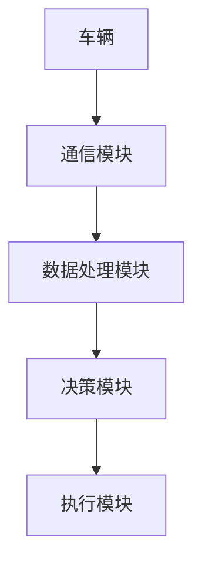
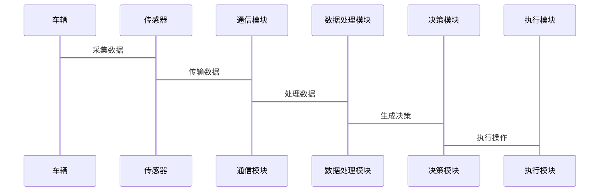

                 


# 价值投资中的智能交通车辆编队系统分析

> 关键词：智能交通系统, 车辆编队系统, 价值投资, 算法原理, 系统架构设计

> 摘要：本文从价值投资的角度分析智能交通车辆编队系统，探讨其经济效益、算法原理、系统架构及实际应用。通过分析车辆编队系统的功能模块、价值评估模型及系统架构设计，揭示其在智能交通中的潜力与价值。

---

## 第一部分: 智能交通车辆编队系统的背景与价值投资的结合

### 第1章: 智能交通车辆编队系统的背景介绍

#### 1.1 智能交通系统的概念与现状
智能交通系统（Intelligent Transportation System，ITS）是一种利用先进的信息技术、数据通信技术、传感器技术和计算机技术，对交通系统进行监测、协调和控制的系统。其目标是提高交通效率、减少拥堵、降低能源消耗和环境污染。近年来，随着人工智能和物联网技术的发展，智能交通系统在全球范围内的应用越来越广泛。

#### 1.2 车辆编队系统的定义与作用
车辆编队系统（Vehicle Platoon System）是一种智能交通系统的重要组成部分，它通过车辆间的协同工作，实现车辆在高速公路上自动编队行驶。编队系统可以减少空气阻力，降低燃油消耗，同时提高道路利用率。

#### 1.3 价值投资的基本概念
价值投资是一种投资策略，强调以低于内在价值的价格购买优质的资产。其核心理念是寻找市场低估的公司，长期持有，等待其价值回归。价值投资的关键在于对标的资产的深入分析和长期判断。

#### 1.4 车辆编队系统与价值投资的结合
车辆编队系统在智能交通中的应用具有显著的经济效益，例如降低燃油消耗、减少交通事故、提高道路容量等。从价值投资的角度来看，投资于车辆编队系统的技术研发和推广，可以在长期获得较高的收益。

---

### 第2章: 智能交通车辆编队系统的核心概念

#### 2.1 车辆编队系统的组成与功能模块
车辆编队系统主要由以下几个模块组成：
1. **车辆通信模块**：负责车辆之间的数据传输。
2. **自动驾驶模块**：实现车辆的自动跟驰和路径规划。
3. **数据处理模块**：对传感器数据进行处理和分析。
4. **决策控制模块**：根据数据处理结果做出驾驶决策。

#### 2.2 价值投资在车辆编队系统中的应用
价值投资在车辆编队系统中的应用主要体现在以下几个方面：
1. **技术研发投资**：投资于车辆编队系统的研发，提升技术的先进性和可靠性。
2. **市场推广投资**：通过市场推广，扩大编队系统的应用范围，提高市场占有率。
3. **长期收益分析**：通过长期的收益分析，评估投资的可行性和回报率。

#### 2.3 车辆编队系统与价值投资的联系
车辆编队系统的经济效益与价值投资的长期收益目标相契合。通过价值投资的方法，可以有效评估编队系统的市场价值和投资潜力，从而制定合理的投资策略。

---

### 第3章: 智能交通车辆编队系统的算法原理

#### 3.1 车辆编队系统的算法概述
车辆编队系统的核心算法包括队列控制算法和路径规划算法。队列控制算法主要用于车辆之间的间距控制，路径规划算法用于规划车辆的行驶路径。

#### 3.2 队列控制算法的数学模型
队列控制算法可以通过以下数学模型实现：

$$ \text{车速} = \max(v_{\text{max}}, v_{\text{lead}} - k \cdot d) $$

其中：
- $v_{\text{max}}$：最大允许速度
- $v_{\text{lead}}$：前方车辆的速度
- $k$：减速系数
- $d$：当前车辆与前方车辆的距离

#### 3.3 价值评估模型的建立
价值评估模型可以通过以下步骤建立：

1. **数据收集**：收集编队系统的相关数据，包括成本、收益、市场占有率等。
2. **数据处理**：对收集的数据进行清洗和处理。
3. **模型建立**：通过回归分析等方法建立价值评估模型。
4. **模型验证**：通过实际数据验证模型的准确性。

#### 3.4 本章小结

---

## 第二部分: 智能交通车辆编队系统的系统架构与价值投资模型设计

### 第4章: 智能交通车辆编队系统的系统架构设计

#### 4.1 系统功能设计
车辆编队系统的功能模块包括：
1. **通信模块**：实现车辆间的通信。
2. **传感器模块**：采集车辆的环境数据。
3. **数据处理模块**：处理传感器数据并生成决策。
4. **执行模块**：根据决策控制车辆的运动。

#### 4.2 系统架构设计
系统架构设计如下：



#### 4.3 系统接口设计
系统接口设计需要考虑车辆、传感器、通信模块之间的接口。

#### 4.4 系统交互流程
系统交互流程如下：



---

### 第5章: 价值投资模型的建立与实现

#### 5.1 价值投资模型的数学模型
价值投资模型可以通过以下公式实现：

$$ \text{内在价值} = \frac{\text{净利润} \times (1 + g)}{r - g} $$

其中：
- $\text{净利润}$：公司的净利润
- $g$：净利润增长率
- $r$：折现率

#### 5.2 模型实现步骤
1. **数据收集**：收集相关公司的财务数据。
2. **数据处理**：对数据进行清洗和处理。
3. **模型建立**：建立价值评估模型。
4. **模型验证**：通过历史数据验证模型的准确性。

#### 5.3 本章小结

---

## 第三部分: 项目实战与价值投资策略

### 第6章: 项目实战

#### 6.1 环境安装
需要安装以下环境：
1. Python 3.8及以上
2. Mermaid工具
3. MathJax支持

#### 6.2 核心代码实现
以下是队列控制算法的Python实现：

```python
def calculate_speed(max_speed, lead_speed, distance, k=2):
    return max(max_speed, lead_speed - k * distance)
```

#### 6.3 案例分析
以某公司为例，分析其价值投资的潜力。

---

### 第7章: 最佳实践与小结

#### 7.1 最佳实践
1. **技术评估**：深入了解编队系统的技术细节。
2. **市场分析**：分析市场的潜力和竞争情况。
3. **风险控制**：制定合理的风险控制策略。

#### 7.2 小结
本文从价值投资的角度分析了智能交通车辆编队系统，探讨了其经济效益、算法原理和系统架构设计。通过实际案例分析，揭示了其在智能交通中的潜力与价值。

---

## 作者：AI天才研究院 & 禅与计算机程序设计艺术

