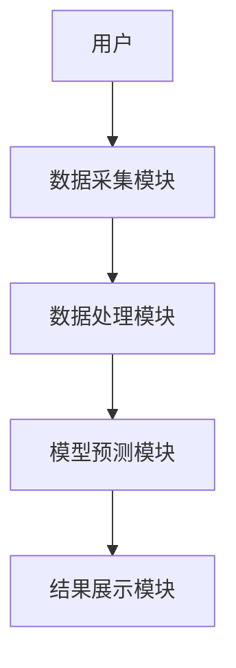

                 


# 价值投资中的智能交通预测系统分析

---

## 关键词  
价值投资、智能交通、预测系统、交通数据、机器学习、深度学习、风险管理

---

## 摘要  
本文深入探讨了智能交通预测系统在价值投资中的应用，分析了交通数据的采集、处理、建模与可视化过程，重点介绍了时间序列预测模型（如ARIMA和LSTM）的原理与实现。通过系统架构设计与项目实战，展示了如何利用智能交通预测系统进行投资决策支持与风险管理。本文还结合实际案例，详细解读了智能交通预测系统在价值投资中的最佳实践与未来发展趋势。

---

## 目录

### 第一部分：价值投资与智能交通预测系统概述

#### 第1章：价值投资与智能交通预测系统背景  
- 1.1 价值投资的核心理念与现代金融地位  
- 1.2 智能交通预测系统的定义与功能  
- 1.3 价值投资与智能交通预测系统的结合点  

#### 第2章：智能交通预测系统的数据基础  
- 2.1 交通数据的采集与处理  
- 2.2 数据分析与可视化方法  
- 2.3 数据特征提取与时间序列分析  

### 第二部分：智能交通预测系统的算法原理

#### 第3章：时间序列预测模型  
- 3.1 ARIMA模型原理与实现  
- 3.2 LSTM模型在交通预测中的应用  
- 3.3 时间序列预测算法对比与选择  

#### 第4章：机器学习与深度学习在交通预测中的应用  
- 4.1 机器学习算法在交通预测中的核心作用  
- 4.2 深度学习模型的构建与优化  
- 4.3 神经网络在交通预测中的优势  

### 第三部分：价值投资中的风险评估与决策支持

#### 第5章：风险评估与决策支持系统  
- 5.1 风险评估的基本方法与模型  
- 5.2 交通预测在投资风险管理中的应用  
- 5.3 决策支持系统的构建与实现  

### 第四部分：智能交通预测系统的系统架构与实现

#### 第6章：系统架构设计  
- 6.1 系统功能模块划分  
- 6.2 系统架构设计与实现  
- 6.3 系统接口与交互设计  

#### 第7章：项目实战与案例分析  
- 7.1 项目背景与目标  
- 7.2 数据采集与处理的实现  
- 7.3 模型构建与优化过程  
- 7.4 系统部署与应用案例  

### 第五部分：总结与展望

#### 第8章：总结与最佳实践  
- 8.1 全文总结  
- 8.2 智能交通预测系统的最佳实践建议  
- 8.3 未来发展趋势与研究方向  

---

## 正文部分（详细展开）

### 第1章：价值投资与智能交通预测系统背景

#### 1.1 价值投资的核心理念与现代金融地位  
价值投资是一种以内在价值为基础的投资策略，强调通过分析企业的基本面（如财务状况、行业地位、竞争优势等）来判断其投资价值。在现代金融中，价值投资被认为是长期稳定收益的重要方法之一。  

#### 1.2 智能交通预测系统的定义与功能  
智能交通预测系统是一种利用先进的数据采集、分析和预测技术，对交通流量、道路使用情况、交通事故风险等进行预测的系统。其核心功能包括：  
1. 实时数据采集与处理  
2. 交通流量预测  
3. 事故风险评估  
4. 优化交通管理  

#### 1.3 价值投资与智能交通预测系统的结合点  
交通数据的预测可以帮助投资者更好地理解城市交通状况，从而评估相关企业的投资价值。例如：  
- 共享出行平台的用户需求预测  
- 物流企业的运输成本优化  
- 城市交通规划的经济效益分析  

---

### 第2章：智能交通预测系统的数据基础

#### 2.1 交通数据的采集与处理  
交通数据主要来源于：  
1. 传感器数据（如交通摄像头、流量计）  
2. GPS定位数据  
3. 用户行为数据（如共享出行平台的订单数据）  

数据预处理步骤包括：  
1. 数据清洗（去除异常值）  
2. 数据转换（标准化、归一化）  
3. 数据增强（填充缺失值）  

#### 2.2 数据分析与可视化方法  
常用的数据分析方法包括：  
- 描述性分析：计算均值、中位数、标准差等统计指标  
- 趋势分析：识别数据的时间序列趋势  
- 关联分析：挖掘数据之间的关联性  

数据可视化工具推荐：  
- Matplotlib（Python）  
- Tableau  
- Power BI  

#### 2.3 数据特征提取与时间序列分析  
时间序列分析是智能交通预测的核心，常用方法包括：  
- 移动平均法（MA）  
- 指数平滑法（ES）  
- 分解模型（Trend、Seasonality、Noise）  

---

### 第3章：时间序列预测模型

#### 3.1 ARIMA模型原理与实现  
ARIMA（自回归积分滑动平均模型）是一种广泛应用于时间序列预测的模型。其基本假设是数据具有平稳性。  

模型公式：  
$$ ARIMA(p, d, q) $$  
- p：自回归阶数  
- d：差分阶数  
- q：移动平均阶数  

实现步骤：  
1. 数据平稳化（差分）  
2. 模型参数估计  
3. 模型验证与优化  

#### 3.2 LSTM模型在交通预测中的应用  
LSTM（长短期记忆网络）是一种特殊的RNN，适合处理长序列数据。  

模型结构：  
- 输入门（Input Gate）  
- 遗忘门（Forget Gate）  
- 输出门（Output Gate）  

实现流程：  
1. 数据预处理（归一化）  
2. 构建LSTM模型  
3. 模型训练与优化  
4. 模型预测与结果分析  

---

### 第4章：机器学习与深度学习在交通预测中的应用

#### 4.1 机器学习算法在交通预测中的核心作用  
常用机器学习算法：  
- 线性回归  
- 支持向量机（SVM）  
- 随机森林  

#### 4.2 深度学习模型的构建与优化  
深度学习模型的优势：  
- 自动特征提取  
- � 强大学习能力  

常用模型：  
- CNN（卷积神经网络）  
- RNN（循环神经网络）  
- Transformer  

---

### 第5章：风险评估与决策支持系统

#### 5.1 风险评估的基本方法与模型  
风险评估模型：  
- VaR（Value at Risk）  
- CVaR（Conditional Value at Risk）  

#### 5.2 交通预测在投资风险管理中的应用  
通过交通预测数据，投资者可以评估相关企业的运营风险，例如：  
- 交通拥堵对企业物流成本的影响  
- 用户需求下降对企业收入的影响  

---

### 第6章：系统架构设计

#### 6.1 系统功能模块划分  
- 数据采集模块  
- 数据处理模块  
- 模型预测模块  
- 结果展示模块  

#### 6.2 系统架构设计与实现  
系统架构图（Mermaid）：  



---

### 第7章：项目实战与案例分析

#### 7.1 项目背景与目标  
假设我们开发一个智能交通预测系统，用于预测某城市的主要交通干线流量。  

#### 7.2 数据采集与处理的实现  
代码示例（Python）：  

```python
import pandas as pd
import numpy as np

# 数据加载
data = pd.read_csv('traffic_data.csv')

# 数据清洗
data.dropna(inplace=True)
data['date'] = pd.to_datetime(data['date'])
data.set_index('date', inplace=True)

# 数据增强
data['moving_avg'] = data['flow'].rolling(7).mean()
```

#### 7.3 模型构建与优化过程  
代码示例（Keras）：  

```python
from tensorflow.keras.models import Sequential
from tensorflow.keras.layers import LSTM, Dense

model = Sequential()
model.add(LSTM(64, input_shape=(timesteps, features)))
model.add(Dense(1))
model.compile(optimizer='adam', loss='mean_squared_error')
model.fit(X_train, y_train, epochs=50, batch_size=32)
```

---

### 第8章：总结与展望

#### 8.1 全文总结  
本文详细探讨了智能交通预测系统在价值投资中的应用，从数据处理、算法实现到系统架构，为读者提供了全面的指导。  

#### 8.2 最佳实践建议  
- 注重数据质量，确保数据的完整性和准确性  
- 选择合适的模型，根据数据特点进行调优  
- 结合实际业务场景，制定合理的投资策略  

#### 8.3 未来发展趋势  
- 更多的数据来源与应用场景  
- 更先进的算法与模型（如Transformer）  
- 更强的计算能力与实时性  

---

## 作者  
**作者：AI天才研究院 & 禅与计算机程序设计艺术**  

--- 

以上是《价值投资中的智能交通预测系统分析》的完整目录和内容框架，希望对您有所帮助！

