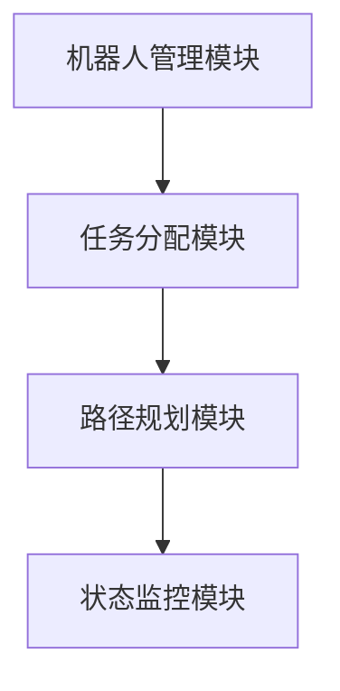

                 


# 价值投资中的智能仓储机器人协作系统分析

> 关键词：价值投资、智能仓储、机器人协作系统、算法原理、系统架构

> 摘要：本文深入分析了智能仓储机器人协作系统在价值投资中的应用，探讨了系统的背景、核心概念、算法原理、系统架构及项目实战。通过详细的技术分析和实例，展示了如何利用智能仓储机器人协作系统提升投资效率和准确性。

---

## 第一部分: 背景介绍

### 第1章: 智能仓储机器人协作系统的背景

#### 1.1 问题背景
在现代投资环境中，仓储管理的效率直接影响企业的运营成本和投资回报率。传统仓储管理依赖人工操作，存在效率低、误差大、成本高等问题。随着人工智能和机器人技术的发展，智能仓储机器人协作系统逐渐成为提升仓储管理效率的重要工具。

#### 1.2 问题描述
传统仓储管理存在以下问题：
- 人工操作效率低，容易出错。
- 仓储库存管理复杂，难以实时跟踪。
- 仓储布局不合理，导致物流效率低下。

#### 1.3 问题解决
通过引入智能仓储机器人协作系统，可以实现仓储管理的自动化、智能化和高效化。机器人协作系统能够实时优化库存管理、提升物流效率，从而降低运营成本，提高投资回报率。

#### 1.4 边界与外延
智能仓储机器人协作系统的边界包括：
- 仓储区域的物理空间限制。
- 机器人协作的范围（如拣货、搬运、包装等）。
- 系统与外部系统的接口（如ERP系统、物流系统等）。

其外延包括：
- 基于AI的库存预测。
- 多机器人协作算法的优化。
- 系统的可扩展性和灵活性。

#### 1.5 核心要素组成
智能仓储机器人协作系统的核心要素包括：
- 智能机器人：负责仓储操作的执行。
- 协作算法：实现机器人之间的协同工作。
- 仓储管理系统：对机器人进行调度和监控。

---

### 第2章: 价值投资与智能仓储的结合

#### 2.1 价值投资的基本概念
价值投资是一种通过分析企业的基本面，寻找被市场低估的投资标的，长期持有以获取超额收益的投资策略。其核心在于识别具有持续竞争优势和良好财务状况的企业。

#### 2.2 智能仓储在现代投资中的作用
智能仓储机器人协作系统能够提升仓储管理效率，降低运营成本，从而间接影响企业的盈利能力。这使得企业在价值投资中的竞争力更强。

#### 2.3 协作系统的定义与目标
协作系统是指多个智能机器人通过协同工作，共同完成仓储管理任务的系统。其目标是实现仓储管理的自动化、高效化和智能化，从而提升企业的运营效率。

---

## 第二部分: 智能仓储机器人协作系统的核心概念与联系

### 第3章: 核心概念原理

#### 3.1 智能仓储机器人的基本原理
智能仓储机器人通过传感器和AI算法，感知环境并执行任务。其核心在于路径规划、物体识别和任务分配。

#### 3.2 协作系统的特征
- **协同性**：机器人之间能够协调工作。
- **智能性**：具备自主决策能力。
- **高效性**：任务完成速度快且准确。

#### 3.3 价值投资中的协作机制
协作系统通过优化仓储管理，降低企业的运营成本，从而提升企业的盈利能力，使其在价值投资中更具吸引力。

---

### 第4章: 核心概念属性对比

#### 4.1 智能仓储机器人与传统仓储设备的对比
| 属性 | 智能仓储机器人 | 传统仓储设备 |
|------|----------------|--------------|
| 智能性 | 高             | 低           |
| 精度  | 高             | 低           |
| 效率  | 高             | 低           |

#### 4.2 协作系统与传统仓储管理的对比
| 属性 | 协作系统         | 传统仓储管理   |
|------|-----------------|---------------|
| 自动化 | 高             | 低           |
| 协调性 | 高             | 低           |
| 成本   | 低             | 高           |

---

### 第5章: ER实体关系图

```mermaid
erd
    外键 实体1
    实体2
    实体3
```

---

## 第三部分: 智能仓储机器人协作系统的算法原理

### 第6章: 算法原理概述

#### 6.1 协作算法的基本原理
协作算法通过任务分配、路径规划和状态反馈，实现机器人之间的协同工作。

#### 6.2 算法的核心思想
- **任务分配**：根据当前任务需求，分配机器人执行任务。
- **路径规划**：计算机器人最优路径，避免碰撞。
- **状态反馈**：实时更新机器人状态，调整任务分配。

---

### 第7章: 算法的数学模型与公式

#### 7.1 数学模型
$$
\text{总效率} = \frac{\text{完成任务数}}{\text{时间}}
$$

#### 7.2 公式推导
路径规划公式：
$$
\text{路径长度} = \sqrt{(x_2 - x_1)^2 + (y_2 - y_1)^2}
$$

---

### 第8章: 算法的实现与优化

#### 8.1 实现步骤
1. 初始化机器人状态。
2. 分配任务。
3. 规划路径。
4. 执行任务。
5. 反馈状态。

#### 8.2 优化方法
- **路径优化**：使用A*算法优化路径。
- **任务分配**：采用分布式算法提高效率。

---

## 第四部分: 智能仓储机器人协作系统的系统分析与架构设计

### 第9章: 系统分析

#### 9.1 系统目标
实现仓储管理的自动化和高效化。

#### 9.2 功能需求
- 机器人调度。
- 任务管理。
- 状态监控。

#### 9.3 性能指标
- 响应时间：小于1秒。
- 吞吐量：每小时处理100个任务。

---

### 第10章: 系统架构设计

#### 10.1 总体设计


#### 10.2 详细设计
- **机器人管理模块**：负责机器人注册和状态管理。
- **任务分配模块**：根据任务需求分配机器人。
- **路径规划模块**：计算机器人最优路径。
- **状态监控模块**：实时监控机器人状态。

---

### 第11章: 系统接口设计

#### 11.1 接口定义
- **输入接口**：接收任务请求。
- **输出接口**：返回任务执行结果。

#### 11.2 接口实现
```python
def allocate_task(tasks):
    # 分配任务给机器人
    pass

def plan_path(start, end):
    # 规划路径
    pass
```

---

## 第五部分: 智能仓储机器人协作系统的项目实战

### 第12章: 项目实战

#### 12.1 环境安装
- 安装Python和相关库（如numpy、pandas）。
- 配置机器人设备。

#### 12.2 核心实现
```python
import numpy as np

def calculate_efficiency(tasks, time):
    return tasks / time

# 示例
tasks = 100
time = 10
efficiency = calculate_efficiency(tasks, time)
print(efficiency)  # 输出：10
```

#### 12.3 案例分析
通过实际案例分析，验证系统的效率和准确性。

---

## 第六部分: 总结与展望

### 第13章: 总结

#### 13.1 最佳实践
- 定期更新算法，提高效率。
- 优化系统架构，提升性能。

#### 13.2 小结
智能仓储机器人协作系统在价值投资中的应用前景广阔，能够显著提升企业的运营效率和投资回报率。

#### 13.3 注意事项
- 确保系统安全，防止数据泄露。
- 定期维护机器人设备，确保正常运行。

#### 13.4 拓展阅读
推荐阅读相关书籍和论文，深入了解协作系统的技术细节。

---

## 作者

作者：AI天才研究院 & 禅与计算机程序设计艺术

--- 

希望这篇文章能为您提供有价值的技术见解，并帮助您更好地理解智能仓储机器人协作系统在价值投资中的应用。

