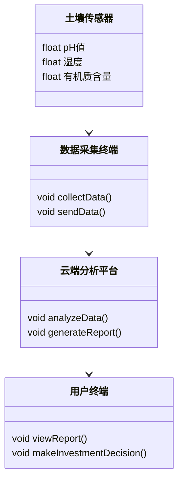
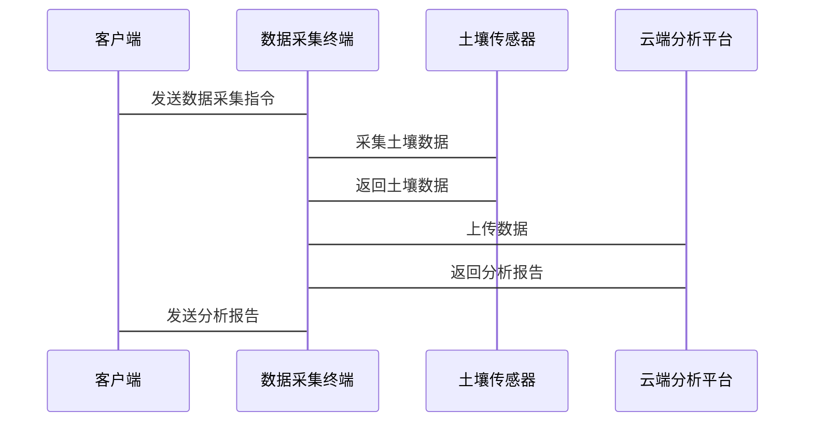

                 


# 价值投资中的智能农业土壤健康监测系统分析

---

## 关键词：
智能农业、土壤健康监测、价值投资、算法原理、系统架构、项目实战

---

## 摘要：
本文结合智能农业与价值投资，深入分析了土壤健康监测系统的核心原理、算法实现及实际应用场景。通过背景介绍、核心概念、算法原理、系统架构、项目实战等多维度的分析，揭示了智能农业土壤监测系统在投资决策中的潜在价值，并提出了实际的解决方案和最佳实践。

---

# 第一部分: 背景介绍

## 第1章: 价值投资与智能农业的结合

### 1.1 问题背景
#### 1.1.1 农业智能化的必要性
现代农业正面临着资源浪费、环境污染和效率低下的问题。通过智能技术优化农业生产，可以显著提高资源利用率和生产效率。

#### 1.1.2 土壤健康监测的重要性
土壤是农业的基础，土壤健康直接关系到作物产量和品质。传统的土壤监测方法效率低下，难以满足现代农业的需求。

#### 1.1.3 价值投资在农业中的应用
农业投资具有较高的潜力，但传统投资方式难以量化农业生产的真实情况。通过智能监测系统，可以更精准地评估农业投资的价值。

### 1.2 问题描述
#### 1.2.1 土壤健康监测的现状
当前土壤监测主要依赖人工采样和实验室分析，耗时长、成本高，且难以实现大规模监测。

#### 1.2.2 传统农业投资的局限性
传统农业投资难以量化生产过程，导致投资决策缺乏科学依据。

#### 1.2.3 智能农业土壤监测系统的潜力
智能土壤监测系统可以实时采集土壤数据，为农业生产提供科学依据，同时也为农业投资提供了精准的评估指标。

### 1.3 问题解决
#### 1.3.1 智能农业土壤监测系统的解决方案
通过物联网技术实时采集土壤数据，结合人工智能算法进行分析，为农业生产提供科学指导。

#### 1.3.2 价值投资在智能农业中的具体应用
利用土壤监测数据和人工智能模型，评估农业项目的投资价值，优化投资决策。

### 1.4 边界与外延
#### 1.4.1 系统的边界
智能土壤监测系统的边界包括土壤传感器、数据采集终端、云端分析平台和用户终端。

#### 1.4.2 系统的外延与扩展
未来可以扩展到气象监测、作物生长监测等更广泛的农业监测领域。

### 1.5 核心要素组成
#### 1.5.1 土壤监测的关键参数
- 土壤pH值
- 有机质含量
- 氮磷钾含量
- 土壤湿度

#### 1.5.2 价值投资的核心要素
- 投资回报率
- 投资风险
- 投资周期

---

# 第二部分: 核心概念与联系

## 第2章: 智能农业土壤健康监测系统的核心原理

### 2.1 核心概念原理
#### 2.1.1 土壤监测的多维度分析
土壤健康监测需要从多个维度进行分析，包括物理、化学和生物指标。

#### 2.1.2 价值投资的量化评估方法
通过量化分析土壤数据，评估农业项目的潜在收益和风险。

### 2.2 属性特征对比表格
| 属性 | 土壤监测指标 | 价值投资评估方法 |
|------|---------------|------------------|
| 参数1 | 土壤pH值      | 投资回报率       |
| 参数2 | 有机质含量    | 投资风险评估     |
| 参数3 | 氮磷钾含量    | 投资周期预测     |
| 参数4 | 土壤湿度      | 投资收益预测     |

### 2.3 ER实体关系图架构
```mermaid
erd
  土壤监测系统
    组件: 感知层、传输层、计算层
  价值投资模型
    组件: 数据采集、数据分析、投资决策
  监测数据
    属性: 土壤pH值、有机质含量、氮磷钾含量
  投资评估
    属性: 投资回报率、风险评估、收益预测
  关系: 土壤监测数据 -> 价值投资评估
```

---

# 第三部分: 算法原理讲解

## 第3章: 土壤健康监测算法

### 3.1 数据采集与预处理
#### 3.1.1 数据采集流程
- 传感器采集土壤数据（pH值、湿度等）
- 数据传输到云端
- 数据清洗与标准化

### 3.2 特征提取
#### 3.2.1 主成分分析（PCA）
通过主成分分析，减少数据维度，提取关键特征。

#### 3.2.2 线性回归模型
用于预测土壤健康指数。

### 3.3 模型训练
#### 3.3.1 线性回归算法
$$ y = \beta_0 + \beta_1 x + \epsilon $$

#### 3.3.2 支持向量机（SVM）
用于分类问题，例如判断土壤健康状况。

### 3.4 模型评估
#### 3.4.1 均方误差（MSE）
$$ MSE = \frac{1}{n}\sum_{i=1}^{n}(y_i - \hat{y}_i)^2 $$

#### 3.4.2 R平方值
$$ R^2 = 1 - \frac{SSE}{SST} $$

### 3.5 代码实现
```python
import numpy as np
from sklearn.linear_model import LinearRegression

# 示例数据
X = np.array([[1], [2], [3], [4], [5]])
y = np.array([2, 4, 5, 4, 6])

# 模型训练
model = LinearRegression()
model.fit(X, y)

# 预测
print(model.predict([[6]]))
```

---

# 第四部分: 系统分析与架构设计

## 第4章: 智能农业土壤健康监测系统架构

### 4.1 问题场景介绍
描述一个典型的农业场景，例如某农场的土壤监测需求。

### 4.2 系统功能设计
#### 4.2.1 领域模型图


### 4.3 系统架构设计
#### 4.3.1 系统架构图


### 4.4 系统接口设计
- 数据采集终端接口：负责与土壤传感器和云端平台通信。
- 云端分析平台接口：负责接收数据并返回分析结果。

### 4.5 系统交互流程


---

# 第五部分: 项目实战

## 第5章: 实战项目分析

### 5.1 环境安装
- 安装Python和相关库（numpy、scikit-learn等）。

### 5.2 系统核心实现
#### 5.2.1 代码实现
```python
import numpy as np
from sklearn.linear_model import LinearRegression

# 数据预处理
X = np.array([[1], [2], [3], [4], [5]])
y = np.array([2, 4, 5, 4, 6])

# 模型训练
model = LinearRegression()
model.fit(X, y)

# 预测
print(model.predict([[6]]))
```

#### 5.2.2 代码解读
- 数据预处理：对土壤数据进行标准化处理。
- 模型训练：使用线性回归算法训练模型。
- 预测：基于模型预测土壤健康指数。

### 5.3 实际案例分析
分析一个具体农场的土壤数据，预测其投资价值。

### 5.4 项目小结
总结项目实现的关键步骤和成果。

---

# 第六部分: 最佳实践

## 第6章: 小结与注意事项

### 6.1 小结
- 智能农业土壤监测系统为农业投资提供了科学依据。
- 通过人工智能算法优化投资决策。

### 6.2 注意事项
- 数据采集的准确性影响模型效果。
- 系统的安全性和稳定性需要重点考虑。

### 6.3 拓展阅读
建议进一步阅读关于人工智能在农业中的应用的相关文献。

---

# 作者：
AI天才研究院/AI Genius Institute & 禅与计算机程序设计艺术 /Zen And The Art of Computer Programming

