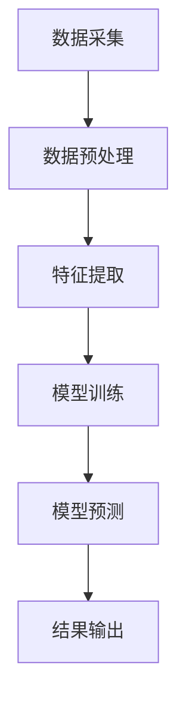
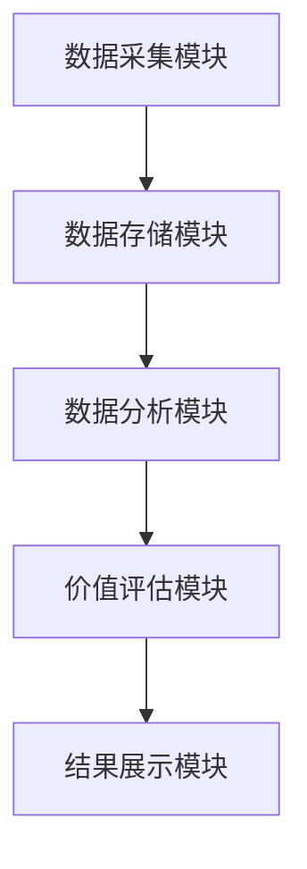

                 


# 价值投资中的智能农业机器人系统分析

> 关键词：智能农业机器人，价值投资，数据分析，机器学习，系统架构

> 摘要：本文深入分析了智能农业机器人系统在价值投资中的应用，探讨了系统的核心功能、算法原理、数学模型以及实际案例。通过详细的技术分析和系统设计，展示了如何利用智能农业机器人数据进行投资决策，为投资者和技术人员提供了有价值的参考。

---

## 第1章: 背景介绍

### 1.1 农业机器人与价值投资的结合

#### 1.1.1 农业机器人技术的发展现状

智能农业机器人技术近年来发展迅速，涵盖了从土壤监测到作物收割的各个环节。这些机器人配备了先进的传感器和自动化控制模块，能够实时采集环境数据，并通过数据分析模块优化农业生产效率。

#### 1.1.2 价值投资在农业领域的应用

价值投资是一种通过分析企业的财务状况、市场前景和竞争优势来评估其投资价值的方法。在农业领域，价值投资可以帮助投资者识别高潜力的农业项目或企业。

#### 1.1.3 两者的结合与发展趋势

将智能农业机器人技术与价值投资结合，可以利用机器人采集的精准数据支持投资决策，提高投资的科学性和准确性。这种结合不仅能够优化农业生产，还能为投资者提供更可靠的投资依据。

### 1.2 智能农业机器人系统的定义与特点

#### 1.2.1 智能农业机器人系统的定义

智能农业机器人系统是一种集成传感器、自动化控制和数据分析技术的智能系统，用于监测和管理农业生产环境，优化作物生长条件。

#### 1.2.2 系统的核心功能与技术特点

- **核心功能**：环境监测、自动化控制、数据采集与分析。
- **技术特点**：高精度传感器、智能决策算法、实时数据处理。

#### 1.2.3 系统的边界与外延

智能农业机器人系统的边界包括硬件设备和软件模块，外延则涵盖农业生产的全过程，从播种到收获。

---

## 第2章: 核心概念与联系

### 2.1 农业机器人系统的核心要素

#### 2.1.1 传感器与数据采集

传感器是智能农业机器人系统的核心部件，用于采集土壤湿度、温度、光照强度等环境数据。

#### 2.1.2 自动化控制模块

自动化控制模块根据传感器数据调整灌溉、施肥等农业生产参数，优化作物生长条件。

#### 2.1.3 数据分析与决策模块

数据分析模块通过对采集数据的分析，生成优化建议，指导农业生产决策。

### 2.2 价值评估模型的构建

#### 2.2.1 数据特征提取与分析

从农业机器人采集的数据中提取关键特征，如产量、成本、市场价格等，为价值评估提供基础。

#### 2.2.2 价值评估的数学模型

构建数学模型，评估农业企业的投资价值。常用的模型包括线性回归和随机森林等。

#### 2.2.3 模型的优化与验证

通过交叉验证和参数调优，优化价值评估模型，提高预测准确性。

---

## 第3章: 算法原理讲解

### 3.1 数据采集与预处理

#### 3.1.1 数据采集流程

通过传感器采集环境数据，存储到数据库中。

#### 3.1.2 数据清洗与特征提取

对数据进行去噪和标准化处理，提取关键特征。

### 3.2 价值评估模型的构建

#### 3.2.1 线性回归模型

线性回归模型用于预测农业企业的收益。

$$ y = \beta_0 + \beta_1x + \epsilon $$

#### 3.2.2 支持向量机（SVM）模型

SVM模型用于分类问题，如判断企业是否具有投资价值。

$$ \text{目标函数} = \sum_{i=1}^{n} \xi_i + C \sum_{i=1}^{n} \xi_i $$

#### 3.2.3 随机森林模型

随机森林模型通过集成学习提高预测准确性。

### 3.3 算法流程图



---

## 第4章: 数学模型与公式

### 4.1 线性回归模型

#### 4.1.1 线性回归公式

$$ y = \beta_0 + \beta_1x + \epsilon $$

#### 4.1.2 案例分析

通过实际案例分析，验证线性回归模型的准确性。

### 4.2 支持向量机模型

#### 4.2.1 SVM数学公式

$$ \text{目标函数} = \sum_{i=1}^{n} \xi_i + C \sum_{i=1}^{n} \xi_i $$

#### 4.2.2 案例分析

通过案例分析，展示SVM模型在价值评估中的应用。

---

## 第5章: 系统分析与架构设计

### 5.1 系统应用场景

#### 5.1.1 农业机器人在种植中的应用

智能农业机器人用于监测和管理作物生长环境。

#### 5.1.2 价值投资在农业中的应用场景

利用农业机器人数据进行投资决策。

### 5.2 系统功能设计

#### 5.2.1 数据采集模块

负责采集环境数据，如土壤湿度、温度等。

#### 5.2.2 数据分析模块

对采集数据进行分析，生成优化建议。

#### 5.2.3 价值评估模块

基于数据分析结果，评估农业企业的投资价值。

### 5.3 系统架构图



---

## 第6章: 项目实战

### 6.1 环境安装与配置

#### 6.1.1 开发环境搭建

安装Python、机器学习库等开发工具。

#### 6.1.2 数据集准备

收集农业机器人采集的数据，如土壤湿度、温度、产量等。

### 6.2 系统核心实现

#### 6.2.1 数据采集代码

```python
import pandas as pd
data = pd.read_csv('agriculture_data.csv')
```

#### 6.2.2 数据分析与建模

使用机器学习算法进行数据分析和建模。

#### 6.2.3 案例分析

通过实际案例分析，展示系统的应用效果。

### 6.3 项目小结

总结项目实施过程中的经验和教训，提出改进建议。

---

## 第7章: 最佳实践与小结

### 7.1 最佳实践 tips

- 数据采集要准确，避免噪声干扰。
- 模型要定期更新，适应新的数据变化。
- 系统要保持稳定，确保数据传输的实时性。

### 7.2 小结

本文详细分析了智能农业机器人系统在价值投资中的应用，通过理论分析和实际案例展示了系统的潜力和优势。

### 7.3 注意事项

在实际应用中，要注意数据隐私和系统安全，确保数据不被滥用。

### 7.4 拓展阅读

推荐阅读相关领域的书籍和论文，深入学习智能农业机器人和价值投资的理论与实践。

---

作者：AI天才研究院 & 禅与计算机程序设计艺术

