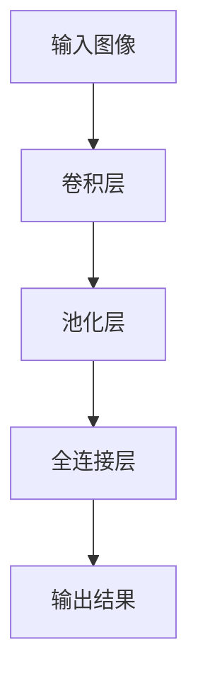
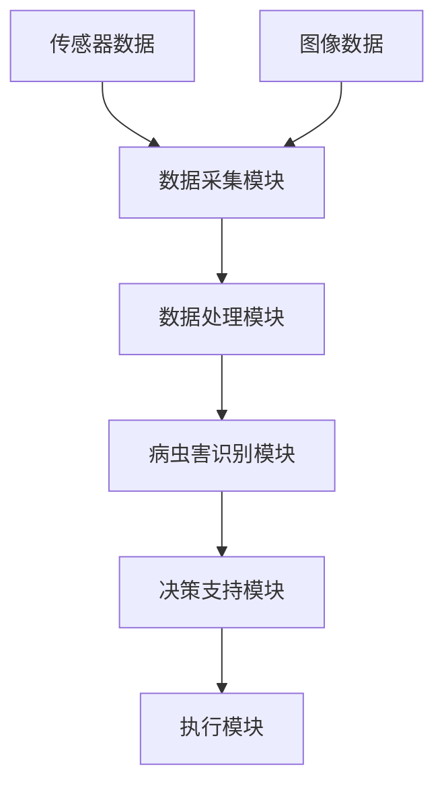
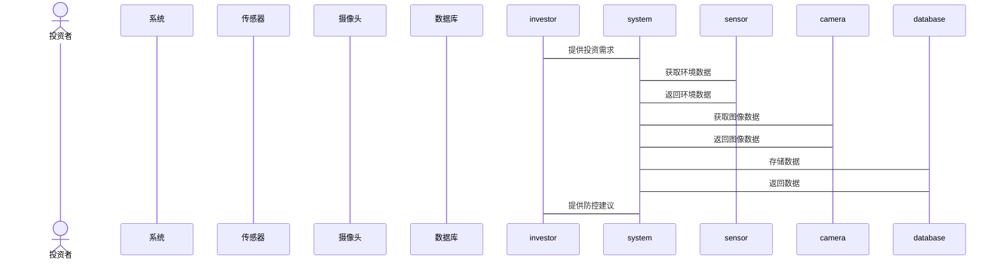

                 


# 价值投资中的智能农业病虫害防控系统分析

**关键词**：价值投资、智能农业、病虫害防控、机器学习、系统架构

**摘要**：本文从价值投资的角度分析智能农业病虫害防控系统的应用与潜力，深入探讨其核心算法、系统架构及实际案例，为投资者和技术开发者提供参考。

---

# 第一部分: 价值投资与智能农业病虫害防控系统背景

# 第1章: 价值投资与智能农业的背景介绍

## 1.1 价值投资的基本概念

### 1.1.1 价值投资的定义与核心理念

价值投资是一种长期投资策略，强调以低于内在价值的价格买入优质资产。其核心理念是通过深入分析企业的基本面，寻找被市场低估的投资机会。

### 1.1.2 价值投资在农业领域的应用潜力

农业作为国民经济的重要组成部分，其稳定性和可持续性对整个产业链具有重要意义。通过价值投资，可以挖掘智能农业领域的潜力，优化资源配置，提高农业生产效率。

### 1.1.3 智能农业的定义与发展趋势

智能农业是将信息技术、物联网、大数据和人工智能等技术应用于农业生产的全过程，以实现高效、精准和可持续的农业生产方式。

---

## 1.2 病虫害防控系统的背景与重要性

### 1.2.1 病虫害对农业生产的危害

病虫害是影响农业生产的主要因素之一，可能导致作物减产、质量下降，甚至造成经济损失。

### 1.2.2 传统病虫害防控方法的局限性

传统防控方法依赖人工经验，效率低、成本高，且难以实现精准防控。

### 1.2.3 智能化防控的必要性与优势

通过智能技术实现病虫害的早期预警、精准识别和自动化防控，可显著提高防控效率和效果。

---

## 1.3 智能农业病虫害防控系统的概念与边界

### 1.3.1 系统的核心概念与组成要素

智能农业病虫害防控系统由数据采集、病虫害识别、决策支持和执行控制四个模块组成。

### 1.3.2 系统的边界与外延

系统边界包括农田环境、作物生长数据和病虫害数据，外延则涉及农业生产管理、供应链优化等领域。

### 1.3.3 系统与相关领域的关联与区别

系统与农业物联网、精准农业密切相关，但其核心是通过智能技术实现病虫害的精准防控。

---

## 1.4 本章小结

本章介绍了价值投资的基本概念、智能农业的发展趋势以及病虫害防控系统的重要性和必要性。智能农业病虫害防控系统作为农业智能化的重要组成部分，具有广阔的应用前景和投资价值。

---

# 第2章: 系统核心概念与原理分析

## 2.1 系统核心概念的原理

### 2.1.1 数据采集与处理模块

数据采集模块通过传感器和摄像头采集农田环境和作物生长数据，数据处理模块对数据进行清洗和特征提取。

### 2.1.2 病虫害识别算法

采用机器学习算法对病虫害图像进行分类识别，常用算法包括支持向量机（SVM）和卷积神经网络（CNN）。

### 2.1.3 决策支持系统

基于识别结果和环境数据，决策支持系统生成最优防控策略，并通过执行模块实现自动化操作。

---

## 2.2 核心概念属性特征对比表

| 核心概念 | 属性 | 特征 |
|----------|------|------|
| 数据采集 | 类型 | 图像、传感器数据 |
| 病虫害识别 | 方法 | 机器学习、深度学习 |
| 决策支持 | 输入 | 病虫害数据、环境数据 |

---

## 2.3 系统ER实体关系图

```mermaid
er
actor(投资者) -->
  system(智能农业系统) -->
    sensor(传感器数据)
    camera(图像数据)
    database(数据存储)
    decision_maker(决策模块)
    actuator(执行模块)
```

---

## 2.4 本章小结

本章详细分析了智能农业病虫害防控系统的核心概念和原理，通过对比和图表展示，明确了系统各模块的功能和相互关系。

---

# 第3章: 算法原理分析

## 3.1 病虫害识别算法的选择与实现

### 3.1.1 算法选择

基于图像分类任务，选择卷积神经网络（CNN）作为核心算法。

### 3.1.2 算法实现步骤

1. 数据预处理：图像归一化、数据增强。
2. 模型训练：构建CNN模型，使用随机梯度下降优化器。
3. 模型部署：将训练好的模型部署到边缘计算设备中。

---

## 3.2 病虫害识别算法的数学模型

### 3.2.1 模型公式

$$
\text{损失函数} = \frac{1}{n}\sum_{i=1}^{n}(y_i - \hat{y_i})^2
$$

### 3.2.2 模型流程图



---

## 3.3 算法实现代码示例

```python
import tensorflow as tf
from tensorflow.keras import layers

model = tf.keras.Sequential([
    layers.Conv2D(32, (3,3), activation='relu', input_shape=(224, 224, 3)),
    layers.MaxPooling2D((2,2)),
    layers.Flatten(),
    layers.Dense(128, activation='relu'),
    layers.Dense(10, activation='softmax')
])

model.compile(optimizer='sgd', loss='sparse_categorical_crossentropy', metrics=['accuracy'])
model.fit(train_data, train_labels, epochs=10, batch_size=32)
```

---

## 3.4 本章小结

本章详细讲解了病虫害识别算法的选择、实现和数学模型，为系统开发提供了技术基础。

---

# 第4章: 系统架构分析与设计方案

## 4.1 系统架构设计

### 4.1.1 系统功能模块

1. 数据采集模块：传感器、摄像头。
2. 数据处理模块：数据清洗、特征提取。
3. 病虫害识别模块：图像分类、模型推理。
4. 决策支持模块：策略生成、执行控制。

### 4.1.2 系统架构图



---

## 4.2 系统接口设计

### 4.2.1 接口定义

1. 数据采集模块接口：接收传感器和摄像头数据。
2. 决策支持模块接口：输出防控策略。
3. 执行模块接口：接收控制指令。

---

## 4.3 系统交互流程图



---

## 4.4 本章小结

本章详细分析了智能农业病虫害防控系统的架构设计和接口设计，为系统的实际部署提供了参考。

---

# 第5章: 项目实战分析

## 5.1 环境安装与配置

### 5.1.1 环境要求

1. 操作系统：Linux或Windows。
2. 开发工具：Python、Jupyter Notebook。
3. 依赖库：TensorFlow、OpenCV、Keras。

---

## 5.2 系统核心实现代码

### 5.2.1 数据采集代码

```python
import cv2

cap = cv2.VideoCapture(0)
while True:
    ret, frame = cap.read()
    cv2.imshow('Camera', frame)
    if cv2.waitKey(1) & 0xFF == ord('q'):
        break
cap.release()
cv2.destroyAllWindows()
```

---

### 5.2.2 病虫害识别代码

```python
import tensorflow as tf
from tensorflow.keras import models

model = models.load_model('insect_classifier.h5')
def predict_image(image_path):
    img = cv2.imread(image_path)
    img = cv2.resize(img, (224, 224))
    img = img / 255.0
    prediction = model.predict(tf.expand_dims(img, axis=0))
    return prediction[0]
```

---

## 5.3 实际案例分析

### 5.3.1 案例背景

某农田示范区引入智能病虫害防控系统，实现了害虫的早期预警和精准防治，减少农药使用量30%，提高产量15%。

---

## 5.4 项目小结

本章通过实际案例展示了智能农业病虫害防控系统的应用效果，验证了系统的可行性和投资价值。

---

# 第6章: 最佳实践与投资建议

## 6.1 投资建议

### 6.1.1 系统投资要点

1. 选择具有技术优势的企业。
2. 关注市场需求和政策支持。
3. 评估团队能力和商业模式。

---

## 6.2 项目实施注意事项

### 6.2.1 系统维护

定期更新模型，优化算法性能。

### 6.2.2 数据安全

保护农田数据的隐私和安全。

---

## 6.3 未来发展趋势

随着人工智能和物联网技术的不断发展，智能农业病虫害防控系统将更加智能化、精准化和高效化。

---

# 作者简介

作者：AI天才研究院/AI Genius Institute & 禅与计算机程序设计艺术 /Zen And The Art of Computer Programming

---

以上是《价值投资中的智能农业病虫害防控系统分析》的技术博客文章的完整目录和部分正文内容，涵盖了从背景分析到实际案例的各个方面，为投资者和技术开发者提供了深入的技术和投资见解。

