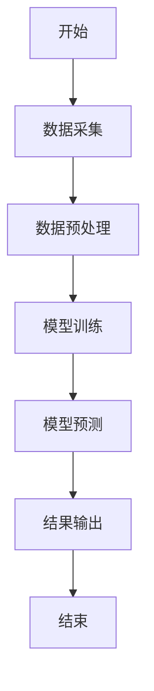
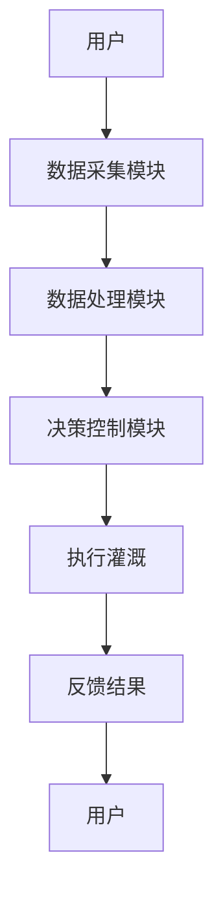

                 


# 价值投资中的智能农业精准灌溉系统分析

> 关键词：价值投资、智能农业、精准灌溉系统、机器学习、算法优化、农业投资分析

> 摘要：本文结合价值投资与智能农业中的精准灌溉系统，分析其技术原理和投资价值。通过系统设计、算法优化和案例分析，探讨如何通过智能灌溉系统实现农业投资的高效决策，并展示其在实际中的应用场景和效果。

---

# 第一部分: 价值投资与智能农业精准灌溉系统背景

## 第1章: 价值投资与智能农业精准灌溉系统概述

### 1.1 价值投资的基本概念
#### 1.1.1 价值投资的定义
价值投资是一种投资策略，强调以低于内在价值的价格购买优质资产。其核心在于识别市场低估的公司，长期持有以实现收益。

#### 1.1.2 价值投资的核心原则
- **安全边际**：购买价格低于内在价值，以降低风险。
- **长期视角**：关注公司的长期盈利能力，而非短期波动。
- **基本面分析**：通过财务指标评估公司价值。

#### 1.1.3 价值投资在农业领域的应用
农业投资涉及土地、设备和农作物等资产，价值投资可帮助识别低估的农业项目，优化资源配置。

### 1.2 智能农业与精准灌溉系统
#### 1.2.1 智能农业的定义
智能农业利用信息技术、物联网和大数据优化农业生产，提高效率和可持续性。

#### 1.2.2 精准灌溉系统的概念
精准灌溉通过传感器和自动化控制，根据土壤湿度、天气数据等信息，精确调节灌溉量。

#### 1.2.3 精准灌溉系统在农业中的作用
- 提高水资源利用效率。
- 优化作物生长环境，提升产量和质量。
- 减少能源和时间消耗，降低成本。

### 1.3 价值投资与精准灌溉系统的结合
#### 1.3.1 农业精准灌溉系统的投资价值
精准灌溉系统可提高农业生产力，降低运营成本，具备较高的投资回报潜力。

#### 1.3.2 价值投资在精准灌溉系统中的应用
通过分析技术成熟度、市场前景和财务指标，识别具有投资价值的精准灌溉项目。

#### 1.3.3 价值投资与精准灌溉系统的未来趋势
随着技术进步，精准灌溉系统将更加智能化，价值投资在农业技术中的应用将更加广泛。

---

# 第二部分: 精准灌溉系统的核心技术与算法

## 第2章: 精准灌溉系统的数学模型与算法

### 2.1 精准灌溉系统的数学模型
#### 2.1.1 灌溉水量计算模型
模型基于土壤湿度、蒸发量和作物需水量计算灌溉量。

#### 2.1.2 土壤湿度预测模型
使用时间序列模型预测土壤湿度变化，优化灌溉计划。

#### 2.1.3 农作物生长模型
模型模拟作物生长过程，预测产量和水分需求。

### 2.2 算法原理
#### 2.2.1 基于机器学习的灌溉算法
算法通过历史数据训练，预测最佳灌溉时间。

#### 2.2.2 时间序列分析算法
用于预测土壤湿度和气象数据，优化灌溉决策。

#### 2.2.3 灰色系统理论在灌溉中的应用
灰度模型用于处理不确定因素，提高灌溉决策的准确性。

### 2.3 算法实现
#### 2.3.1 算法流程图（Mermaid）


#### 2.3.2 数据采集与预处理
收集土壤湿度、气象数据等信息，清理和标准化数据。

#### 2.3.3 模型训练代码
```python
# 示例代码：训练机器学习模型
from sklearn.linear_model import LinearRegression
import numpy as np

# 假设X为输入特征，y为目标变量
model = LinearRegression()
model.fit(X, y)
```

### 2.4 算法代码实现
#### 2.4.1 数据采集与预处理
使用传感器获取实时数据，进行数据清洗和特征提取。

#### 2.4.2 模型训练代码
训练机器学习模型，如随机森林或神经网络。

#### 2.4.3 模型预测与结果分析
评估模型性能，优化灌溉策略。

---

# 第三部分: 系统架构与设计

## 第3章: 精准灌溉系统的系统架构

### 3.1 系统功能模块
#### 3.1.1 数据采集模块
负责收集土壤湿度、气象数据等。

#### 3.1.2 数据处理模块
处理和分析数据，生成灌溉建议。

#### 3.1.3 决策控制模块
根据分析结果，控制灌溉设备。

#### 3.1.4 用户交互模块
提供用户界面，展示数据和控制设备。

### 3.2 系统架构设计
#### 3.2.1 分层架构设计
将系统分为数据层、业务逻辑层和 presentation 层，便于维护和扩展。

#### 3.2.2 微服务架构设计
采用微服务架构，提高系统的灵活性和可扩展性。

#### 3.2.3 系统交互流程设计
描述用户与系统之间的交互流程。

### 3.3 系统接口设计
#### 3.3.1 数据采集接口
定义传感器数据的接口协议。

#### 3.3.2 控制指令接口
定义控制灌溉设备的指令格式。

#### 3.3.3 用户界面接口
定义用户与系统交互的界面元素。

### 3.4 系统交互流程图（Mermaid）


---

# 第四部分: 项目实战

## 第4章: 精准灌溉系统的项目实战

### 4.1 项目背景介绍
描述项目目标、实施地点和主要技术。

### 4.2 系统核心实现
详细描述系统设计、功能实现和算法优化。

### 4.3 代码实现与解读
展示关键代码片段，解释其功能。

### 4.4 实际案例分析
分析一个实际案例，展示系统的效果和投资回报。

### 4.5 项目小结
总结项目成果，指出不足和改进方向。

---

# 第五部分: 案例分析与总结

## 第5章: 案例分析与总结

### 5.1 投资分析与收益评估
分析精准灌溉系统的投资成本、收益和回报周期。

### 5.2 项目实施中的挑战与解决方案
总结实施过程中遇到的困难及其解决方案。

### 5.3 未来展望
探讨精准灌溉系统的发展方向和技术进步。

---

# 作者信息

作者：AI天才研究院/AI Genius Institute & 禅与计算机程序设计艺术 /Zen And The Art of Computer Programming

---

以上是文章的完整目录和内容概要。每部分内容将详细展开，确保技术深度和逻辑清晰，帮助读者全面理解价值投资与智能农业精准灌溉系统的结合及其技术实现。

