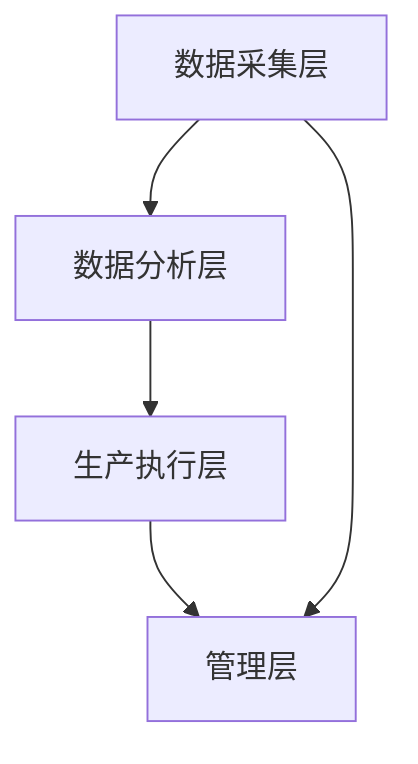
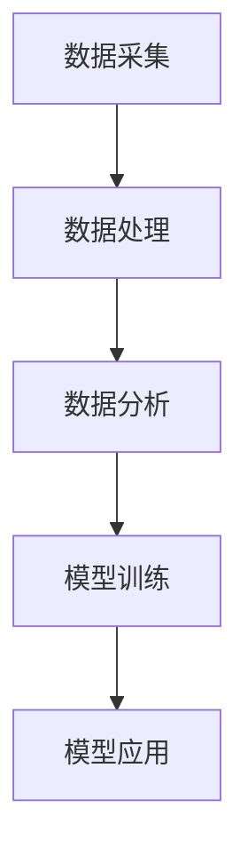
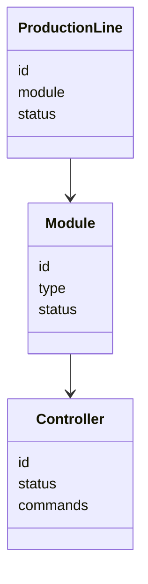
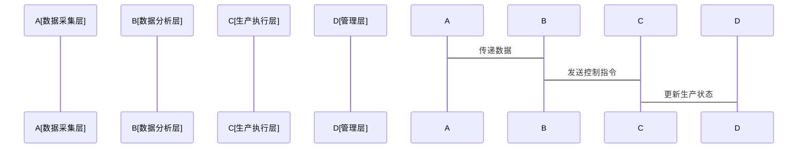

                 


# 价值投资中的智能制造柔性生产线分析

## 关键词：
智能制造、柔性生产线、价值投资、算法原理、系统架构、项目实战

## 摘要：
智能制造柔性生产线是现代制造业的重要组成部分，其灵活性、高效性和智能化特性为价值投资提供了新的机遇。本文从智能制造与柔性生产线的定义与特点入手，结合价值投资的视角，详细分析了智能制造柔性生产线的核心概念、算法原理、系统架构及项目实战。通过实际案例分析，揭示了智能制造柔性生产线在投资中的潜力与挑战，并提出了相应的投资策略与建议。

---

# 第1章: 智能制造与柔性生产线概述

## 1.1 智能制造的定义与特点
### 1.1.1 智能制造的定义
智能制造是一种基于信息技术和自动化技术的先进制造模式，通过物联网、大数据、人工智能等技术实现生产过程的智能化、自动化和优化。

### 1.1.2 智能制造的核心特点
1. **自动化**：生产过程高度自动化，减少人工干预。
2. **数字化**：生产数据实时采集、传输和分析。
3. **智能化**：通过人工智能技术优化生产流程。
4. **灵活性**：能够快速适应市场变化和客户需求。

### 1.1.3 智能制造与传统制造的区别
| 特性         | 智能制造                     | 传统制造                     |
|--------------|------------------------------|------------------------------|
| 技术基础     | 物联网、大数据、人工智能     | 机械化、电气化               |
| 生产效率     | 高                          | 较低                        |
| 灵活性        | 高                          | 低                          |
| 数据处理     | 实时数据采集与分析          | 事后记录与分析              |

## 1.2 柔性生产线的定义与特点
### 1.2.1 柔性生产线的定义
柔性生产线是指能够在同一生产线上快速切换生产不同产品或规格的生产线，具有高度的适应性和灵活性。

### 1.2.2 柔性生产线的核心特点
1. **模块化设计**：生产线由多个模块组成，模块之间可以灵活组合。
2. **快速切换**：生产线可以在短时间内切换生产不同产品。
3. **定制化生产**：能够满足小批量、多样化的生产需求。
4. **高效资源配置**：资源利用效率高，减少浪费。

### 1.2.3 柔性生产线与传统生产线的区别
| 特性         | 柔性生产线                     | 传统生产线                     |
|--------------|--------------------------------|--------------------------------|
| 生产效率     | 高                          | 较低                        |
| 灵活性        | 高                          | 低                          |
| 切换时间     | 短                          | 长                          |
| 适应性        | 强                          | 弱                          |

## 1.3 智能制造柔性生产线的结合
### 1.3.1 智能制造与柔性生产的融合
智能制造柔性生产线结合了智能制造的先进技术与柔性生产线的灵活性，能够实现高效、灵活、智能的生产模式。

### 1.3.2 柔性生产线在智能制造中的作用
1. 提高生产效率。
2. 降低成本。
3. 快速响应市场需求。
4. 优化资源配置。

### 1.3.3 柔性生产线的优势与挑战
优势：
- 灵活性强，适应市场变化。
- 生产效率高，成本低。
- 能够满足多样化的客户需求。

挑战：
- 技术要求高。
- 初始投资大。
- 维护成本高。

## 1.4 价值投资中的智能制造分析
### 1.4.1 价值投资的基本概念
价值投资是一种投资策略，通过分析企业的内在价值，寻找被市场低估的投资标的。

### 1.4.2 智能制造行业的投资价值
智能制造行业是未来制造业发展的趋势，具有广阔的市场前景和较高的投资价值。

### 1.4.3 柔性生产线对投资的影响
柔性生产线的引入能够提高企业的生产效率和灵活性，增强企业的竞争力，从而提升企业的内在价值，为投资者带来更高的回报。

## 1.5 本章小结
本章介绍了智能制造和柔性生产线的基本概念、特点及两者的结合，分析了智能制造柔性生产线在价值投资中的潜力和重要性。

---

# 第2章: 智能制造柔性生产线的核心概念

## 2.1 智能制造柔性生产线的系统架构
### 2.1.1 系统架构的定义
智能制造柔性生产线的系统架构是一个多层次的结构，包括数据采集层、数据分析层、生产执行层和管理层。

### 2.1.2 柔性生产线的系统架构图（Mermaid）


## 2.2 柔性生产线的关键技术
### 2.2.1 自动化技术
自动化技术是柔性生产线的核心技术之一，包括机器人技术、自动化控制系统等。

### 2.2.2 数字化技术
数字化技术包括物联网技术、大数据技术等，用于实时采集和分析生产数据。

### 2.2.3 智能化技术
智能化技术包括人工智能技术，用于优化生产流程和预测生产问题。

## 2.3 柔性生产线的实体关系图（ER图）
### 2.3.1 实体关系图的定义
实体关系图（ER图）用于描述系统中各实体之间的关系。

### 2.3.2 柔性生产线的ER图（Mermaid）
```mermaid
erd
    customer
    supplier
    product
    order
    production_line
    --关系--
    customer -- 订单: order
    supplier -- 提供: product
    product -- 生产: production_line
    order -- 下达: production_line
```

## 2.4 柔性生产线的核心要素对比表
| 核心要素     | 特性                   |
|--------------|------------------------|
| 模块化设计   | 灵活性高               |
| 快速切换     | 时间短                 |
| 定制化生产     | 多样化                 |
| 高效资源配置   | 成本低                 |

## 2.5 本章小结
本章详细分析了智能制造柔性生产线的核心概念，包括系统架构、关键技术、实体关系图和核心要素对比。

---

# 第3章: 智能制造柔性生产线的算法原理

## 3.1 数据采集与处理
### 3.1.1 数据采集方法
数据采集方法包括传感器数据采集、生产记录采集等。

### 3.1.2 数据处理流程
数据处理流程包括数据清洗、数据转换和数据存储。

### 3.1.3 数据清洗与预处理
数据清洗是去除噪声数据和异常数据，确保数据的准确性和完整性。

## 3.2 数据分析与建模
### 3.2.1 数据分析方法
数据分析方法包括统计分析、机器学习等。

### 3.2.2 数据建模流程
数据建模流程包括数据预处理、特征提取、模型训练和模型评估。

### 3.2.3 机器学习算法在柔性生产线中的应用
机器学习算法可以用于预测生产故障、优化生产参数等。

## 3.3 算法流程图（Mermaid）


## 3.4 算法实现代码
### 3.4.1 环境安装
需要安装Python和相关机器学习库，如scikit-learn。

### 3.4.2 核心代码
```python
import numpy as np
from sklearn.linear_model import LinearRegression

# 示例数据
X = np.array([[1], [2], [3], [4], [5]])
y = np.array([2, 4, 5, 4, 6])

# 模型训练
model = LinearRegression()
model.fit(X, y)

# 预测
print(model.predict([[6]]))
```

### 3.4.3 算法数学模型
线性回归模型的数学表达式为：
$$ y = \beta_0 + \beta_1 x + \epsilon $$

其中：
- $y$ 是目标变量
- $x$ 是自变量
- $\beta_0$ 和 $\beta_1$ 是模型参数
- $\epsilon$ 是误差项

## 3.5 本章小结
本章详细讲解了智能制造柔性生产线的算法原理，包括数据采集与处理、数据分析与建模以及机器学习算法的应用。

---

# 第4章: 系统分析与架构设计方案

## 4.1 问题场景介绍
智能制造柔性生产线的系统架构设计需要考虑生产过程的灵活性和高效性。

## 4.2 系统功能设计
### 4.2.1 领域模型（Mermaid类图）


### 4.2.2 系统架构设计（Mermaid架构图）


## 4.3 系统接口设计
系统接口设计包括数据接口、控制接口和人机交互接口。

## 4.4 系统交互设计（Mermaid序列图）


## 4.5 本章小结
本章详细分析了智能制造柔性生产线的系统架构设计，包括功能设计、架构设计和接口设计。

---

# 第5章: 项目实战

## 5.1 环境安装
需要安装Python、数据库和相关开发工具。

## 5.2 系统核心实现源代码
### 5.2.1 数据采集代码
```python
import serial

# 串口通信配置
ser = serial.Serial('COM1', 9600)
ser.write(b'command')
```

### 5.2.2 数据分析代码
```python
import pandas as pd

# 数据分析
data = pd.read_csv('data.csv')
result = data.groupby('module').mean()
print(result)
```

### 5.2.3 系统交互代码
```python
import socket

# 服务器端
server = socket.socket(socket.AF_INET, socket.SOCK_STREAM)
server.bind(('localhost', 8080))
server.listen(5)

while True:
    client, addr = server.accept()
    data = client.recv(1024)
    print(data.decode())
```

## 5.3 代码应用解读与分析
通过对代码的解读与分析，可以看出数据采集、数据分析和系统交互的具体实现方式。

## 5.4 实际案例分析
以某公司柔性生产线为例，分析其生产效率、成本和市场响应能力。

## 5.5 本章小结
本章通过实际案例分析，详细讲解了智能制造柔性生产线的项目实战，包括环境安装、代码实现和案例分析。

---

# 第6章: 总结与展望

## 6.1 总结
智能制造柔性生产线是未来制造业的重要发展方向，具有广阔的投资价值。

## 6.2 未来展望
随着人工智能和大数据技术的不断发展，智能制造柔性生产线将更加智能化和高效化。

## 6.3 投资建议
投资者应关注具有技术创新能力和市场竞争力的智能制造企业。

## 6.4 最佳实践 tips
1. 关注企业的技术创新能力。
2. 重视企业的成本控制能力。
3. 考虑市场的供需关系。

## 6.5 本章小结
本章总结了全文内容，并对未来的发展方向提出了展望和建议。

---

# 作者：AI天才研究院/AI Genius Institute & 禅与计算机程序设计艺术 /Zen And The Art of Computer Programming

