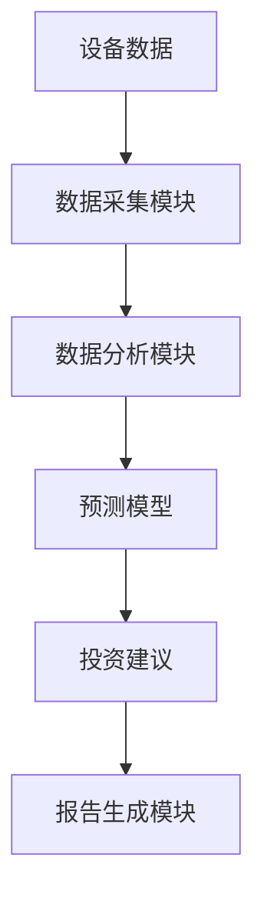

                 


# 价值投资中的智能制造预测性维护分析

## 关键词：智能制造、预测性维护、价值投资、数据分析、机器学习

## 摘要：本文探讨了智能制造中的预测性维护技术及其在价值投资中的应用。通过分析预测性维护的数学模型、算法实现和系统架构设计，结合实际案例，展示了如何利用预测性维护数据优化投资决策，提升投资回报率。本文旨在为投资者和相关技术从业者提供深入的技术和投资策略见解。

---

# 第1章：智能制造与预测性维护概述

## 1.1 智能制造的基本概念

### 1.1.1 智能制造的定义与特点
智能制造是一种基于数字化技术的制造模式，通过物联网（IoT）、大数据、人工智能（AI）和自动化技术实现生产过程的智能化和高效化。其特点包括：
- **数据驱动**：利用传感器和物联网设备实时采集生产数据。
- **自动化**：通过自动化系统减少人工干预，提高生产效率。
- **预测性维护**：基于数据分析预测设备故障，减少停机时间。
- **灵活性**：能够快速调整生产计划以适应市场需求变化。

### 1.1.2 预测性维护在智能制造中的作用
预测性维护是智能制造的核心技术之一，通过实时监测设备状态，利用数据分析预测设备故障，从而实现预防性维护，减少设备停机时间，降低维护成本。

## 1.2 价值投资的基本概念

### 1.2.1 价值投资的定义与核心理念
价值投资是一种投资策略，旨在通过分析企业的基本面（如财务状况、行业地位、竞争优势等）找到被市场低估的投资标的，长期持有以实现超额收益。其核心理念是寻找“烟蒂股”，即具有内在价值但被市场忽视的企业。

### 1.2.2 制造业中的价值投资机会
制造业作为实体经济的重要组成部分，具有较高的投资价值。通过分析制造业企业的生产效率、成本控制、技术创新能力等因素，可以发现具有投资潜力的企业。

## 1.3 预测性维护与价值投资的结合

### 1.3.1 预测性维护如何影响投资决策
预测性维护可以帮助投资者评估企业的生产效率和设备维护能力，从而判断企业的盈利能力和成长潜力。

### 1.3.2 制造业效率提升与投资回报的关系
通过预测性维护优化设备维护计划，可以降低设备停机时间，提高生产效率，从而提升企业的盈利能力和市场竞争力，为投资者带来更高的投资回报。

---

# 第2章：预测性维护的数学模型

## 2.1 预测性维护的核心原理

### 2.1.1 基于统计分析的模型
统计分析模型是预测性维护的基础，常用的方法包括回归分析、时间序列分析等。

#### 回归分析
回归分析是一种统计方法，用于研究变量之间的关系。在预测性维护中，回归分析可以用于预测设备故障时间。例如，可以通过设备的运行时间、温度、振动等参数建立线性回归模型，预测设备故障的概率。

#### 时间序列分析
时间序列分析是一种用于分析数据随时间变化的模式的方法。在预测性维护中，时间序列分析可以用于预测设备的运行状态，发现设备性能的下降趋势。

### 2.1.2 基于机器学习的模型
机器学习模型是预测性维护的高级方法，常用的方法包括支持向量机（SVM）、随机森林、神经网络等。

#### 支持向量机（SVM）
支持向量机是一种监督学习算法，适用于分类和回归问题。在预测性维护中，SVM 可以用于设备状态分类，预测设备是否会出现故障。

#### 随机森林
随机森林是一种基于决策树的集成学习算法，具有高准确性和鲁棒性。在预测性维护中，随机森林可以用于设备故障预测和分类。

#### 神经网络
神经网络是一种模仿人脑结构和功能的算法，适用于复杂非线性关系的建模。在预测性维护中，神经网络可以用于设备状态监测和故障预测。

## 2.2 预测性维护的数学模型与公式

### 2.2.1 线性回归模型
线性回归模型用于预测设备故障时间，公式为：
$$ y = \beta_0 + \beta_1x + \epsilon $$
其中，\( y \) 是预测的设备故障时间，\( x \) 是设备运行时间，\( \beta_0 \) 和 \( \beta_1 \) 是回归系数，\( \epsilon \) 是误差项。

### 2.2.2 时间序列模型
时间序列模型用于预测设备状态的变化，常用的模型是ARIMA（自回归积分滑动平均模型）。ARIMA 模型的结构如下：
$$ \phi(B)(1 - B)d(X_t) = \theta(B)Z_t $$
其中，\( \phi(B) \) 是自回归多项式，\( d(X_t) \) 是数据的差分，\( \theta(B) \) 是滑动平均多项式，\( Z_t \) 是白噪声。

---

# 第3章：价值投资中的数据分析与机器学习算法

## 3.1 数据驱动决策的核心要素

### 3.1.1 数据的收集与处理
在价值投资中，数据的收集与处理是关键。需要收集企业的财务数据、行业数据、市场数据等，通过清洗、转换和特征提取，为后续分析提供高质量的数据。

### 3.1.2 数据分析与可视化
通过数据分析和可视化，可以发现数据中的规律和趋势，帮助投资者做出更明智的决策。常用的工具包括Python的pandas、matplotlib和seaborn等。

## 3.2 价值投资中的关键指标

### 3.2.1 投资回报率（ROI）
投资回报率是衡量投资项目收益的重要指标，公式为：
$$ ROI = \frac{\text{净利润}}{\text{投资成本}} \times 100\% $$

### 3.2.2 风险评估与投资组合优化
风险评估是价值投资的重要组成部分，常用的指标包括标准差、VaR（在险价值）和CVaR（条件在险价值）。投资组合优化的目标是通过合理配置资产，降低风险，提高收益。

---

# 第4章：系统架构设计与实现

## 4.1 系统功能模块划分

### 4.1.1 数据采集模块
数据采集模块负责采集设备的运行数据，包括温度、振动、压力等参数。常用的数据采集工具包括传感器节点和物联网平台。

### 4.1.2 数据分析模块
数据分析模块负责对采集的数据进行处理和分析，包括数据清洗、特征提取和模型训练。常用的工具包括Python的scikit-learn和TensorFlow。

### 4.1.3 报告生成模块
报告生成模块负责生成分析报告，包括设备状态、故障预测和投资建议等。报告可以以文本、图表或仪表盘的形式呈现。

## 4.2 系统架构图



---

# 第5章：项目实战与案例分析

## 5.1 项目背景与目标
本项目旨在通过预测性维护技术优化企业的设备维护计划，降低设备停机时间，提高生产效率，从而提升企业的投资价值。

## 5.2 环境搭建与代码实现

### 5.2.1 环境安装
需要安装的工具包括Python、Jupyter Notebook、scikit-learn、TensorFlow等。

### 5.2.2 核心代码实现

```python
# 数据预处理
import pandas as pd
import numpy as np
from sklearn.model_selection import train_test_split
from sklearn.linear_model import LinearRegression

# 加载数据
data = pd.read_csv('equipment_data.csv')
X = data[['运行时间', '温度', '振动']]
y = data['故障时间']

# 数据分割
X_train, X_test, y_train, y_test = train_test_split(X, y, test_size=0.2, random_state=42)

# 模型训练
model = LinearRegression()
model.fit(X_train, y_train)

# 模型评估
score = model.score(X_test, y_test)
print(f'模型得分：{score}')
```

### 5.2.3 案例分析
通过实际案例分析，展示如何利用预测性维护技术优化设备维护计划，降低设备停机时间，提高企业的投资价值。

---

# 第6章：总结与展望

## 6.1 本文总结
本文探讨了智能制造中的预测性维护技术及其在价值投资中的应用。通过分析预测性维护的数学模型、算法实现和系统架构设计，展示了如何利用预测性维护数据优化投资决策，提升投资回报率。

## 6.2 未来展望
未来，随着人工智能和大数据技术的不断发展，预测性维护在智能制造中的应用将更加广泛。投资者可以通过更先进的算法和工具，进一步优化投资决策，实现更高的投资回报。

---

# 作者：AI天才研究院 & 禅与计算机程序设计艺术

---

**注**：本文内容涉及的技术细节和案例分析，旨在为读者提供理论和实践指导。实际投资需结合市场情况和企业具体情况，谨慎决策。

