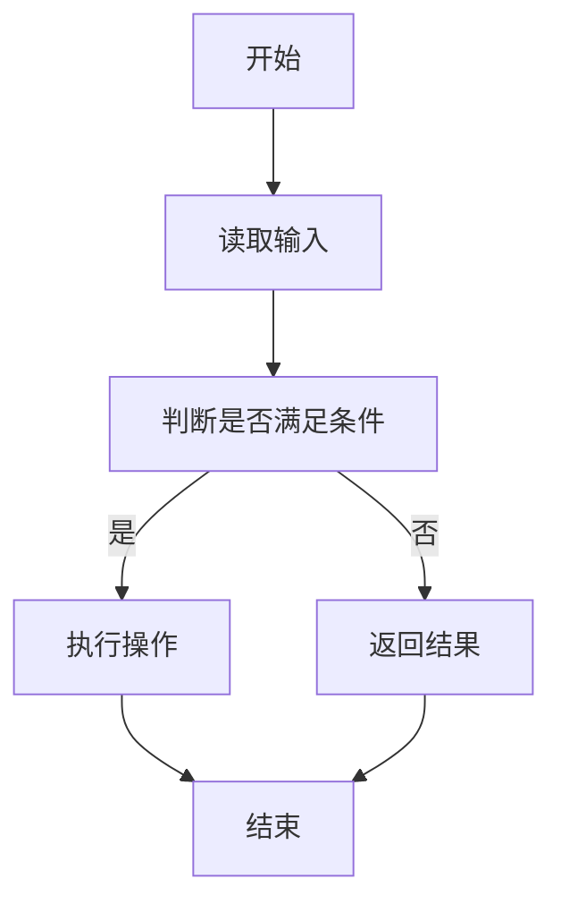
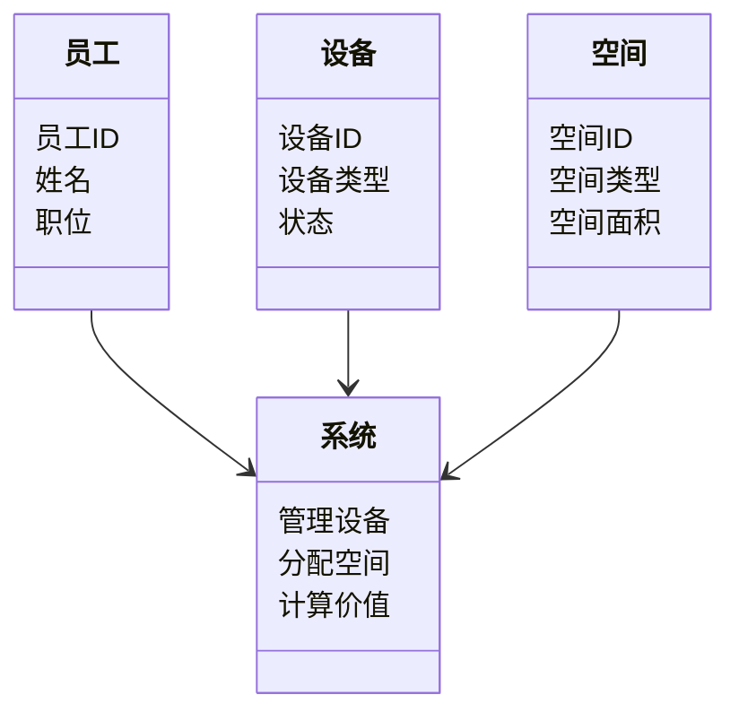
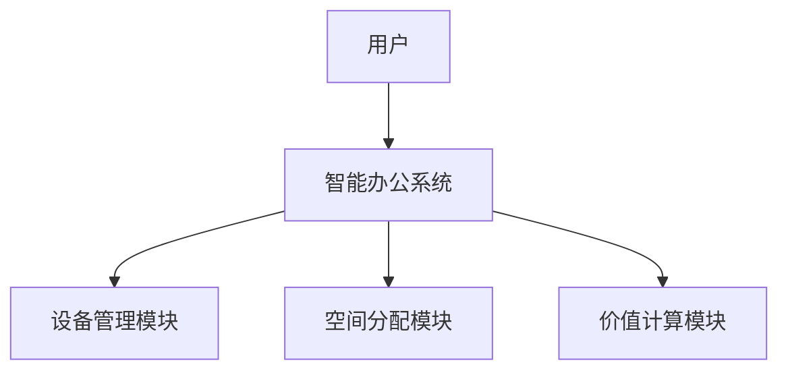

                 


# 价值投资中的智能办公空间技术趋势

> 关键词：价值投资，智能办公空间，技术趋势，办公效率，空间设计，投资策略

> 摘要：随着技术的不断进步，智能办公空间正在成为价值投资的新热点。本文将从技术趋势的角度，分析智能办公空间的核心概念、算法原理、系统架构、项目实战以及最佳实践，揭示智能办公空间如何通过技术创新提升办公效率，为企业创造更大的价值。

---

# 1. 引言

## 1.1 引言概述
智能办公空间是近年来技术与办公结合的产物，它通过智能化的设备和系统，优化了办公环境，提升了工作效率。价值投资者需要关注这一领域的技术趋势，以找到投资机会。

## 1.2 研究意义与目标
本文旨在探讨智能办公空间的技术趋势，分析其对价值投资的影响，为企业和投资者提供参考。

---

# 2. 背景介绍

## 2.1 价值投资的定义与特点
价值投资是通过分析企业的内在价值，寻找被市场低估的投资标的。其核心在于长期稳定的投资回报。

## 2.2 智能办公空间的技术基础
智能办公空间依赖于物联网、人工智能、大数据等技术，实现办公环境的智能化管理。

## 2.3 与传统办公空间的对比
智能办公空间通过自动化和智能化手段，显著提高了办公效率，降低了运营成本。

## 2.4 智能办公空间在价值投资中的应用
智能办公空间的技术创新为企业带来了更高的效率和更低的成本，使其成为价值投资者关注的焦点。

---

# 3. 核心概念与联系

## 3.1 核心概念原理
智能办公空间通过整合多种技术，实现办公环境的智能化管理。

## 3.2 核心概念对比表格
| 特性       | 传统办公空间 | 智能办公空间 |
|------------|--------------|--------------|
| 管理方式     | 人工管理       | 自动化管理     |
| 成本         | 高           | 低           |
| 效率         | 低           | 高           |

## 3.3 ER图（用Mermaid表示）
```mermaid
er
    %%{init: { '_theme': 'none' }}
    rectangle 1 {
        title 员工
        field 员工ID (主键)
        field 姓名
        field 职位
    }
    rectangle 2 {
        title 设备
        field 设备ID (主键)
        field 设备类型
        field 状态
    }
    rectangle 3 {
        title 办公空间
        field 空间ID (主键)
        field 空间类型
        field 空间面积
    }
    diamond 4 { 员工-设备关联 }
    diamond 5 { 设备-空间关联 }

    员工 --> 员工-设备关联 --> 设备
    设备 --> 设备-空间关联 --> 空间
```

---

# 4. 算法原理

## 4.1 算法流程图（用Mermaid表示）


## 4.2 数学模型与公式
$$ \text{价值} = \frac{\text{收益}}{\text{成本}} $$

---

# 5. 系统分析与架构设计

## 5.1 系统功能设计


## 5.2 系统架构设计


---

# 6. 项目实战

## 6.1 环境安装
安装Python和相关库，如pandas、numpy。

## 6.2 核心代码实现
```python
import pandas as pd

def calculate_value(revenue, cost):
    return revenue / cost

data = pd.DataFrame({
    '收益': [100000, 80000],
    '成本': [50000, 40000]
})

data['价值'] = data.apply(lambda x: calculate_value(x['收益'], x['成本']), axis=1)
print(data)
```

---

# 7. 最佳实践与结论

## 7.1 小结
智能办公空间的技术创新为企业带来了更高的效率和更低的成本，是价值投资者的重要关注点。

## 7.2 注意事项
在投资时，需关注技术的可扩展性和实际应用效果。

## 7.3 拓展阅读
建议进一步研究人工智能在办公空间中的具体应用。

---

作者：AI天才研究院 & 禅与计算机程序设计艺术

