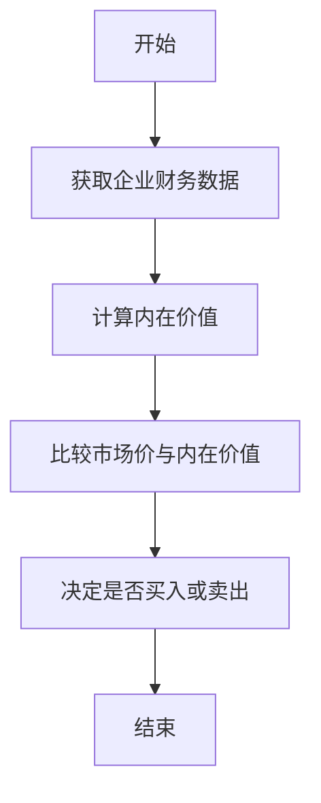
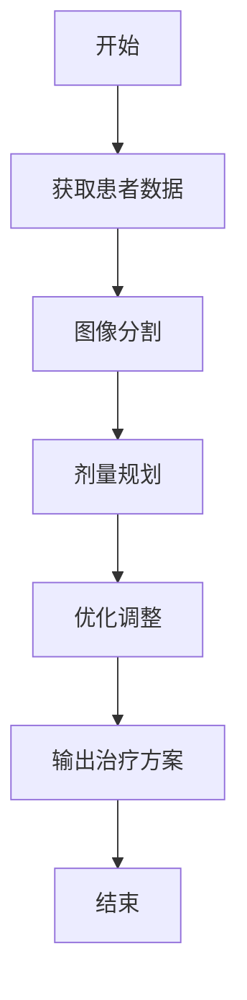
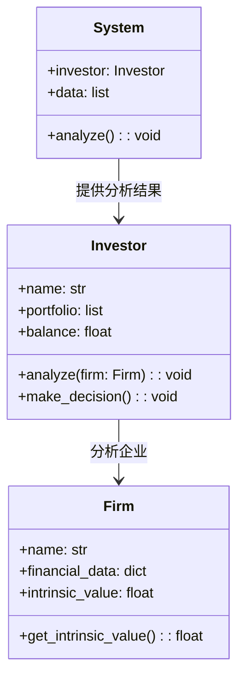
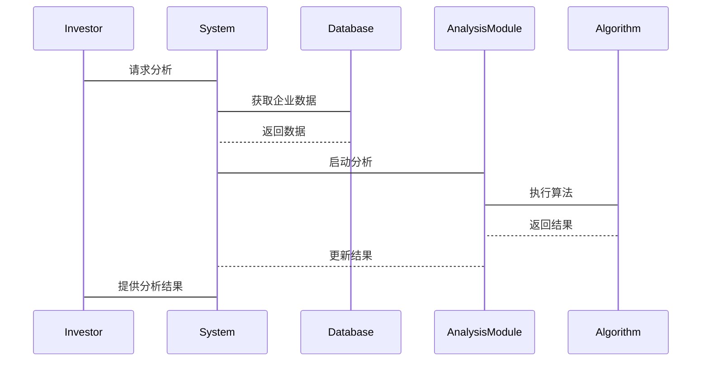

                 


# 价值投资中的智能化精准放疗系统分析

## 关键词：价值投资，智能化精准放疗，系统分析，投资策略，算法优化

## 摘要：  
本文探讨了如何将智能化精准放疗系统的理念和方法应用于价值投资领域。通过分析价值投资的核心概念和智能化精准放疗系统的原理，提出了一种结合两者优势的系统分析框架。文章详细介绍了算法原理、系统架构设计以及实际案例分析，展示了如何利用智能化精准放疗系统提升价值投资的效率和准确性。

---

## 第一章：价值投资与精准放疗系统概述

### 1.1 价值投资的核心概念  
价值投资是一种以基本面分析为基础的投资策略，旨在通过识别市场中被低估的资产进行投资。其核心理念包括：  
1. **内在价值**：资产的真实价值，与市场波动无关。  
2. **安全边际**：买入价格低于内在价值，以降低风险。  
3. **长期视角**：关注企业的长期盈利能力，而非短期市场波动。  

### 1.2 精准放疗系统的定义与特点  
精准放疗是一种利用先进技术和数据分析，对疾病进行个性化治疗的方法。其特点包括：  
1. **个性化治疗**：根据患者的具体情况制定治疗方案。  
2. **高精度**：利用影像技术和算法优化治疗计划，减少对健康组织的损伤。  
3. **数据驱动**：依赖大量数据和机器学习算法进行决策。  

### 1.3 价值投资与精准放疗系统的结合  
价值投资需要精准的分析和决策，而精准放疗系统在医疗领域的成功应用为价值投资提供了新的思路。两者结合的核心在于：  
1. **数据驱动**：利用大数据分析企业财务数据，识别潜在投资机会。  
2. **精准分析**：通过算法优化投资组合，降低风险。  
3. **动态调整**：根据市场变化实时调整投资策略。  

---

## 第二章：价值投资与精准放疗系统的概念分析

### 2.1 核心概念的原理  
#### 价值投资的内在价值计算  
内在价值是企业未来现金流的现值，可通过以下公式计算：  
$$ V = \frac{CF}{(1 + r)^n} $$  
其中，$CF$为未来现金流，$r$为折现率，$n$为时间期限。  

#### 精准放疗系统的算法原理  
精准放疗系统的算法基于图像处理和优化模型，核心步骤包括：  
1. **图像分割**：识别肿瘤区域。  
2. **剂量规划**：根据肿瘤形状和位置制定放疗计划。  
3. **优化调整**：通过算法优化放疗方案，减少副作用。  

### 2.2 核心概念的属性对比  
以下为价值投资与精准放疗系统的属性对比：  
| 属性 | 价值投资 | 精准放疗系统 |  
|------|----------|-------------|  
| 数据来源 | 财务报表、市场数据 | 医疗影像、患者数据 |  
| 分析目标 | 寻找低估资产 | 精准治疗方案 |  
| 方法论 | 基于基本面分析 | 基于图像处理和优化算法 |  

### 2.3 实体关系图  
以下是价值投资与精准放疗系统的实体关系图：  
```mermaid
erDiagram
    investor[x]-(通过系统进行投资决策)->{valueInvestmentSystem}
    patient[y]-(通过系统进行精准治疗)->{precisionRadiotherapySystem}
    valueInvestmentSystem --|{数据输入}--> financialData
    precisionRadiotherapySystem --|{数据输入}--> patientData
```

---

## 第三章：价值投资中的算法分析

### 3.1 算法原理  
#### 价值投资算法的流程  
以下是价值投资算法的流程图：  


#### 精准放疗系统的算法流程  
以下是精准放疗系统的算法流程图：  


### 3.2 算法实现  
#### Python 实现  
以下是价值投资算法的 Python 实现：  
```python
def calculate_intrinsic_value(free_cash_flow, discount_rate, years):
    return sum(free_cash_flow / (1 + discount_rate) ** year for year in range(years))

# 示例
free_cash_flow = [100, 200, 300]
discount_rate = 0.1
years = 3
intrinsic_value = calculate_intrinsic_value(free_cash_flow, discount_rate, years)
print(f"内在价值为：{intrinsic_value}")
```

#### 算法解读  
上述代码计算了企业的内在价值，帮助投资者判断其是否被低估。通过调整现金流和折现率，可以实现对不同企业的精准分析。

---

## 第四章：智能化精准放疗系统的架构设计

### 4.1 问题场景  
在价值投资中，投资者需要快速分析大量企业数据，制定最优投资策略。传统的分析方法效率低下，容易受主观因素影响。因此，智能化精准放疗系统的引入可以解决这些问题。

### 4.2 系统功能设计  
以下是系统功能的领域模型类图：  


### 4.3 系统架构设计  
以下是系统的架构图：  


### 4.4 接口设计与交互  
以下是系统交互的序列图：  


---

## 第五章：项目实战与案例分析

### 5.1 环境安装  
安装所需的工具包括 Python、Jupyter Notebook 和相关库（如 pandas、numpy）。  

### 5.2 核心代码实现  
以下是价值投资算法的核心代码：  
```python
import pandas as pd
import numpy as np

def calculate_intrinsic_value(fcf, wac, horizon):
    return np.npv(wac, [0] + fcf) + fcf[-1]

# 示例数据
fcf = [100, 200, 300]
wac = 0.1
horizon = 3
iv = calculate_intrinsic_value(fcf, wac, horizon)
print(f"内在价值：{iv}")
```

### 5.3 案例分析  
以某公司为例，通过系统分析其财务数据，计算其内在价值，并与市场价格进行对比，判断其是否被低估。

---

## 第六章：总结与展望

### 6.1 总结  
本文将价值投资与精准放疗系统结合，提出了一种智能化的投资分析方法。通过算法优化和系统设计，提升了投资决策的效率和准确性。

### 6.2 未来展望  
未来，随着人工智能技术的发展，价值投资将更加依赖智能化系统。精准放疗系统在投资领域的应用将更加广泛，推动投资分析向更高精度和效率发展。

---

## 附录

### 附录1：术语表  
- 内在价值：企业的未来现金流现值。  
- 精准放疗：基于患者数据的个性化治疗方案。  

### 附录2：工具安装指南  
- Python 安装：通过官方网站下载安装。  
- Jupyter Notebook：通过 pip 安装。  

### 附录3：参考文献  
- Graham, Benjamin. *The Intelligent Investor*.  
- Lippert, Charles. *Python for Data Analysis*.  

---

## 作者：AI天才研究院  
本文由AI天才研究院编写，转载请注明出处。

