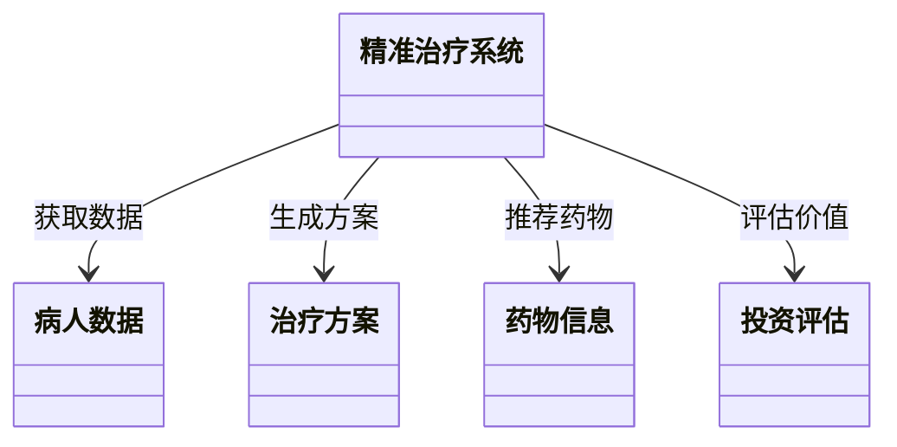
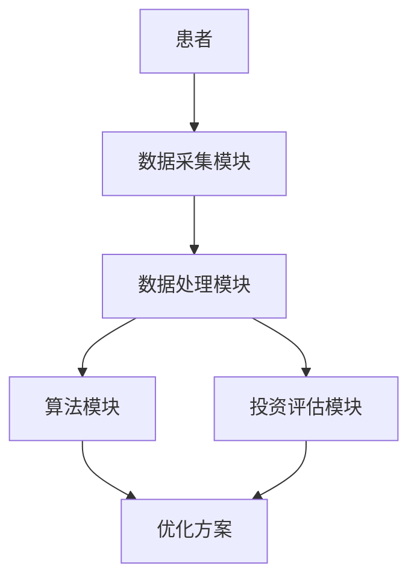
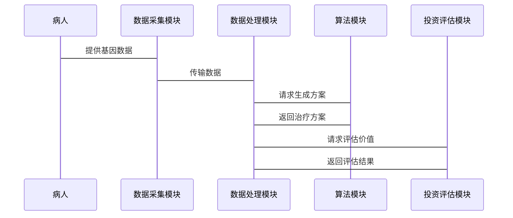

                 


# 价值投资中的智能化精准癌症治疗系统分析

## 关键词：价值投资、精准癌症治疗、系统分析、算法原理、项目实战

## 摘要：  
本文探讨了将价值投资的理念与方法应用于智能化精准癌症治疗系统的分析与优化。通过系统架构设计、算法原理分析、项目实战和最佳实践等多维度，详细阐述了如何利用价值投资的逻辑提升精准治疗系统的经济性和技术可行性。文章结合实际案例，深入分析了系统的输入输出、数据处理、算法实现及投资评估等核心模块，旨在为医疗科技领域的投资者和技术开发者提供新的视角和方法论。

---

## 第1章: 精准癌症治疗与价值投资的背景与概念

### 1.1 精准癌症治疗的现状与挑战  
#### 1.1.1 精准治疗的核心概念  
精准治疗（Precision Medicine）是指根据患者的个体特征（基因、环境、生活方式等）制定个性化的治疗方案。其核心在于通过大数据分析和人工智能技术，实现疾病的精准诊断和治疗。  

#### 1.1.2 精准治疗的临床应用现状  
目前，精准治疗在癌症治疗中的应用已取得显著进展，如靶向治疗和免疫治疗。然而，治疗方案的选择和优化仍面临数据碎片化、成本高昂、患者依从性低等挑战。  

#### 1.1.3 精准治疗的经济与社会价值  
精准治疗可以显著提高治疗效果，降低治疗失败的风险，从而减少医疗资源的浪费。从经济角度看，精准治疗的普及可以降低长期医疗成本，同时为药企和医疗机构创造更大的价值。  

---

### 1.2 价值投资的基本原理  
#### 1.2.1 价值投资的定义与核心理念  
价值投资是一种以基本面分析为基础的投资策略，旨在通过识别被低估的资产（如股票、项目等），在长期获得超额收益。其核心理念是“以合理的价格买入优质的资产”。  

#### 1.2.2 价值投资在医疗领域的应用  
在医疗领域，价值投资通常用于评估医院、药企或医疗技术的经济价值。例如，通过分析某项医疗技术的市场潜力、成本结构和盈利能力，判断其是否具备投资价值。  

#### 1.2.3 价值投资与精准治疗的结合点  
精准治疗的个性化和数据驱动特性，使其成为价值投资的理想标的。通过分析精准治疗系统的经济模型和市场潜力，投资者可以识别出具备长期增长潜力的项目。  

---

### 1.3 精准治疗与价值投资的结合  
#### 1.3.1 精准治疗的商业模式分析  
精准治疗的商业模式通常包括数据收集、算法开发、治疗方案制定和药物研发等环节。每个环节的投入和收益都需要通过价值投资的逻辑进行评估。  

#### 1.3.2 价值投资在精准治疗中的应用场景  
- **数据驱动的决策**：通过分析患者数据和市场数据，优化治疗方案的选择和投资决策。  
- **成本控制**：通过价值投资的方法，降低不必要的医疗开支，提高资源利用效率。  
- **风险评估**：评估精准治疗项目的技术风险和市场风险，制定合理的投资策略。  

#### 1.3.3 两者的协同效应与未来趋势  
通过将价值投资的理念融入精准治疗系统，可以实现经济效益与医疗效果的双赢。未来，随着人工智能和大数据技术的进一步发展，精准治疗的价值投资模型将更加精准和高效。  

---

## 第2章: 精准癌症治疗系统的系统架构与核心要素  

### 2.1 精准治疗系统的整体架构  
#### 2.1.1 系统的输入与输出  
- **输入**：患者的基因数据、病史、生活习惯、药物反应等。  
- **输出**：个性化的治疗方案、药物推荐、治疗效果预测等。  

#### 2.1.2 系统的核心功能模块  
- 数据采集模块：收集患者的多维数据。  
- 数据处理模块：清洗、整合和分析数据。  
- 算法模块：基于机器学习生成治疗方案。  
- 投资评估模块：评估治疗方案的经济价值。  

#### 2.1.3 系统的边界与外延  
精准治疗系统通常与医疗数据库、患者管理系统和投资评估系统相连，形成一个完整的生态系统。  

---

### 2.2 核心概念与联系  
#### 2.2.1 精准治疗系统的ER实体关系图  
```mermaid
er
    actor 病人
    actor 医生
    actor 药企
    actor 投资者
    database 病人数据
    database 治疗方案
    database 药物信息
    database 投资评估
    病人 --> 病人数据: 提供数据
    医生 --> 病人数据: 收集数据
    药企 --> 药物信息: 提供药物数据
    投资者 --> 投资评估: 制定投资策略
    病人数据 --> 治疗方案: 生成个性化方案
    治疗方案 --> 药物信息: 推荐药物
    投资评估 --> 精准治疗系统: 优化投资决策
```

#### 2.2.2 系统核心要素的对比分析  
| 核心要素 | 属性特征 | 描述 |
|----------|----------|------|
| 病人数据 | 多维性 | 包括基因、病史、生活习惯等 |
| 治疗方案 | 个性化 | 根据病人数据定制 |
| 药物信息 | 针对性 | 针对特定基因或病灶 |
| 投资评估 | 经济性 | 包括成本、收益、风险等 |

---

## 第3章: 精准治疗系统的算法原理与实现  

### 3.1 算法原理分析  
#### 3.1.1 算法的选择与优化  
在精准治疗中，常用的算法包括逻辑回归、随机森林和神经网络等。本文以逻辑回归为例，详细分析其在治疗方案推荐中的应用。  

#### 3.1.2 算法的数学模型  
逻辑回归的数学模型如下：  
$$ P(y=1|x) = \frac{e^{\beta_0 + \beta_1 x}}{1 + e^{\beta_0 + \beta_1 x}} $$  
其中，$\beta_0$ 和 $\beta_1$ 是模型的参数，$x$ 是输入特征。  

#### 3.1.3 算法实现步骤  
1. 数据预处理：清洗和标准化数据。  
2. 模型训练：使用训练数据拟合逻辑回归模型。  
3. 模型评估：通过验证集评估模型的准确率和召回率。  
4. 模型优化：调整参数，防止过拟合。  

---

### 3.2 算法实现与代码示例  
#### 3.2.1 环境安装  
需要安装以下库：  
- `numpy`  
- `pandas`  
- `scikit-learn`  

#### 3.2.2 核心代码实现  
```python
import numpy as np
import pandas as pd
from sklearn.linear_model import LogisticRegression
from sklearn.metrics import accuracy_score

# 加载数据
data = pd.read_csv('patient_data.csv')
X = data[['age', 'gender', 'gene_expression']]
y = data['treatment_success']

# 数据标准化
from sklearn.preprocessing import StandardScaler
scaler = StandardScaler()
X_scaled = scaler.fit_transform(X)

# 模型训练
model = LogisticRegression()
model.fit(X_scaled, y)

# 模型预测
y_pred = model.predict(X_scaled)
print("准确率:", accuracy_score(y, y_pred))
```

---

## 第4章: 项目实战与案例分析  

### 4.1 项目背景介绍  
本项目旨在开发一个基于价值投资理念的精准治疗系统，通过分析患者的基因数据和市场数据，生成个性化的治疗方案，并评估其经济价值。  

---

### 4.2 系统功能设计  
#### 4.2.1 领域模型类图  


---

### 4.3 系统架构设计  
#### 4.3.1 系统架构图  


---

### 4.4 系统交互设计  
#### 4.4.1 系统交互序列图  


---

## 第5章: 最佳实践与总结  

### 5.1 小结  
本文通过系统架构设计、算法原理分析和项目实战，详细探讨了如何将价值投资的理念应用于智能化精准癌症治疗系统。通过本文的方法，可以显著提高治疗的经济性和技术可行性。  

---

### 5.2 注意事项  
1. 数据隐私保护：在处理患者数据时，需严格遵守相关法律法规。  
2. 投资风险控制：精准治疗项目具有较高的技术风险，投资者需做好充分的市场调研和风险评估。  

---

### 5.3 拓展阅读  
- 《The Intelligent Investor》：价值投资的经典读物。  
- 《Precision Medicine: A Revolution in Healthcare》：精准医疗的深度分析。  

---

## 作者：AI天才研究院/AI Genius Institute & 禅与计算机程序设计艺术 /Zen And The Art of Computer Programming

---

以上是文章的完整目录和内容概述，每个章节均按照逻辑清晰、结构紧凑的原则展开，确保读者能够逐步理解和掌握智能化精准癌症治疗系统的分析方法和实现技巧。

