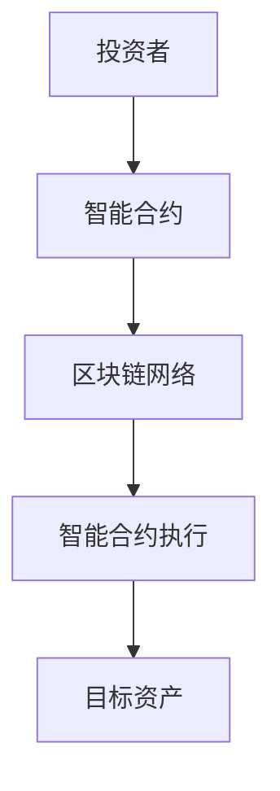
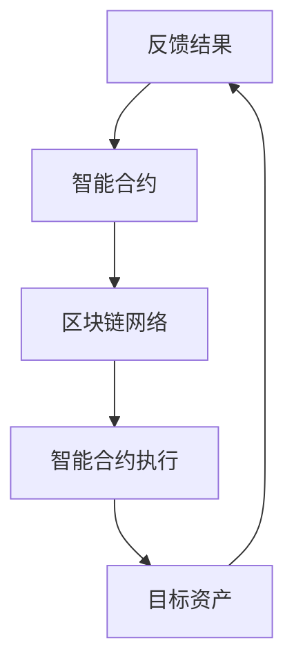

                 


# 价值投资中的智能合约应用前景

> 关键词：智能合约、价值投资、区块链、风险管理、量化交易、自动化投资策略

> 摘要：智能合约作为一种基于区块链技术的自动化执行工具，正在逐步改变传统金融市场的运作方式。本文将从智能合约的核心概念、技术原理、在价值投资中的应用场景，以及其对金融市场的深远影响等方面进行详细探讨。通过分析智能合约在股票、债券和基金等金融工具中的应用，结合实际案例，本文将揭示智能合约如何优化价值投资流程，提升投资效率，并降低风险管理成本。此外，本文还将探讨智能合约的算法设计、系统架构及其实现方案，为读者提供全面而深入的技术视角。

---

## 第一部分：智能合约与价值投资的核心概念

### 第1章：智能合约的基本概念与技术原理

#### 1.1 智能合约的定义与特点
智能合约是一种基于区块链技术的自动化执行协议，其核心特点包括：
- **去中心化**：不依赖任何中心化机构，通过区块链网络实现去信任化。
- **自动执行**：一旦触发预设条件，合约自动执行相关操作。
- **不可篡改**：存储在区块链上的智能合约无法被修改或删除。
- **透明性**：合约代码对所有人公开，确保操作的透明性和可追溯性。

#### 1.2 智能合约的核心功能
智能合约的功能模块包括：
- **条件判断**：根据预设的条件触发执行。
- **自动支付**：基于条件的满足，自动完成资金的划转。
- **风险管理**：通过智能合约实现对金融资产的自动监控和风险控制。

#### 1.3 智能合约的技术实现
智能合约的实现依赖于区块链平台的底层技术，包括：
- **区块链网络**：如以太坊、Solana等。
- **智能合约语言**：如Solidity（以太坊）、Rust（波卡）等。
- **共识机制**：如PoW（工作量证明）、PoS（权益证明）等。

### 第2章：价值投资的基本原理与智能合约的结合

#### 2.1 价值投资的核心理念
价值投资是一种以基本面分析为基础的投资策略，强调以低于内在价值的价格购买优质资产。其核心理念包括：
- **长期投资**：注重资产的长期价值，而非短期波动。
- **基本面分析**：通过分析公司的财务状况、行业地位等因素，判断其内在价值。
- **风险管理**：通过分散投资、严格筛选等方式降低投资风险。

#### 2.2 智能合约与价值投资的结合点
智能合约可以通过自动化和去中心化的方式，优化价值投资的多个环节：
- **投资策略的自动化**：将价值投资策略转化为智能合约，实现自动化的投资决策。
- **风险管理的智能化**：通过智能合约实时监控投资组合的风险，并根据预设规则自动调整投资策略。
- **透明化与信任机制**：智能合约的透明性和不可篡改性，增强了投资者对投资过程的信任。

---

## 第二部分：智能合约在价值投资中的技术实现

### 第3章：智能合约的算法原理与数学模型

#### 3.1 智能合约的条件判断逻辑
智能合约的条件判断逻辑是其核心算法之一。以下是其实现步骤：
1. **条件判断的定义**：根据价值投资策略，定义触发合约执行的条件，例如股价低于某一阈值。
2. **条件判断的执行流程**：
   ```mermaid
   graph TD
       A[触发条件判断] --> B[条件满足]
       B --> C[执行相关操作]
       C --> D[完成]
   ```
3. **条件判断的数学模型**：
   - 条件判断的逻辑可以用布尔表达式表示，例如：
     $$ \text{条件} = (P < P_{\text{threshold}}) \land (Q > Q_{\text{threshold}}) $$
     其中，$P$ 和 $Q$ 是资产的价格和财务指标，$P_{\text{threshold}}$ 和 $Q_{\text{threshold}}$ 是预设的阈值。

#### 3.2 智能合约的自动执行算法
智能合约的自动执行算法基于区块链的共识机制和智能合约的编程语言。以下是其实现步骤：
1. **触发条件**：当智能合约的条件判断满足时，触发合约的自动执行。
2. **执行流程**：
   ```mermaid
   graph TD
       A[触发条件] --> B[调用智能合约]
       B --> C[执行合约代码]
       C --> D[完成交易]
   ```
3. **数学模型**：
   - 自动执行算法的核心是状态转移函数，可以用状态机模型表示：
     $$ S_{t+1} = f(S_t, C) $$
     其中，$S_t$ 表示当前状态，$C$ 表示触发条件，$f$ 是状态转移函数。

### 第4章：智能合约的系统架构与设计

#### 4.1 系统功能设计
智能合约在价值投资中的系统功能设计包括：
- **投资策略模块**：实现价值投资策略的自动化执行。
- **风险管理模块**：实时监控投资组合的风险，并根据智能合约的规则进行调整。
- **智能合约模块**：实现智能合约的部署、触发和执行。

#### 4.2 系统架构设计
以下是智能合约系统的架构设计：


#### 4.3 系统接口设计
智能合约系统的接口设计包括：
- **投资者接口**：用于提交投资策略和参数。
- **区块链接口**：用于部署和执行智能合约。
- **风险管理接口**：用于实时监控和调整投资组合。

#### 4.4 系统交互流程
以下是系统交互的流程图：


---

## 第三部分：智能合约在价值投资中的应用场景

### 第5章：智能合约在股票投资中的应用

#### 5.1 自动化投资策略的实现
智能合约可以实现股票投资策略的自动化，例如：
- **价值选股**：根据预设的财务指标，自动筛选出低估的股票。
- **自动下单**：当触发条件满足时，自动执行买入或卖出操作。

#### 5.2 股票交易的智能合约设计
以下是股票交易智能合约的实现示例：
```solidity
// SPDX-License-Identifier: MIT
pragma solidity ^0.8.0;

contract StockTrading {
    address payable public owner;
    uint256 public targetPrice; // 预设的目标价格
    address public tokenAddress; // 股票的地址

    constructor(uint256 _targetPrice, address _tokenAddress) {
        owner = payable(msg.sender);
        targetPrice = _targetPrice;
        tokenAddress = _tokenAddress;
    }

    function buy() public {
        require(msg.sender == owner, "Only owner can call this function");
        // 执行买入操作
        // 实际实现需要调用外部接口，如交易所API
    }

    function sell() public {
        require(msg.sender == owner, "Only owner can call this function");
        // 执行卖出操作
        // 实际实现需要调用外部接口，如交易所API
    }
}
```

#### 5.3 智能合约在风险管理中的应用
智能合约可以通过实时监控股价波动，自动调整投资组合的风险。例如：
- **止损策略**：当股价下跌至预设阈值时，自动触发止损指令。
- **止盈策略**：当股价上涨至预设阈值时，自动触发止盈指令。

---

## 第四部分：智能合约的算法优化与实际案例

### 第6章：智能合约的算法优化

#### 6.1 条件判断的优化
智能合约的条件判断可以通过以下方式优化：
- **减少不必要的计算**：避免复杂的布尔运算，简化条件判断逻辑。
- **利用链下计算**：将部分计算逻辑转移到链下，降低链上计算负担。

#### 6.2 自动执行算法的优化
智能合约的自动执行算法可以通过以下方式优化：
- **批量处理**：将多个交易合并为一个批量交易，减少交易次数。
- **并行执行**：通过区块链的并行计算能力，提高交易处理效率。

### 第7章：智能合约的实际案例分析

#### 7.1 智能合约在量化交易中的应用
以下是智能合约在量化交易中的实际案例：
- **案例背景**：某量化交易机构希望通过智能合约实现股票的自动买卖。
- **实现方案**：基于以太坊平台，部署一个智能合约，根据股价波动自动执行买卖指令。

#### 7.2 智能合约在风险管理中的实际应用
- **案例背景**：某投资机构希望通过智能合约实现投资组合的自动风险管理。
- **实现方案**：部署一个智能合约，实时监控投资组合的风险指标，并根据预设规则自动调整投资策略。

---

## 第五部分：智能合约的未来发展与挑战

### 第8章：智能合约的未来发展趋势

#### 8.1 智能合约的进一步优化
智能合约的未来优化方向包括：
- **性能优化**：通过技术创新提高智能合约的执行效率。
- **功能扩展**：增加智能合约的功能模块，例如支持多种资产类型。

#### 8.2 区块链技术的进一步发展
区块链技术的进一步发展将为智能合约提供更强大的支持，例如：
- **Layer 2 扩展**：通过Layer 2技术提高智能合约的交易速度和降低费用。
- **跨链技术**：实现不同区块链之间的智能合约交互。

### 第9章：智能合约的挑战与风险管理

#### 9.1 智能合约的主要挑战
智能合约在实际应用中面临的主要挑战包括：
- **技术挑战**：智能合约的开发和维护需要高度专业的技术能力。
- **法律挑战**：智能合约的法律地位和合规性问题尚未完全解决。

#### 9.2 智能合约的风险管理
智能合约的风险管理策略包括：
- **代码审计**：通过专业的代码审计确保智能合约的安全性。
- **法律合规**：确保智能合约的开发和应用符合相关法律法规。

---

## 第六部分：总结与展望

### 第10章：智能合约在价值投资中的总结

#### 10.1 智能合约的核心优势
智能合约在价值投资中的核心优势包括：
- **自动化**：实现投资策略的自动化执行。
- **风险管理**：通过智能合约实现投资组合的自动风险管理。
- **透明性**：确保投资过程的透明和可追溯。

#### 10.2 智能合约的未来展望
智能合约的未来展望包括：
- **技术创新**：通过技术创新进一步优化智能合约的性能和功能。
- **应用场景扩展**：智能合约将在更多金融领域中得到应用，例如保险、借贷等。

---

## 作者简介

作者：AI天才研究院/AI Genius Institute & 禅与计算机程序设计艺术/Zen And The Art of Computer Programming

---

以上是《价值投资中的智能合约应用前景》的完整目录和文章结构。如需进一步展开具体章节的内容或代码实现，请随时告知！

