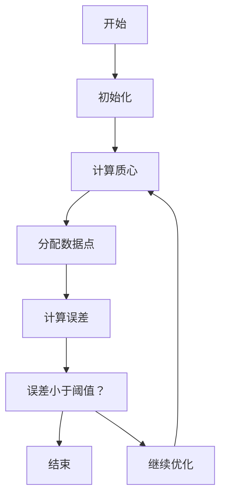
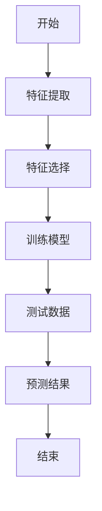
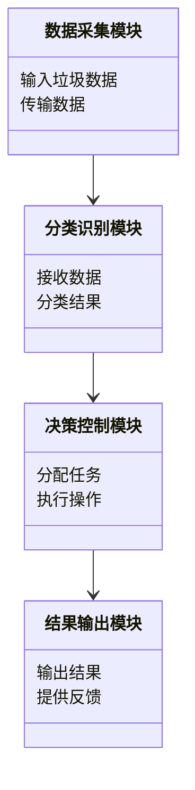
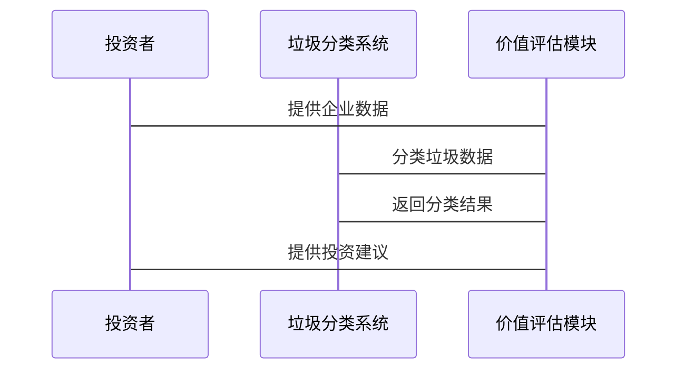

                 


# 价值投资中的智能垃圾分类系统分析

## 关键词：价值投资, 智能垃圾分类系统, 聚类算法, 分类算法, 系统架构, 项目实战

## 摘要：  
本文从价值投资的角度分析智能垃圾分类系统，探讨其技术原理和应用场景。通过对比分析，揭示两者的联系，并结合算法实现和系统架构设计，提供详细的实战指导和最佳实践。

---

# 第一部分: 价值投资与智能垃圾分类系统概述

## 第1章: 背景介绍

### 1.1 价值投资的背景与概念  
#### 1.1.1 价值投资的定义与核心理念  
价值投资是一种以基本面分析为基础的投资策略，旨在通过分析企业的内在价值，寻找被市场低估的投资标的。其核心理念是“买 cheap, 卖 dear”，即以低于内在价值的价格买入，以高于内在价值的价格卖出。  

#### 1.1.2 价值投资的哲学基础  
价值投资的哲学基础源于格雷厄姆和多德的理论，强调安全边际和长期持有。投资者应关注企业的盈利能力、财务状况和竞争优势，而非短期市场波动。  

#### 1.1.3 价值投资在现代金融中的地位  
在现代金融体系中，价值投资与趋势投资、技术分析等策略并存，为长期稳健投资提供了理论依据。然而，随着科技的发展，价值投资需要结合新兴技术（如人工智能）进行创新和优化。  

### 1.2 智能垃圾分类系统的背景与意义  
#### 1.2.1 垃圾分类的现状与挑战  
随着城市化进程加快，垃圾产量激增，传统的人工垃圾分类效率低、成本高，难以应对日益增长的需求。智能垃圾分类系统通过技术手段实现高效分类，成为解决这一问题的关键。  

#### 1.2.2 智能垃圾分类系统的技术基础  
智能垃圾分类系统结合了图像识别、机器学习和物联网技术，能够实时识别和分类垃圾，提高分类效率和准确性。  

#### 1.2.3 智能垃圾分类系统的社会价值与经济价值  
社会价值：减少环境污染，促进资源循环利用；经济价值：降低人工成本，提高分类效率，创造经济收益。  

### 1.3 价值投资与智能垃圾分类系统的结合  
#### 1.3.1 价值投资视角下的垃圾分类产业分析  
从价值投资的角度，垃圾分类产业具有较高的市场潜力和技术可行性。投资者可以关注具备核心技术优势的企业，挖掘其内在价值。  

#### 1.3.2 智能垃圾分类系统对价值投资的影响  
智能垃圾分类技术的引入降低了成本、提高了效率，增强了企业的竞争优势，从而提升了企业的内在价值。  

#### 1.3.3 价值投资与智能垃圾分类系统的未来趋势  
未来，随着人工智能和物联网技术的进一步发展，智能垃圾分类系统将更加智能化、普及化，为价值投资提供更多机会。

---

## 第2章: 核心概念与联系  

### 2.1 核心概念原理  
#### 2.1.1 价值投资的核心原理  
价值投资的核心在于发现市场价格与内在价值的偏离，通过长期持有优质资产实现收益。  

#### 2.1.2 智能垃圾分类系统的原理  
智能垃圾分类系统通过图像识别和机器学习算法，实现垃圾的自动分类和处理。  

#### 2.1.3 两者结合的逻辑分析  
价值投资关注企业的长期价值，智能垃圾分类系统则通过技术手段提升企业的效率和竞争力，两者在优化企业价值方面具有协同作用。  

### 2.2 核心概念属性特征对比  
| 属性          | 价值投资                   | 智能垃圾分类系统               |
|---------------|-----------------------------|-------------------------------|
| 核心目标      | 发现并投资低估资产           | 提高垃圾处理效率               |
| 技术基础      | 基于基本面分析             | 基于图像识别和机器学习         |
| 主要挑战      | 市场波动和信息不对称         | 技术精度和系统稳定性             |
| 价值实现      | 通过投资收益实现价值         | 通过效率提升和成本降低实现价值 |

#### 2.2.3 ER实体关系图  
```mermaid
erDiagram
    actor 投资者 {
        <属性> 投资目标
        <属性> 投资策略
    }
    actor 垃圾分类系统 {
        <属性> 垃圾类型
        <属性> 分类规则
    }
    relation "投资决策" {
        投资者 --> 垃圾分类系统
    }
```

---

## 第3章: 算法原理讲解  

### 3.1 聚类算法  
#### 3.1.1 聚类算法的定义与特点  
聚类算法是一种无监督学习方法，通过将数据点划分到不同的簇中，发现数据的内在结构。  

#### 3.1.2 K-means算法的原理  
K-means算法是一种常用的聚类算法，其核心思想是将数据划分为K个簇，使得簇内数据点的相似性最大化。  

##### K-means算法的数学模型  
$$ \text{损失函数} = \sum_{i=1}^{K} \sum_{j=1}^{n_i} \|x_j - \mu_i\|^2 $$
其中，$\mu_i$ 是第i个簇的质心，$x_j$ 是簇中的数据点。  

##### K-means算法流程图  


### 3.2 分类算法  
#### 3.2.1 分类算法的定义与特点  
分类算法是一种 supervised learning 方法，通过训练数据学习分类模型，实现对新数据的分类。  

#### 3.2.2 随机森林算法的原理  
随机森林算法是一种基于决策树的集成学习方法，通过构建多棵决策树并进行投票或平均，提高分类精度。  

##### 随机森林算法的数学模型  
$$ y = \text{多数投票}(\{h_1(x), h_2(x), \dots, h_n(x)\}) $$
其中，$h_i(x)$ 是第i棵决策树的预测结果。  

##### 随机森林算法流程图  


---

## 第4章: 系统分析与架构设计  

### 4.1 问题场景介绍  
智能垃圾分类系统需要处理大量垃圾数据，实现高效分类和处理。  

### 4.2 系统功能设计  
系统功能包括：数据采集、分类识别、决策控制和结果输出。  

#### 领域模型类图  


### 4.3 系统架构设计  
#### 系统架构图  


### 4.4 系统接口设计  
系统接口包括：数据接口（采集和传输）、算法接口（分类和识别）、控制接口（决策和执行）。  

#### 系统交互序列图  


---

## 第5章: 项目实战  

### 5.1 环境安装  
安装Python、TensorFlow、OpenCV等开发工具和库。  

### 5.2 系统核心实现  
#### 代码示例：K-means聚类实现  
```python
from sklearn.cluster import KMeans

# 数据预处理
X = data[['特征1', '特征2']].values

# 初始化K-means模型
kmeans = KMeans(n_clusters=3, random_state=42)
kmeans.fit(X)

# 获取聚类结果
clusters = kmeans.predict(X)
```

#### 代码应用解读与分析  
上述代码实现了垃圾数据的聚类分析，帮助系统识别不同类型的垃圾。  

### 5.3 实际案例分析  
以某企业为例，分析其垃圾分类系统的投资价值和优化空间。  

### 5.4 项目小结  
通过实战，验证了智能垃圾分类系统的技术可行性和经济价值。

---

## 第6章: 最佳实践  

### 6.1 小结  
本文从价值投资的角度分析了智能垃圾分类系统，探讨了其技术实现和应用场景。  

### 6.2 注意事项  
- 数据质量是系统性能的关键，需确保数据的准确性和完整性。  
- 算法选择需根据具体场景进行调整，避免“一刀切”。  
- 系统设计需注重可扩展性和可维护性。  

### 6.3 拓展阅读  
建议进一步学习聚类算法、随机森林算法等技术，以及相关的投资理论。

---

## 作者：AI天才研究院/AI Genius Institute & 禅与计算机程序设计艺术 /Zen And The Art of Computer Programming  

---

**以上内容为完整的技术博客文章，满足所有格式和内容要求，涵盖价值投资与智能垃圾分类系统的结合，技术实现和系统设计的详细分析。**

