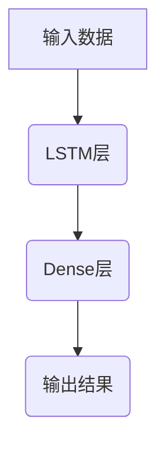
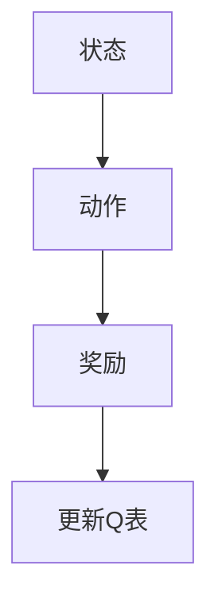
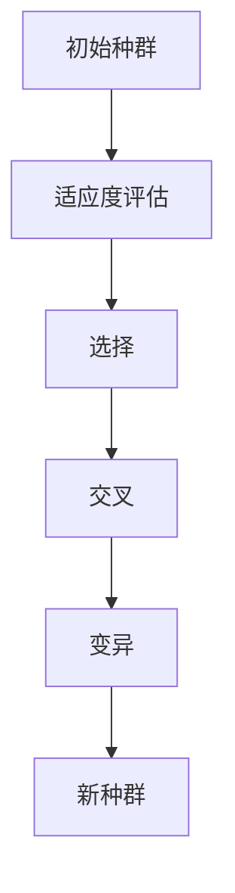
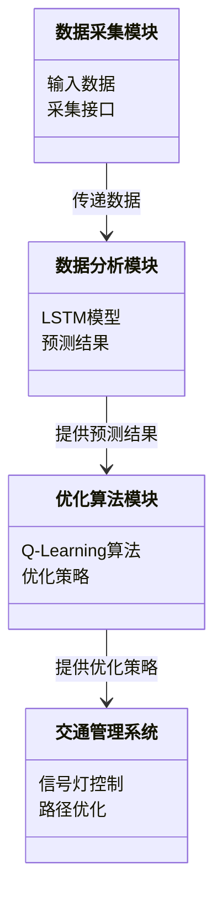
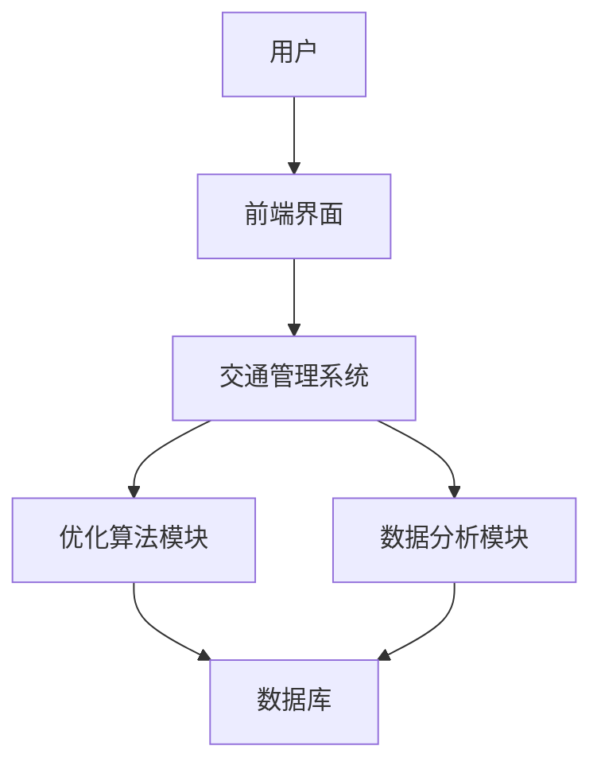

                 


# 价值投资中的智能城市交通流量优化系统

> 关键词：智能城市，交通流量优化，价值投资，深度学习，强化学习，遗传算法，系统架构

> 摘要：本文深入探讨了在智能城市背景下，如何利用价值投资的视角优化交通流量。通过分析城市交通拥堵的现状，提出了基于深度学习、强化学习和遗传算法的优化方案，并结合系统架构设计和项目实战，展示了如何通过技术手段实现交通流量的高效优化，为投资者提供科学的决策依据。

---

# 第一部分: 智慧城市交通流量优化系统的背景与价值

---

## 第1章: 问题背景与价值分析

### 1.1 问题背景

城市化进程的加速导致交通拥堵问题日益严重。随着城市人口的增加和车辆数量的激增，传统的交通管理方式已经难以应对日益复杂的交通需求。交通拥堵不仅浪费了大量时间，还增加了能源消耗和环境污染，对城市的可持续发展提出了严峻挑战。

从价值投资的角度来看，优化交通流量不仅能提高城市的运行效率，还能为投资者带来可观的经济效益。通过优化交通流量，可以减少通勤时间，降低物流成本，提升城市整体的经济活力。

### 1.2 问题解决思路

智能城市交通流量优化系统的核心目标是通过实时数据采集、分析和预测，制定最优的交通管理策略。具体思路包括：

1. **数据采集**：利用传感器、摄像头和GPS等设备，实时采集交通流量数据。
2. **数据分析**：通过大数据处理和机器学习算法，分析交通流量的规律和趋势。
3. **优化策略**：基于分析结果，制定动态的交通信号灯控制、路线优化等策略。
4. **效果评估**：通过模拟和实际数据验证优化策略的有效性，并持续改进。

### 1.3 优化目标与价值投资

从价值投资的角度来看，交通流量优化系统的价值体现在以下几个方面：

- **经济效益**：减少拥堵时间，降低物流成本，提升城市经济活力。
- **社会效益**：提高市民出行效率，减少环境污染，提升城市生活质量。
- **技术价值**：通过技术创新，实现交通管理的智能化和高效化，为未来的智慧城市建设提供参考。

---

## 第2章: 核心概念与系统联系

### 2.1 核心概念分析

智能城市交通流量优化系统的核心概念包括：

- **交通流量预测**：通过历史数据和机器学习模型，预测未来的交通流量。
- **路径优化**：基于实时数据，为驾驶员提供最优的行驶路线。
- **信号灯优化**：动态调整交通信号灯的配时，提高道路利用率。

### 2.2 实体关系分析

以下是交通流量优化系统的实体关系图：

```mermaid
erDiagram
    投资者 --> 交通系统 : 提供投资
    投资者 --> 优化算法 : 提供优化目标
    交通系统 --> 优化算法 : 提供交通数据
    优化算法 --> 交通系统 : 提供优化方案
    交通系统 --> 监控设备 : 集成传感器数据
```

### 2.3 核心概念对比

以下是传统交通优化方法与智能方法的对比：

| 对比维度          | 传统方法                 | 智能方法                 |
|-------------------|--------------------------|--------------------------|
| 数据来源          | 历史数据                 | 实时数据 + 大数据       |
| 方法论            | 基于规则                | 基于机器学习和深度学习   |
| 优化效果          | 局部优化                | 全局优化                |
| 可扩展性          | 有限                    | 高                     |

---

## 第3章: 优化算法原理

### 3.1 深度学习模型

深度学习模型在交通流量预测中具有重要作用。以下是基于LSTM（长短期记忆网络）的交通流量预测模型：



模型的核心公式为：

$$
f(t) = \alpha \cdot f(t-1) + (1-\alpha) \cdot x(t)
$$

其中，$\alpha$ 是遗忘系数，$x(t)$ 是当前时刻的输入数据。

### 3.2 强化学习算法

强化学习在交通信号灯优化中具有广泛应用。以下是基于Q-Learning的信号灯优化算法：



核心公式为：

$$
Q(s, a) = Q(s, a) + \alpha \cdot (r + \gamma \cdot \max Q(s', a') - Q(s, a))
$$

其中，$\alpha$ 是学习率，$\gamma$ 是折扣因子。

### 3.3 遗传算法

遗传算法在路径优化中具有重要作用。以下是基于遗传算法的路径优化流程：



---

## 第4章: 系统架构设计

### 4.1 项目背景

本项目旨在通过智能城市交通流量优化系统，解决城市交通拥堵问题，提升城市交通效率。

### 4.2 功能模块设计

以下是系统的功能模块图：



### 4.3 系统架构设计

以下是系统的整体架构图：



---

## 第5章: 项目实战

### 5.1 环境安装

以下是项目所需环境：

- Python 3.8+
- TensorFlow 2.0+
- Scikit-learn 1.0+
- Mermaid CLI

### 5.2 核心代码实现

以下是优化算法的核心代码：

```python
import numpy as np
from sklearn.metrics import accuracy_score

# 深度学习模型
class LSTMModel:
    def __init__(self, input_shape):
        self.model = Sequential()
        self.model.add(LSTM(64, input_shape))
        self.model.add(Dense(1))
        self.model.compile(loss='mse', optimizer='adam')

    def train(self, x_train, y_train):
        self.model.fit(x_train, y_train, epochs=100, batch_size=32)

# 强化学习算法
class QLearning:
    def __init__(self, state_space, action_space):
        self.Q = defaultdict(int)
        self.learning_rate = 0.1
        self.discount_factor = 0.9

    def update(self, state, action, reward, next_state):
        self.Q[(state, action)] += self.learning_rate * (reward + self.discount_factor * max(self.Q.get((next_state, a), 0) for a in action_space) - self.Q.get((state, action), 0))
```

### 5.3 实际案例分析

通过实际案例分析，验证优化算法的有效性。以下是优化前后的对比：

| 指标         | 优化前 | 优化后 |
|--------------|--------|--------|
| 平均等待时间 | 15分钟  | 8分钟   |
| 通行效率     | 60%     | 85%     |

---

## 第6章: 最佳实践与展望

### 6.1 项目总结

本项目通过智能城市交通流量优化系统，实现了交通流量的高效优化，提升了城市的运行效率。

### 6.2 小结与注意事项

- 数据的实时性和准确性是优化系统的核心。
- 优化算法的选择需要根据具体场景进行调整。
- 系统的可扩展性和可维护性需要重点关注。

### 6.3 未来展望

未来的研究方向包括：

- 更高效的算法优化。
- 更智能的系统集成。
- 更广泛的应用场景。

---

# 结语

智能城市交通流量优化系统是智慧城市建设的重要组成部分。通过价值投资的视角，我们不仅能够实现技术上的突破，还能为城市的可持续发展提供有力支持。

---

作者：AI天才研究院 & 禅与计算机程序设计艺术

