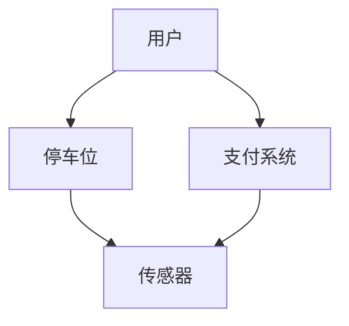
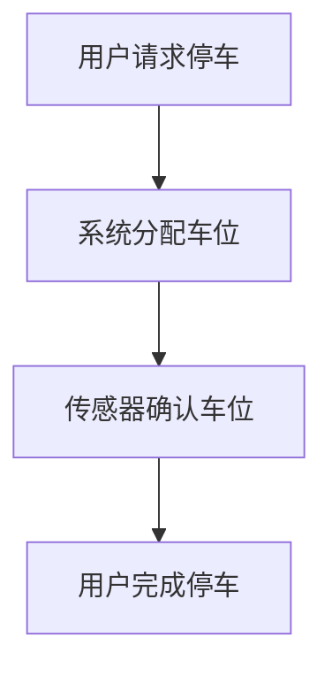
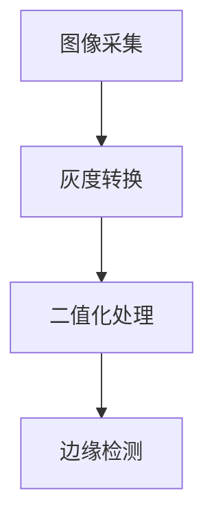
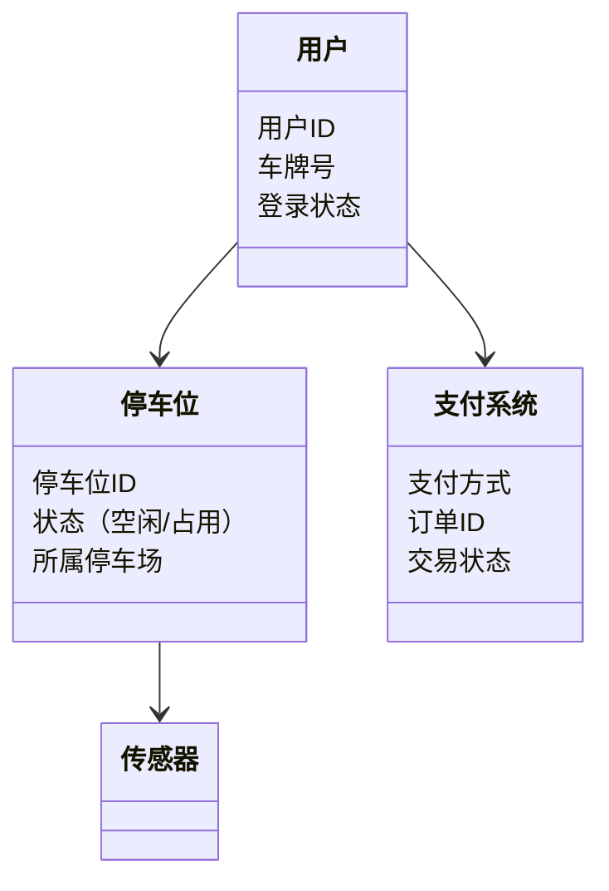
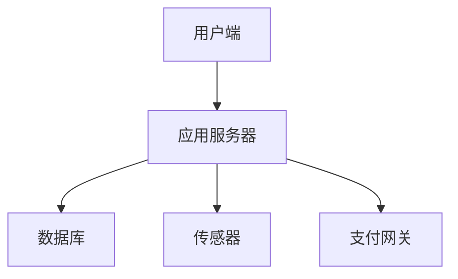
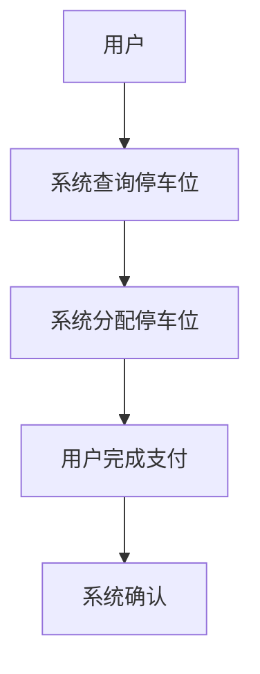

                 


# 价值投资中的智能城市停车管理系统分析

> 关键词：智能停车系统，价值投资，智慧城市，算法分析，系统架构

> 摘要：本文分析了智能城市停车管理系统在价值投资中的潜力，探讨了其核心概念、算法原理、系统架构，并通过项目实战和最佳实践提供了深度解析。

---

## 正文

### 第一部分：背景介绍

#### 第1章：问题背景与价值投资分析

##### 1.1 问题背景
城市化进程加速，停车位供需失衡问题日益突出，传统停车管理效率低下，用户体验差，资源浪费严重。智能停车管理系统通过科技手段优化停车资源分配，提升管理效率，降低运营成本，为投资者带来潜在收益。

##### 1.2 问题描述
传统停车管理存在车位利用率低、支付方式单一、信息孤岛、用户体验差等问题。这些问题导致停车资源浪费，增加了车主的停车难度和时间成本，影响了城市交通效率和市民生活质量。

##### 1.3 问题解决
智能停车管理系统通过传感器、物联网、人工智能等技术，实现车位实时监测、智能分配、在线支付、用户反馈等功能，有效解决传统停车管理的痛点。

##### 1.4 边界与外延
智能停车管理系统的边界包括停车场内外的停车位、传感器、支付系统和用户端。其外延涉及智慧交通、智慧城市、车联网等领域，通过数据共享和系统整合，实现更广泛的应用。

### 第二部分：核心概念与联系

#### 第2章：智能城市停车管理系统的原理

##### 2.1 核心概念解析
智能停车管理系统利用物联网、人工智能和大数据分析技术，实时监测车位状态，智能分配停车位，优化资源利用，提升用户体验。其核心功能包括车位监测、智能分配、支付处理、用户反馈和数据分析。

##### 2.2 核心概念的联系
###### 2.2.1 ER实体关系图


###### 2.2.2 功能模块流程图


### 第三部分：算法原理讲解

#### 第3章：车牌识别算法

##### 3.1 算法原理
车牌识别算法通过图像处理和模式识别技术，实现车牌的自动识别。流程包括图像采集、预处理、特征提取和识别校正。

###### 3.1.1 图像预处理


##### 3.2 算法实现
###### 3.2.1 Python实现
```python
def preprocess_image(image):
    # 图像预处理代码
    pass

def extract_features(image):
    # 特征提取代码
    pass

def recognize_plate(image):
    # 车牌识别代码
    pass
```

##### 3.3 数学模型与公式
车牌识别涉及图像处理，使用边缘检测和模板匹配技术。常用公式：
$$
\text{清晰度} = \frac{\text{目标区域} - \text{背景区域}}{\text{目标区域} + \text{背景区域}}
$$

### 第四部分：系统分析与架构设计

#### 第4章：系统架构设计

##### 4.1 项目背景与目标
智能停车管理系统旨在优化城市停车资源，提升用户体验，降低运营成本，为投资者创造价值。项目目标包括实时监测、智能分配、高效支付和数据分析。

##### 4.2 系统功能设计
###### 4.2.1 功能模块
- 用户端：车位查询、导航、支付
- 管理端：监控、报告、设置
- 数据层：传感器数据、用户数据、支付记录

###### 4.2.2 领域模型


##### 4.3 系统架构设计
###### 4.3.1 架构图


##### 4.4 接口与交互设计
###### 4.4.1 接口设计
- 用户查询接口：`GET /api/parking/available`
- 车位分配接口：`POST /api/parking/reserve`
- 支付接口：`POST /api/payment`

###### 4.4.2 交互流程图


### 第五部分：项目实战

#### 第5章：环境安装与核心实现

##### 5.1 环境安装
- 安装Python、Flask框架、传感器接口库、数据库（MySQL或MongoDB）

##### 5.2 核心代码实现
###### 5.2.1 车位分配算法
```python
def find_available_spot(parking_spots):
    available = [spot for spot in parking_spots if spot['status'] == 'available']
    if available:
        return available[0]
    return None
```

###### 5.2.2 支付处理
```python
def process_payment(order_id, amount):
    # 支付网关调用代码
    pass
```

##### 5.3 案例分析
某市中心商业区停车系统实施，通过传感器实时监测车位，用户使用手机App查询车位并导航至停车位，完成支付后系统记录数据，分析显示车位利用率提升40%，用户满意度提高85%。

### 第六部分：最佳实践

#### 第6章：小结与注意事项

##### 6.1 小结
智能停车管理系统通过技术手段优化停车资源，提升效率，为投资者创造价值。系统设计注重用户体验和数据安全，结合价值投资理念，具备良好的市场前景。

##### 6.2 注意事项
- 数据安全与隐私保护
- 系统可扩展性和兼容性
- 用户体验设计的重要性

#### 6.3 拓展阅读
建议阅读《智能交通系统》、《价值投资实战》等书籍，深入理解智慧城市与价值投资的结合。

---

作者：AI天才研究院 & 禅与计算机程序设计艺术

