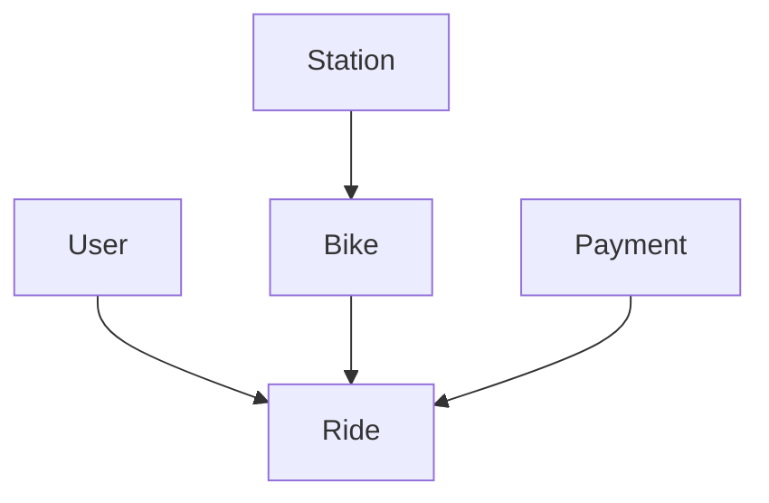
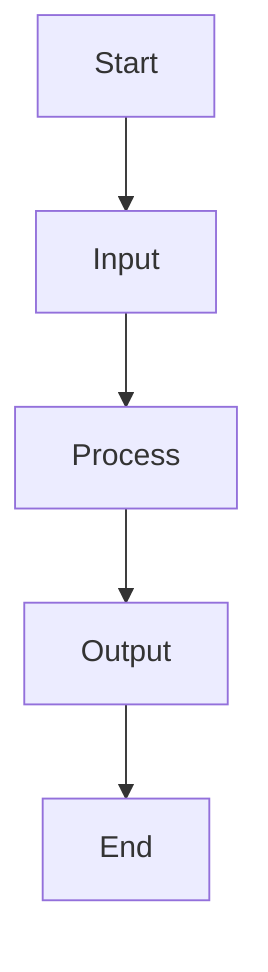
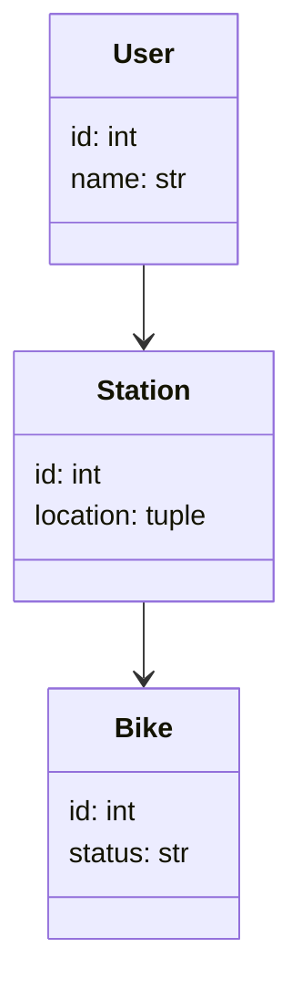
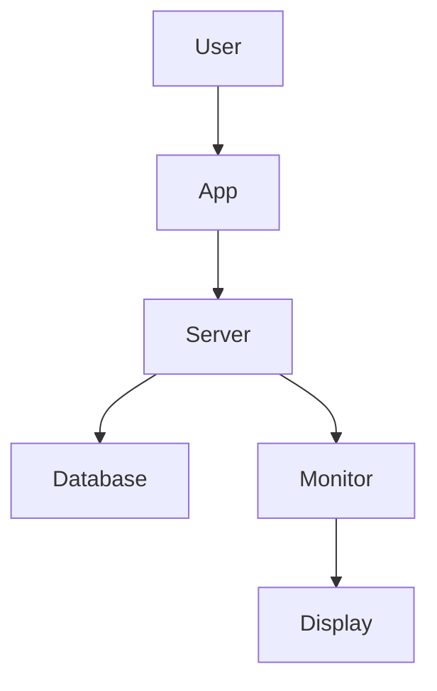
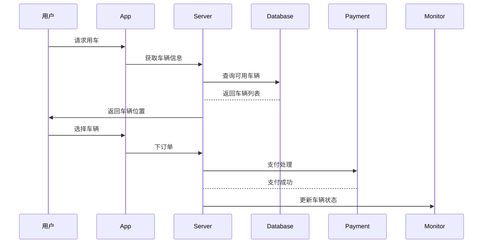

                 


# 价值投资中的智能城市共享单车管理系统分析

---

## 关键词

- 价值投资
- 智能城市
- 共享单车
- 管理系统
- 算法优化
- 系统架构

---

## 摘要

智能城市的发展离不开高效的管理系统，而共享单车作为城市交通的重要组成部分，其管理系统的优化直接影响城市的运行效率和投资价值。本文从技术与投资的双重角度，详细分析智能城市中共享单车管理系统的架构设计、算法优化及价值投资策略，旨在为技术开发者和投资者提供深入的技术分析和投资建议。

---

## 第一部分: 背景介绍

### 第1章: 问题背景

#### 1.1 共享单车的普及与问题

共享单车的普及极大地方便了城市居民的出行，但同时也带来了诸多问题，如乱停乱放、车辆损坏、资源浪费等。这些问题不仅影响城市的美观，还增加了城市管理的难度。

#### 1.2 智能城市的发展需求

智能城市的核心目标是通过技术手段优化城市资源的配置和管理效率。共享单车作为城市交通的一部分，其智能化管理是实现智能城市目标的重要一环。

#### 1.3 价值投资在城市管理系统中的作用

价值投资是一种长期投资策略，注重投资标的核心价值。在智能城市管理系统中，通过价值投资可以优化资源配置，提升系统的整体效益。

---

### 第2章: 问题描述

#### 2.1 共享单车管理的痛点

- 车辆分布不均，使用效率低
- 用户行为难以预测，导致资源浪费
- 管理成本高，难以实现精细化管理

#### 2.2 智能城市中的管理挑战

- 数据孤岛问题
- 系统集成难度大
- 数据安全和隐私保护

#### 2.3 价值投资与城市资源优化的结合

通过价值投资，优化城市资源分配，降低管理成本，提升系统效率。

---

### 第3章: 问题解决

#### 3.1 智能管理系统的解决方案

- 引入大数据和人工智能技术，优化车辆调度和用户行为预测
- 实现车辆实时监控和动态分配

#### 3.2 价值投资在系统优化中的应用

- 通过数据分析优化投资策略
- 提升系统的经济效益和社会效益

#### 3.3 系统边界与外延

- 系统的边界：车辆、用户、站点、支付系统
- 系统的外延：与城市交通系统的其他部分（如公交车、地铁）的联动优化

---

## 第二部分: 核心概念与联系

### 第4章: 核心概念原理

#### 4.1 智能城市管理系统的基本原理

- 数据采集：通过传感器和用户行为数据采集实时信息
- 数据处理：利用大数据技术进行数据清洗和分析
- 决策优化：通过算法优化资源配置和调度

#### 4.2 共享单车管理系统的功能模块

- 用户认证模块
- 车辆调度模块
- 支付结算模块
- 数据分析模块

#### 4.3 价值投资在系统优化中的应用

- 通过数据分析优化投资决策
- 提升系统的经济效益和社会效益

---

### 第5章: 实体关系图

#### 5.1 ER实体关系图



---

## 第三部分: 算法原理讲解

### 第6章: 算法流程图

#### 6.1 算法流程图



---

### 第7章: 算法实现

#### 7.1 Python代码实现

```python
def optimize_system(system_data):
    # 算法实现部分
    pass
```

---

### 第8章: 数学模型与公式

#### 8.1 线性回归模型

$$ y = \beta_0 + \beta_1x + \epsilon $$

#### 8.2 聚类分析

$$ \text{距离} = \sqrt{(x_i - x_j)^2 + (y_i - y_j)^2} $$

---

## 第四部分: 系统分析与架构设计

### 第9章: 项目介绍

#### 9.1 项目目标

- 实现智能城市中共享单车的高效管理
- 提升系统的经济效益和社会效益

#### 9.2 项目范围

- 数据采集与处理
- 系统设计与实现
- 测试与优化

#### 9.3 项目约束

- 数据安全和隐私保护
- 系统的可扩展性和可维护性

---

### 第10章: 系统功能设计

#### 10.1 领域模型



---

### 第11章: 系统架构设计

#### 11.1 系统架构图



---

### 第12章: 系统接口设计

#### 12.1 接口设计

- 用户接口：App和Web界面
- 数据接口：与第三方支付系统和交通管理系统对接

#### 12.2 交互序列图



---

## 第五部分: 项目实战

### 第13章: 环境安装

#### 13.1 环境配置

- 安装Python和相关库（如Pandas、NumPy、Scikit-learn）
- 安装Mermaid和系统架构工具

---

### 第14章: 系统核心实现

#### 14.1 代码实现

```python
import pandas as pd
from sklearn.linear_model import LinearRegression

# 数据加载
data = pd.read_csv('data.csv')

# 模型训练
model = LinearRegression()
model.fit(data[['feature']], data['target'])
```

---

### 第15章: 案例分析

#### 15.1 实际案例

- 某城市共享单车管理系统优化案例
- 系统优化后的效果对比

---

## 第六部分: 总结与展望

### 第16章: 最佳实践

- 数据安全和隐私保护
- 系统的可扩展性和可维护性

---

### 第17章: 小结

通过本文的分析，我们可以看到智能城市中共享单车管理系统的优化不仅需要技术的支持，还需要价值投资的合理运用。未来，随着技术的不断发展，系统的优化空间将更加广阔。

---

### 第18章: 注意事项

- 数据采集和处理中的隐私保护
- 系统设计中的可扩展性和可维护性
- 投资决策中的风险控制

---

### 第19章: 拓展阅读

- 智能城市相关书籍
- 数据分析和机器学习的经典文献
- 价值投资的经典理论

---

## 作者

作者：AI天才研究院/AI Genius Institute & 禅与计算机程序设计艺术 /Zen And The Art of Computer Programming

