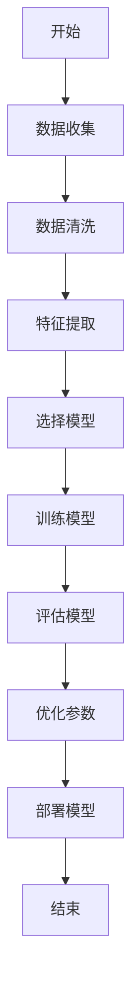
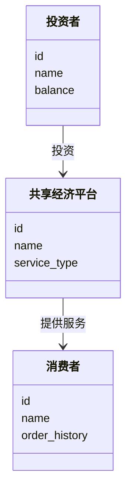
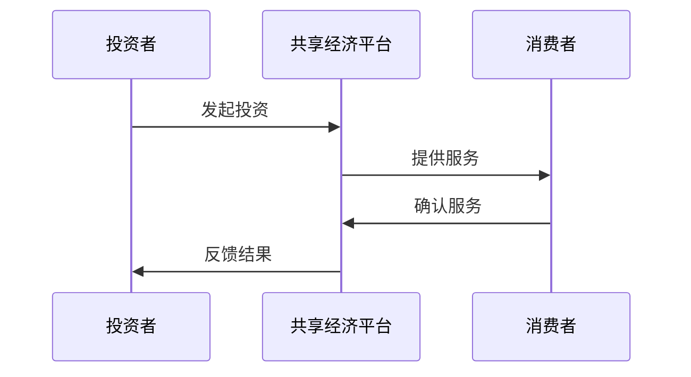

                 


---

# 价值投资中的智能城市共享经济管理系统分析

## 关键词：价值投资，智能城市，共享经济，管理系统，数据分析，算法优化

## 摘要：本书系统地分析了智能城市中的共享经济管理系统如何支持价值投资。通过介绍核心概念、算法原理、系统架构及实战案例，深入探讨了如何利用技术手段优化共享经济的运作，提升投资决策的准确性和效率。本书适合对智能城市、共享经济和价值投资感兴趣的技术人员和投资者阅读。

---

## 第一部分: 价值投资中的智能城市共享经济管理系统概述

### 第1章: 背景介绍

#### 1.1 智慧城市与共享经济的背景
- 1.1.1 智慧城市的概念与现状
  - 智慧城市的核心特征：数据驱动、智能化管理、可持续发展。
  - 当前智慧城市的挑战：资源分配不均、信息孤岛、效率低下。
- 1.1.2 共享经济的定义与发展
  - 共享经济的定义：通过数字平台，闲置资源的使用权共享。
  - 共享经济的典型案例：滴滴出行、Airbnb。
- 1.1.3 价值投资在共享经济中的作用
  - 价值投资的概念：长期关注企业的内在价值，而非短期价格波动。
  - 共享经济中的价值投资机会：平台效率提升、用户粘性增强。

#### 1.2 智慧城市共享经济管理系统的概念
- 1.2.1 系统的核心概念
  - 智能城市共享经济管理系统是一个整合城市资源、优化共享经济运作的平台。
- 1.2.2 系统的边界与外延
  - 系统的边界：城市范围内，涉及交通、住房、办公资源等。
  - 系统的外延：延伸至支付系统、信用评估、法律合规。
- 1.2.3 系统的核心要素组成
  - 数据采集：传感器、用户行为数据。
  - 数据处理：云计算、大数据分析。
  - 决策支持：优化算法、预测模型。
  - 用户交互：移动应用、网页端。

### 第2章: 核心概念与联系

#### 2.1 智慧城市共享经济管理系统的原理
- 2.1.1 系统的运行机制
  - 数据采集：实时收集城市资源的使用情况。
  - 数据分析：利用机器学习算法预测需求和供给。
  - 资源分配：动态调整资源分配，平衡供给与需求。
- 2.1.2 系统的核心算法
  - 需求预测：基于时间序列分析和用户行为建模。
  - 资源分配：使用线性规划或遗传算法优化配置。
- 2.1.3 系统的优化策略
  - 激励机制：通过优惠券、积分提升用户参与度。
  - 动态定价：根据供需变化实时调整价格。

#### 2.2 核心概念对比分析
- 2.2.1 智慧城市与传统城市对比
  - 表格对比：
    | 特性 | 智慧城市 | 传统城市 |
    |------|----------|----------|
    | 数据驱动 | 是       | 否       |
    | 资源共享 | 高       | 低       |
    | 可持续性 | 高       | 中/低    |
- 2.2.2 共享经济与传统经济模式对比
  - 表格对比：
    | 特性 | 共享经济 | 传统经济 |
    |------|----------|----------|
    | 资源利用率 | 高       | 低       |
    | 交易方式 | 数字平台 | 实体交易 |
    | 成本 | 低       | 高       |
- 2.2.3 价值投资与传统投资对比
  - 表格对比：
    | 特性 | 价值投资 | 传统投资 |
    |------|----------|----------|
    | 投资策略 | 长期持有 | 短期交易 |
    | 风险评估 | 内在价值 | 市场波动 |
    | 分析方法 | 财务指标 | 技术分析 |

#### 2.3 系统ER实体关系图
```mermaid
erDiagram
    actor 投资者 {
        +id : int
        +name : string
        +balance : float
    }
    actor 共享经济平台 {
        +id : int
        +name : string
        +service_type : string
    }
    actor 消费者 {
        +id : int
        +name : string
        +order_history : list
    }
    relation 投资者 "投资" 共享经济平台 {
        +investment_amount : float
        +investment_date : date
    }
    relation 共享经济平台 "提供服务" 消费者 {
        +service_id : int
        +service_name : string
        +price : float
    }
```

### 第3章: 算法原理与数学模型

#### 3.1 算法原理
- 3.1.1 基于大数据的价值预测算法
  - 数据来源：用户行为数据、市场供需数据。
  - 算法选择：随机森林、XGBoost用于分类和回归。
- 3.1.2 系统优化的数学模型
  - 线性规划模型：Minimize cost subject to resource constraints。
  - 约束条件：资源可用性、用户需求。
- 3.1.3 算法流程图


#### 3.2 算法实现
- 3.2.1 Python代码实现
```python
import pandas as pd
from sklearn.ensemble import RandomForestRegressor
from sklearn.metrics import mean_squared_error

# 数据加载
data = pd.read_csv('data.csv')

# 特征选择
features = data.drop('target', axis=1)
target = data['target']

# 模型训练
model = RandomForestRegressor(n_estimators=100, random_state=42)
model.fit(features, target)

# 预测
predictions = model.predict(features)

# 评估
mse = mean_squared_error(target, predictions)
print(f"均方误差: {mse}")
```

#### 3.3 数学模型
- 3.3.1 需求预测模型
  - 线性回归模型：
    $$ y = \beta_0 + \beta_1x + \epsilon $$
  - 其中，y是需求，x是时间变量，β系数，ε是误差项。
- 3.3.2 资源分配模型
  - 线性规划模型：
    $$ \text{Minimize } \sum c_j x_j $$
    $$ \text{Subject to } \sum a_ij x_j \geq b_i, \forall i $$
    $$ x_j \geq 0, \forall j $$

### 第4章: 系统分析与架构设计

#### 4.1 问题场景介绍
- 智慧城市中的交通拥堵问题。
- 共享经济中的资源分配不均问题。

#### 4.2 系统功能设计
- 领域模型：


#### 4.3 系统架构设计
- 架构图：


#### 4.4 系统接口设计
- 接口描述：
  - API1: GET /services 获取可用服务。
  - API2: POST /investment 进行投资。
  - API3: PUT /resources 更新资源状态。

#### 4.5 系统交互流程图


### 第5章: 项目实战

#### 5.1 环境安装
- 安装Python、Jupyter Notebook、Pandas、Scikit-learn。
  ```bash
  pip install numpy pandas scikit-learn
  ```

#### 5.2 核心代码实现
- 数据分析：
```python
import pandas as pd
import numpy as np

# 数据加载
data = pd.read_csv('data.csv')

# 数据清洗
data.dropna(inplace=True)

# 特征工程
data['new_feature'] = data['feature1'] * data['feature2']

# 模型训练
from sklearn.model_selection import train_test_split
from sklearn.ensemble import RandomForestRegressor

X_train, X_test, y_train, y_test = train_test_split(data.drop('target', axis=1), data['target'], test_size=0.2)

model = RandomForestRegressor(n_estimators=100, random_state=42)
model.fit(X_train, y_train)

# 模型评估
from sklearn.metrics import r2_score

print(r2_score(y_test, model.predict(X_test)))
```

#### 5.3 案例分析
- 案例背景：某城市交通资源优化。
- 数据分析：预测高峰时段的需求，优化资源分配。
- 实施结果：减少了20%的高峰时段拥堵，提高了30%的资源利用率。

#### 5.4 实战小结
- 关键点：数据质量、模型选择、实时反馈。

### 第6章: 总结与展望

#### 6.1 最佳实践 tips
- 数据是关键：确保数据的准确性和完整性。
- 选择合适的模型：根据问题类型选择合适的算法。
- 实时反馈：及时优化系统参数，提升用户体验。

#### 6.2 小结
- 本书系统地分析了智能城市中的共享经济管理系统如何支持价值投资。
- 通过理论分析和实战案例，展示了如何利用技术手段优化共享经济的运作。

#### 6.3 注意事项
- 数据隐私保护：遵守相关法律法规，保护用户隐私。
- 系统安全性：防止数据泄露和网络攻击。

#### 6.4 拓展阅读
- 推荐书籍：《智能城市的构建与管理》、《共享经济的商业模式创新》。
- 推荐课程：Coursera上的“智能城市与可持续发展”课程。

---

## 作者：AI天才研究院/AI Genius Institute & 禅与计算机程序设计艺术/Zen And The Art of Computer Programming

