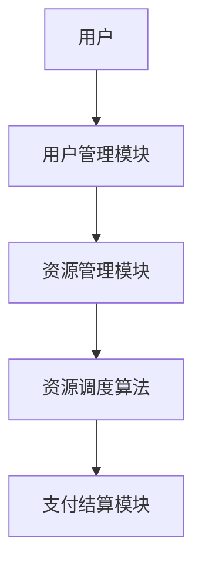

                 


# 价值投资中的智能城市共享经济管理系统分析

---

## 关键词：
价值投资，智能城市，共享经济，系统管理，算法设计

---

## 摘要：
本文旨在分析价值投资在智能城市共享经济管理系统中的应用，通过技术与经济的结合，探讨如何利用智能城市中的共享经济系统实现价值投资的最大化。文章从背景介绍、核心概念、算法设计、系统架构到项目实战，层层深入，结合理论与实践，为读者提供全面的分析与指导。通过本文，读者可以理解如何在智能城市中构建共享经济管理系统，并通过价值投资实现系统的优化与收益最大化。

---

## 第1章：背景与核心概念

### 1.1 价值投资的定义与特点

#### 1.1.1 价值投资的基本概念
价值投资是一种投资策略，强调以低于内在价值的价格购买优质资产。其核心在于寻找市场低估的标的，长期持有，获得超额收益。价值投资的关键在于对标的资产的深入分析和长期判断。

#### 1.1.2 价值投资的核心原则
- **安全边际**：买入价格低于内在价值。
- **长期视角**：关注企业的长期盈利能力。
- **分散投资**：降低风险，避免过度集中。
- **独立思考**：基于基本面分析，而非市场情绪。

#### 1.1.3 价值投资在现代经济中的应用
价值投资不仅适用于传统金融领域，还可以应用于新兴技术领域，如智能城市和共享经济。随着技术的进步，价值投资的工具和方法也在不断演变。

---

### 1.2 智能城市的发展现状

#### 1.2.1 智能城市的定义与特征
智能城市是通过信息技术（如物联网、大数据、人工智能等）优化城市资源配置，提高城市运行效率的新型城市形态。其主要特征包括：
- **数字化**：万物互联，数据驱动。
- **智能化**：AI技术广泛应用。
- **高效性**：资源优化配置。

#### 1.2.2 智能城市的关键技术
- **物联网（IoT）**：连接城市中的设备和传感器。
- **大数据分析**：处理海量城市数据。
- **人工智能（AI）**：优化城市运行。
- **区块链**：提升数据安全性和透明度。

#### 1.2.3 智能城市的发展趋势
智能城市正在向深度智能化方向发展，未来的趋势包括：
- **绿色技术**：节能减排。
- **智慧城市大脑**：统一的城市管理平台。
- **市民参与**：市民通过数字化手段参与城市管理。

---

### 1.3 共享经济的崛起与挑战

#### 1.3.1 共享经济的定义与模式
共享经济是一种基于数字平台的经济模式，通过共享资源实现高效利用。其主要模式包括：
- **P2P（点对点）共享**：个人对个人的资源分享。
- **B2C（企业对消费者）共享**：企业通过平台提供服务。
- **C2B（消费者对企业）共享**：消费者通过平台提供资源。

#### 1.3.2 共享经济的典型案例
- **滴滴出行**：共享出行。
- **Airbnb**：共享住宿。
- **共享办公空间**：如WeWork。

#### 1.3.3 共享经济面临的挑战
- **政策监管**：法律法规不完善。
- **信任问题**：用户之间的信任难以建立。
- **资源分配不均**：部分资源被过度使用，部分资源闲置。

---

### 1.4 价值投资与智能城市共享经济的结合

#### 1.4.1 价值投资在共享经济中的应用
价值投资可以用于评估共享经济企业的内在价值，寻找市场低估的投资机会。例如，通过分析企业的收入、成本、利润和市场潜力，判断其是否具备长期投资价值。

#### 1.4.2 智能城市为共享经济带来的机遇
智能城市通过技术手段优化共享经济的资源配置，降低运营成本，提高效率。例如，智能交通系统可以优化共享出行的调度，减少空驶率。

#### 1.4.3 共享经济系统中的投资策略
在智能城市中，投资者可以通过以下策略实现价值投资：
- **选择优质平台**：选择技术领先、用户基础庞大的共享经济平台。
- **关注技术创新**：投资于技术创新能力强的企业。
- **分散投资风险**：通过分散投资降低市场波动风险。

---

## 第2章：核心概念与系统分析

### 2.1 智能城市共享经济管理系统的构成

#### 2.1.1 系统的核心要素
- **用户需求分析**：通过数据分析挖掘用户需求。
- **资源分配机制**：基于算法优化资源配置。
- **支付与结算系统**：实现便捷的支付和结算。

#### 2.1.2 系统的架构设计
- **用户管理模块**：负责用户注册、登录和信息管理。
- **资源管理模块**：管理共享资源的分配和调度。
- **支付结算模块**：实现交易的支付和结算。

---

### 2.2 系统的实体关系分析

#### 2.2.1 用户与资源的关系
- 用户可以预订、使用和评价共享资源。
- 资源可以被多个用户共享，但需避免资源冲突。

#### 2.2.2 资源与服务的关系
- 资源通过服务提供给用户使用。
- 服务的类型和质量影响用户体验。

#### 2.2.3 系统与外部接口的关系
- 系统通过API与外部支付平台、地图服务等接口进行交互。

---

## 第3章：算法原理与数学模型

### 3.1 共享经济管理系统中的算法设计

#### 3.1.1 资源分配算法
- **贪心算法**：优先分配资源给需求最高的用户。
- **遗传算法**：通过多次迭代优化资源分配。

#### 3.1.2 用户行为预测算法
- **线性回归**：预测用户需求。
- **决策树**：基于用户特征分类预测行为。

#### 3.1.3 风险评估算法
- **VaR（在险价值）**：评估投资风险。
- **信用评分模型**：评估用户信用风险。

---

### 3.2 算法的数学模型

#### 3.2.1 资源分配模型
$$ \text{目标函数：} \min \sum_{i=1}^{n} |x_i - \text{需求}| $$
其中，$x_i$为分配给用户的资源数量。

#### 3.2.2 用户需求预测模型
$$ \text{预测值} = \beta_0 + \beta_1 \times \text{特征变量} + \epsilon $$
其中，$\beta_0$为截距，$\beta_1$为回归系数，$\epsilon$为误差项。

---

## 第4章：系统设计与架构

### 4.1 系统功能设计

#### 4.1.1 用户管理模块
- 用户注册与登录。
- 用户信息管理。

#### 4.1.2 资源管理模块
- 资源信息发布。
- 资源调度与分配。

#### 4.1.3 支付结算模块
- 支付方式管理。
- 账单生成与结算。

---

### 4.2 系统架构设计

#### 4.2.1 系统架构图


---

## 第5章：项目实战

### 5.1 环境安装

#### 5.1.1 安装Python
```bash
# 安装Python
sudo apt-get install python3
```

#### 5.1.2 安装依赖库
```bash
pip install numpy
pip install matplotlib
```

---

### 5.2 系统核心实现源代码

#### 5.2.1 资源分配算法
```python
import numpy as np

def resource_allocation(demand, resources):
    allocation = []
    for d in demand:
        allocated = min(d, resources)
        allocation.append(allocated)
        resources -= allocated
    return allocation
```

---

## 第6章：总结与展望

### 6.1 总结
本文通过分析价值投资在智能城市共享经济管理系统中的应用，提出了系统的构建方法和投资策略。通过技术与经济的结合，为投资者和技术人员提供了理论和实践指导。

### 6.2 展望
未来，随着人工智能和大数据技术的进一步发展，智能城市共享经济管理系统将更加智能化和高效化。价值投资在其中的应用也将更加广泛和深入。

---

## 作者：AI天才研究院/AI Genius Institute & 禅与计算机程序设计艺术 /Zen And The Art of Computer Programming

---

**本文为AI天才研究院（AI Genius Institute）原创文章，转载请注明出处。**

