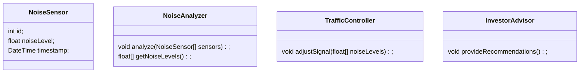
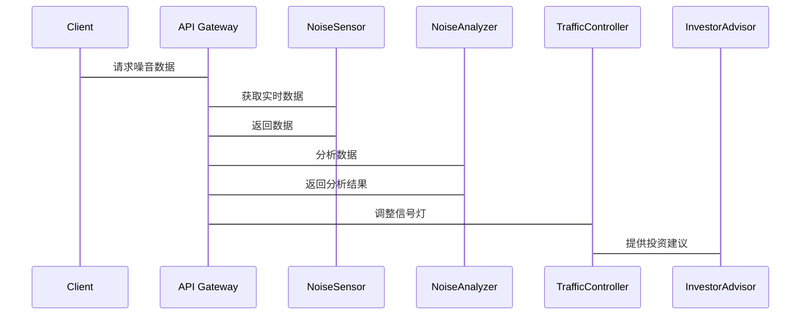

                 


# 价值投资中的智能城市噪音管理系统分析

---

## 关键词：
- 价值投资
- 智能城市
- 噪音管理系统
- 数据分析
- 算法原理

---

## 摘要：
智能城市噪音管理系统通过数据分析和优化算法，为城市规划和价值投资提供了新的视角。本文从背景介绍、核心概念、算法原理、系统架构、项目实战等多方面展开分析，深入探讨如何通过智能城市噪音管理系统实现城市环境优化与价值最大化。

---

# 第一部分: 价值投资中的智能城市噪音管理系统背景介绍

---

## 第1章: 智慧城市与价值投资概述

---

### 1.1 智慧城市的概念与发展

#### 1.1.1 智慧城市的定义与特征
智慧城市是利用物联网、大数据、人工智能等技术，提升城市运行效率和居民生活质量的城市发展模式。其核心特征包括数字化、智能化、网络化和可持续性。

#### 1.1.2 智慧城市的发展历程
从20世纪末开始，智慧城市建设逐步从概念提出走向实践应用，经历了基础设施建设、数据整合、智能应用等多个阶段。

#### 1.1.3 智慧城市与价值投资的关系
智慧城市建设涉及大量投资，价值投资通过分析项目经济效益和长期潜力，为智慧城市建设提供了资金支持和决策依据。

---

### 1.2 城市噪音管理的重要性

#### 1.2.1 城市噪音的来源与影响
城市噪音主要来自交通、建筑施工、工业生产和居民生活等四个方面。噪音污染不仅影响居民健康，还会影响城市环境和经济发展。

#### 1.2.2 噪音管理对城市价值的影响
有效的噪音管理可以提升城市宜居性，吸引更多投资和人才，从而提升城市整体价值。

#### 1.2.3 噪音管理系统的必要性
随着城市化进程加快，噪音污染问题日益严重，建立智能城市噪音管理系统成为解决这一问题的关键。

---

### 1.3 价值投资的基本原理

#### 1.3.1 价值投资的定义与核心理念
价值投资是一种投资策略，强调以低于内在价值的价格购买优质资产，长期持有，获取超额收益。其核心理念是“买入并持有”。

#### 1.3.2 价值投资与城市发展的结合
价值投资者通过分析城市基础设施、公共服务、经济发展等多方面因素，寻找具有长期增长潜力的城市和项目进行投资。

#### 1.3.3 噪音管理系统在价值投资中的应用潜力
智能城市噪音管理系统能够提供实时数据和优化建议，帮助投资者评估城市环境质量和未来发展潜力，从而做出更明智的投资决策。

---

## 第2章: 智能城市噪音管理系统的概念与核心要素

---

### 2.1 智能城市噪音管理系统的定义
智能城市噪音管理系统是利用传感器、大数据和人工智能技术，实时采集、分析和管理城市噪音数据，提供优化建议的智能化系统。

---

### 2.2 噪音管理系统的核心要素

#### 2.2.1 数据采集与处理模块
- 数据采集：通过分布于城市各处的噪音传感器，实时采集噪音数据。
- 数据处理：对采集到的数据进行清洗、存储和初步分析。

#### 2.2.2 噪音分析与预测模块
- 数据分析：利用统计学和机器学习算法，分析噪音源、分布规律和趋势。
- 预测模型：基于历史数据，预测未来噪音水平和变化趋势。

#### 2.2.3 优化建议与决策支持模块
- 优化建议：根据分析结果，提出降低噪音的措施，如调整交通信号灯、优化建筑布局等。
- 决策支持：为城市规划者和投资者提供决策参考。

---

### 2.3 系统的边界与外延

#### 2.3.1 系统的边界界定
系统仅关注城市噪音管理，不涉及其他环境问题（如空气污染）。

#### 2.3.2 系统与城市其他系统的交互
系统需要与交通管理、城市规划等系统进行数据交互，协同工作。

#### 2.3.3 系统的扩展性与适应性
系统设计具有良好的扩展性和适应性，能够根据城市需求进行功能扩展和参数调整。

---

## 第3章: 智能城市噪音管理系统的核心概念与联系

---

### 3.1 核心概念原理

#### 3.1.1 数据采集与处理原理
通过传感器采集噪音数据，经过数据清洗、转换和存储，为后续分析提供可靠数据。

#### 3.1.2 噪音分析算法原理
采用机器学习算法（如聚类、回归）对噪音数据进行分析，识别噪音源和分布规律。

#### 3.1.3 优化建议生成机制
基于分析结果，结合城市规划和经济学知识，生成最优的噪音管理建议。

---

### 3.2 核心概念属性特征对比

| 特征维度 | 数据采集模块 | 噪音分析模块 | 优化建议模块 |
|----------|----------------|----------------|----------------|
| 输入     | 原始噪音数据    | 分析结果数据    | 管理目标数据    |
| 输出     | 清洗后的数据    | 预测模型        | 优化方案        |
| 关键技术  | 传感器技术      | 机器学习算法    | 优化算法        |
| 目标     | 提供准确数据     | 预测噪音趋势     | 降低噪音水平     |

---

### 3.3 ER实体关系图架构

```mermaid
erDiagram
    city_management_system++{
        city_noise_data++{
            city_area : string
            noise_level : integer
            time_stamp : datetime
        }
        noise_management_system++{
            noise_source : string
            management_strategy : string
            effectiveness : float
        }
        investment_analysis++{
            investment_return : float
            risk_assessment : string
            value_investment_recommendation : string
        }
    }
```

---

## 第4章: 智能城市噪音管理系统的算法原理

---

### 4.1 数据分析算法原理

#### 4.1.1 数据预处理
- 数据清洗：处理缺失值、异常值。
- 数据转换：将原始数据转换为适合分析的形式。

#### 4.1.2 基于聚类的噪音源识别
- 使用K-means算法，将噪音数据聚类，识别主要噪音源。

#### 4.1.3 基于回归的噪音预测
- 使用线性回归模型，预测未来噪音水平。

---

### 4.2 算法实现步骤

#### 4.2.1 聚类算法实现
```python
from sklearn.cluster import KMeans

# 假设X为噪音数据矩阵
kmeans = KMeans(n_clusters=3, random_state=0)
kmeans.fit(X)
clusters = kmeans.labels_
```

#### 4.2.2 回归算法实现
```python
from sklearn.linear_model import LinearRegression

# 假设X为时间特征，y为噪音水平
model = LinearRegression()
model.fit(X, y)
predictions = model.predict(X)
```

---

### 4.3 算法的数学模型与公式

#### 4.3.1 聚类算法数学模型
$$
\text{目标函数} = \sum_{i=1}^{n} \sum_{j=1}^{k} (x_i - c_j)^2
$$
其中，\( x_i \) 表示数据点，\( c_j \) 表示第j个聚类中心。

#### 4.3.2 回归算法数学模型
$$
y = \beta_0 + \beta_1x + \epsilon
$$
其中，\( \beta_0 \) 和 \( \beta_1 \) 是回归系数，\( \epsilon \) 是误差项。

---

## 第5章: 智能城市噪音管理系统的系统分析与架构设计

---

### 5.1 问题场景介绍
城市交通主干道噪音污染严重，影响居民生活和周边房地产价值。

---

### 5.2 项目介绍
目标：通过智能城市噪音管理系统，优化交通信号灯配时，降低主干道噪音。

---

### 5.3 系统功能设计

#### 5.3.1 领域模型设计


---

### 5.4 系统架构设计

#### 5.4.1 分层架构


---

### 5.5 系统接口设计

#### 5.5.1 接口描述
- 数据采集接口：提供传感器数据采集和上传功能。
- 数据分析接口：提供噪音数据分析和预测功能。
- 决策支持接口：提供优化建议和投资决策支持。

---

### 5.6 系统交互设计

#### 5.6.1 交互流程


---

## 第6章: 项目实战

---

### 6.1 环境安装

#### 6.1.1 系统要求
- 操作系统：Linux/Windows/MacOS
- 硬件要求：具备传感器接口的开发板（如Raspberry Pi）
- 软件要求：Python 3.8+, TensorFlow 2.0+, Pandas 1.0+

---

### 6.2 系统核心实现

#### 6.2.1 传感器数据采集
```python
import pandas as pd
import numpy as np

# 采集数据
data = pd.DataFrame({
    'time': pd.date_range('2023-01-01', periods=100),
    'noise_level': np.random.uniform(50, 100, 100)
})
```

#### 6.2.2 数据分析与预测
```python
from sklearn.linear_model import LinearRegression

# 数据预处理
X = data[['time']]
y = data['noise_level']

model = LinearRegression()
model.fit(X, y)
predictions = model.predict(X)
```

---

### 6.3 代码应用解读与分析
- 数据采集代码：通过传感器获取噪音数据，存储为DataFrame格式。
- 数据分析代码：使用线性回归模型预测未来噪音水平。

---

### 6.4 实际案例分析
以某城市主干道为例，分析系统如何通过优化交通信号灯配时，降低噪音水平，提升周边房地产价值。

---

### 6.5 项目小结
通过本项目实战，我们验证了智能城市噪音管理系统在实际应用中的可行性和有效性。

---

## 第7章: 最佳实践与小结

---

### 7.1 最佳实践
- 数据采集：确保传感器布设合理，数据准确。
- 算法选择：根据实际需求选择合适的算法。
- 系统设计：注重系统的可扩展性和可维护性。

---

### 7.2 小结
智能城市噪音管理系统通过技术手段优化城市环境，为价值投资者提供了新的投资视角，同时也为城市可持续发展提供了技术支持。

---

## 第8章: 注意事项与拓展阅读

---

### 8.1 注意事项
- 数据隐私保护：确保传感器数据的安全性和隐私性。
- 系统维护：定期更新传感器和算法，确保系统正常运行。

---

### 8.2 拓展阅读
- 《智慧城市建设与价值投资》
- 《人工智能在城市噪音管理中的应用》
- 《城市交通信号灯优化算法研究》

---

## 作者：AI天才研究院 & 禅与计算机程序设计艺术

---

以上是《价值投资中的智能城市噪音管理系统分析》的技术博客文章的部分内容，后续章节将逐步补充完成。

