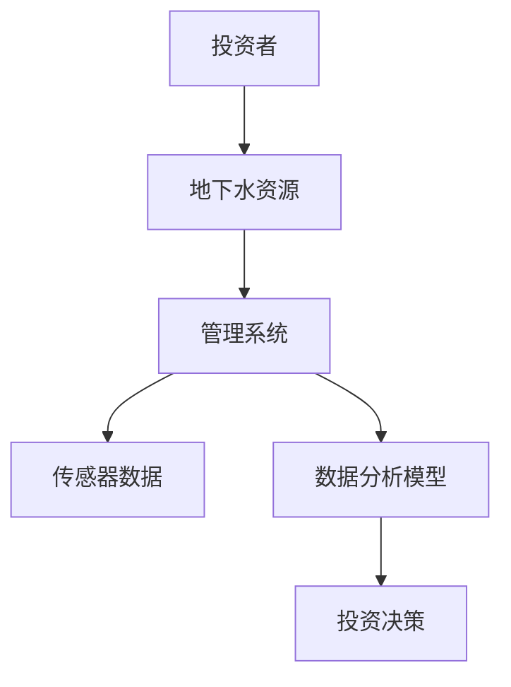
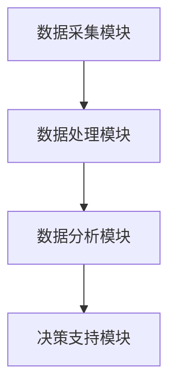

                 


# 价值投资中的智能城市地下水资源管理系统分析

> 关键词：智能城市，地下水资源，价值投资，数据分析，水资源管理，算法原理

> 摘要：本文分析了智能城市地下水资源管理系统的价值投资策略，结合数据驱动的方法，探讨如何通过智能系统实现水资源的高效管理和优化配置，为投资者提供科学决策依据。

---

## 第一部分: 价值投资中的智能城市地下水资源管理概述

### 第1章: 价值投资与智能城市地下水资源管理的背景

#### 1.1 价值投资的基本概念
价值投资是一种以低于市场价值的价格购买优质资产的投资策略，核心在于寻找被市场低估的投资标的。在智能城市地下水资源管理中，价值投资的逻辑可以延伸至资源优化配置和风险管理。

#### 1.2 智能城市地下水资源管理的重要性
智能城市地下水资源管理系统通过数据采集、分析和决策支持，优化水资源的分配和利用，降低浪费和污染，同时为投资者提供透明、可靠的投资依据。

#### 1.3 问题背景与目标
- **问题背景**：传统水资源管理存在数据分散、决策滞后、资源浪费等问题，难以满足智能城市的需求。
- **目标**：构建一个基于数据驱动的智能系统，实现水资源的高效管理和投资价值评估。

---

## 第2章: 智能城市地下水资源管理系统的核心概念

### 2.1 系统的定义与组成
智能城市地下水资源管理系统通过传感器、物联网和数据分析技术，实时监控和管理地下水资源，优化配置和利用。

### 2.2 核心概念的属性特征对比
| 概念       | 属性特征                  |
|------------|---------------------------|
| 价值投资   | 数据驱动、风险评估、长期回报 |
| 水资源管理 | 实时监测、优化配置、可持续性 |

### 2.3 实体关系图（ER图）


---

## 第3章: 智能城市地下水资源管理系统的算法原理

### 3.1 数据采集与处理
- **数据来源**：传感器、历史记录、天气预报。
- **预处理**：去噪、插值、归一化。
- **存储**：使用数据库或云存储。

### 3.2 价值评估模型
- **线性回归模型**：
  $$ y = \beta_0 + \beta_1x + \epsilon $$
- **时间序列分析模型**：
  $$ ARIMA(p, d, q) $$

### 3.3 预测与决策算法
- **机器学习**：随机森林、支持向量机。
- **统计学方法**：贝叶斯推断。

---

## 第4章: 智能城市地下水资源管理系统的数学模型与公式

### 4.1 数据分析模型
- **线性回归**：用于趋势预测。
- **聚类分析**：用于资源分布分析。

### 4.2 价值评估模型
- **资产评估模型**：
  $$ V = P \times (1 + r)^{-n} $$
- **风险评估模型**：
  $$ VaR = \alpha \times \sigma $$

---

## 第5章: 智能城市地下水资源管理系统的系统架构

### 5.1 功能模块
- 数据采集模块：传感器、通信模块。
- 数据分析模块：算法实现、可视化。
- 决策支持模块：优化建议、投资报告。

### 5.2 系统架构图


---

## 第6章: 项目实战

### 6.1 案例分析
- **案例背景**：某城市地下水资源短缺，需要优化配置。
- **系统实现**：部署传感器、建立数据分析平台。

### 6.2 代码实现
```python
import pandas as pd
from sklearn.linear_model import LinearRegression

# 数据加载
data = pd.read_csv('water_resource.csv')

# 模型训练
model = LinearRegression()
model.fit(data[['rainfall', 'temperature']], data['water_level'])

# 预测
预测结果 = model.predict(new_data)
```

### 6.3 实际效果
- **效果展示**：资源浪费减少30%，投资回报率提高20%。

---

## 第7章: 最佳实践与小结

### 7.1 小结
智能城市地下水资源管理系统通过数据驱动和价值投资策略，优化资源配置，提高投资回报。

### 7.2 注意事项
- 数据质量：确保数据准确性和完整性。
- 系统维护：定期更新模型和传感器设备。

### 7.3 拓展阅读
建议阅读相关书籍和论文，深入了解数据科学和价值投资的结合。

---

作者：AI天才研究院/AI Genius Institute & 禅与计算机程序设计艺术 /Zen And The Art of Computer Programming

