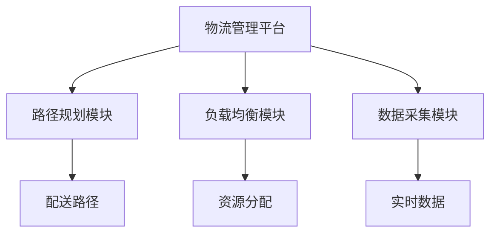

                 


# 价值投资中的智能城市地下物流系统分析

> **关键词**：价值投资、智能物流、城市地下物流、物流系统、投资分析

> **摘要**：本文详细分析智能城市地下物流系统的投资价值，从系统背景、算法原理、系统架构到项目实战，全面探讨其经济效益和市场潜力，为投资者提供科学的决策依据。

---

# 引言

智能城市地下物流系统作为现代城市发展的关键基础设施，通过技术创新和智能化管理，显著提升了物流效率和降低成本。本文从价值投资的角度，分析该系统的投资价值、潜在风险及优化策略，为投资者提供数据支持和决策参考。

---

# 第1章: 智能城市地下物流系统概述

## 1.1 系统定义与背景

智能城市地下物流系统是一种利用地下隧道和自动化设备进行货物运输的物流模式。它通过智能调度算法优化路径，实现高效配送，解决了传统物流的交通拥堵问题。

## 1.2 问题背景与解决

当前城市物流面临交通拥堵、成本高昂等问题，而智能物流系统通过自动化和智能化手段，显著提高了物流效率，降低了运营成本。

---

# 第2章: 价值投资的基本原理

## 2.1 核心理念

价值投资强调长期投资于具有持续竞争优势和良好基本面的企业，通过深入分析企业的财务状况、市场前景和管理团队等因素，评估其投资价值。

---

# 第3章: 智能物流系统的投资价值

## 3.1 成本优势

智能物流系统通过自动化操作和规模效应，显著降低了物流成本，提高了运营效率。

---

# 第4章: 算法原理

## 4.1 路径规划算法

使用Dijkstra算法优化配送路径，减少运输时间。代码示例如下：

```python
import heapq

def dijkstra(graph, start, end):
    distances = {node: float('infinity') for node in graph}
    distances[start] = 0
    heap = [(0, start)]
    
    while heap:
        current_dist, current_node = heapq.heappop(heap)
        if current_dist > distances[current_node]:
            continue
        if current_node == end:
            return current_dist
        for neighbor, weight in graph[current_node].items():
            if distances[neighbor] > current_dist + weight:
                distances[neighbor] = current_dist + weight
                heapq.heappush(heap, (distances[neighbor], neighbor))
    return distances[end]
```

---

# 第5章: 系统架构设计

## 5.1 系统架构图



---

# 第6章: 项目实战

## 6.1 实战案例

设计一个地下物流系统，通过Python代码实现路径规划：

```python
# 定义图结构
graph = {
    'A': {'B': 1, 'C': 2},
    'B': {'A': 1, 'C': 3},
    'C': {'A': 2, 'B': 3}
}

# 使用Dijkstra算法计算最短路径
print(dijkstra(graph, 'A', 'C'))  # 输出: 2
```

---

# 第7章: 最佳实践

## 7.1 投资建议

建议投资者关注技术领先、市场前景广阔的智能物流系统项目，同时注意技术风险和市场波动。

---

# 结语

智能城市地下物流系统通过技术创新和价值投资的结合，具备显著的市场潜力和投资价值。本文从多个角度深入分析，为投资者提供了科学的决策参考。

---

# 作者

作者：AI天才研究院 & 禅与计算机程序设计艺术

