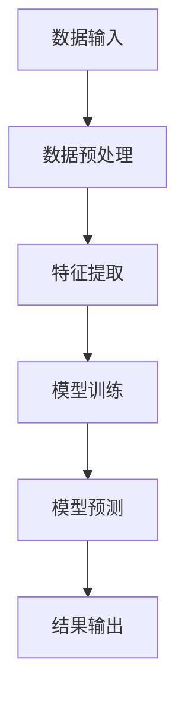
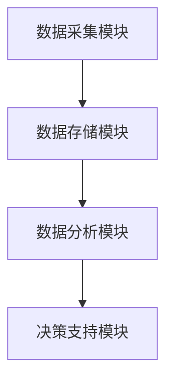

                 


```markdown
# 价值投资中的智能城市地下空间利用系统分析

> 关键词：价值投资、智能城市、地下空间、系统分析、算法实现、系统架构

> 摘要：本文将探讨如何将价值投资的理论与方法应用于智能城市地下空间利用系统的分析与优化。通过系统分析、数据建模、算法实现等技术手段，深入挖掘地下空间的潜在价值，为投资者提供科学的决策支持。

---

## 第一部分：背景与概念

### 第1章：智慧城市建设与地下空间利用概述

#### 1.1 智慧城市建设的背景与意义
智慧城市建设是当今城市发展的重要方向，旨在通过技术创新和数据驱动的方式，提升城市运行效率和居民生活质量。在这一过程中，地下空间的合理利用显得尤为重要。

#### 1.2 智能城市地下空间利用系统的基本概念
- **地下空间利用**：指对城市地下空间进行规划、建设和管理，以满足城市发展需求。
- **智能城市地下空间利用系统**：基于物联网、大数据、人工智能等技术，对地下空间进行实时监测、分析和优化的系统。

#### 1.3 价值投资在地下空间利用中的应用前景
价值投资是一种通过分析资产的内在价值来做出投资决策的方法。将其应用于地下空间利用系统分析，可以帮助投资者识别高价值潜力的地下空间项目。

---

### 第2章：核心概念与联系

#### 2.1 智能城市地下空间利用系统的构成要素
- 数据采集：通过传感器、GIS、BIM等技术获取地下空间数据。
- 数据分析：利用数据挖掘、机器学习等技术对数据进行分析。
- 系统架构：设计高效的系统架构以支持数据分析和决策。

#### 2.2 价值投资与智能城市地下空间利用的联系
- 数据驱动的决策：通过数据分析挖掘地下空间的潜在价值。
- 投资风险评估：利用系统分析方法评估投资项目的潜在风险。

#### 2.3 概念结构与核心要素
- **数据采集**：获取地下空间的相关数据。
- **数据分析**：对数据进行清洗、建模和分析。
- **系统优化**：基于分析结果优化地下空间利用方案。

---

## 第二部分：数据采集与分析

### 第3章：数据采集方法

#### 3.1 数据来源与分类
- **传感器数据**：如温度、湿度、压力等传感器的数据。
- **GIS数据**：地理信息系统中的空间数据。
- **BIM数据**：建筑信息模型中的详细数据。

#### 3.2 数据清洗与预处理
- 数据清洗：去除噪声数据，填补缺失值。
- 数据标准化：将不同来源的数据统一到同一尺度。

### 第4章：数据分析方法

#### 4.1 数据可视化
- **空间分布分析**：通过地图等方式展示地下空间的分布情况。
- **时间序列分析**：分析地下空间使用情况的变化趋势。

#### 4.2 数据挖掘
- **聚类分析**：将相似的区域或项目进行分组。
- **回归分析**：预测地下空间的使用情况或价值。

---

## 第三部分：算法原理与实现

### 第5章：算法原理

#### 5.1 算法选择
- **机器学习算法**：如随机森林、支持向量机等。
- **时间序列分析算法**：如ARIMA模型。

#### 5.2 算法流程图


### 第6章：算法实现

#### 6.1 Python代码实现
```python
import pandas as pd
from sklearn.ensemble import RandomForestRegressor

# 数据加载与预处理
data = pd.read_csv('underground_space.csv')
data = data.dropna()

# 特征提取
features = data.drop('value', axis=1)
target = data['value']

# 模型训练
model = RandomForestRegressor(n_estimators=100)
model.fit(features, target)

# 模型预测
predicted_values = model.predict(features)
```

#### 6.2 数学模型
- 线性回归模型：
  $$ y = \beta_0 + \beta_1x_1 + \beta_2x_2 + \cdots + \beta_nx_n + \epsilon $$

---

## 第四部分：系统分析与架构设计

### 第7章：系统架构设计

#### 7.1 系统功能设计
- 数据采集模块：负责采集地下空间数据。
- 数据分析模块：对数据进行处理和建模。
- 决策支持模块：提供投资决策支持。

#### 7.2 系统架构图


---

## 第五部分：项目实战

### 第8章：项目实战

#### 8.1 环境安装
- 安装Python和相关库（如pandas、scikit-learn）。

#### 8.2 核心代码实现
```python
import pandas as pd
from sklearn.metrics import mean_squared_error

# 加载数据
data = pd.read_csv('underground_space.csv')

# 划分训练集和测试集
train_data = data.sample(frac=0.8, random_state=42)
test_data = data.drop(train_data.index)

# 特征与目标分离
X_train = train_data.drop('value', axis=1)
y_train = train_data['value']
X_test = test_data.drop('value', axis=1)
y_test = test_data['value']

# 模型训练
from sklearn.ensemble import RandomForestRegressor
model = RandomForestRegressor(n_estimators=100)
model.fit(X_train, y_train)

# 模型预测
y_pred = model.predict(X_test)

# 评估模型
 mse = mean_squared_error(y_test, y_pred)
 print(f'MSE: {mse}')
```

---

## 第六部分：总结与展望

### 第9章：总结与展望

#### 9.1 最佳实践
- 数据质量：确保数据的准确性和完整性。
- 模型选择：根据具体问题选择合适的算法。
- 结果验证：通过实际案例验证模型的准确性。

#### 9.2 未来展望
随着技术的进步，智能城市地下空间利用系统分析将更加精准和高效，为价值投资提供更有力的支持。

---

## 作者信息

作者：AI天才研究院/AI Genius Institute & 禅与计算机程序设计艺术/Zen And The Art of Computer Programming
```

